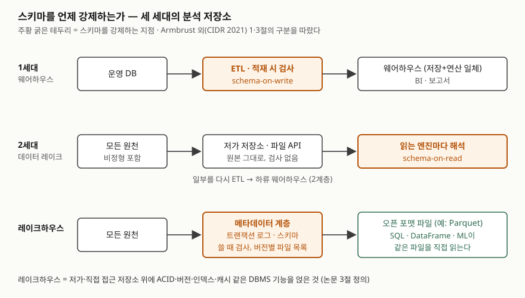

> DW 정의는 Chaudhuri·Dayal(1997)이 인용한 Inmon의 정의를, 데이터 레이크·레이크하우스의 구분과 정의는
> Armbrust 외(CIDR 2021)를 근거로 했다. 데이터 레이크라는 말의 기원은 James Dixon의 2010년 블로그 글(2차 자료)이다.
> 차이를 보이는 모형은 [`code/schema_timing.py`](code/schema_timing.py)(실행 기록 [`code/output.txt`](code/output.txt))다.
> 실제 제품을 돌린 것이 아니라 개념을 표준 라이브러리로 옮긴 것이고, 성능 수치는 싣지 않는다.

## 들어가며

DW·레이크·레이크하우스 문항은 "정형 / 비정형 / 둘 다"로 외우면 답안이 표 한 장으로 끝난다. 채점에서 갈리는 것은
**왜 레이크가 나왔고 왜 다시 레이크하우스가 나왔는가**를 한 축으로 설명하느냐다. 그 축이 스키마를 강제하는 시점이다.
실무에서는 "레이크에 다 부어 두고 필요할 때 보자"던 팀이 팀마다 다른 집계값을 내놓는 문제로 같은 질문이 돌아온다.

## 정의

| 저장소 | 정의 | 출처 |
|---|---|---|
| **데이터 웨어하우스** | 조직의 의사결정에 주로 쓰이는 **주제 지향·통합·시간 가변·비휘발** 데이터의 모음 | Inmon의 정의, Chaudhuri·Dayal(1997) 1절 인용 |
| **데이터 레이크** | 범용·오픈 파일 형식으로 데이터를 담는, 파일 API를 갖춘 **저가 저장 시스템**. schema-on-read 구조 | Armbrust 외(2021) 1절 |
| **레이크하우스** | 저가·직접 접근 저장소를 바탕으로, **ACID 트랜잭션·버전 관리·감사·인덱스·캐시·질의 최적화** 같은 분석 DBMS의 관리·성능 기능을 함께 제공하는 데이터 관리 시스템 | Armbrust 외(2021) 3절 |

**DW의 4특성**(Inmon)은 다음과 같다.

1. **주제 지향**(subject-oriented) — 업무 처리 단위가 아니라 고객·상품 같은 분석 주제로 묶는다
2. **통합**(integrated) — 여러 운영 DB의 데이터를 하나의 형식·이름으로 맞춘다
3. **시간 가변**(time-varying) — 시점별 이력을 쌓는다
4. **비휘발**(non-volatile) — 적재한 뒤 갱신하지 않고 조회한다

## 등장 배경 — 세 세대

Armbrust 외(2021)는 분석 플랫폼을 세 세대로 나눈다.

- **1세대 웨어하우스.** 운영 DB에서 모은 데이터를 **schema-on-write**로 쓴다. 하류의 BI 질의에 맞춘 모델이 보장된다.
  그러나 저장과 연산이 한 장비에 묶여 최대 부하에 맞춰 사야 했고, 영상·음성·문서 같은 비정형 데이터는 저장도
  질의도 못 했다.
- **2세대 데이터 레이크.** 원본을 전부 저가 저장소(HDFS, 이후 S3 같은 클라우드 객체 저장소)에 내려놓는다.
  **schema-on-read**라 무엇이든 싸게 쌓을 수 있지만, 논문은 데이터 품질과 거버넌스 문제를 **하류로 떠넘겼다**고
  쓴다. 중요한 일부는 다시 ETL로 하류 웨어하우스에 옮긴다. 이 **레이크 + 웨어하우스 2계층**이 지금의 주류다.
- **레이크하우스.** 2계층을 하나로 합치려는 설계다.

Dixon(2010)은 데이터 마트가 원천의 **일부 속성만** 골라 담아 미리 정한 질문에만 답할 수 있다는 점을 들어,
원본을 자연 상태로 두는 저장소를 "데이터 레이크"라 불렀다. 적재할 때 버린 속성은 나중에 물을 수 없다는 것이
레이크가 나온 이유다.

**2계층 구조의 문제 4가지**(Armbrust 외 2021, 1절)

| 문제 | 내용 |
|---|---|
| 신뢰성 | 레이크와 웨어하우스를 맞추는 ETL이 계속 필요하고, 단계마다 실패·버그가 품질을 떨어뜨린다 |
| 데이터 지연 | 웨어하우스의 데이터가 레이크보다 늦다 |
| 고급 분석 지원 부족 | ML 시스템은 SQL이 아닌 코드로 큰 데이터를 읽어야 하는데 ODBC/JDBC로는 비효율적이다 |
| 총소유비용 | ETL 비용에 더해, 웨어하우스로 복사한 데이터의 저장비를 두 번 내고 독점 형식에 묶인다 |

## 구성요소 — 레이크하우스 구현 아이디어 3가지

논문 3절은 레이크하우스를 세 가지 기술 아이디어로 설계한다.

1. **메타데이터 계층.** 객체 저장소의 오픈 포맷 파일(예: Parquet) 위에, **어느 객체가 어느 버전의 표에 속하는지**를
   정하는 트랜잭션 계층을 둔다. 여기서 ACID·버전 관리를 구현하고, 스키마 강제와 제약 검사 같은 품질 기능도 이 계층에
   둔다. Delta Lake·Apache Iceberg·Apache Hudi가 이 계열이다.
2. **SQL 성능 기법.** 파일 형식은 그대로 둔 채 캐시, 인덱스·통계 같은 보조 데이터, 데이터 배치 최적화를 더한다.
3. **고급 분석 지원.** ML 라이브러리가 파일을 직접 읽고, 선언적 DataFrame API로 최적화의 혜택을 받는다.

Delta Lake의 공개 프로토콜 문서는 표의 상태를 **번호가 이어지는 원자적 버전의 직렬 이력**으로 정의하고, 한 버전의
상태를 **스냅샷**이라 부른다. 로그 파일 하나가 버전 하나이고, 파일을 표에 넣는 `add`와 빼는 `remove` 동작,
스키마를 담는 `metaData` 동작이 그 안에 기록된다.

## 도식



> **출처**: [Armbrust 외, Lakehouse (CIDR 2021)](https://www.cidrdb.org/cidr2021/papers/cidr2021_paper17.pdf) 1절과 Figure 1(세 세대 구조), 3절과 Figure 2(메타데이터·캐시·인덱스 계층),
> [Chaudhuri·Dayal (1997)](https://www.microsoft.com/en-us/research/wp-content/uploads/2016/02/sigrecord.pdf) 1절(DW 정의).

## 모형으로 돌려 보기

원천 이벤트 6건 가운데 3건을 일부러 망가뜨렸다. 2번은 금액에 쉼표가 섞였고(`"15,000"`), 4번은 금액이 없고,
5번에는 원천에 없던 `coupon` 필드가 붙었다. 아래는 실행 기록에서 원천 목록과 레이크하우스의 쓰기 거부 3줄을 뺀 것이다.

```text
== 1. 웨어하우스 — 적재할 때 검사 ==
   적재 거부 order_id=2: cannot store TEXT value in INTEGER column orders.amount
   적재 거부 order_id=4: NOT NULL constraint failed: orders.amount
   적재 4건 · SUM(amount) = 55000

== 2. 레이크 — 그대로 쓰고, 읽는 쪽이 정한다 ==
   쓰기: 6개 파일 전부 받아들였다
   읽기 팀 A(정수만 인정): 4건 집계 · 2건 건너뜀 · 합계 55000
   읽기 팀 B(쉼표 제거, 없으면 0): 6건 집계 · 0건 건너뜀 · 합계 70000
   10-03 파일을 지우고 새 파일을 쓰기 전에 읽으면: 4건 · 합계 35000

== 3. 레이크하우스 — 로그가 스키마와 파일 목록을 든다 ==
   버전 1 커밋 · 읽기: 3건 · 합계 25000
   새 파일을 썼지만 커밋 전에 읽으면: 3건 · 합계 25000
   버전 2 커밋 · 읽기: 5건 · 합계 49000
   버전 1 을 다시 읽으면(시간 여행): 3건 · 합계 25000
```

세 가지가 드러난다.

- **레이크에서는 같은 파일에서 두 개의 합계가 나왔다**(55000, 70000). 스키마를 읽는 쪽이 정하므로 해석이 팀마다
  갈린다. 논문이 말한 "품질 문제를 하류로 떠넘긴다"가 이것이다.
- **레이크에서는 다시 쓰는 도중의 상태가 그대로 보였다.** 하루치 파일 두 개를 지우고 새 파일을 쓰기 전에 읽은 사람은
  4건·35000을 받았다. 객체 저장소의 파일 API에는 여러 파일에 걸친 변경을 한 번에 반영하는 수단이 없다.
- **레이크하우스에서는 파일을 써 놓아도 로그에 커밋하기 전에는 보이지 않았다.** 읽는 쪽은 로그를 재생해 파일 목록을
  정하므로 버전 1과 2 사이의 중간 상태가 없다. 지난 버전도 로그 앞부분만 재생하면 다시 읽힌다.

예상과 달랐던 것은 5번(`coupon`)이다. 웨어하우스 적재에서는 표에 없는 필드를 ETL이 그냥 버려 행이 들어갔고,
레이크하우스 쓰기에서는 필드 집합이 스키마와 다르다는 이유로 행 전체가 거부됐다. 이것은 모형의 두 검사기를 그렇게
짰기 때문이지 제품의 정해진 동작이 아니다. 다만 **"스키마에 없는 필드가 오면 버릴지, 거부할지, 스키마를 넓힐지"는
강제하는 지점에서 정해야 하는 규칙**이라는 점은 그대로다.

## 비교

| 구분 | 데이터 웨어하우스 | 데이터 레이크 | 레이크하우스 |
|---|---|---|---|
| 스키마 강제 시점 | 적재할 때 (schema-on-write) | 읽을 때 (schema-on-read) | 쓸 때, 메타데이터 계층이 |
| 저장 형식 | 웨어하우스 내부 형식 | 오픈 파일 형식 | 오픈 파일 형식 + 트랜잭션 로그 |
| 담는 데이터 | 정형 | 정형·반정형·비정형 | 정형·반정형·비정형 |
| 트랜잭션·버전 | 있다 | 파일 단위뿐 | 메타데이터 계층이 제공 |
| 주 사용처 | BI·보고서 | 데이터 과학·ML, 하류 DW로 재적재 | BI와 ML이 같은 데이터를 |
| 대가 | 적재 전 설계, 버린 속성은 못 묻는다 | 품질·거버넌스가 읽는 쪽 몫 | 직접 접근을 허용하므로 데이터 독립성 일부를 내준다 |

마지막 줄의 레이크하우스 대가는 논문 3절이 직접 짚은 점이다. 응용이 파일을 직접 읽게 하면 DBMS가 저장 형식을
마음대로 바꿀 수 없다.

## 적용 시 고려사항

- **스키마 진화 규칙을 먼저 정한다.** 새 필드가 오면 거부·무시·확장 중 무엇을 할지가 강제 지점의 정책이다.
  정하지 않으면 모형의 5번처럼 시스템마다 다르게 처리된다.
- **"한 번 더 ETL"이 남는지 본다.** 레이크하우스로 가도 원천을 정제해 분석용 표를 만드는 ETL/ELT 로직은 여전히
  써야 한다고 논문도 적는다. 줄어드는 것은 레이크에서 웨어하우스로 옮기는 단계다.
- **트랜잭션 범위를 확인한다.** 논문은 Delta Lake·Iceberg·Hudi가 한 번에 **표 하나**에만 트랜잭션을 지원한다고 쓴다.
  여러 표를 함께 바꾸는 작업은 그 경계를 고려해 설계한다.
- **원본 보존 기간과 비용을 따로 잡는다.** 레이크의 장점은 버린 속성이 없다는 것이다. 메타데이터 계층의 버전을
  오래 남기면 지난 파일도 남으므로 시간 여행 범위와 저장 비용을 함께 정한다.
- **거버넌스를 메타데이터 계층에 둔다.** 논문은 접근 제어와 감사 로그를 이 계층에 두는 것이 자연스럽다고 쓴다.
  파일 저장소 권한만으로 표 단위 권한을 관리하지 않는다.

## 정리

- **축 하나**: 스키마를 언제 강제하는가 — DW는 적재 시, 레이크는 읽기 시, 레이크하우스는 메타데이터 계층에서 쓰기 시.
- **DW 4특성**: 주제 지향·통합·시간 가변·비휘발 ("주통시비").
- **2계층 문제 4가지**: 신뢰성·지연·고급 분석 부족·총소유비용 ("신지고비").
- **레이크하우스 3요소**: 메타데이터 계층·SQL 성능 기법(캐시·보조 데이터·배치)·고급 분석 API.
- 레이크하우스는 오픈 포맷 파일 위에 트랜잭션 로그를 얹어, 커밋 전 파일은 보이지 않고 지난 버전을 다시 읽을 수 있다.

## 참고 자료

- [Armbrust, Ghodsi, Xin, Zaharia, *Lakehouse: A New Generation of Open Platforms that Unify Data Warehousing and Advanced Analytics*, CIDR 2021](https://www.cidrdb.org/cidr2021/papers/cidr2021_paper17.pdf) — 1절(세 세대, 2계층 문제 4가지), 3절(정의, 구현 아이디어 3가지), 3.2절(메타데이터 계층, 스키마 강제, 표 하나 트랜잭션)
- [Chaudhuri, Dayal, *An Overview of Data Warehousing and OLAP Technology*, ACM SIGMOD Record 26(1), 1997](https://www.microsoft.com/en-us/research/wp-content/uploads/2016/02/sigrecord.pdf) — 1절, Inmon의 DW 정의 인용과 OLTP와의 차이
- [Delta Transaction Log Protocol](https://github.com/delta-io/delta/blob/master/PROTOCOL.md) — Delta Table Specification(버전·스냅샷), Actions(`metaData`·`add`·`remove`)
- [James Dixon, *Pentaho, Hadoop, and Data Lakes*, 2010-10-14](https://jamesdixon.wordpress.com/2010/10/14/pentaho-hadoop-and-data-lakes/) — 데이터 레이크라는 말의 기원 (2차 자료, 발행일 2010-10-14)
