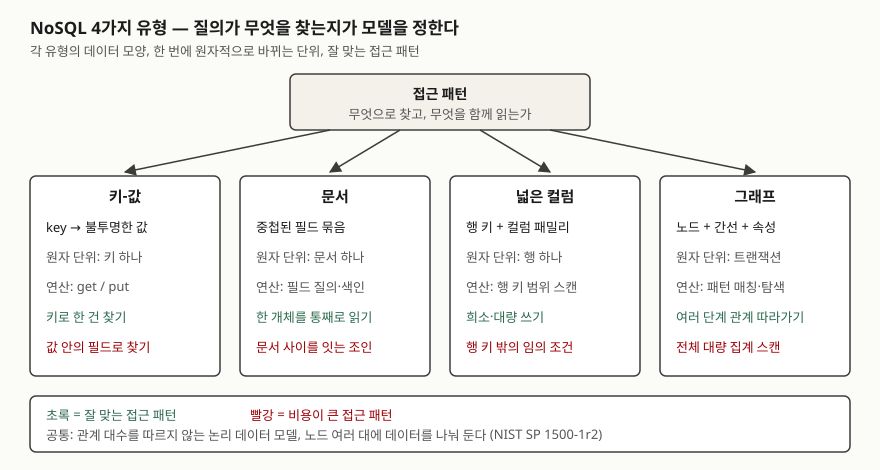

> **실행 검증 없음.** 이 글은 표준·원 논문·공식 문서의 정의와 분류를 정리한 개념 글이다.
> 실행 예제가 없고, 유형별 성능 수치는 싣지 않았다.

## 들어가며

NoSQL 문항은 "4가지 유형을 쓰고 대표 제품을 적어라"로 외워 두는 경우가 많다. 그런데 채점에서 점수가 갈리는 곳은
유형 이름이 아니라 **왜 그 유형을 고르는가**다. 같은 주문 데이터도 "주문번호로 한 건 찾기"가 대부분이면 키-값,
"주문 한 건을 상품·배송지와 함께 통째로 보여 주기"면 문서, "이 고객과 3단계 안에서 연결된 계정"을 찾으면 그래프가
맞는다. 실무에서는 관계형으로 충분한 데이터를 유행 따라 옮겼다가, 필요해진 조인을 애플리케이션 코드로 짜게 되는
일로 같은 문제가 돌아온다.

## 정의

> **NoSQL**: 데이터의 저장과 조작에 **관계 대수를 따르지 않는 논리 데이터 모델**. — NIST SP 1500-1r2,
> 비관계형 플랫폼 절(§4.2.2)

NIST는 같은 절에서 NoSQL의 근본 특성을 **데이터셋을 여러 노드에 나눠 분산 처리하는 것**으로 든다. 그리고 "NoSQL"이라는
이름 자체에 문제를 제기한다. 저장 모델을 질의 언어(SQL)를 기준으로 이름 붙였고, 비관계형 저장소에도 SQL 확장을 쓰는
경우가 늘고 있어서다. 그래서 답안에서는 "SQL을 안 쓰는 DB"가 아니라 **"관계 모델이 아닌 데이터 모델"**로 쓴다.

## 등장 배경

Dynamo 논문(DeCandia 외, 2007)의 배경 절이 문제를 직접 적는다. 아마존 서비스 대부분은 **기본 키로만 저장·조회**하고
RDBMS의 복잡한 질의·관리 기능이 필요 없었다. 그런데 그 기능이 비싼 장비와 숙련 인력을 요구했고, 당시 복제 기술은
가용성보다 일관성을 고르는 쪽이었으며, 수평 확장이 쉽지 않았다. 이 세 가지가 요구사항을 바꿨다.

- **접근 패턴이 단순하다** — 키 하나로 읽고 쓴다. 여러 항목에 걸친 연산이 없다(Dynamo 질의 모델)
- **수평 확장이 필요하다** — NIST가 든 근본 특성, 노드를 더해 늘린다
- **가용성을 일관성보다 앞에 둔다** — [CAP 글](../2026-10-06-cap-theorem-base-pacelc/index.md)의 AP 쪽 선택이다

NIST 정의 문서는 같은 흐름을 데이터 쪽에서 설명한다. 구조화된 데이터의 확장 요구가 키-값을, 문서 분석의 중요성이
문서 지향 DB를, 관계 데이터의 중요성이 그래프 저장을 낳았다고 적는다(빅데이터 엔지니어링 절, §4).

## 구성요소 — 4가지 유형

| 유형 | 데이터 모양 | 원자적으로 바뀌는 단위 | 근거 |
|---|---|---|---|
| **① 키-값** | 고유 키 → 불투명한 값(바이트 배열) | 키 하나 | Dynamo §2.1 |
| **② 문서** | 이름 붙은 필드와 중첩 값을 가진 문서(주로 JSON) | 문서 하나 | NIST §4.2.2, MongoDB 매뉴얼 |
| **③ 넓은 컬럼** | 행 키 + 컬럼 패밀리 아래 동적 컬럼 + 타임스탬프 | 행 하나 | Bigtable §2 |
| **④ 그래프** | 노드·간선과 그 위의 레이블·속성 | 트랜잭션 | NIST §4.2.2, ISO/IEC 39075 |

**① 키-값.** Dynamo의 질의 모델은 키로 식별되는 항목 하나를 읽고 쓰는 것이고, 값은 바이너리 객체로 저장된다.
여러 항목에 걸친 연산이 없고 관계 스키마도 없다. 값 안을 DB가 해석하지 않으므로 **값 속 필드로는 찾을 수 없다.**
Microsoft 문서도 값의 일부만 바꾸려 해도 값 전체를 덮어써야 한다고 적는다.

**② 문서.** NIST는 문서 저장소를 키-값의 변형으로 보되, 키뿐 아니라 **값 안의 문서를 색인하고 검색할 수 있다**는 점을
차이로 든다. 문서마다 필드 구성이 달라도 된다. MongoDB 매뉴얼의 설계 원칙은 "함께 접근하는 데이터는 함께 저장한다"이고,
관련 데이터를 한 문서에 내포(embedding)하면 컬렉션 사이 조인을 피한다고 적는다.

**③ 넓은 컬럼.** Bigtable 논문은 데이터 모델을 "희소하고, 분산되고, 영속적인 다차원 정렬 맵"으로 정의한다. 맵의 인덱스는
**행 키·컬럼 키·타임스탬프**다. 컬럼 키는 **컬럼 패밀리**로 묶이고, 패밀리는 수백 개 이내로 적게 두되 패밀리 안의
컬럼 수에는 제한이 없다. 행 하나에 대한 읽기·쓰기는 컬럼 수와 무관하게 원자적이고, 데이터는 행 키의 사전순으로
정렬되어 행 범위(태블릿) 단위로 나뉜다. 그래서 **행 키 설계가 곧 질의 설계**다.

**④ 그래프.** NIST는 데이터 요소를 노드로, 관계를 노드 사이 링크로 표현하는 모델로 설명한다. 2024년 4월에 나온
ISO/IEC 39075(GQL)는 SQL을 만든 위원회(JTC 1/SC 32/WG 3)가 **속성 그래프**용으로 만든 데이터베이스 언어 표준이다.
속성 그래프는 노드와 간선을 저장하고, 관계가 데이터 안에 만들어져 있어 질의할 때 관계를 다시 지정하지 않는다.

## 도식

> **출처**: 공통 정의는 [NIST SP 1500-1r2 §4.2.2 Non-Relational Platforms (NoSQL)](https://nvlpubs.nist.gov/nistpubs/SpecialPublications/NIST.SP.1500-1r2.pdf),
> 키-값은 [Dynamo §2.1 System Assumptions and Requirements](https://www.allthingsdistributed.com/files/amazon-dynamo-sosp2007.pdf),
> 넓은 컬럼은 [Bigtable §2 Data Model](https://static.googleusercontent.com/media/research.google.com/en//archive/bigtable-osdi06.pdf),
> 원자 단위와 접근 패턴 비교는 [Microsoft Azure Architecture Center — Understand data models](https://learn.microsoft.com/en-us/azure/architecture/data-guide/technology-choices/understand-data-store-models)의 "Comparative characteristics (core nonrelational models)" 표를 따랐다.

답안에는 위의 "접근 패턴" 칸 하나와 아래 네 칸, 각 칸에 데이터 모양 한 줄과 잘 맞는 패턴 한 줄만 옮기면 된다.

## 비교

### 4유형 대비

Microsoft Azure 아키텍처 센터의 비교표에서 시험에 쓸 항목만 골라 옮겼다.

| 항목 | 키-값 | 문서 | 넓은 컬럼 | 그래프 |
|---|---|---|---|---|
| 접근 패턴 | 키로 한 건 조회 | 개체 단위 묶음 조회 | 넓고 희소한 묶음 | 관계 따라가기 |
| 정규화 | 비정규화 | 비정규화 | 비정규화 | 관계를 정규화 |
| 색인 | 키(기본) | 기본 + 보조 | 기본 + 제한적 보조 | 기본, 때로 보조 |
| 데이터 모양 | 불투명한 값 | 유연한 계층 | 희소한 넓은 표 | 노드와 간선 |
| 확장 축 | 키 공간 | 파티션 수 | 파티션·패밀리 폭 | 노드·간선 수 |
| 대표 업무 | 캐시, 세션, 기능 플래그 | 상품 카탈로그, 콘텐츠, 프로필 | IoT 원격 측정, 개인화 | 소셜 네트워크, 부정 거래 고리, 지식 그래프 |

### 관계형과 NoSQL

| 항목 | 관계형 | NoSQL |
|---|---|---|
| 데이터 모델 | 관계 대수를 따르는 표 | 관계 대수를 따르지 않는 모델(NIST) |
| 스키마 | 쓰기 시점에 정한다 | 대체로 읽기 시점에 해석한다(Microsoft 비교표) |
| 트랜잭션 범위 | 여러 행·여러 표 | 키·문서·행 하나가 기본, 유형마다 다르다 |
| 확장 | 수평 확장에는 샤딩·파티셔닝이 따로 필요 | 여러 노드에 나눠 두는 것이 근본 특성 |
| 맞는 경우 | 여러 개체에 걸친 엄격한 트랜잭션, 임의 조인 | 접근 패턴이 정해져 있고 규모가 큰 경우 |

## 적용 시 고려사항 — 선택 기준 5단계

Microsoft 문서가 제시하는 데이터 모델 선택 절차를 따라 **5단계**로 판단한다.

1. **접근 패턴을 먼저 적는다.** 키 단건 조회, 집계, 전문 검색, 시간 구간 스캔, 관계 탐색 중 무엇이 대부분인가
2. **패턴을 모델에 대응시킨다.** 키 단건 → 키-값, 개체 통째로 → 문서, 넓고 희소한 대량 쓰기 → 넓은 컬럼, 깊은 관계 → 그래프
3. **그 모델을 구현한 서비스·제품을 후보로 좁힌다**
4. **일관성·지연·규모·거버넌스·비용으로 평가한다.** 원자 단위가 업무의 트랜잭션 범위와 맞는지가 여기서 갈린다
5. **접근 패턴이나 수명 주기가 분명히 갈릴 때만 모델을 섞는다**(다중 저장소, polyglot persistence)

판단할 때 놓치기 쉬운 지점은 셋이다.

- **원자 단위를 업무 단위와 맞춘다.** Dynamo는 단일 키 갱신만 허용하고 격리 보장이 없다. "주문과 재고를 함께 바꾼다"가
  업무 규칙이면 키-값 하나로는 보장되지 않는다. 문서형이면 둘을 한 문서에 넣을 수 있는지를 먼저 본다
- **조회 키를 먼저 설계한다.** 넓은 컬럼은 행 키 사전순으로 정렬되므로 행 키에 없는 조건은 비싸다. 키-값은 값 속 필드로
  찾을 수 없어 그런 조회가 생기면 설계를 다시 해야 한다
- **모델을 바꿔야 한다는 신호를 정해 둔다.** Microsoft 문서는 문서 저장소에 임의 조인이 늘면 관계형 읽기 모델을 들이고,
  넓은 컬럼에서 시간 구간 질의가 느려지면 시계열 DB를 검토하라고 적는다

## 정리

암기 단서는 **"키·문·컬·그 — 찾는 방식이 모델을 정한다"** 다.

- 정의: **관계 대수를 따르지 않는 논리 데이터 모델**, 근본 특성은 **여러 노드에 나눠 분산 처리**(NIST SP 1500-1r2)
- **4유형** — 키-값(키 하나), 문서(문서 하나), 넓은 컬럼(행 하나), 그래프(노드·간선). 괄호는 원자 단위
- 등장 배경 **3가지** — 단순한 키 접근, 수평 확장, 가용성 우선
- 선택 기준 **5단계** — 접근 패턴 → 모델 대응 → 후보 → 평가 → 필요할 때만 혼합

관련 글: [분산 데이터베이스 — CAP 정리와 BASE](../2026-10-06-cap-theorem-base-pacelc/index.md)

## 참고 자료

- [NIST SP 1500-1r2, *NIST Big Data Interoperability Framework: Volume 1, Definitions*, Version 3, 2019-10](https://nvlpubs.nist.gov/nistpubs/SpecialPublications/NIST.SP.1500-1r2.pdf) — §4 Big Data Engineering, §4.2.2 Non-Relational Platforms (NoSQL)
- [G. DeCandia 외, *Dynamo: Amazon's Highly Available Key-value Store*, SOSP 2007](https://www.allthingsdistributed.com/files/amazon-dynamo-sosp2007.pdf) — §2 Background, §2.1 System Assumptions and Requirements
- [F. Chang 외, *Bigtable: A Distributed Storage System for Structured Data*, OSDI 2006](https://static.googleusercontent.com/media/research.google.com/en//archive/bigtable-osdi06.pdf) — §2 Data Model (Rows, Column Families)
- [MongoDB Manual — Data Modeling](https://www.mongodb.com/docs/manual/data-modeling/) — 함께 접근하는 데이터를 함께 저장, 내포와 참조
- [ISO/IEC JTC 1, *ISO/IEC 39075 Database Language GQL*, 2024-04](https://www.jtc1info.org/wp-content/uploads/2024/04/2024-Article-39075-Database-Language-GQL.docx.pdf) — 표준 개요 기사. 표준 원문은 유료라 열람하지 못했다
- [Microsoft Azure Architecture Center — Understand data models](https://learn.microsoft.com/en-us/azure/architecture/data-guide/technology-choices/understand-data-store-models) — 유형별 정의, 비교표, 선택 휴리스틱 (2025-08-21)
