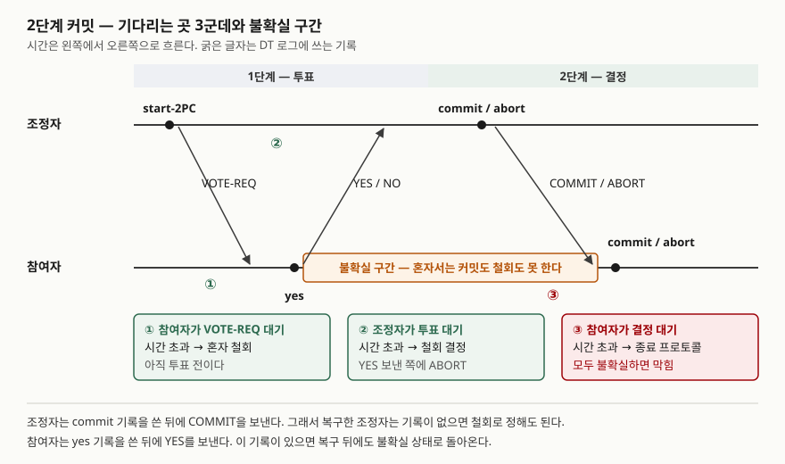

> 정의와 절차는 Bernstein·Hadzilacos·Goodman(1987) 7장(이하 BHG)을, 제품의 준비 상태와 휴리스틱 완료는
> X/Open XA 명세와 PostgreSQL 16 문서를 근거로 했다. 조정자 장애 시나리오는 예제 코드를 돌려 확인했다.
> 성능 수치는 싣지 않는다.

## 들어가며

분산 DB 문제는 "여러 사이트의 갱신을 어떻게 한 트랜잭션처럼 끝내는가"를 묻고, 답은 거의 2단계 커밋(2PC)이다.
"준비 후 커밋"까지는 누구나 쓰므로, 점수는 **어디서 막히는가**를 정확히 짚는 데서 갈린다.
막힘은 프로토콜 전체가 아니라 참여자가 YES를 보낸 뒤 결정을 받기 전, **불확실 구간** 한 곳에서만 생긴다.
실무에서는 XA 분산 트랜잭션의 조정자(트랜잭션 관리자)가 죽은 뒤 준비된 트랜잭션이 잠금을 쥔 채 남는 모습으로 나타난다.

## 정의

> **2단계 커밋**은 분산 트랜잭션에 참여한 모든 사이트가 함께 커밋하거나 함께 철회하도록, 조정자가 참여자의
> 투표를 모으고(투표 단계) 그 결과로 정한 결정을 알리는(결정 단계) **원자적 커밋 프로토콜**이다.
> — BHG의 2PC 절(§7.4)은 이를 가장 단순하고 널리 쓰이는 원자적 커밋 프로토콜로 소개한다.

ACID는 트랜잭션이 갖춰야 할 **4가지** 성질(원자성·일관성·고립성·지속성)이다. 정의와 이상 현상은
[ACID와 격리 수준](../2026-09-23-acid-and-isolation-levels/index.md)에서 다뤘다. 2PC가 맡는 것은 그중 **원자성**을 사이트 여러 곳으로
넓히는 일이다. 한 사이트의 원자성은 로그로 지키지만, 사이트가 여럿이면 "다른 사이트가 커밋했는가"를 로그만으로 알 수 없다.

## 등장 배경

BHG는 원자적 커밋 프로토콜이 지켜야 할 조건을 **5가지**로 정리한다.

| 조건 | 뜻 |
|---|---|
| AC1 | 결정에 이른 프로세스는 모두 같은 결정에 이른다 |
| AC2 | 한 번 내린 결정은 뒤집지 않는다 |
| AC3 | 모두 YES를 투표했을 때만 커밋으로 정할 수 있다 |
| AC4 | 장애가 없고 모두 YES면 커밋으로 정한다 |
| AC5 | 장애가 모두 고쳐지고 충분히 오래 새 장애가 없으면 모든 프로세스가 결정에 이른다 |

AC3에서 바로 따라 나오는 것이 있다. **YES를 투표하기 전이면 혼자 철회해도 되고, YES를 투표한 뒤에는 혼자 아무것도 못 한다.**
BHG는 YES를 보낸 때부터 결정을 알 만한 정보를 받을 때까지를 **불확실 구간**이라 부르고, 그 안에서 장애가 나서 고쳐지기를
기다려야 하는 상태를 **막힘**(blocked)이라 정의한다. 또 통신 장애나 전체 장애가 가능하면 **어떤 원자적 커밋 프로토콜도 막힘을
피할 수 없다**고 명제로 적는다(명제 7.1). 2PC의 막힘은 구현의 결함이 아니라 문제 자체의 성질이다.

## 구성요소 / 절차

**참여자 2종**: 조정자 1, 참여자 n. **단계 2개, 라운드 3개**(VOTE-REQ → 투표 → 결정)로, 장애가 없으면 메시지는 3n개다(BHG 2PC 절).

**기다리는 곳 3군데와 시간 초과 처리** (BHG Timeout Actions)

1. 참여자가 VOTE-REQ를 기다림 → 아직 투표 전이므로 **혼자 철회**
2. 조정자가 투표를 기다림 → 아무도 커밋하지 않았으므로 **철회로 결정**, YES를 보낸 쪽에 ABORT
3. 참여자가 결정을 기다림 → 불확실하므로 **종료 프로토콜**을 연다

**협력 종료 프로토콜 — 물어본 상대의 응답 3경우** (BHG 그림 7-4)

1. 이미 결정했다 → 그 결정을 알려 준다
2. 아직 투표 전이다 → 혼자 철회하고 ABORT를 알려 준다
3. 상대도 불확실하다 → 도와줄 수 없다. **물어볼 수 있는 상대가 모두 이 경우면 막힌다**

**DT 로그 기록 순서 2가지**가 복구를 떠받친다. 참여자는 yes 기록을 쓴 **뒤에** YES를 보내고,
조정자는 commit 기록을 쓴 **뒤에** COMMIT을 보낸다. 그래서 복구한 조정자는 commit 기록이 없으면 철회로 정해도 된다.

## 도식



> **출처**: 단계와 메시지는 [BHG, Concurrency Control and Recovery in Database Systems §7.4 The Two Phase Commit Protocol](https://www.microsoft.com/en-us/research/wp-content/uploads/2016/05/chapter7.pdf),
> 불확실 구간은 같은 장의 §7.3 Atomic Commitment, 시간 초과 처리와 DT 로그 기록 순서는 같은 절의 Timeout Actions·Recovery 항목과 그림 7-3을 따랐다.

답안지에는 생명선 두 줄, 화살표 세 개, 불확실 구간 띠 하나만 옮기면 된다. ③만 빨간색인 이유가 이 글의 요점이다.

## 실행으로 확인한 것

출금 은행·입금 은행·포인트를 각자 SQLite 파일로 두고, 준비(YES)는 쓰기 트랜잭션을 열어 둔 채 yes 기록을 남기는 것으로 구현했다.
조정자가 멈추는 지점을 바꿔 가며 협력 종료 프로토콜을 돌렸다. 전체 소스는 [`code/two_phase_commit.py`](code/two_phase_commit.py),
실행 기록은 [`code/output.txt`](code/output.txt).

| 시나리오 | 조정자가 멈춘 곳 | 종료 프로토콜 결과 | 최종 |
|---|---|---|---|
| S2 | VOTE-REQ를 P3에 보내기 전 | P3이 투표 전이라 ABORT 응답 | 철회 |
| S3 | P1에게만 COMMIT을 보낸 뒤 | P1이 COMMIT 응답 | 커밋 |
| S4 | YES를 다 받고 결정 기록 전 | 셋 다 불확실, **막힘** | 조정자 복구 후 철회 |
| S5 | commit 기록 직후, 보내기 전 | 셋 다 불확실, **막힘** | 조정자 복구 후 커밋 |

표의 결과 칸은 실행 기록의 각 시나리오 `[끝]` 줄을 옮긴 것이다. 예상과 달랐던 것은 S4와 S5다.

```text
== S4 조정자가 YES 를 다 받고 결정을 기록하기 전에 멈춤 ==
    P1 출금 은행   DT 로그=['yes']           상태=불확실      커밋된 balance=500000
  [막힌 동안 P1 출금 은행 의 DB]
    다른 세션 읽기  : balance=500000 (준비 전 값)
    다른 세션 쓰기  : 실패 -> database is locked
    조정자 복구: DT 로그 ['start-2PC'] -> ABORT
== S5 조정자가 commit 을 기록한 직후 보내기 전에 멈춤 ==
    P1 출금 은행   DT 로그=['yes']           상태=불확실      커밋된 balance=500000
    조정자 복구: DT 로그 ['start-2PC', 'commit'] -> COMMIT
```

두 경우 **참여자 셋의 DT 로그와 상태가 글자 하나 다르지 않은데 결과는 철회와 커밋으로 갈렸다.** 차이는 조정자의 DT 로그에만 있다.
참여자들끼리 아무리 물어도 답이 안 나오는 이유가 이것이고, 이때 누군가 혼자 철회하면 S5에서 AC1이 깨진다.
막힌 동안 다른 세션은 읽기는 했지만 쓰기는 잠금에 걸렸다. BHG가 막힘의 비용으로 든 "잠금을 쥔 채 자원을 쓰는" 상태다.

S3에서는 멈춘 직후 P1의 출금만 커밋된 순간이 있었다(출금 은행 400000, 입금 은행 500000). 2PC는 **결과의 원자성**을 지킬 뿐,
사이트들이 같은 순간에 커밋한다는 뜻은 아니다.

## 비교

| 비교축 | 2PC | 3PC | Paxos Commit | 사가 |
|---|---|---|---|---|
| 단계 | 투표·결정 2단계 | 투표·사전 커밋·커밋 3단계 | 2PC + 조정자 합의 | 지역 트랜잭션 연쇄 |
| 막힘 | 조정자 하나만 죽어도 막힐 수 있다 | 사이트 장애만 있으면 막히지 않는다(전체 장애 제외) | 조정자 2F+1 중 F+1이 살아 있으면 진행 | 기다리지 않는다 |
| 통신 장애 | 막히지만 결정은 일관 | 이 가정의 3PC는 결정이 엇갈릴 수 있다 | 다수가 살아 있으면 진행 | 해당 없음 |
| 격리 | 결정 전까지 준비 상태로 잠금 유지 | 결정 전까지 준비 상태 | 결정 전까지 준비 상태 | 없다 |
| 쓰임 | 거의 모든 시스템(BHG, 1987) | 실제로는 쓰이지 않는다(BHG, 1987) | F=0이면 2PC와 같다 | MSA의 서비스 간 일관성 |

3PC 열은 BHG의 3PC 절(§7.5), Paxos Commit 열은 Gray & Lamport(2006) 초록에서 왔다. 사가는
[사가 패턴](../../software-engineering/2026-10-02-saga-pattern-compensating-transaction/index.md)에서 다뤘다.
**어느 쪽이 낫다고 쓰지 않는다.** 막힘을 줄이는 대가로 단계·메시지가 늘거나(3PC·Paxos Commit) 격리를 내놓는다(사가).

## 적용 시 고려사항

1. **불확실 구간을 짧게 둔다.** 막힘은 그 구간에서만 생기므로, 준비 뒤 결정까지 걸리는 시간이 곧 위험 노출 시간이다.
   PostgreSQL 문서도 준비된 트랜잭션은 잠금을 계속 쥐고 VACUUM을 방해하므로 바로 커밋 또는 롤백하라고 경고한다.
2. **잔류 준비 트랜잭션을 감시한다.** PostgreSQL은 `pg_prepared_xacts` 뷰로 남은 것을 보여 주고, 트랜잭션 관리자를 쓰지 않으면
   `max_prepared_transactions`를 0으로 두어 기능을 끄라고 권한다. 준비 기능을 열어 둔 DB라면 이 뷰를 주기적으로 본다.
3. **휴리스틱 완료의 대가를 안다.** XA 명세의 휴리스틱 완료 절(§2.3.3)은 준비된 자원 관리자가 트랜잭션 관리자와 무관하게 커밋하거나
   롤백해 잠금을 풀 수 있지만, **자원이 불일치 상태로 남을 수 있다**고 적는다. 막힘을 푸는 대신 AC1을 포기하는 선택이다.
4. **조정자 DT 로그를 복제한다.** 실행에서 본 것처럼 결정은 조정자 로그에만 있다. 조정자를 다중화하거나(Paxos Commit),
   그 로그를 장애에 강한 저장소에 둔다.
5. **참여자가 하나면 1단계로 끝낸다.** XA의 프로토콜 최적화 절(§2.3.2)은 변경하는 자원 관리자가 하나뿐이면 준비 없이 바로 커밋하는
   1단계 커밋을 허용한다. 준비 단계가 없으니 불확실 구간도 없다. 대신 명세는 일부 장애에서 트랜잭션 관리자가 결과를 모를 수 있다고 적는다.

## 정리

- **정의**: 투표 단계와 결정 단계로 모든 사이트가 함께 커밋하거나 함께 철회하게 하는 원자적 커밋 프로토콜. ACID 중 **원자성**을 분산으로 넓힌다.
- **숫자로 묶는다**: 조건 **5**(AC1~AC5), 단계 **2**·라운드 **3**·메시지 3n, 기다리는 곳 **3**, 협력 종료 응답 **3**, 기록 순서 규칙 **2**.
- **막힘의 위치 한 줄**: YES를 보낸 뒤 결정을 받기 전, 물어볼 상대가 모두 불확실할 때. 그 전에는 혼자 철회할 수 있다.
- **왜 못 푸는가**: 참여자 상태가 같아도 조정자 로그에 따라 결과가 갈린다. 통신·전체 장애가 있으면 막힘은 어떤 프로토콜도 피하지 못한다.

## 참고 자료

- [P. A. Bernstein, V. Hadzilacos, N. Goodman, *Concurrency Control and Recovery in Database Systems*, Addison-Wesley, 1987 — Chapter 7 Distributed Recovery](https://www.microsoft.com/en-us/research/wp-content/uploads/2016/05/chapter7.pdf) — §7.3 원자적 커밋 조건 AC1~AC5·불확실 구간·막힘·명제 7.1과 7.2, §7.4 2PC 절차·Timeout Actions·협력 종료 프로토콜(그림 7-4)·Recovery·DT 로그 규칙(그림 7-3), §7.5 3PC (Microsoft Research 게재본)
- [The Open Group, *Distributed Transaction Processing: The XA Specification*, X/Open CAE Specification C193, 1991](https://pubs.opengroup.org/onlinepubs/009680699/toc.pdf) — §2.3.2 Protocol Optimisations(1단계 커밋), §2.3.3 Heuristic Branch Completion, §2.3.4 Failures and Recovery
- [J. Gray, L. Lamport, *Consensus on Transaction Commit*, ACM TODS 31(1), 2006](https://arxiv.org/abs/cs/0408036) — 초록: 2PC는 조정자가 죽으면 막히고, Paxos Commit은 2F+1 조정자 중 F+1이 살아 있으면 진행한다
- [PostgreSQL 16 — PREPARE TRANSACTION](https://www.postgresql.org/docs/16/sql-prepare-transaction.html) — 준비된 트랜잭션의 잠금 유지, 외부 트랜잭션 관리자용이라는 안내, `pg_prepared_xacts`, `max_prepared_transactions`
- [T. Härder, A. Reuter, *Principles of Transaction-Oriented Database Recovery*, ACM Computing Surveys 15(4), 1983](https://dl.acm.org/doi/10.1145/289.291) — ACID 두문자의 출처
