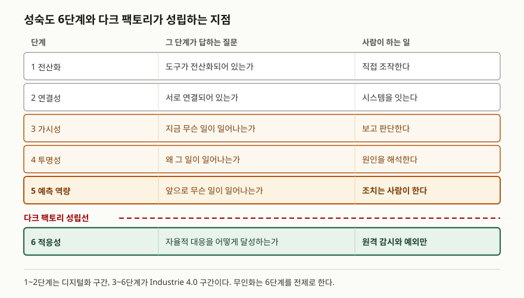

> **실행 검증 없음.** 표준 문서와 공개 연구 보고서의 정의를 정리한 개념 글이다.
>
> **용어 자체에는 1차 자료가 없다.** 다크 팩토리를 정의한 표준·규격을 찾지 못해
> 독립된 2차 자료 3건(설비 공급사·산업 협회·정비 서비스 기업)을 교차 확인해 정의를 잡았다.
> 그 위에 얹는 성숙도 단계와 구성 기술은 전부 1차 자료로 근거를 붙였다. (§10)
> 절감률·생산성 배수 같은 수치는 원 출처가 1차 자료가 아니어서 싣지 않았다.

## 들어가며

다크 팩토리는 시험에서 단답형으로 잘 나오는데, 답안 대부분이 "조명 없이 돌아가는 무인
공장"이라는 한 줄에서 멈춘다. 그 한 줄은 용어 풀이지 개념 설명이 아니다. 채점자가
가르고 싶은 것은 **무인화가 어떤 조건이 갖춰졌을 때 성립하는가**이고, 이걸 쓰려면
다크 팩토리를 스마트 팩토리 논의 위에 올려놓아야 한다.

실무 관점에서도 질문은 하나로 좁혀진다. 무인화를 막는 것이 로봇이나 센서 같은 설비
기술인가, 아니면 정상 경로를 벗어난 상황을 처리하는 문제인가. 이 글은 후자라는 쪽으로
답하고, 그 근거를 성숙도 모델에서 가져온다.

## 정의

**다크 팩토리(dark factory)**: 현장에 상주하는 작업자 없이 생산 설비가 연속 가동되는
공장. 영문 문헌에서는 **lights-out manufacturing**으로 더 자주 쓰인다. 조명이 필요
없다는 데서 이름이 왔다.

확인한 세 출처가 공통으로 드는 요건은 **2가지**다.

1. 물류·가공·검사까지 **한 사이클이 사람의 개입 없이 닫힌다**
2. 사람은 **현장이 아니라 원격에서** 감시하고 예외일 때만 들어온다

주의할 점은 "무인"이 "인력 불필요"가 아니라는 것이다. 세 출처 모두 정비·프로그래밍·
공정 설계 인력을 전제로 들고 있다. 답안에서 완전 무인으로 단정하면 감점 요인이 된다.
사람이 사라진 것이 아니라 **사람의 자리가 현장에서 감시·설계로 옮겨간 것**이다.

## 등장 배경

무인 운전 자체는 새로운 발상이 아니다. 수치제어 공작기계와 자동 공급 장치만 있으면
야간 무인 가동은 오래전부터 가능했다. 그런데 그렇게 돌린 공장은 아침에 와 보면
한 대가 멈춰 있고 그 뒤 물량이 전부 밀려 있는 일이 잦았다. **이상을 감지하고 조치할
사람이 없다**는 것이 무인 운전의 본질적 약점이었다.

그래서 다크 팩토리는 설비 자동화가 아니라 **상태 파악과 자율 조치**의 문제로
다시 정의된다. 이 관점을 가장 또렷하게 정리해 둔 것이 acatech의 Industrie 4.0
성숙도 모델이다.

## 구성요소 — 성숙도 6단계와 성립 전제 4가지

acatech Industrie 4.0 Maturity Index는 디지털 성숙도를 **6단계**로 나눈다.
1~2단계는 디지털화 구간이고, 3~6단계가 Industrie 4.0 구간이다.

| 단계 | 이름 | 그 단계가 답하는 질문 |
|---|---|---|
| 1 | 전산화 Computerisation | 개별 도구가 전산화되어 있는가 |
| 2 | 연결성 Connectivity | 그 도구들이 서로 연결되어 있는가 |
| 3 | 가시성 Visibility | 지금 무슨 일이 일어나고 있는가 |
| 4 | 투명성 Transparency | 왜 그 일이 일어나는가 |
| 5 | 예측 역량 Predictive capacity | 앞으로 무슨 일이 일어나는가 |
| 6 | 적응성 Adaptability | 자율적 대응을 어떻게 달성하는가 |

갈림길은 **5단계와 6단계 사이**다. acatech의 설명에 따르면 5단계는 미래 시나리오를
예측할 수 있는 상태이지만 **조치는 여전히 사람이 수행**한다. 6단계는 디지털 섀도의
데이터로 결정을 내리고 해당 조치를 **사람의 개입 없이 자동으로 실행**하는 상태다.
다크 팩토리는 6단계를 전제로 성립한다. 야간에 사람이 없다는 말은 그 시간 동안
5단계로는 부족하다는 뜻이다.

성립 전제는 **4가지**로 묶인다.

1. **상태 동기화** — 관측 가능한 제조 요소를 디지털 표현과 동기화해 원격에서 현재
   상태를 판단할 수 있어야 한다 (ISO 23247-1).
2. **자율 조치** — 예측에서 그치지 않고 조치까지 자동으로 닫혀야 한다 (acatech 6단계).
3. **안전과 보안** — 사람이 없어도 예기치 않은 기동·정지가 안전하게 처리되고
   (ISO 10218-1), 제어망 침해가 곧 설비 사고가 되지 않아야 한다 (IEC 62443).
4. **생산 특성** — 변동이 적고 물량이 큰 품목. 교체·재설정이 잦으면 사람이 다시 들어온다.

②를 떠받치는 것이 예지정비다. ISO 13374-1은 상태 감시 시스템의 기능을 **6개 블록**으로
규정한다 — 데이터 수집, 데이터 가공, 상태 판정, 건전성 평가, 예후 평가, 권고 생성이다.
마지막 블록인 **권고 생성의 수신자를 사람에서 제어 시스템으로 바꾸는 것**이 acatech
5단계에서 6단계로 넘어가는 일과 같다. 답안에서 이 대응을 적으면 두 표준이 한 줄로 묶인다.

## 도식

> **구조 근거**: 6단계와 각 단계가 답하는 질문은
> [acatech STUDY, *Industrie 4.0 Maturity Index* (2017) Figure 5 및 §3.1.1–3.1.6](https://www.acatech.de/wp-content/uploads/2018/03/acatech_STUDIE_Maturity_Index_eng_WEB.pdf)을
> 따랐다. 6단계의 정의("사람의 도움 없이 조치를 자동 실행")도 같은 문서 §3.1.6이다.
> "사람이 하는 일" 열은 각 단계 설명에서 사람이 수행한다고 적힌 행위를 옮긴 것이며,
> 다크 팩토리 성립선의 위치는 §2의 정의 2요건을 6단계 정의에 대응시킨 것이다 (2차 자료 기반).

답안지에는 여섯 칸을 세로로 쌓고 5번과 6번 사이에 점선 하나를 긋는 것으로 끝난다.
그 점선에 "여기부터 무인"이라고 적으면 이 문제의 핵심이 다 들어간다.

## 비교

### 자동화 공장 · 스마트 팩토리 · 다크 팩토리

| 항목 | 자동화 공장 | 스마트 팩토리 | 다크 팩토리 |
|---|---|---|---|
| 성숙도 위치 | 1~2단계 | 3~5단계 | 6단계 |
| 판단 주체 | 고정 로직 | 사람 + 분석 | 시스템 |
| 사람의 위치 | 현장 조작 | 현장 + 관제 | 원격 관제만 |
| 이상 발생 시 | 정지 후 대기 | 사람이 조치 | 자동 조치, 불가 시 정지 |
| 적합 품종 | 대량 소품종 | 다품종 대응 | 변동 작은 품목 |

### 예측 역량(5단계)과 적응성(6단계)

| 구분 | 5단계 예측 역량 | 6단계 적응성 |
|---|---|---|
| 산출물 | 시나리오와 발생 확률 | 결정과 실행 |
| 조치 수행 | 사람 | 시스템 |
| 실패 시 손실 | 리드타임 확보 실패 | 무인 구간 전체 손실 |
| 필요한 것 | 디지털 섀도와 상호작용 지식 | 위임 범위의 사전 정의 |

두 단계를 가르는 것이 설비의 성능이 아니라 **결정 위임의 범위**라는 점이 중요하다.
acatech도 적응성의 정도가 결정의 복잡도와 비용·편익 비율에 달려 있고, 개별 공정만
자동화하는 편이 나은 경우가 많다고 적고 있다.

## 적용 시 고려사항

- **무인화를 막는 것은 대개 정상 경로가 아니라 예외다.** 가공·이송·검사의 정상 흐름은
  이미 자동화되어 있다. 남는 것은 자재가 비스듬히 놓였을 때, 공구가 예상보다 빨리
  마모됐을 때처럼 빈도는 낮고 종류는 많은 상황이다. 이 꼬리를 얼마나 닫았느냐가
  무인 가동 시간을 정한다. 설비 투자보다 **예외 목록을 먼저 만드는 것**이 순서다.
- **위임 범위를 사전에 문서로 정한다.** 6단계는 결정을 시스템에 넘기는 단계인데,
  무엇을 넘기고 무엇을 넘기지 않는지가 정해져 있지 않으면 사고 후에 책임이 남지 않는다.
  고객·공급사에 대한 승인처럼 되돌리기 어려운 결정은 위임 대상에서 빼는 편이 안전하다.
- **안전과 보안을 한 묶음으로 다룬다.** 현장에 사람이 없다는 말은 물리적 비상 정지를
  누를 사람도 없다는 뜻이다. 기능 안전(ISO 10218-1)과 OT 보안(IEC 62443)을 따로
  검토하면 "원격 침입으로 인한 오동작"처럼 두 영역에 걸친 위험이 빠진다.
- **공정 단위로 끊어서 넓힌다.** 공장 전체를 한 번에 무인화하는 대신 변동이 작은
  공정부터 구간을 닫고, 그 구간의 무인 가동 시간을 지표로 잡아 확장한다.
- **조직과 문화도 성숙도의 일부다.** acatech는 성숙도를 자원·정보시스템·조직구조·문화의
  **4개 구조 영역**에서 평가한다. 넷 중 둘이 기술 밖에 있다. 설비만 갖추고 6단계라고
  주장할 수 없다는 뜻이고, 답안에서 이 점을 적으면 기술 나열에서 한 걸음 나간다.

## 정리

- 정의는 두 요건으로 끊는다 — **한 사이클이 사람 개입 없이 닫힌다 + 사람은 원격에만 있다.**
  "무인 ≠ 인력 불필요"라는 단서를 반드시 붙인다.
- 개수는 **성숙도 6단계, 성립 전제 4가지, ISO 13374 기능 6블록, acatech 구조 영역 4개**다.
- 6단계의 질문만 순서대로 외워도 절반이 된다 — **연결 → 보이는가 → 왜인가 → 무엇이 올까 → 스스로 대응하는가.**
- 다크 팩토리의 성립선은 **5단계와 6단계 사이**다. 5단계는 예측하고 사람이 조치하지만,
  6단계는 조치까지 자동으로 닫는다.
- 무인화를 막는 것은 설비가 아니라 **예외의 꼬리**와 **결정 위임의 범위**다.
- 용어 자체는 표준 정의가 없다. 답안에서도 "정의가 정립되는 중"이라고 쓸 수 있다.

> 기출 답안: [기출문제 — 다크 팩토리(Dark Factory)](../../exam/2026-09-21-dark-factory/index.md)

## 참고 자료

- [acatech STUDY, *Industrie 4.0 Maturity Index: Managing the Digital Transformation of Companies*, Herbert Utz Verlag, 2017](https://www.acatech.de/wp-content/uploads/2018/03/acatech_STUDIE_Maturity_Index_eng_WEB.pdf) — §3.1 발전 단계, §3.2 구조 영역
- [acatech, *Industrie 4.0 Maturity Index — UPDATE 2020*](https://en.acatech.de/publication/industrie-4-0-maturity-index-update-2020/)
- [IEC 62264-1 / ANSI-ISA-95 — Enterprise-control system integration, Part 1: Models and terminology](https://www.isa.org/standards-and-publications/isa-standards/isa-95-standard)
- [ISO 13374-1:2003 — Condition monitoring and diagnostics of machines: Data processing, communication and presentation, Part 1: General guidelines](https://www.iso.org/standard/21832.html)
- [ISO 23247-1:2021 — Automation systems and integration: Digital twin framework for manufacturing, Part 1: Overview and general principles](https://www.iso.org/standard/75066.html)
- [ISO 10218-1:2025 — Robotics: Safety requirements, Part 1: Industrial robots](https://www.iso.org/standard/73933.html)
- [IEC 62443 series — Security for industrial automation and control systems](https://www.iec.ch/blog/understanding-iec-62443)
- 2차 자료 (용어 정의 교차 확인, 세 건 모두 발행일 미표기)
  - [Siemens, "Lights-out factory"](https://www.siemens.com/en-us/technology/lights-out-factory/)
  - [AMT/IMTS, "Automated Factory Guide: Lights-Out and Dark Manufacturing"](https://www.imts.com/read/article-details/Automated-Factory-Guide-Lights-Out-and-Dark-Manufacturing/1206/type/Read/1)
  - [Advanced Technology Services, "What is 'Lights Out' Dark Manufacturing?"](https://www.advancedtech.com/blog/what-is-lights-out-dark-manufacturing/)
