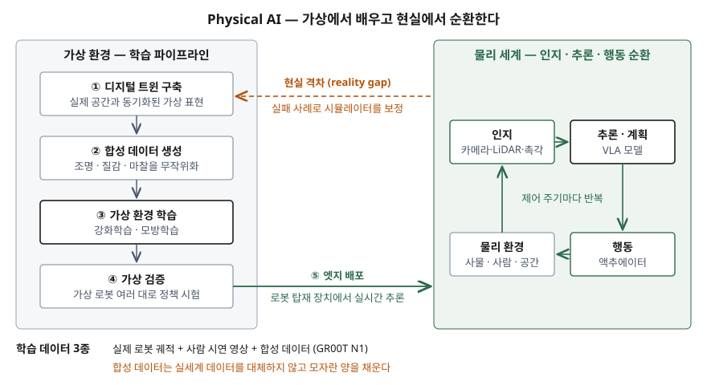

> **실행 검증 없음.** 논문과 공개 보고서를 근거로 정리한 개념 글이다.
>
> **용어 자체에는 1차 자료 없음.** Physical AI를 정의한 표준·공공 문서를 찾지 못해 독립된
> 2차 자료 3건(NVIDIA 용어집, 발행일 미표기 / IBM Think, 2026-01-19 / WEF·BCG 백서,
> 2025-09)을 교차 확인해 정의와 학습 파이프라인을 잡았다. VLA 모델과 도메인 무작위화는
> 원 논문(RT-2, GR00T N1, Tobin et al.)을 근거로 했다. (§10)
> 시장 규모와 백서의 기업 사례 수치는 원 출처가 1차가 아니어서 싣지 않았다.

## 들어가며

Physical AI는 생성형 AI 다음에 오는 주제로 시험에 나온다. 답안이 "로봇에 들어간
생성형 AI"에서 멈추면 두 가지를 놓친다. 하나는 출력이 물리 세계에 닿고 그 결과를
다시 관측하는 **순환 구조**이고, 다른 하나는 실세계 데이터가 모자라서 **학습 데이터를
시뮬레이션에서 만든다**는 점이다. 정보관리기술사 관점에서 점수가 붙는 곳은 후자다.
데이터를 어디서 만들고, 그것이 현실과 맞는지를 어떻게 검증하느냐가 정보시스템의 일이다.

## 정의

**Physical AI**: 센서로 물리 환경을 인지하고, 추론해 행동을 정하고, 액추에이터로
실제 세계에 작용하는 AI 시스템이다.

정의가 정립되는 중이며 세 출처의 강조점이 다르다.

| 출처 | 정의의 중심 |
|---|---|
| NVIDIA 용어집 | 자율 시스템이 물리 세계에서 **인지·이해·추론하고 복잡한 행동을 수행**한다 |
| IBM Think | 소프트웨어 안에만 있지 않고 **물리 세계에서 동작하고 상호작용**하는 AI |
| WEF·BCG 백서 | 로봇이 복잡한 실세계에서 **인지·계획·행동**하도록 하는 AI 기반 접근 |

세 출처가 공통으로 드는 요소는 **인지·추론(계획)·행동 3가지**다.

## 등장 배경

산업용 로봇은 오래전부터 있었지만 **명시적으로 프로그래밍한 동작**만 수행했다.
WEF 백서는 기존 로봇이 적응성이 낮고 통합 비용이 높다는 제약에 묶여 있었다고 적는다.
부품 위치가 조금만 달라져도 사람이 다시 프로그래밍해야 했다.

같은 시기에 생성형 AI는 인터넷 규모 데이터로 사전학습해 처음 보는 입력에도 대응하는
능력을 보였다. 문제는 그 출력이 텍스트와 이미지에서 끝난다는 것이었다. 로봇에 이
능력을 옮기려면 두 가지가 필요했다. 모델이 **행동을 출력할 수 있어야** 하고, 행동을
배울 **데이터가 있어야** 했다. 인터넷에는 텍스트가 많지만 로봇 관절 궤적은 거의 없다.
IBM은 실세계 데이터 수집이 비싸고 시간이 오래 걸린다는 것을 첫 번째 과제로 든다.
앞의 문제는 VLA 모델이, 뒤의 문제는 시뮬레이션 기반 학습이 푼다.

## 구성요소 — 순환 3단계, 학습 파이프라인 5단계

### 인지·추론·행동 순환 3단계

1. **인지** — 카메라·LiDAR·촉각 센서로 사물의 종류, 3차원 방향, 물리적 성질을 파악한다
2. **추론·계획** — 목표를 받아 행동의 순서를 정한다. WEF 백서의 예는 "화물 하역"이라는
   목표를 지게차 이동, 결속 밴드 절단, 포장 개봉으로 나누는 것이다
3. **행동** — 액추에이터로 물리 세계에 작용한다. 결과는 다시 인지 단계의 입력이 된다

추론 단계를 맡는 것이 **VLA(Vision-Language-Action) 모델**이다. RT-2 논문은 로봇 행동을
**텍스트 토큰으로 표현**해 시각·언어 데이터와 같은 학습 집합에 넣었다. 언어 모델이
단어를 출력하듯 행동을 출력하게 만든 것이다. GR00T N1 논문은 이를 **이중 시스템**으로
나눈다. 시각·언어 모듈(System 2)이 환경과 지시를 해석하고, 확산 트랜스포머(System 1)가
실시간 모터 행동을 생성하며, 둘을 종단 간으로 함께 학습한다. 해석은 느려도 되지만
행동은 제어 주기 안에 나와야 하기 때문에 갈라 놓은 것이다.

### 시뮬레이션 기반 학습 파이프라인 5단계

NVIDIA 용어집이 드는 단계를 뼈대로 하고, WEF·IBM이 같은 흐름을 적은 부분으로 확인했다.

1. **디지털 트윈 구축** — 실제 공간을 가상 환경으로 재현한다. ISO 23247-1은 제조 디지털
   트윈을 관측 가능한 제조 요소와 **동기화되는** 디지털 표현으로 규정한다
2. **합성 데이터 생성** — 조명·질감·물체 모양을 무작위로 바꾼 장면을 대량으로 렌더링한다
3. **가상 환경 학습** — 강화학습으로 시행착오를 반복하거나, 사람 시연을 모방학습한다
4. **가상 검증** — 여러 대의 가상 로봇으로 정책을 시험한 뒤에만 현실에 내보낸다
5. **엣지 배포** — 로봇에 탑재된 장치에서 모델을 실시간으로 돌린다. IBM은 배포 뒤
   실세계에서 추가 조정(fine-tuning)을 한다고 적는다

2단계의 근거는 **도메인 무작위화** 논문(Tobin et al., 2017)이다. 시뮬레이터의 렌더링을
무작위로 바꿔 학습하면, 모델에게는 현실이 여러 변형 중 하나로 보여 **시뮬레이션과
현실의 차이(reality gap)** 를 넘을 수 있다는 것이다. 이 논문은 시뮬레이션 이미지로만
학습한 물체 검출기가 실제 환경에서 1.5cm 이내 정확도를 냈다고 보고한다.
WEF 백서는 무작위로 바꾸는 대상에 조명뿐 아니라 **마찰** 같은 물리 파라미터를 든다.

GR00T N1은 학습 데이터를 **3종**으로 섞는다 — 실제 로봇 궤적, 사람 시연 영상, 합성
데이터다. 시뮬레이션이 실세계 데이터를 대체하는 것이 아니라 모자란 양을 채운다.

## 도식

> **출처**: 순환 3단계는 [NVIDIA Glossary, What is Physical AI?](https://www.nvidia.com/en-us/glossary/generative-physical-ai/) · [IBM Think, What is physical AI?](https://www.ibm.com/think/topics/physical-ai) · [WEF, Physical AI §1.1 Technological breakthroughs](https://reports.weforum.org/docs/WEF_Physical_AI_Powering_the_New_Age_of_Industrial_Operations_2025.pdf) 교차 확인, 파이프라인 5단계는 NVIDIA Glossary *How does physical AI work?* 를 WEF §1.1·IBM과 대조, 도메인 무작위화는 [Tobin et al., arXiv:1703.06907](https://arxiv.org/abs/1703.06907) (2차 자료 기반)

답안지에는 왼쪽에 가상 쪽 네 칸(트윈 → 합성 데이터 → 학습 → 검증)을 세로로 쌓고,
오른쪽에 인지 → 추론 → 행동 순환 하나를 그린 뒤 둘 사이에 "배포"와 "현실 격차"
화살표를 긋는다.

## 비교

### 3계층 자동화 — 규칙 기반 · 학습 기반 · 맥락 기반

WEF 백서는 로봇 시스템을 **3가지**로 나누고, 셋이 서로를 대체하지 않고 **공존하는
계층형 자동화**를 이룬다고 본다.

| 구분 | 규칙 기반 | 학습 기반 | 맥락 기반 |
|---|---|---|---|
| 동작을 얻는 방법 | 명시적 프로그래밍 | 강화학습·모방학습 (현실 + 시뮬레이션) | 별도 학습 없는 제로샷 수행 |
| 맞는 공정 | 구조화된 반복 작업 | 통제된 변동이 있는 작업 | 예측 불가 공정, 처음 보는 환경 |
| 백서의 예 | 자동차 용접 | 적응형 키팅 | 자연어 지시를 받아 추론·수행 |
| 정보시스템의 부담 | 프로그램 관리 | 학습 데이터·시뮬레이터 관리 | 기반 모델 배포·검증 |

### 실세계 데이터와 합성 데이터

| 구분 | 실세계 데이터 | 시뮬레이션 합성 데이터 |
|---|---|---|
| 수집 비용 | 로봇·사람·시간이 든다 | 연산 자원이 든다 |
| 위험 | 실패가 곧 파손·사고 | 가상 환경 안에서 끝난다 |
| 정답 표시 | 사람이 붙인다 | 시뮬레이터가 알고 있다 |
| 약점 | 드문 상황을 모으기 어렵다 | 현실과 차이가 있다 — 검증 절차가 필요 |

생성형 AI와의 대비는 기출 답안에 표로 정리했다.

## 적용 시 고려사항

- **현실 격차를 데이터 품질 항목으로 관리한다.** 가상에서 잘 되는 정책이 현실에서
  실패하는 원인은 대부분 시뮬레이터가 재현하지 못한 물리 조건이다. 무엇을 무작위화했고
  어느 범위였는지를 학습 데이터의 메타데이터로 남겨야 현실에서 실패했을 때 원인을
  시뮬레이터 설정까지 거슬러 올라갈 수 있다.
- **합성 데이터에도 계보를 붙인다.** 한 번의 학습에 실제 궤적, 시연 영상, 합성 장면이
  섞인다. 어떤 버전의 디지털 트윈과 어떤 생성 설정에서 나온 데이터인지 기록하지 않으면
  같은 모델을 다시 만들 수 없다. 모델 버전과 데이터 버전을 함께 관리한다.
- **배포 대상이 현장 장치 전체다.** 행동은 제어 주기 안에 나와야 하므로 추론을 엣지에서
  돌린다. 모델 갱신·되돌리기를 데이터센터 한 곳이 아니라 로봇마다 해야 하고, 장치별로
  어느 버전이 돌고 있는지 파악하는 구성 관리가 필요하다.
- **안전과 보안을 한 묶음으로 설계한다.** IBM은 디지털 AI와 달리 오류가 실제 결과를
  낳는다는 점을 과제로 든다. 로봇 안전 규격(ISO 10218-1)이 무인 운전의 전제 조건이 되고,
  제어망 침해가 곧 물리 사고가 되므로 OT 보안(IEC 62443)을 함께 검토한다.
- **계층을 공정에 맞춰 고른다.** 변동이 적은 반복 공정에 학습 기반을 넣으면 규칙 기반보다
  검증 부담만 늘어난다. WEF 백서도 작업의 복잡도·변동성·물량 조합에 따라 셋 중 하나를
  고르라고 한다.

## 정리

- 정의는 **인지·추론·행동 3가지**로 끊고, "정의가 정립되는 중"이라는 단서를 붙인다.
- 추론을 맡는 **VLA** — RT-2는 행동을 텍스트 토큰으로, GR00T N1은 System 2(해석)와 System 1(행동) **이중 시스템**으로.
- 학습 파이프라인 **5단계** — 트윈 → 합성 데이터 → 가상 학습 → 가상 검증 → 엣지 배포.
- 넘어야 할 것은 **현실 격차**, 쓰는 기법은 **도메인 무작위화**. 학습 데이터는 **실제·시연·합성 3종** 혼합이다.
- 자동화는 **규칙·학습·맥락 3계층**이 공존한다. 대체가 아니다.

> 기출 답안: [기출문제 — Physical AI와 생성형 AI 비교](../../exam/2026-09-23-physical-ai-vs-generative-ai/index.md)

## 참고 자료

- [Brohan et al., RT-2: Vision-Language-Action Models Transfer Web Knowledge to Robotic Control, arXiv:2307.15818 (2023-07)](https://arxiv.org/abs/2307.15818)
- [NVIDIA et al., GR00T N1: An Open Foundation Model for Generalist Humanoid Robots, arXiv:2503.14734 (2025-03)](https://arxiv.org/abs/2503.14734)
- [Tobin et al., Domain Randomization for Transferring Deep Neural Networks from Simulation to the Real World, arXiv:1703.06907 (2017-03)](https://arxiv.org/abs/1703.06907)
- [ISO 23247-1:2021 — Automation systems and integration: Digital twin framework for manufacturing, Part 1: Overview and general principles](https://www.iso.org/standard/75066.html)
- [ISO 10218-1:2025 — Robotics: Safety requirements, Part 1: Industrial robots](https://www.iso.org/standard/73933.html)
- [IEC 62443 series — Security for industrial automation and control systems](https://www.iec.ch/blog/understanding-iec-62443)
- 2차 자료 (Physical AI 정의·학습 파이프라인 교차 확인)
  - [NVIDIA Glossary, "What is Physical AI?"](https://www.nvidia.com/en-us/glossary/generative-physical-ai/) — 발행일 미표기
  - [IBM Think, Cole Stryker, "What is physical AI?"](https://www.ibm.com/think/topics/physical-ai) — 2026-01-19
  - [World Economic Forum · BCG, "Physical AI: Powering the New Age of Industrial Operations"](https://reports.weforum.org/docs/WEF_Physical_AI_Powering_the_New_Age_of_Industrial_Operations_2025.pdf) — 2025-09, §1.1 Technological breakthroughs · §1.2 Enhanced capabilities
