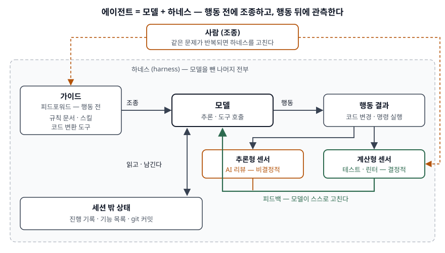

> **실행 검증 없음.** 공개 문서의 정의와 구조를 정리한 개념 글이다. 출력·측정값은 싣지 않는다.
>
> **1차 자료 없음. 2차 자료 3건을 교차 확인해 정리했다.** 하네스 엔지니어링을 정의한 표준이나
> 동료 심사 논문을 찾지 못했다. 근거는 Thoughtworks Birgitta Böckeler의 martinfowler.com 글
> (2026-04-02), Anthropic 엔지니어링 블로그(2025-11-26), Google Developers Blog(2026-09-09)이며,
> 셋은 서로를 인용하지 않는 독립된 글이다. 정의가 정립되는 중이므로 출처마다 다른 점은 통일하지 않고
> 그대로 적는다. (§10)

## 들어가며

코딩 에이전트에게 "테스트를 깨지 말 것"을 프롬프트로 적어도 에이전트는 가끔 테스트를 깬다.
다음 날 새 세션을 열면 어제 무엇을 했는지 모른다. 모델 버전을 올리면 멀쩡하던 동작이 바뀐다.
이 세 가지는 프롬프트 문구를 다듬어서는 풀리지 않고, **모델 바깥에 무엇을 둘 것인가**의 문제다.
시험은 이 바깥 구조를 가리키는 하네스 엔지니어링을 프롬프트·컨텍스트 엔지니어링과 구분해 쓸 수
있는지를 묻는다.

## 정의

**하네스(harness)**: AI 에이전트에서 **모델 자체를 뺀 나머지 전부**다. Böckeler 글은 이를
**에이전트 = 모델 + 하네스**로 적는다.

**하네스 엔지니어링**: 이 하네스 — 모델에 공급하는 규칙과 도구, 행동 결과를 검사하는 장치, 세션 밖에
두는 상태 — 를 설계하고 고쳐 가며 에이전트가 믿을 수 있게 동작하도록 만드는 활동이다. 세 출처가
중심에 두는 것은 다르다.

| 출처 | 중심에 두는 것 |
|---|---|
| Böckeler (Thoughtworks) | 행동 **전에** 조종하는 가이드와 행동 **뒤에** 관측하는 센서 |
| Anthropic Engineering | 기억 없는 세션이 여러 컨텍스트 창에 걸쳐 작업을 **이어받는 구조** |
| Google Developers Blog | 모델·프롬프트가 바뀌어도 행동을 계속 **검증하는 평가** |

## 등장 배경

프롬프트만으로 에이전트를 다루던 방식에는 **세 가지 한계**가 있다.

- **지시는 확률적으로 지켜진다.** 규칙을 문장으로 적으면 모델이 따르기를 기대할 뿐이다. Böckeler 글은
  테스트·린터처럼 CPU가 돌리는 검사를 "결정적이고 빠르다"고 따로 분류한다. 결정적으로 막을 수 있는
  규칙을 문장으로 남겨 둘 이유가 없다.
- **세션에 기억이 없다.** Anthropic 글은 긴 작업의 핵심 문제를 새 세션이 이전 작업을 전혀 기억하지 못한
  채 시작하는 것으로 본다. 컨텍스트 창 안에만 있는 상태는 세션이 끝나면 사라진다.
- **종합 점수는 원인을 가린다.** Google 글은 종단 간 벤치마크가 합산 점수를 주지만 어떤 행동이 왜
  실패했는지는 직접 답하지 못한다고 지적한다. 모델을 바꿀 때마다 무엇이 깨졌는지 알 방법이 필요하다.

## 구성요소 / 절차

### 제어의 2축 — 방향 2가지 × 실행 방식 2가지 (Böckeler)

| | 계산형 (결정적·빠름) | 추론형 (의미 판단·느림·비결정적) |
|---|---|---|
| **가이드** (피드포워드, 행동 전) | 코드 변환 레시피(OpenRewrite)를 쓰는 도구 | 규칙 문서(`AGENTS.md`), 스킬 |
| **센서** (피드백, 행동 뒤) | 린터·정적 분석, 모듈 경계를 검사하는 테스트 훅 | 리뷰 방법을 적은 스킬, 전체 맥락을 보는 AI 코드 리뷰 |

가이드는 에이전트의 행동을 **예상해 먼저** 조종하고, 센서는 행동을 **관측한 뒤** 에이전트가 스스로
고치게 한다. 글은 계산형 센서가 모델이 읽기 좋게 쓴 신호를 낼 때 특히 강하다고 적는다. 예를 들어
린터 오류 메시지에 고치는 방법을 함께 적어 두면, 에이전트가 그 메시지를 읽고 바로 고친다.

### 하네스가 조절하는 대상 — 3가지 (Böckeler)

- **유지보수성 하네스**: 내부 코드 품질
- **아키텍처 적합성 하네스**: 정해 둔 아키텍처 특성을 지키는지
- **행동 하네스**: 기능이 맞게 동작하는지. 글은 이 부분이 아직 가장 덜 발달했다고 적는다

### 세션 밖 상태 — 역할 2개, 산출물 4가지 (Anthropic)

첫 세션의 **초기화 에이전트**가 환경을 만들고, 이후 세션의 **코딩 에이전트**가 기능을 하나씩 진행한다.
두 역할이 주고받는 것은 대화가 아니라 저장소에 남긴 파일이다.

1. **진행 기록 파일** — 무엇을 했고 다음에 무엇을 할지
2. **기능 목록(JSON)** — 처음엔 전부 `passes: false`. 에이전트는 이 값만 바꾼다
3. **초기화 스크립트** — 개발 서버를 띄우는 방법
4. **설명이 붙은 git 커밋** — 세션을 시작할 때 읽고, 끝낼 때 남긴다

### 행동 평가 반복 — 3단계 (Google)

1. 실패 유형 **하나**를 고른다 (예: 요청이 모호할 때 추측하지 않고 되묻는가)
2. 판정 조건을 쓴다 — 단순한 작업은 엄격한 비교, 복잡한 작업은 LLM 판정
3. 묶음 평가를 자동으로 돌려 안정성을 본다. 나머지 평가 묶음은 CI의 회귀 검사처럼 동작한다

## 도식

> **출처**: [Böckeler, Harness engineering for coding agent users — Guides and sensors, Computational vs inferential](https://martinfowler.com/articles/harness-engineering.html) · [Anthropic, Effective harnesses for long-running agents](https://www.anthropic.com/engineering/effective-harnesses-for-long-running-agents) (2차 자료 기반)

답안지에는 가운데 모델 칸을 두고 왼쪽에 가이드, 오른쪽에 행동 결과와 센서, 아래에 세션 밖 상태를
놓는다. 센서에서 모델로 돌아오는 화살표가 피드백이고, 맨 위 사람은 **모델이 아니라 하네스를 고친다**.
Böckeler 글은 같은 문제가 여러 번 생기면 가이드와 센서를 개선하는 것을 사람의 일로 적는다.

## 비교

### 프롬프트·컨텍스트·하네스 엔지니어링

| 구분 | 프롬프트 엔지니어링 | 컨텍스트 엔지니어링 | 하네스 엔지니어링 |
|---|---|---|---|
| 설계 대상 | 호출 한 번의 입력 문구 | 추론 중 창에 들어갈 토큰 묶음 | 모델 바깥의 실행 환경 전체 |
| 다루는 문제 | 지시를 어떻게 쓸 것인가 | 제한된 주의 예산에 무엇을 넣을 것인가 | 여러 세션·도구 실행에 걸쳐 어떻게 믿을 수 있게 할 것인가 |
| 대표 수단 | 역할·예시·출력 형식 | 요약 압축, 구조화된 메모, 하위 에이전트 | 가이드, 계산형 센서, 진행 기록, 행동 평가 |
| 규칙이 지켜지는 방식 | 모델의 준수에 기댄다 | 모델의 준수에 기댄다 | 계산형 센서는 결정적으로 막는다 |

세 개념의 **포함 관계는 출처마다 다르다.** Anthropic의 컨텍스트 엔지니어링 글(2025-09-29)은
컨텍스트 엔지니어링을 프롬프트 엔지니어링이 자연스럽게 발전한 형태로 본다. Böckeler 글은 코딩 에이전트의
사용자 하네스를 만드는 일을 **컨텍스트 엔지니어링의 특수한 형태**로 보며, 컨텍스트 엔지니어링이 가이드와
센서를 에이전트에 전달하는 수단이라고 적는다. 반면 Google 글은 시스템 프롬프트를 평가 대상이 되는 하네스
요소 중 하나로 다룬다. 답안에는 "정의가 정립되는 중이며 포함 관계가 출처마다 다르다"고 쓰고 두 견해를 함께 적는다.

### 빌더 하네스와 사용자 하네스 (Böckeler)

| 구분 | 빌더 하네스 | 사용자 하네스 |
|---|---|---|
| 만드는 쪽 | 코딩 에이전트 제작사 | 에이전트를 쓰는 팀 |
| 내용 | 시스템 프롬프트, 코드 검색 방식 | 저장소 규칙 문서, 스킬, 린터, 테스트 훅 |
| 바꿀 수 있는가 | 사용자는 못 바꾼다 | 팀이 반복해 고친다 |

## 적용 시 고려사항

- **결정적으로 검사할 수 있는 규칙은 센서로 옮긴다.** 문서에 적은 규칙은 추론형 가이드라 지켜질 수도
  있고 아닐 수도 있다. 명명 규칙, 금지 import, 형식 검사는 린터·테스트로 바꾸는 편이 비용이 싸고 확실하다.
  추론형 센서는 계산형으로 잡을 수 없는 의미 검사에만 쓴다.
- **완료 판정을 에이전트의 자기 보고에 맡기지 않는다.** Anthropic 글이 든 실패 중 하나가 에이전트가
  작업이 끝났다고 너무 일찍 선언하는 것이다. 기능 목록을 전부 실패로 시작하고, 종단 간 검증(브라우저
  자동화)을 통과해야 `passes`를 바꾸게 해 판정 근거를 에이전트 바깥에 둔다.
- **모델 교체를 회귀 시험으로 다룬다.** 하네스는 모델이 바뀌어도 남는 자산이다. Google 글처럼 행동 단위
  평가를 쌓아 두면 시스템 프롬프트를 고치거나 모델을 바꿀 때 무엇이 깨졌는지 바로 드러난다.
- **하네스가 커지면 하네스 자체가 관리 대상이 된다.** Böckeler 글은 하네스가 커질 때의 일관성, 하네스
  품질을 체계적으로 평가하는 방법을 풀리지 않은 문제로 남긴다. 규칙 문서끼리 모순되면 가이드가 에이전트를
  서로 다른 방향으로 조종한다.
- **적용 범위를 과장하지 않는다.** Anthropic 글은 자기 기법이 웹 개발에 맞춰져 있고, 단일 에이전트와
  다중 에이전트 중 무엇이 나은지는 열린 질문이라고 적는다. 다른 영역에 옮길 때는 평가부터 다시 세운다.

> 기출 답안: [기출문제 — 프롬프트 엔지니어링과 하네스 엔지니어링 비교](../../exam/2026-09-28-prompt-vs-harness-engineering/index.md)
>
> 관련 개념: [컨텍스트 엔지니어링 — 추론 시점에 모델에 들어가는 토큰을 고르는 기술](../2026-09-29-context-engineering-token-curation/index.md)

## 정리

- 정의: **에이전트 = 모델 + 하네스.** 하네스는 모델을 뺀 전부(Böckeler). 정의는 정립되는 중이다.
- 등장 배경 **3가지** — 지시는 확률적, 세션은 기억이 없다, 종합 점수는 원인을 가린다.
- 제어 **2×2** — 가이드·센서 × 계산형·추론형. "가·센 × 계·추".
- 조절 대상 **3가지** — 유지보수성·아키텍처 적합성·행동. 행동 하네스가 가장 덜 발달했다.
- 세션 밖 상태 **4산출물** — 진행 기록·기능 목록·초기화 스크립트·git 커밋.
- 행동 평가 **3단계** — 실패 유형 하나 → 판정 조건 → 묶음 자동 평가.

## 참고 자료

- 2차 자료 (하네스 엔지니어링 정의 교차 확인)
  - [Birgitta Böckeler (Thoughtworks), "Harness engineering for coding agent users", martinfowler.com](https://martinfowler.com/articles/harness-engineering.html) — 2026-04-02. 에이전트 = 모델 + 하네스, 가이드·센서, 계산형·추론형, 하네스 3분류, 빌더·사용자 하네스
  - [Anthropic Engineering, Justin Young, "Effective harnesses for long-running agents"](https://www.anthropic.com/engineering/effective-harnesses-for-long-running-agents) — 2025-11-26. 초기화·코딩 에이전트, 상태 산출물, 실패 유형과 대응
  - [Google Developers Blog, Taylor Mullen · Christian Gunderman, "The Anatomy of Harness Engineering"](https://developers.googleblog.com/the-anatomy-of-harness-engineering-how-to-evaluate-iterate-and-guard-ai-coding-agents/) — 2026-09-09. 행동 평가와 종단 간 벤치마크, 반복 3단계
- [Anthropic Engineering, "Effective context engineering for AI agents"](https://www.anthropic.com/engineering/effective-context-engineering-for-ai-agents) — 2025-09-29. 컨텍스트 엔지니어링 정의와 프롬프트 엔지니어링과의 관계, 긴 작업 기법 3가지
