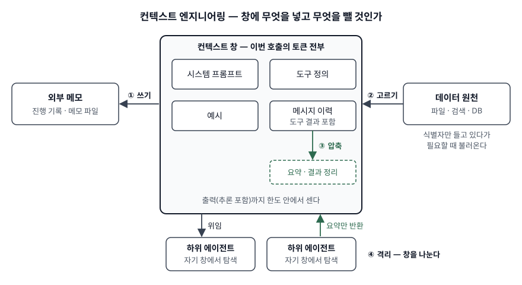

> **실행 검증 없음.** 공개 문서의 정의와 구조를 정리한 개념 글이다. 출력·측정값은 싣지 않는다.
>
> **정의는 2차 자료 3건을 교차 확인해 정리했다.** 컨텍스트 엔지니어링을 정의한 표준은 없다. 1차 자료로는
> 서베이 논문 1편(arXiv 프리프린트, 동료 심사 전)과 컨텍스트 창·컨텍스트 편집을 다룬 Anthropic 공식 문서가 있고,
> 용어의 정의와 전략은 Anthropic 엔지니어링 블로그(2025-09-29), LangChain 블로그(2025-07-02),
> Manus 블로그(2025-07-18)를 교차 확인했다. 세 글은 각자 자기 제품을 만든 경험을 바탕으로 썼다. (§10)

## 들어가며

에이전트가 도구를 수십 번 호출하면 파일 내용, 검색 결과, 오류 로그가 대화에 계속 쌓인다. 어느 순간 창이
가득 차거나, 가득 차기 전에 이미 앞에서 준 지시를 놓치기 시작한다. 이 문제는 지시 문구를 다듬어서는 풀리지
않고 **이번 호출에 어떤 토큰을 넣고 어떤 토큰을 뺄 것인가**를 정해야 풀린다. 시험은 이 선택을 가리키는
컨텍스트 엔지니어링을 프롬프트 엔지니어링과 구분하고, 그 기법을 개수와 함께 쓸 수 있는지를 묻는다.

## 정의

**컨텍스트(context)**: LLM이 응답을 생성할 때 포함되는 토큰의 집합이다(Anthropic Engineering).
Claude 공식 문서는 시스템 프롬프트, 메시지(도구 결과·이미지·문서 포함), 도구 정의, 그리고 그 턴에 생성하는
출력까지 전부 컨텍스트 창에 센다고 적는다.

**컨텍스트 엔지니어링**: 원하는 동작을 얻기 위해 **추론 시점에 모델에 들어가는 토큰 묶음을 고르고 배치하는 일**이다.
출처마다 표현이 다르다.

| 출처 | 정의의 중심 |
|---|---|
| Anthropic Engineering (2025-09-29) | LLM의 제약에 맞서 컨텍스트 토큰의 효용을 최적화하는 일 |
| LangChain Blog (2025-07-02) | 에이전트가 움직이는 **각 단계마다** 창을 알맞은 정보로 채우는 일 |
| Mei 외 서베이 (arXiv, 2025-07) | 프롬프트 설계를 넘어 LLM에 들어가는 정보 적재물을 체계적으로 최적화하는 분야 |

## 등장 배경

프롬프트 한 벌을 다듬는 방식으로는 **세 가지 문제**를 풀 수 없다.

- **창은 유한하고 모든 것이 창을 차지한다.** 도구 정의도, 지난 도구 결과도, 모델이 생성한 출력도 한도 안에서
  센다. 입력만으로 한도를 넘으면 API는 요청을 거부한다(Claude 공식 문서).
- **길수록 정확도가 떨어진다.** Claude 공식 문서는 토큰이 늘수록 정확도와 회상이 떨어지는 현상을 컨텍스트 부패
  (context rot)라 부른다. Anthropic 엔지니어링 글은 원인을 트랜스포머에서 모든 토큰이 모든 토큰을 참조해 n개
  토큰에 n² 쌍의 관계가 생기는 데서 찾는다. Liu 외(TACL)는 관련 정보가 입력의 **처음이나 끝**에 있을 때 성능이
  가장 높고 **가운데**에 있으면 크게 떨어진다고 보고했다.
- **에이전트는 여러 번 호출한다.** 호출 한 번의 입력은 사람이 쓰지만, 다회 에이전트의 입력은 앞선 도구 결과가
  쌓여 만들어진다. 매 단계 무엇을 남길지 정하는 장치가 필요하다.

## 구성요소 / 절차

### 컨텍스트를 이루는 요소 — 4가지 (Anthropic Engineering)

1. **시스템 프롬프트** — 너무 구체적인 규칙 나열과 너무 막연한 지시 사이의 알맞은 수준으로 쓴다
2. **도구** — 기능이 겹치지 않는 최소 집합. 결과를 토큰 효율적으로 돌려준다
3. **예시** — 규칙을 모두 나열하는 대신 대표적인 예시 몇 개
4. **메시지 이력** — 도구 결과를 포함한 지난 턴

LangChain 글은 같은 대상을 **지시·지식·도구 피드백 3유형**으로 나눈다.

### 컨텍스트를 다루는 전략 — 4가지 (LangChain, Anthropic 기법과 대응)

| 전략 | 무엇을 하는가 | Anthropic 글의 대응 기법 |
|---|---|---|
| ① 쓰기(write) | 창 밖에 저장한다 | 구조화된 메모 — 진행 상황을 파일에 남기고 나중에 다시 읽는다 |
| ② 고르기(select) | 필요한 것만 창으로 가져온다 | 적시 검색 — 경로·URL 같은 식별자만 들고 있다가 도구로 불러온다 |
| ③ 압축(compress) | 필요한 토큰만 남긴다 | 요약 압축, 도구 결과 정리 |
| ④ 격리(isolate) | 창을 나눈다 | 하위 에이전트 — 깨끗한 창에서 탐색하고 요약만 돌려준다 |

두 글은 서로 다른 이름을 쓰지만 네 갈래가 그대로 대응한다. 암기는 LangChain의 네 동사로 한다.

### 서베이의 분류 — 기초 구성요소 3가지, 시스템 구현 4가지 (Mei 외)

- 기초 구성요소: **컨텍스트 검색·생성, 컨텍스트 처리, 컨텍스트 관리**
- 시스템 구현: **검색 증강 생성(RAG), 메모리 시스템, 도구 통합 추론, 다중 에이전트 시스템**

## 도식

> **출처**: [Anthropic Engineering, Effective context engineering for AI agents](https://www.anthropic.com/engineering/effective-context-engineering-for-ai-agents) · [LangChain, Context Engineering](https://www.langchain.com/blog/context-engineering-for-agents) · [Claude Docs, Context windows — How the context window works](https://platform.claude.com/docs/en/build-with-claude/context-windows#how-the-context-window-works) (2차 자료 기반)

답안지에는 가운데 컨텍스트 창을 크게 그리고 안에 4요소를 적는다. 왼쪽 외부 메모로 나가는 화살표가 **쓰기**,
오른쪽 데이터 원천에서 들어오는 화살표가 **고르기**, 창 안에서 도는 화살표가 **압축**, 아래 하위 에이전트가
**격리**다. 하위 에이전트는 자기 창에서 탐색하고 요약만 돌려보낸다.

## 비교

### 프롬프트·컨텍스트·하네스 엔지니어링

| 구분 | 프롬프트 엔지니어링 | 컨텍스트 엔지니어링 | 하네스 엔지니어링 |
|---|---|---|---|
| 설계 대상 | 호출 한 번의 지시 문구 | 매 호출에 창에 들어갈 토큰 묶음 | 모델 바깥의 실행 환경 전체 |
| 결정 시점 | 작성할 때 한 번 | 추론할 때마다 | 설계·운영하면서 반복 |
| 대표 수단 | 역할·예시·출력 형식 | 적시 검색, 압축, 외부 메모, 하위 에이전트 | 가이드, 테스트·린터 센서, 진행 기록, 행동 평가 |

포함 관계는 출처마다 다르다. Anthropic 엔지니어링 글은 컨텍스트 엔지니어링을 **프롬프트 엔지니어링이 자연스럽게
발전한 형태**로 본다. Thoughtworks Böckeler 글은 코딩 에이전트의 하네스를 만드는 일을 **컨텍스트 엔지니어링의
특수한 형태**로 본다. 답안에는 "정의가 정립되는 중"이라 쓰고 두 견해를 함께 적는다.

### 사전 적재와 적시 검색 (Anthropic Engineering)

| 구분 | 사전 적재 | 적시 검색 |
|---|---|---|
| 방식 | 관련 자료를 추론 전에 창에 넣는다 (임베딩 검색 등) | 식별자만 두고 에이전트가 도구로 불러온다 |
| 장점 | 빠르다 | 창을 적게 쓰고, 탐색하며 필요한 것을 찾는다 |
| 단점 | 오래된 인덱스, 불필요한 토큰 | 도구 호출이 늘어 느리다 |

Anthropic 글은 둘을 섞는 **혼합 전략** — 일부는 미리 넣고 나머지는 에이전트가 찾게 하는 방식 — 을 함께 든다.
RAG는 이 가운데 사전 적재 쪽 구현 하나이고, 컨텍스트 엔지니어링은 RAG를 포함한 상위 개념이다.

## 적용 시 고려사항

- **압축은 캐시와 부딪힌다.** Claude 공식 문서는 도구 결과를 정리하면 캐시된 프롬프트 앞부분이 무효가 된다고
  적고, 한 번에 최소 몇 토큰 이상 지울 때만 정리하도록 `clear_at_least` 값을 둔다. Manus 글도 앞부분을 고정하고
  뒤에 덧붙이기만 해 캐시 적중률을 지키라고 한다. 무엇을 지울지와 언제 지울지를 같이 정한다.
- **지워도 되는 결과와 남길 결과를 구분한다.** 컨텍스트 편집 기능은 오래된 도구 결과부터 지우되 `exclude_tools`로
  예외를 둔다. Manus 글은 실패한 행동과 오류 기록을 지우지 말라고 한다. 모델이 그 흔적을 보고 같은 실수를 피하기 때문이다.
- **도구 정의도 비용이다.** 도구 정의는 창에 센다(Claude 공식 문서). 도구가 많으면 모델이 무엇을 쓸지 헷갈리고
  창도 줄어든다. Anthropic 글은 기능이 겹치지 않는 최소 도구 집합을 권한다.
- **중요한 정보를 가운데 묻지 않는다.** 가운데 정보를 덜 활용한다는 Liu 외의 결과에 맞춰, 목표와 진행 상황을 창의
  끝쪽에 다시 적는다. Manus 글은 할 일 목록 파일을 계속 고쳐 쓰는 방식을 이 목적으로 든다.
- **상태는 창 밖에 둔다.** 창에만 있는 상태는 압축이나 세션 종료로 사라진다. Claude 공식 문서는 메모리 도구를
  컨텍스트 편집과 함께 써서, 정리되기 전에 중요한 내용을 파일에 남기게 한다.

> 기출 답안: [기출문제 — 프롬프트 엔지니어링과 하네스 엔지니어링 비교](../../exam/2026-09-28-prompt-vs-harness-engineering/index.md)
>
> 관련 개념: [하네스 엔지니어링 — 가이드·센서·세션 밖 상태로 에이전트를 통제하는 구조](../2026-09-28-harness-engineering-guides-sensors/index.md)

## 정리

- 정의: **추론 시점에 창에 들어갈 토큰을 고르는 일.** 표준 정의는 없고 정립되는 중이다.
- 등장 배경 **3가지** — 창은 유한, 길수록 정확도 저하(컨텍스트 부패·가운데 손실), 에이전트는 다회 호출.
- 구성 **4요소** — 시스템 프롬프트 · 도구 · 예시 · 메시지 이력.
- 전략 **4동사** — 쓰기 · 고르기 · 압축 · 격리. "쓰·고·압·격".
- 서베이 분류 **3 + 4** — 검색·생성/처리/관리 + RAG/메모리/도구 통합 추론/다중 에이전트.

## 참고 자료

- [Lingrui Mei 외, A Survey of Context Engineering for Large Language Models, arXiv:2507.13334v2 (2025-07-21)](https://arxiv.org/abs/2507.13334) — 정의, 기초 구성요소 3가지와 시스템 구현 4가지 분류
- [Nelson F. Liu 외, Lost in the Middle: How Language Models Use Long Contexts, TACL](https://arxiv.org/abs/2307.03172) — 입력 가운데 정보의 활용 저하
- [Claude Docs, Context windows](https://platform.claude.com/docs/en/build-with-claude/context-windows) — 창에 세는 것, 컨텍스트 부패, 한도 초과 동작
- [Claude Docs, Context editing](https://platform.claude.com/docs/en/build-with-claude/context-editing) — 도구 결과 정리, `clear_at_least`·`exclude_tools`, 캐시 무효화, 메모리 도구 연계
- 2차 자료 (컨텍스트 엔지니어링 정의·전략 교차 확인)
  - [Anthropic Engineering, "Effective context engineering for AI agents"](https://www.anthropic.com/engineering/effective-context-engineering-for-ai-agents) — 2025-09-29. 정의, 4요소, 적시 검색, 압축·구조화된 메모·하위 에이전트
  - [LangChain, "Context Engineering"](https://www.langchain.com/blog/context-engineering-for-agents) — 2025-07-02. 3유형, 쓰기·고르기·압축·격리
  - [Yichao 'Peak' Ji (Manus), "Context Engineering for AI Agents: Lessons from Building Manus"](https://manus.im/blog/Context-Engineering-for-AI-Agents-Lessons-from-Building-Manus) — 2025-07-18. 캐시를 지키는 설계, 파일 시스템을 컨텍스트로, 오류 보존
- [Birgitta Böckeler (Thoughtworks), "Harness engineering for coding agent users", martinfowler.com](https://martinfowler.com/articles/harness-engineering.html) — 2026-04-02. 하네스와 컨텍스트 엔지니어링의 관계
