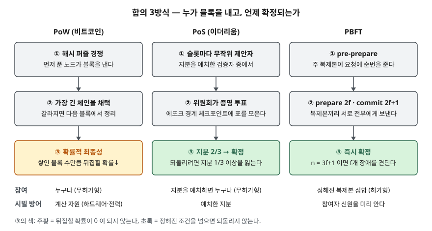

> **계산 부분만 실행 검증했다.** 정의·구성요소·비교는 NIST 보고서, 원 논문, 공식 문서를 근거로 정리했고,
> PoW 확률표와 PBFT 정족수·메시지 수는 [`code/consensus_math.py`](code/consensus_math.py)로 직접 계산해 [`code/output.txt`](code/output.txt)에 남겼다.

## 들어가며

합의 알고리즘은 블록체인 문제의 뼈대라서 1교시 단답과 2~4교시 논술 모두에 나온다. "PoW는 전력을 많이 쓰고 PoS는 적게 쓴다"는
누구나 쓰므로, 점수는 **최종성(finality)이 확률적인가 확정적인가**와 **장애를 몇 개까지 견디는가**를 숫자로 보이는 데서 갈린다.
실무에서는 참여자를 미리 아는 허가형 네트워크냐 누구나 들어오는 무허가형이냐에 따라 쓸 수 있는 합의가 달라지고,
그 선택이 곧 거래 확정까지 기다리는 시간과 노드 수 상한을 정한다.

## 정의

- **합의 모델 (NIST IR 8202 용어집)**: 분산 시스템 안에서 **유효한 상태에 대한 합의를 이루는 과정**이다.
  합의 알고리즘·합의 메커니즘과 같은 말로 쓴다.
- NIST IR 8202 합의 모델 장(§4)은 이 문제를 **"다음 블록을 누가 발행하는가"** 로 좁혀 설명한다. 서로 믿지 않는 참여자들이
  같은 원장을 이어 쓰게 하는 규칙이다.

답안 첫 줄에는 "합의 알고리즘은 중앙 기관 없이 서로 신뢰하지 않는 노드들이 다음 블록과 원장 상태에 동의하게 하는 규칙으로,
블록 발행 권한을 무엇으로 나누느냐(계산·지분·투표)에 따라 PoW·PoS·BFT 계열로 나뉜다"로 쓸 수 있다.

## 등장 배경

분산 원장은 중앙 저장소 없이 여러 노드가 같은 기록을 갖는다. 이때 두 가지가 문제가 된다.

1. **동시 발행** — 두 노드가 거의 같은 때 서로 다른 블록을 내면 원장이 갈라진다. NIST 보고서 원장 충돌 절(§4.7)은
   한 블록에만 담긴 거래 때문에 같은 코인이 한쪽에서는 쓰이고 다른 쪽에서는 안 쓰인 상태가 생길 수 있다고 적는다
2. **시빌(Sybil) 공격** — 무허가형에서는 신원을 만드는 데 비용이 들지 않으므로, "한 노드 한 표"로 정하면 가짜 노드를
   늘린 쪽이 이긴다

전통적 분산 시스템의 BFT 합의(PBFT)는 1을 풀지만 참여자 목록을 미리 안다고 가정해 2를 풀지 못한다.
비트코인 백서는 투표권을 **계산 능력**에 묶어 2를 풀었고("CPU 능력으로 투표한다"), PoS는 그 자리를 **예치한 지분**으로 바꿨다.

## 구성요소 / 절차

### PoW 절차 — 3단계 (NIST IR 8202 작업증명 절, §4.1)

1. **퍼즐 풀이**: 블록 헤더의 해시값이 목표값보다 작아질 때까지 nonce를 바꿔 가며 해시한다. 풀기는 어렵고 검증은 쉽다
2. **난이도 조정**: 비트코인은 2016블록마다 목표값을 바꿔 발행 간격을 약 10분으로 맞춘다
3. **충돌 해소**: 원장이 갈라지면 다음 블록이 붙은 쪽, 곧 더 긴 체인을 공식 체인으로 삼고 버려진 쪽 거래는 대기열로 돌아간다

### PoS 발행자 선정 — 4가지 (NIST IR 8202 지분증명 절, §4.2)

| 방식 | 발행자를 고르는 법 |
|---|---|
| ① 무작위 선정 (체인 기반 PoS) | 전체 예치 지분 대비 자기 지분 비율로 추첨. 42%를 가지면 42% 확률 |
| ② 다회 투표 (BFT PoS) | 여러 명이 블록을 제안하고 예치자 전원이 투표, 여러 번 돌 수 있다 |
| ③ 코인 나이 | 일정 기간(예: 30일) 묵힌 지분만 추첨에 들어가고, 쓰면 나이가 초기화된다 |
| ④ 위임 (DPoS) | 지분 가중 투표로 발행 노드를 뽑고, 반대 투표로 끌어내릴 수 있다 |

이더리움은 **①과 ②를 합친** 형태다. 32 ETH를 예치한 검증자 중 12초 슬롯마다 한 명을 무작위로 뽑아 블록을 제안하게 하고,
32슬롯(한 에포크, 6분 24초) 경계의 체크포인트에 검증자들이 투표한다. 전체 예치량의 2/3 이상이 표를 던진 체크포인트 쌍이
연이어 생기면 체크포인트가 '정당화'를 거쳐 '확정'으로 올라간다.

### PBFT 정상 경로 — 3단계 (PBFT 논문 정상 동작 절, §4.2)

| 단계 | 하는 일 | 다음으로 넘어가는 조건 |
|---|---|---|
| ① pre-prepare | 주(primary) 복제본이 요청에 순번을 붙여 백업들에게 보낸다 | 백업이 받아들임 |
| ② prepare | 백업마다 prepare를 **모든 복제본에게** 보낸다 | pre-prepare와 맞는 prepare **2f개** → prepared |
| ③ commit | 복제본마다 commit을 모든 복제본에게 보낸다 | commit **2f+1개** → committed-local, 실행 후 응답 |

클라이언트는 **서로 다른 복제본 f+1곳에서 같은 결과**를 받으면 받아들인다. 주 복제본이 응답하지 않으면 시간 초과로
**뷰 변경(view change)** 이 일어나 다음 복제본이 주 역할을 넘겨받는다. 논문은 안전성(safety)은 **동기 가정 없이** 보장하고,
진행성(liveness)만 메시지 지연이 무한정 커지지 않는다는 약한 가정에 기댄다고 적는다.

## 도식



> **출처**: PoW·PoS 흐름과 시빌 방어 수단은 [NIST IR 8202 §4.1 Proof of Work, §4.2 Proof of Stake, §4.7 Ledger Conflicts and Resolutions](https://csrc.nist.gov/pubs/ir/8202/final),
> 이더리움의 슬롯·위원회·체크포인트 확정은 [ethereum.org — Proof-of-stake: Finality](https://ethereum.org/developers/docs/consensus-mechanisms/pos/#finality),
> PBFT 3단계와 정족수는 [Castro·Liskov, Practical Byzantine Fault Tolerance §4.2 Normal-Case Operation](https://www.usenix.org/publications/library/proceedings/osdi99/full_papers/castro/castro_html/node4.html)을 따랐다.

답안지에는 세 칸을 세로로 나란히 그리고 ③ 칸만 다르게 표시한다. PoW의 ③에 "확률적", 나머지 둘에 "확정"을 적고,
PBFT 칸 아래에 `n = 3f + 1`을 써 두면 비교표로 넘어가기 쉽다.

## 비교

| 축 | PoW | PoS (이더리움 방식) | PBFT |
|---|---|---|---|
| 발행 권한 | 해시 퍼즐을 먼저 푼 노드 | 지분 비례 무작위 제안자 + 투표 | 순번을 주는 주 복제본 + 전원 투표 |
| 참여 | 무허가형 | 무허가형 (예치 필요) | 허가형 (복제본 집합 고정) |
| 최종성 | **확률적** — 블록이 쌓일수록 뒤집힐 확률이 준다 | **경제적 확정** — 2/3 투표 후 되돌리려면 지분 1/3 이상 소각 | **즉시 확정** — commit 2f+1개면 끝 |
| 장애 허용 | 정직한 쪽이 계산 능력 과반 | 예치 지분 기준 (확정은 2/3 투표) | 전체 3f+1 중 비잔틴 장애 f개 |
| 처리량을 묶는 것 | 발행 간격(약 10분)과 블록 크기 | 슬롯 간격(12초)·에포크 | 복제본 간 메시지 수 (n²에 비례) |
| 자원 소모 | 계산·전력 (설계상 의도) | 적다 | 적다 (통신이 부담) |
| NIST 보고서가 든 약점 | 51% 공격, 하드웨어 경쟁 | 지분 집중, nothing at stake | — (NIST 비교표에는 없음) |

> PoW·PoS 약점 행은 NIST IR 8202 합의 비교표(§4.6)와 지분증명 절(§4.2), 이더리움 행은 ethereum.org 지분증명 문서, PBFT 행은 원 논문 §3·§4를 따랐다.
> 처리량 행에는 공개 자료에서 원 출처를 확인한 TPS 수치가 없어 숫자를 넣지 않았다.

### 검산 1 — PoW의 "확률적"은 얼마나 확률적인가

백서 계산 절(§11)은 공격자가 z 블록 뒤에서 정직한 체인을 따라잡을 확률을 공격자 진행을 포아송 분포로 두고 구한다.
같은 공식을 파이썬으로 옮기자 백서의 표(q=0.1의 z=0~10, P<0.1%를 만드는 z 8개)가 **소수 일곱째 자리까지 모두 같았다.**
그 위에서 확인 블록 6개를 고정하고 공격자 해시 비율 q만 바꿔 봤다.

```text
== 3. PoW — z=6 일 때 q 별 P
   q=0.10  P=0.0002428
   q=0.20  P=0.0142506
   q=0.30  P=0.1321112
   q=0.40  P=0.5039803
   q=0.45  P=0.7661055
```

**"6블록 기다리면 안전하다"는 공격자가 10% 안팎일 때의 이야기다.** 40%를 가진 공격자에게 6블록은 동전 던지기(50.4%)이고,
P<0.1%를 만들려면 백서 표대로 89블록, 45%면 340블록이 필요하다. 확정까지 기다릴 블록 수는 상수가 아니라 **공격자 비율의 함수**다.

### 검산 2 — PBFT는 왜 3f+1이고, 왜 노드를 늘리기 어려운가

논문의 논리는 이렇다. f개가 응답하지 않을 수 있으므로 n−f개만 듣고 진행해야 하고, 그 안에 또 f개가 거짓일 수 있다.
정직한 응답이 거짓보다 많으려면 n−2f > f, 곧 n > 3f다. 계산으로 n = 3f에서는 f=1~4 모두 이 조건이 깨졌다.

```text
   n   | pre-prepare | prepare | commit | 합계
   4   | 3           | 9       | 12     | 24
   31  | 30          | 900     | 930    | 1,860
   100 | 99          | 9801    | 9900   | 19,800
```

요청 하나에 복제본끼리 오가는 메시지를 정상 경로 3단계로 세면 n=4에서 24개, n=100에서 19,800개다. 복제본이 25배 느는 동안
메시지는 825배 늘었다. prepare·commit이 **모두가 모두에게** 보내는 단계라서다. PBFT를 참여 노드가 많은 네트워크에 그대로
쓰기 어려운 이유가 이 모양에 있다.

## 적용 시 고려사항

- **참여 모델부터 정한다.** 참여자를 모르는 무허가형이면 PBFT처럼 신원을 전제하는 합의는 쓸 수 없다. NIST 보고서도
  라운드 로빈 같은 신뢰 기반 합의는 무허가형에서 악의적 노드가 노드를 늘려 가로챌 수 있다고 적는다.
- **확정 기준을 업무 요구로 환산한다.** PoW 위의 결제는 "몇 블록 뒤를 확정으로 볼 것인가"를 거래 금액과 예상 공격자 비율로
  정해야 한다. 검산 1처럼 같은 6블록도 가정에 따라 안전도가 수천 배 달라진다. 즉시 확정이 필요한 업무(증권 결제 등)는
  PBFT 계열이나 확정 단계를 가진 PoS를 검토한다.
- **노드 수 상한을 미리 잡는다.** PBFT 계열은 메시지가 n²으로 늘어나므로 복제본 수를 늘리는 것이 곧 확장이 아니다.
  f를 몇으로 둘지(장애를 몇 개 견딜지)를 먼저 정하고 n = 3f+1로 맞춘다. 3f+1보다 많이 두어도 견디는 장애 수는 늘지 않는다.
- **지분 집중을 감시한다.** PoS는 지분이 곧 발행 확률이므로, NIST 비교표가 지적하듯 지분이 풀(pool)로 모이면 권력이 중앙화된다.
  운영 주체는 상위 검증자의 지분 비율을 지표로 둔다.

## 정리

- 합의 모델 = 분산 시스템에서 **유효한 상태**에 동의하는 과정. 핵심 질문은 "다음 블록을 누가 내는가".
- 발행 권한의 근거 **3가지**: **계**산(PoW) · **지**분(PoS) · **투**표(PBFT) → "계·지·투".
- 최종성 **3단계**: 확률적(PoW) → 경제적 확정(PoS, 2/3 투표) → 즉시 확정(PBFT, commit 2f+1).
- PoS 발행자 선정 **4가지**: 무작위 · 다회 투표 · 코인 나이 · 위임.
- PBFT 숫자 **3개**: 전체 **3f+1**, prepared **2f**, committed-local **2f+1** (클라이언트는 f+1 일치).
- 검산: 6블록 확인은 q=0.1에서 P≈0.02%, q=0.4에서 P≈50%. PBFT 메시지는 n=4→100에서 24→19,800.

## 참고 자료

- [NIST IR 8202, Blockchain Technology Overview (2018-10)](https://csrc.nist.gov/pubs/ir/8202/final) — §4 합의 모델, §4.1 PoW, §4.2 PoS 4방식과 nothing at stake, §4.3 라운드 로빈, §4.6 합의 비교표, §4.7 원장 충돌, 용어집(consensus model)
- [Satoshi Nakamoto, Bitcoin: A Peer-to-Peer Electronic Cash System (2008)](https://bitcoin.org/bitcoin.pdf) — §4 작업증명, §11 계산(공격자 따라잡기 확률과 표), §12 결론
- [Miguel Castro, Barbara Liskov, Practical Byzantine Fault Tolerance (OSDI 1999)](https://www.usenix.org/conference/osdi-99/practical-byzantine-fault-tolerance) — 본문 [§3 서비스 속성(3f+1)](https://www.usenix.org/publications/library/proceedings/osdi99/full_papers/castro/castro_html/node3.html), [§4 알고리즘 — §4.2 정상 동작, §4.4 뷰 변경](https://www.usenix.org/publications/library/proceedings/osdi99/full_papers/castro/castro_html/node4.html)
- [ethereum.org — Proof-of-stake (PoS)](https://ethereum.org/developers/docs/consensus-mechanisms/pos/#finality) — 32 ETH 예치, 12초 슬롯·32슬롯 에포크, 체크포인트 2/3 확정, 되돌릴 때의 지분 1/3 소각
