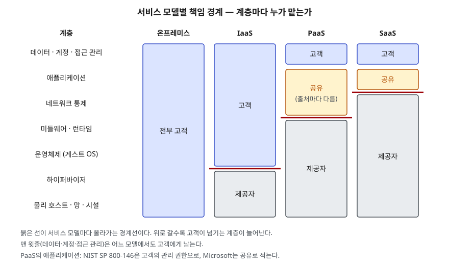

> **실행 검증 없음.** NIST 표준 문서와 Microsoft·AWS 공식 문서의 정의와 책임 구분을 정리한 개념 글이다. 실행 예제와 측정값은 없다.

## 들어가며

클라우드 서비스 모델은 IaaS·PaaS·SaaS를 나열하는 것만으로는 점수가 나지 않는다. 채점자가 보는 것은
**모델이 바뀔 때 이용자가 무엇을 넘기고 무엇을 끝까지 쥐는가**다. 실무에서는 사고가 난 뒤에 이 경계가 드러난다.
DB를 관리형 서비스로 옮기고 나면 패치는 제공자가 하지만, 접근 권한을 넓게 열어 둔 설정은 그대로 이용자 책임이다.
경계를 계층 단위로 그을 줄 알아야 계약·운영 절차·감사 항목을 빠짐없이 나눌 수 있다.

## 정의

- **서비스 모델 (NIST SP 800-145)**: 제공자가 이용자에게 넘겨주는 **능력(capability)의 종류**로 클라우드를 나눈 것이다.
  SaaS는 제공자의 애플리케이션을 쓰는 능력, PaaS는 제공자가 지원하는 언어·도구로 만든 애플리케이션을 올리는 능력,
  IaaS는 처리·저장·네트워크 자원을 할당받아 OS를 포함한 임의의 소프트웨어를 돌리는 능력이다.
- **책임 공유 모델**: 클라우드 서비스의 보안·운영 책임을 **소프트웨어 스택의 계층별로 제공자와 이용자에게 나누고**,
  그 경계가 서비스 모델에 따라 달라진다는 것을 정한 구분이다. AWS는 이를 "클라우드**의** 보안(제공자)"과
  "클라우드 **안의** 보안(이용자)"으로 나누고, Microsoft는 책임을 "각 통제를 누가 구성·운영·감시하는가"라는
  거버넌스의 뜻으로 쓴다고 밝힌다.

이 글이 확인한 NIST 문서에는 "책임 공유 모델"이라는 이름의 정의가 없다. NIST SP 800-146은 모델마다 "통제와 관리 책임이 어떻게
나뉘는가"를 계층 그림으로 보이고, 벤더들은 각자의 책임 공유 모델을 문서로 낸다. 답안에서는 NIST로 계층을 세우고
벤더 문서로 구체 항목을 채우는 구성이 쓸 수 있다.

## 등장 배경

온프레미스에서는 시설부터 애플리케이션까지 한 조직이 전부 가졌다. 누가 무엇을 맡는지 따로 정할 필요가 없었다.
클라우드로 가면서 스택의 아래쪽이 제공자에게 넘어간다. NIST SP 800-146은 이때 이용자가 제공자에게 내주는 것이
**통제**(누가 데이터와 프로그램에 접근하는지를 확신을 갖고 정하는 능력)와 **가시성**(그 상태와 접근을 감시하는 능력)
두 가지라고 적고, 얼마나 내주는지는 물리적 점유와 접근 경계를 이용자가 구성할 수 있는지에 달렸다고 본다.

넘긴 계층과 남은 계층 사이에 선을 긋지 않으면 **양쪽 다 상대가 한다고 여기는 칸**이 생긴다.
책임 공유 모델은 그 칸을 이름 붙여 드러내기 위한 것이다.

## 구성요소 / 절차

### NIST 클라우드 정의의 뼈대 — 5·3·4

| 구분 | 개수 | 항목 |
|---|---|---|
| 필수 특성 | 5 | 주문형 셀프서비스, 광대역 네트워크 접근, 자원 풀링, 신속한 탄력성, 측정되는 서비스 |
| 서비스 모델 | 3 | SaaS, PaaS, IaaS |
| 배포 모델 | 4 | 사설, 커뮤니티, 공공, 하이브리드 |

### 서비스 모델 3가지 — 이용자가 통제하는 범위

NIST SP 800-145는 모델마다 이용자가 **관리·통제하지 않는 것**과 **통제하는 것**을 함께 적는다.

| 모델 | 이용자가 통제하지 않는다 | 이용자가 통제한다 |
|---|---|---|
| SaaS | 네트워크·서버·OS·저장소, **개별 애플리케이션 기능까지** | 이용자별 애플리케이션 설정 일부 (있을 수 있음) |
| PaaS | 네트워크·서버·OS·저장소 | 배포한 애플리케이션, 호스팅 환경 설정 (있을 수 있음) |
| IaaS | 하부 클라우드 인프라 | OS·저장소·배포한 애플리케이션, 일부 네트워크 요소(예: 호스트 방화벽)의 제한된 통제 |

### 계층별 통제 — 5계층 (NIST SP 800-146)

SP 800-146은 전통적 스택을 **하드웨어, 운영체제, 미들웨어, 애플리케이션** 네 층으로 그리고, IaaS에서는 OS 자리를
**하이퍼바이저(VMM)와 게스트 OS** 둘로 나눠 다섯 층이 된다.

1. **SaaS** — 제공자가 스택 대부분을 통제한다. 이용자는 애플리케이션이 내주는 자원(메일 작성·발송·보관)에 대한
   "사용자 수준" 통제와 경우에 따라 제한된 관리 권한을 갖는다. 그 권한도 **제공자의 재량 안에서만** 존재한다
2. **PaaS** — 제공자가 OS와 하드웨어(데이터센터 사이의 망 포함)를 운영하고, 미들웨어에서는 실행 환경을 이루는
   프로그래밍 인터페이스를 내준다. 코드가 언제 활성화되는지(프로그래밍 모델)도 제공자가 정한다
3. **IaaS** — 제공자가 물리 하드웨어를 전부, 하이퍼바이저를 관리 수준에서 통제한다. 이용자는 게스트 OS와 그 위 모든
   계층을 통제하고, 그만큼 **운영·갱신·보안 구성 책임을 떠안는다**

### 책임의 세 갈래

| 갈래 | 무엇 | 근거 |
|---|---|---|
| ① 항상 이용자 | 데이터, 단말, 계정, 접근 관리 — **4가지** | Microsoft 책임 공유 문서 "Responsibilities you always retain" |
| ② 모델에 따라 공유 | 애플리케이션, 네트워크 통제, (SaaS의) 단말 | 같은 문서 "Shared responsibilities explained" |
| ③ 항상 제공자 | 물리 보안, 물리 망, 물리 호스트, 하이퍼바이저 | 같은 문서 "Microsoft responsibilities" |

AWS는 같은 구분을 **통제 단위**로 적는다. 이용자가 그대로 물려받는 **상속 통제**(물리·환경 통제), 양쪽 층에
각자의 맥락으로 걸리는 **공유 통제**(패치 관리, 구성 관리, 인식·교육), 이용자 애플리케이션에만 걸리는
**이용자 고유 통제** 세 가지다. 패치 관리가 공유 통제인 것은, 제공자는 인프라를 패치하고 이용자는 자기 게스트 OS와
애플리케이션을 패치하기 때문이다.

## 도식

> **출처**: 계층 구성과 모델별 통제 범위는 [NIST SP 800-146 §5.2·§6.2·§7.2 Software Stack and Provider/Consumer Scope of Control](https://nvlpubs.nist.gov/nistpubs/legacy/sp/nistspecialpublication800-146.pdf),
> 칸별 책임 구분은 [Microsoft Learn — Shared responsibility in the cloud: Responsibility matrix](https://learn.microsoft.com/en-us/azure/security/fundamentals/shared-responsibility#responsibility-matrix)를 따랐다.
> 두 자료를 한 격자에 겹친 것은 글쓴이의 정리다.

답안지에는 왼쪽에 계층 7줄을 쓰고, 모델 네 열에 경계선만 계단 모양으로 그으면 된다. 맨 윗줄을 전 열에 걸쳐 "이용자"로
칠하는 것을 빼먹지 않는다.

## 비교

### 서비스 모델 3가지

| 구분 | IaaS | PaaS | SaaS |
|---|---|---|---|
| 넘겨받는 능력 | 처리·저장·네트워크 자원 | 애플리케이션 실행 플랫폼 | 완성된 애플리케이션 |
| 이용자 통제 하한 | 게스트 OS | 배포한 애플리케이션 | 이용자별 설정 |
| OS 패치 | 이용자 | 제공자 | 제공자 |
| 이식성 위험 | 낮은 편 (VM 단위) | 프로그래밍 모델·API에 묶임 | 데이터 형식·기능에 묶임 |
| 800-146이 든 대표 우려 | VM 난립, VM 격리의 견고성, 데이터 삭제 관행 | PaaS 간 이식성 부족, 이벤트 기반 스케줄링 | 브라우저 기반 위험, 네트워크 의존, SaaS 간 이식성 부족 |

이식성 행은 800-146의 모델별 우려 항목(§5.4·§6.4·§7.5) 제목에서 정리했다. "낮은 편"은 IaaS 절에 기존 애플리케이션과의
이식성·상호운용성이 **이점**으로 적힌 것(§7.4.3)을 근거로 한다.

### 서비스 모델과 배포 모델 — 다른 축

| 축 | 묻는 것 | 항목 |
|---|---|---|
| 서비스 모델 | 스택의 **어디까지** 넘기는가 | IaaS·PaaS·SaaS |
| 배포 모델 | 인프라를 **누구와** 쓰고 어디에 두는가 | 사설·커뮤니티·공공·하이브리드 |

"사설 클라우드의 SaaS"처럼 두 축은 따로 고른다. 책임 경계는 서비스 모델이 정하고, 배포 모델은 그 경계 아래를
누가 운영하는지(자체·제3자)와 물리적 위치를 정한다.

### 출처마다 갈리는 칸

| 칸 | NIST SP 800-146 | Microsoft |
|---|---|---|
| PaaS의 애플리케이션 | 배포 뒤에는 이용자가 관리 권한을 갖는다 (이용 약관의 지원 범위 안에서) | 공유 — 스택 일부는 제공자, 구성·코드 보안·접근 통제는 이용자 |
| SaaS의 애플리케이션 | 이용자는 사용자 수준 + 제한된 관리 권한, 최종 권한은 제공자 | 공유 |
| SaaS의 단말 | 다루지 않음 | 공유 (제공자가 일부 단말 관리 기능 제공) |

## 적용 시 고려사항

- **서비스마다 경계를 따로 긋는다.** AWS는 이용자 책임이 "고른 서비스에 따라 정해진다"고 적고, EC2에서는 게스트 OS 패치와
  방화벽 구성까지, S3·DynamoDB에서는 데이터·자산 분류·IAM 권한까지로 든다. 한 시스템이 여러 모델을 섞어 쓰면
  **구성요소마다 표 한 줄씩** 책임을 적는다.
- **공유 칸은 계약과 운영 절차로 쪼갠다.** "공유"는 둘 다 한다는 뜻이 아니라 **각자 다른 맥락에서 한다**는 뜻이다.
  패치 관리처럼 공유 통제에 드는 항목은 제공자 몫과 이용자 몫을 나눠 적고, 이용자 몫에 담당자와 주기를 붙인다.
- **설정과 권한은 모델과 무관하게 이용자 몫이다.** Microsoft 표에서 데이터·구성·신원은 네 열 모두 이용자다.
  SaaS로 가도 공유 링크를 전체 공개로 열어 두는 설정은 이용자 책임으로 남는다. 감사 항목은 이 줄부터 잡는다.
- **넘긴 계층에 대한 가시성을 확보한다.** 800-146은 통제와 함께 가시성을 내준다고 보고, 미해결 과제로 가시성 부족과
  포렌식 지원(§8.4.1·§8.4.4)을 든다. 제공자가 주는 로그·감사 기록의 범위를 도입 전에 확인하고, 사고 조사에 필요한
  기록을 이용자 쪽에 따로 쌓는다.
- **모델을 올릴수록 통제권이 제공자 재량에 놓인다.** SaaS 이용자의 관리 권한은 제공자 재량 안에서만 존재한다(800-146).
  규제상 이용자가 직접 통제해야 하는 항목이 있으면 그 항목이 어느 계층에 있는지 보고 모델을 고른다.

> 관련 개념: [서버리스 컴퓨팅 — FaaS·BaaS와 콜드 스타트](../../cloud/2026-09-29-serverless-computing-faas-baas/index.md) — PaaS 위에서 경계가 한 칸 더 올라간 모델

## 정리

- NIST 클라우드 정의는 **5·3·4**: 필수 특성 5, 서비스 모델 3, 배포 모델 4.
- 서비스 모델은 **이용자 통제의 하한**으로 외운다: IaaS = 게스트 OS, PaaS = 애플리케이션, SaaS = 이용자 설정.
- 책임은 **세 갈래**: 항상 이용자(데·단·계·접 — 데이터·단말·계정·접근 관리 4가지), 모델에 따라 공유, 항상 제공자(물리·하이퍼바이저).
- 공유 칸은 출처마다 다르게 적힌다(PaaS·SaaS의 애플리케이션). 답안에서는 둘 다 쓴다.

## 참고 자료

- [NIST SP 800-145, The NIST Definition of Cloud Computing (2011-09)](https://csrc.nist.gov/pubs/sp/800/145/final) — 필수 특성 5, 서비스 모델 3, 배포 모델 4
- [NIST SP 800-146, Cloud Computing Synopsis and Recommendations (2012-05)](https://nvlpubs.nist.gov/nistpubs/legacy/sp/nistspecialpublication800-146.pdf) — §4.1 통제와 가시성, §5.2·§6.2·§7.2 계층별 통제 범위, §8.4 준수 과제
- [Microsoft Learn — Shared responsibility in the cloud (2026-08-24 갱신)](https://learn.microsoft.com/en-us/azure/security/fundamentals/shared-responsibility) — 책임 매트릭스, 항상 이용자에게 남는 4가지
- [AWS — Shared Responsibility Model](https://aws.amazon.com/compliance/shared-responsibility-model/) — 클라우드의 보안 / 클라우드 안의 보안, 상속·공유·이용자 고유 통제
