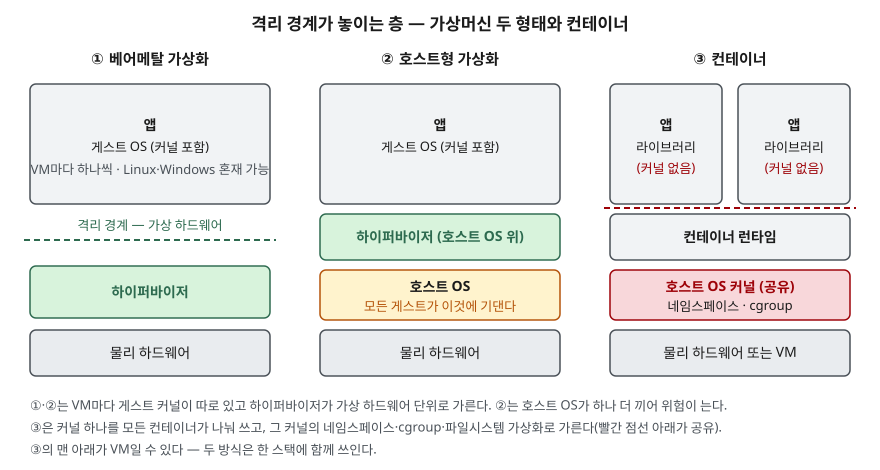

> **실행 검증 없음.** NIST 가이드 두 편과 리눅스 매뉴얼의 정의·구조를 정리한 개념 글이다. 실행 예제와 측정값은 없다.

## 들어가며

컨테이너와 가상머신(VM)은 클라우드·가상화 문제에서 거의 항상 짝으로 묻는다. "컨테이너가 가볍다"는 한 줄은 누구나 쓰므로,
점수는 **격리 경계가 어느 층에 놓이는가**와 **그래서 무엇을 공유하는가**를 도식으로 보이는 데서 갈린다.
실무에서는 한 서버에 여러 응용을 올릴 때 어떤 방식으로 가를지를 정해야 하고, 그 선택이 곧 보안 경계와 운영 단위를 정한다.

## 정의

- **가상머신 (NIST SP 800-125)**: 전가상화(full virtualization)는 하나 이상의 OS와 그 안의 응용을 **가상화된 하드웨어 위에서** 실행하는 방식이다.
  하이퍼바이저는 호스트 위의 게스트 OS들을 관리하고 게스트 OS와 물리 하드웨어 사이의 명령 흐름을 제어하는 구성요소다.
- **컨테이너 (NIST SP 800-190)**: 응용 가상화 환경 안에서 응용을 패키징하고 실행하는 방법이다. 응용 가상화는
  **하나의 공유 OS 커널**을 여러 응용 인스턴스에 내보이되 각 인스턴스를 서로 격리하는 가상화 형태다.

답안 첫 줄에는 "VM은 하이퍼바이저가 만든 가상 하드웨어 위에 게스트 OS를 통째로 올리는 하드웨어 수준 가상화이고,
컨테이너는 호스트 커널 하나를 공유하며 커널 기능으로 응용을 가르는 OS 수준 가상화다"로 쓸 수 있다.

## 등장 배경

SP 800-190은 VM을 **하드웨어 수준 격리**로 설명한다. VM마다 자기 가상 하드웨어를 보고, 응용과 데이터 외에
**완전한 게스트 OS**를 품는다. 서로 다른 OS(리눅스와 윈도)를 한 하드웨어에 올릴 수 있는 대신, 응용 하나를 옮기려 해도
OS까지 함께 옮기고 패치해야 한다.

컨테이너는 이 단위를 응용으로 줄였다. SP 800-190 요약은 오늘날 OS 가상화 기술이 응용을 **이식 가능하고 재사용 가능하며
자동화 가능한 방식으로 패키징·실행**하는 데 초점이 있다고 적는다. 게스트 커널이 없으므로 같은 OS 계열에서만 돈다 —
리눅스 호스트는 리눅스용 컨테이너만 실행한다.

## 구성요소 / 절차

### 전가상화의 형태 — 2가지 (SP 800-125 전가상화 유형 절, §2.2)

| 형태 | 하이퍼바이저의 위치 | 특징 |
|---|---|---|
| ① 베어메탈(네이티브) | 하드웨어 바로 위. 호스트 OS 없음 | 서버에 주로 쓴다. 지원 하드웨어 범위가 좁다 |
| ② 호스트형 | 호스트 OS 위 | 데스크톱에 주로 쓴다. 게스트의 보안이 호스트 OS에 기댄다 |

SP 800-125는 하이퍼바이저가 호스트 OS보다 **훨씬 작고 단순해 공격 표적이 작다**고 보고, 호스트 OS 위에 하이퍼바이저를
더하는 ②는 위험을 키우는 쪽이라고 적는다.

### 컨테이너 격리 기술 — 3가지 (SP 800-190 컨테이너와 호스트 OS 절, §2.2)

컨테이너 런타임이 호스트 OS에게 제공하도록 보장하는 기술 능력이다.

1. **네임스페이스 격리** — 컨테이너가 상호작용할 수 있는 자원을 제한한다. 파일시스템·네트워크 인터페이스·IPC·호스트명·사용자 정보·프로세스
2. **자원 할당** — 컨테이너가 쓸 수 있는 호스트 자원의 양을 제한한다. 리눅스는 주로 **cgroup**, 윈도는 job object
3. **파일시스템 가상화** — 여러 컨테이너가 같은 물리 저장소를 공유하되 서로의 저장소를 읽거나 바꾸지 못하게 한다. copy-on-write로 같은 이미지의 파일을 한 벌만 둔다

### 리눅스 네임스페이스 — 8종 (namespaces(7))

| 네임스페이스 | 격리 대상 |
|---|---|
| Cgroup | cgroup 루트 디렉터리 |
| IPC | System V IPC, POSIX 메시지 큐 |
| Network | 네트워크 장치·스택·포트 |
| Mount | 마운트 지점 |
| PID | 프로세스 ID |
| Time | 부팅·단조 시계 |
| User | 사용자·그룹 ID |
| UTS | 호스트명, NIS 도메인명 |

cgroups(7)은 cgroup을 프로세스를 계층 그룹으로 묶어 **자원 사용량을 제한하고 감시하는** 커널 기능으로 정의한다.
네임스페이스가 "무엇이 보이는가"를, cgroup이 "얼마나 쓰는가"를 가른다.

### 컨테이너 기술 아키텍처 — 5계층 (SP 800-190 아키텍처 절, §2.3)

개발 시스템 → 시험·인가 시스템 → 레지스트리 → 오케스트레이터 → 호스트. 이 중 레지스트리·오케스트레이터가 핵심 구성요소이고
컨테이너는 호스트에서 돈다. VM에는 이 층이 따로 없다는 점이 운영 단위의 차이다.

## 도식

> **출처**: 베어메탈·호스트형 구조는 [NIST SP 800-125 §2.2 Types of Full Virtualization, Figure 2-1](https://csrc.nist.gov/pubs/sp/800/125/final),
> VM·컨테이너 배치와 공유 커널, 컨테이너가 VM 위에서 도는 배치는 [NIST SP 800-190 §2.2 Containers and the Host Operating System, Figure 2](https://csrc.nist.gov/pubs/sp/800/190/final)를 따랐다.

답안지에는 세 칸을 나란히 그리고, ①·②는 하이퍼바이저 위에, ③은 공유 커널 위에 격리 경계 점선을 긋는다.
③의 컨테이너 칸에 "커널 없음"을 적는 것이 핵심이다.

## 비교

| 구분 | 가상머신 | 컨테이너 |
|---|---|---|
| 가상화 수준 | 하드웨어 (전가상화) | OS (응용 가상화) |
| 격리 경계 | 하이퍼바이저 — 가상 하드웨어 단위 | 공유 커널의 네임스페이스·cgroup·파일시스템 가상화 |
| 커널 | VM마다 게스트 커널 | 호스트 커널 하나를 공유 |
| 게스트 OS | 다른 OS 계열 혼재 가능 | 호스트와 같은 OS 계열만 |
| 배포 단위 | 디스크 이미지 (게스트 OS 포함) | 컨테이너 이미지 (응용·라이브러리·설정) |
| 패치 방식 | 설치된 자리에서 갱신 | 이미지를 고쳐 다시 배포 |
| 탈출 시 영향 | 하이퍼바이저·다른 게스트 (escape) | 공유 커널·호스트·같은 호스트의 컨테이너 |

> 격리 경계·커널·OS 계열 행은 SP 800-190 §2.2, 패치 방식 행은 SP 800-190 이미지 취약점 항목(§3.1.1), 탈출 행은 SP 800-125 용어집의 escape 정의와 SP 800-190 §3 위험 범주를 따랐다.

SP 800-190은 컨테이너가 강한 격리를 주지만 **VM만큼 뚜렷한 보안 경계는 아니라고** 적는다. 같은 커널을 공유하고 권한을
다르게 줄 수 있어서, 설정을 잘못하면 컨테이너끼리 또는 호스트와 VM보다 훨씬 쉽게 닿는다는 것이다.
동시에 둘이 **대체 관계가 아니라** 함께 쓰인다고 본다 — VM으로 하드웨어를 나누고, 그 VM 안에서 컨테이너로 응용을 패키징한다.

## 적용 시 고려사항

- **민감도가 다른 워크로드를 한 커널에 섞지 않는다.** SP 800-190은 호스트 단위로 컨테이너를 민감도별로 묶고,
  컨테이너와 비컨테이너 워크로드를 한 호스트에 섞지 말라고 권한다. 경계를 더 세게 해야 하면 VM으로 먼저 가른다.
- **커널과 런타임을 최신으로 유지한다.** 커널이 공유되므로 커널 취약점은 그 호스트의 모든 컨테이너에 걸친다.
  SP 800-190은 커널·런타임의 새 판이 취약점 수정 외에 보호 기능을 더한다는 점을 들어 갱신을 강조한다.
- **패치 절차를 이미지 중심으로 바꾼다.** 컨테이너는 떠 있는 자리에서 고치지 않고 이미지를 고쳐 다시 배포한다.
  VM 시절의 패치 관리 도구와 절차를 그대로 옮기면 배포된 컨테이너가 옛 이미지의 취약점을 안고 돈다.
- **호스트형 하이퍼바이저는 서버에 신중히 쓴다.** 게스트의 보안이 호스트 OS에 기대고, 파일 공유 같은 게스트 도구가
  공격 경로가 될 수 있다(SP 800-125).
- **OS 계열이 다르면 컨테이너로 풀 수 없다.** 리눅스 응용과 윈도 응용을 한 호스트에 올려야 하면 VM이 필요하다.

## 정리

- 정의 **2가지 관점**: VM = 가상 하드웨어 위 게스트 OS(전가상화) / 컨테이너 = 공유 커널 위 응용 격리(OS 가상화).
- 전가상화 **2유형**: 베어메탈(하이퍼바이저가 하드웨어 위) · 호스트형(호스트 OS 위).
- 컨테이너 격리 기술 **3가지**: **네**임스페이스 · **자**원 할당(cgroup) · **파**일시스템 가상화 → "네·자·파".
- 리눅스 네임스페이스 **8종**: Cgroup·IPC·Network·Mount·PID·Time·User·UTS.
- 핵심 차이 한 줄: **VM은 커널을 나누고, 컨테이너는 커널을 나눠 쓴다.** 둘은 함께 쓰인다.

## 참고 자료

- [NIST SP 800-125, Guide to Security for Full Virtualization Technologies (2011-01)](https://csrc.nist.gov/pubs/sp/800/125/final) — §2.2 전가상화 2유형과 Figure 2-1, 하이퍼바이저 보안, 부록 A 용어집(full virtualization, hypervisor, escape)
- [NIST SP 800-190, Application Container Security Guide (2017-09)](https://csrc.nist.gov/pubs/sp/800/190/final) — §2.2 VM·컨테이너 비교와 격리 기술 3가지, §2.3 5계층, §3 위험, §4.5 호스트 OS 대책, 부록 D 용어집
- [Linux man-pages 6.19 — namespaces(7)](https://man7.org/linux/man-pages/man7/namespaces.7.html) — 네임스페이스 8종
- [Linux man-pages 6.19 — cgroups(7)](https://man7.org/linux/man-pages/man7/cgroups.7.html) — cgroup 정의
