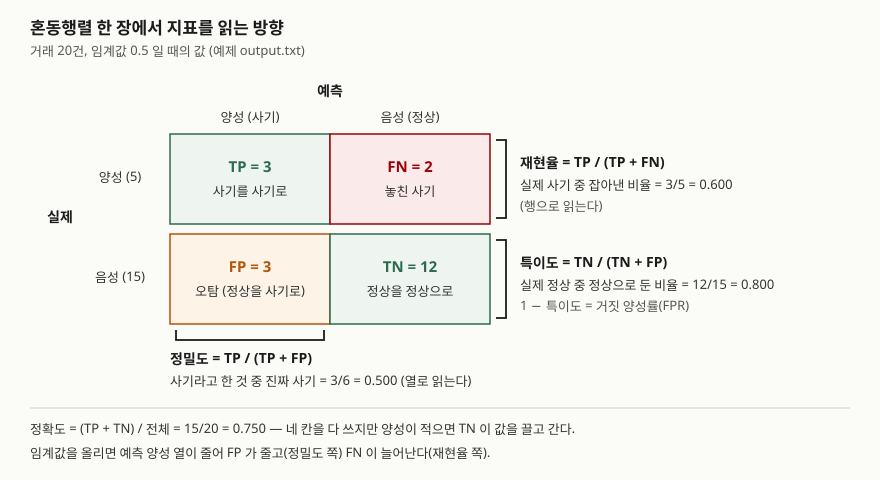

> 정의는 Google Machine Learning Crash Course와 scikit-learn 1.9.1 문서, ROC는 Fawcett(2006) 논문을 따랐다.
> 지표 값은 전부 [`code/confusion_metrics.py`](code/confusion_metrics.py)로 계산해 [`code/output.txt`](code/output.txt)에 남긴 것이다.

## 들어가며

분류 모델 문제는 "정확도 95%인 모델이 왜 쓸모없는가"나 "사기 탐지에서 무엇을 우선할 것인가" 형태로 자주 나온다.
점수는 지표의 공식을 외웠는지보다 **혼동행렬의 어느 칸을 분모로 쓰는지**, 그리고 **임계값이 그 칸들을 어떻게 옮기는지**를
보이는 데서 갈린다. 실무에서는 오탐 비용과 미탐 비용이 다르기 때문에, 지표를 고르는 일이 곧 업무 요구를 숫자로 바꾸는 일이 된다.

## 정의

- **혼동행렬(confusion matrix)**: 분류 결과를 실제 클래스와 예측 클래스의 조합별로 센 표다. 이진 분류에서는
  TP(참 양성)·FP(거짓 양성)·FN(거짓 음성)·TN(참 음성) 네 칸이 된다(scikit-learn 문서의 Confusion matrix 절).
- **정밀도(precision)**: 모델이 양성으로 분류한 것 중 실제로 양성인 비율, `TP / (TP + FP)`.
- **재현율(recall)**: 실제 양성 중 양성으로 올바르게 분류된 비율, `TP / (TP + FN)`. 참 양성률(TPR), 탐지 확률이라고도 한다.

답안 첫 줄에는 "모델 평가 지표는 혼동행렬의 네 칸을 서로 다른 분모로 나눈 비율이며, 정밀도는 **예측 양성**을, 재현율은
**실제 양성**을 분모로 삼으므로 임계값에 따라 서로 반대로 움직인다"로 쓸 수 있다.

## 등장 배경

가장 먼저 쓰이는 지표는 **정확도**, `(TP + TN) / 전체`다. Google MLCC는 양성이 1%인 데이터에서 **늘 음성이라고 답하는 모델이
정확도 99%**를 받는다는 예를 든다. 맞힌 개수만 세면 드문 클래스를 하나도 못 잡은 모델이 높은 점수를 받는다.

그래서 분모를 쪼갠 지표가 필요해졌다. 양성을 얼마나 **놓치지 않았는가**(재현율)와 양성이라고 한 판정을 얼마나
**믿을 수 있는가**(정밀도)를 따로 재야, 사기·질병·장애처럼 드문 사건을 찾는 모델을 평가할 수 있다.

## 구성요소 — 혼동행렬 4칸과 지표 7가지

| 지표 | 식 | 분모 | 무엇을 묻는가 |
|---|---|---|---|
| ① 정확도 | (TP+TN) / 전체 | 전체 | 전부 몇 개 맞혔나 |
| ② 정밀도 | TP / (TP+FP) | 예측 양성 | 양성이라고 한 것을 믿을 수 있나 |
| ③ 재현율(TPR) | TP / (TP+FN) | 실제 양성 | 양성을 놓치지 않았나 |
| ④ 특이도(TNR) | TN / (TN+FP) | 실제 음성 | 음성을 음성으로 뒀나. `1 − 특이도`가 거짓 양성률(FPR) |
| ⑤ F<sub>β</sub> | (1+β²)·P·R / (β²·P + R) | — | 정밀도·재현율의 가중 조화평균. β=1이 F1 |
| ⑥ 균형 정확도 | (재현율 + 특이도) / 2 | — | 클래스마다 재현율을 구해 평균 |
| ⑦ MCC | (TP·TN − FP·FN) / √((TP+FP)(TP+FN)(TN+FP)(TN+FN)) | — | 네 칸을 모두 쓰는 상관계수. −1~1 |

scikit-learn 문서는 β를 정밀도와 재현율의 상대 가중치로 설명한다. **β > 1이면 재현율, β < 1이면 정밀도**에 더 무게를 둔다.
F1이 산술평균이 아니라 조화평균인 이유는, 둘 중 하나가 0에 가까우면 평균도 0에 가깝게 끌어내리기 위해서다.

임계값에 묶이지 않는 지표로 **ROC 곡선과 AUC**가 있다. ROC는 모든 임계값에 대해 x축에 FPR, y축에 TPR을 찍은 곡선이고(Fawcett 2006),
그 아래 넓이 AUC는 Google MLCC의 설명대로 **양성 하나와 음성 하나를 무작위로 골랐을 때 모델이 양성에 더 높은 점수를 줄 확률**이다.

## 도식



> **출처**: 지표 정의는 [Google MLCC — Classification: Accuracy, recall, precision, and related metrics](https://developers.google.com/machine-learning/crash-course/classification/accuracy-precision-recall),
> 칸 배치는 [scikit-learn 1.9.1 — Metrics and scoring: Confusion matrix](https://scikit-learn.org/stable/modules/model_evaluation.html#confusion-matrix)를 따랐다.
> 칸 안의 숫자는 이 글의 예제에서 임계값 0.5로 계산한 값이다.

답안지에는 2×2 표를 그리고, **행 옆에 재현율, 열 아래에 정밀도**를 괄호로 묶어 적으면 된다. 3분이면 옮긴다.

## 계산 검산 — 거래 20건

사기 5건, 정상 15건에 모델이 점수를 매겼고, **점수가 임계값 이상이면 사기로 판정**한다. 점수는 난수 없이 고정했다
(전체 목록은 `output.txt`). 임계값 네 개에서 혼동행렬과 지표를 계산했다.

```text
  임계값 | TP | FP | FN | TN
   0.3   |  4 |  7 |  1 |  8
   0.5   |  3 |  3 |  2 | 12
   0.7   |  2 |  1 |  3 | 14
   0.9   |  1 |  1 |  4 | 14
```

| 임계값 | 정확도 | 정밀도 | 재현율 | 특이도 | F1 | F2 | F0.5 | 균형 정확도 | MCC |
|---|---|---|---|---|---|---|---|---|---|
| 0.3 | 0.600 | 0.364 | 0.800 | 0.533 | 0.500 | 0.645 | 0.408 | 0.667 | 0.290 |
| 0.5 | 0.750 | 0.500 | 0.600 | 0.800 | 0.545 | 0.577 | 0.517 | 0.700 | 0.378 |
| 0.7 | 0.800 | 0.667 | 0.400 | 0.933 | 0.500 | 0.435 | 0.588 | 0.667 | 0.404 |
| 0.9 | 0.750 | 0.500 | 0.200 | 0.933 | 0.286 | 0.227 | 0.385 | 0.567 | 0.192 |

(표의 값은 `output.txt` 2절을 옮긴 것이다.)

손으로 검산하면 임계값 0.5에서 점수 0.5 이상인 거래는 T01~T06의 6건이고 그중 사기가 T01·T03·T05의 3건이다.
정밀도 3/6 = 0.500, 재현율 3/5 = 0.600, F1 = 2·0.5·0.6 / 1.1 = 0.545로 코드 결과와 같다.

계산하면서 예상과 달랐던 것이 셋이다.

1. **쓸모없는 모델의 정확도가 멀쩡한 모델과 같다.** 전부 '정상'이라고 답하는 모델은 TP=0, FN=5, TN=15로 정확도 **0.750**이다.
   임계값 0.5 모델과 같은 값이다. 그 모델의 재현율은 0, 균형 정확도는 0.500이고, 정밀도와 MCC는 분모가 0이라 정의되지 않는다.
2. **임계값을 올렸는데 정밀도가 떨어졌다.** 0.7 → 0.9에서 정밀도가 0.667 → 0.500이 됐다. 0.9 이상에 남은 두 건 중 하나(T02, 0.91)가
   정상 거래였기 때문이다. 재현율은 임계값을 올리면 줄기만 하지만, 정밀도는 **분자와 분모가 함께 줄어** 오르내릴 수 있다.
   "임계값을 올리면 정밀도가 오른다"는 경향이지 보장이 아니다.
3. **F1이 같은데 모델의 성격은 반대다.** 임계값 0.3과 0.7은 F1이 둘 다 **0.500**이다. 0.3은 재현율 0.8·정밀도 0.364로
   사기를 거의 다 잡되 오탐이 7건이고, 0.7은 정밀도 0.667·재현율 0.4로 오탐이 1건인 대신 사기 셋을 놓친다. F2와 F0.5는 둘을 갈라낸다
   (0.645 대 0.435, 0.408 대 0.588).

ROC AUC는 양성 5 × 음성 15 = 75쌍 중 양성 점수가 더 높은 쌍을 세어 구했다. 61쌍이므로 **AUC = 61/75 = 0.813**이다.
이 값은 어느 임계값을 고르든 바뀌지 않는다.

## 비교

### 정밀도 대 재현율

| 구분 | 정밀도 | 재현율 |
|---|---|---|
| 분모 | 예측 양성 (TP + FP) | 실제 양성 (TP + FN) |
| 줄이려는 오류 | FP — 오탐 | FN — 미탐 |
| 임계값을 올리면 | 대체로 오른다 (보장 아님) | 줄거나 그대로다 |
| 우선하는 업무 | 스팸 차단, 추천, 자동 제재 — 잘못 막으면 비용이 크다 | 사기·질병 선별, 장애 탐지 — 놓치면 비용이 크다 |
| 함께 보는 지표 | F0.5 | F2 |

### 임계값에 묶인 지표 대 묶이지 않은 지표

| 구분 | 정확도·정밀도·재현율·F<sub>β</sub>·MCC | ROC AUC |
|---|---|---|
| 무엇을 평가하나 | 한 임계값에서의 판정 | 모든 임계값에 걸친 점수 순서 |
| 이 예제 값 | 임계값마다 다르다 | 0.813 하나 |
| 클래스 불균형 | 정확도는 부풀려진다. scikit-learn 문서는 균형 정확도가 이 부풀림을 피하고, MCC는 클래스 크기가 크게 달라도 쓸 수 있다고 적는다 | Google MLCC는 불균형 데이터에서 PR 곡선이 비교에 더 나을 수 있다고 적는다 |
| 답하는 질문 | "이 기준으로 운영하면 어떻게 되나" | "점수가 양성과 음성을 얼마나 잘 줄 세우나" |

## 적용 시 고려사항 — 4가지

1. **오류 비용을 먼저 정한다.** FP 한 건과 FN 한 건의 업무 비용이 어떻게 다른지 정해야 지표와 β가 정해진다.
   정해지지 않은 채 F1을 쓰면 두 비용이 같다고 가정한 것이다.
2. **불균형 데이터에서 정확도를 단독으로 보고하지 않는다.** 이 예제의 양성 비율 25%에서도 쓸모없는 모델이 정확도 0.750을 받았다.
   재현율·정밀도, 또는 균형 정확도·MCC를 함께 낸다.
3. **임계값은 모델과 따로 정한다.** 같은 모델, 같은 AUC 0.813에서 F1 0.286~0.545가 나왔다. 운영 임계값은 검증 데이터에서
   업무 제약(예: 오탐은 하루 몇 건까지)을 만족하는 값으로 고르고, 그 값을 모델 산출물과 함께 관리한다.
4. **분모가 0인 경우를 정해 둔다.** 양성을 하나도 예측하지 않으면 정밀도가 정의되지 않는다. 대시보드나 자동 평가 파이프라인이
   이것을 0으로 칠지, 빈 값으로 둘지 정해 두지 않으면 지표 추이가 갑자기 끊기거나 튄다.

## 정리

- **4칸 7지표**: TP·FP·FN·TN → 정확도·정밀도·재현율·특이도·F<sub>β</sub>·균형 정확도·MCC. 여기에 임계값과 무관한 ROC AUC.
- **분모로 외운다**: 정밀도는 "예측 양성(열)", 재현율은 "실제 양성(행)", 특이도는 "실제 음성(행)".
- **임계값↑ → FP↓·FN↑**: 재현율은 줄거나 그대로, 정밀도는 대체로 오르지만 떨어질 수도 있다(예제 0.7 → 0.9).
- **β로 비용을 싣는다**: β > 1은 재현율, β < 1은 정밀도 쪽. F1이 같아도 F2·F0.5는 갈린다.
- **정확도의 함정**: 전부 음성이라고 답해도 정확도는 음성 비율만큼 나온다.

## 참고 자료

- [Google Machine Learning Crash Course — Classification: Accuracy, recall, precision, and related metrics](https://developers.google.com/machine-learning/crash-course/classification/accuracy-precision-recall) — 정확도·재현율·FPR·정밀도·F1 정의, 늘 음성으로 답하는 모델 예, 임계값과 정밀도·재현율의 반비례 경향
- [Google Machine Learning Crash Course — Classification: ROC and AUC](https://developers.google.com/machine-learning/crash-course/classification/roc-and-auc) — AUC의 확률 해석, 불균형 데이터와 PR 곡선
- [scikit-learn 1.9.1 — Metrics and scoring](https://scikit-learn.org/stable/modules/model_evaluation.html) — [Confusion matrix](https://scikit-learn.org/stable/modules/model_evaluation.html#confusion-matrix), [Precision, recall and F-measures](https://scikit-learn.org/stable/modules/model_evaluation.html#precision-recall-and-f-measures)(F<sub>β</sub>와 β의 뜻), [Balanced accuracy score](https://scikit-learn.org/stable/modules/model_evaluation.html#balanced-accuracy-score), [Matthews correlation coefficient](https://scikit-learn.org/stable/modules/model_evaluation.html#matthews-correlation-coefficient)
- [Fawcett, T. (2006). An introduction to ROC analysis. *Pattern Recognition Letters*, 27(8), 861–874](https://doi.org/10.1016/j.patrec.2005.10.010) — ROC 공간(FPR·TPR 축)의 정의
