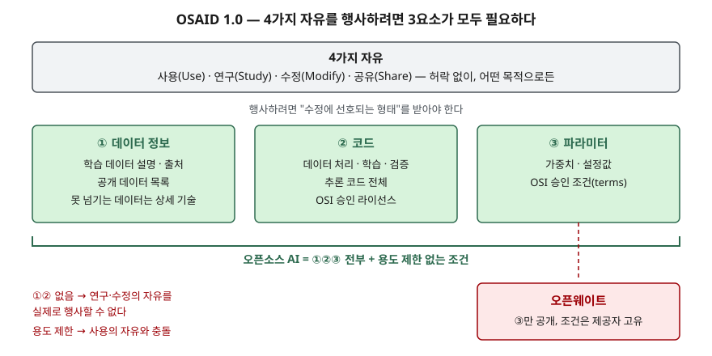

> **실행 검증 없음.** OSI의 정의 원문과 FAQ, EU AI 법 조문, 라이선스 원문, 모델 개방성 프레임워크 논문을 근거로 정리한 개념 글이다. 실행 예제와 측정값은 없다.

## 들어가며

모델 저장소에서 가중치를 내려받을 수 있으면 흔히 "오픈소스 모델"이라고 부른다. 그런데 같은 모델의 라이선스를 열어 보면 금지 용도 목록과
이용자 규모 조건이 붙어 있고, 무엇으로 학습했는지는 적혀 있지 않은 경우가 많다. 이 차이를 놓치면 서비스를 키우는 순간 라이선스를 다시 받아야 하거나,
규제상 오픈소스 예외를 받을 수 있다고 잘못 판단한다. 시험에서는 "오픈웨이트와 오픈소스 AI의 차이"를 **정의의 요소로** 설명할 수 있는지를 본다.

## 정의

- **오픈소스 AI (OSI, OSAID 1.0)**: 이용자에게 **어떤 목적으로든 허락 없이 사용하고, 작동 방식을 연구하고, 출력을 바꾸는 것을 포함해 수정하고,
  수정 여부와 관계없이 공유할 자유**를 부여하는 AI 시스템이다. 이 자유를 행사할 수 있도록 **수정에 선호되는 형태**(데이터 정보·코드·파라미터)를 함께 제공해야 한다.
  정의는 시스템 전체뿐 아니라 모델과 가중치에도 똑같이 적용된다.
- **오픈웨이트**: OSI는 학습을 마친 신경망의 최종 가중치와 편향을 공개한 것으로 설명한다. 미세조정과 배포는 가능해지지만
  **학습 코드, 데이터셋, 데이터 구성 정보는 빠진다.**

OSAID 1.0은 2024년 10월 28일 All Things Open 2024에서 발표됐다. 두 해에 걸친 공개 공동 설계 과정을 거쳤다.

## 등장 배경

OSI의 오픈소스 정의(OSD)는 **소스코드가 있는 소프트웨어**를 전제로 한다. AI 시스템은 코드만으로 재현되지 않는다. 같은 코드라도 무슨 데이터로
학습했는지에 따라 전혀 다른 가중치가 나온다. 이 틈에서 두 가지 문제가 생겼다.

1. **용어가 흐려졌다** — 가중치만 공개하고 용도를 제한한 모델도 "오픈소스"로 불렸다. OSI가 여러 모델을 초안에 대어 검증했을 때
   Pythia·OLMo·Amber·CrystalCoder·T5는 통과했고, Llama 2·Grok·Phi-2·Mixtral은 필요한 요소가 빠졌거나 법적 조건이 맞지 않아 통과하지 못했다
2. **규제가 기준을 필요로 했다** — EU AI 법은 오픈소스로 공개된 범용 AI 모델에 일부 의무를 면제한다. 면제하려면 무엇이 오픈소스인지를 먼저 정해야 한다

OSAID는 첫 번째 문제에 대해 **"소스코드"에 해당하는 것이 AI에서는 무엇인가**를 3요소로 답했다.

## 구성요소 / 절차

### 4가지 자유

| 자유 | 내용 | 오픈웨이트에서 막히는 지점 |
|---|---|---|
| ① 사용 | 어떤 목적으로든, 허락을 구하지 않고 쓴다 | 금지 용도 목록, 이용자 규모 조건 |
| ② 연구 | 작동 방식을 연구하고 구성요소를 들여다본다 | 학습 데이터와 학습 코드가 없다 |
| ③ 수정 | 출력을 바꾸는 것을 포함해 어떤 목적으로든 고친다 | 미세조정은 되지만 처음부터 다시 학습할 수 없다 |
| ④ 공유 | 수정 여부와 관계없이 남에게 넘긴다 | 재배포 시 명명·표시 의무, 사용 제한 승계 |

### 수정에 선호되는 형태 — 3요소

| 요소 | 무엇을 내놓는가 | 조건 |
|---|---|---|
| ① 데이터 정보 | 숙련자가 **실질적으로 동등한 시스템**을 만들 수 있을 만큼 상세한 학습 데이터 정보. 데이터 설명, 공개 데이터 목록, 제3자 데이터 출처 | 공유할 수 없는 데이터는 출처와 특성을 밝힌다 |
| ② 코드 | 학습과 실행에 쓴 **전체 소스코드** — 데이터 처리, 학습, 검증, 추론 | OSI 승인 라이선스 |
| ③ 파라미터 | 가중치나 그 밖의 설정값 | OSI 승인 조건(terms) |

③에서 "라이선스"가 아니라 "조건"이라고 쓴 데는 이유가 있다. 가중치에 저작권이 성립하는지부터 법적으로 정리되지 않았으므로,
정의는 자유를 보장하는 법적 수단이 아직 발전 중이라고 인정하고 표현을 넓게 잡았다.

### 학습 데이터 4분류

OSAID는 학습 데이터 자체의 공개를 요구하지 않는다. FAQ는 학습 데이터가 소프트웨어 소스코드와 같지 않고, 의료처럼 데이터 공유가 법으로
막힌 분야에서도 오픈소스 AI가 가능해야 한다는 이유를 든다. 대신 데이터를 4가지로 나눠 각각 다른 의무를 둔다.

| 분류 | 성격 | 의무 |
|---|---|---|
| ① 개방 데이터 | 자유롭게 복제·수정·공유 가능 | 공유한다 |
| ② 공개 데이터 | 온라인에 있는 동안 누구나 볼 수 있다 | 어디서 받는지 밝힌다 |
| ③ 획득 가능 데이터 | 구매나 접근 절차로 얻을 수 있다 | 어디서 얻는지 밝힌다 |
| ④ 공유 불가 비공개 데이터 | 개인정보처럼 법으로 보호된다 | 상세히 기술한다 |

## 도식

> **출처**: [OSI, The Open Source AI Definition 1.0 — What is Open Source AI · Preferred form to make modifications](https://opensource.org/ai/open-source-ai-definition) · [OSI, Open Weights](https://opensource.org/ai/open-weights)

답안지에는 위에 4가지 자유 띠 하나, 아래에 3요소 박스 3개, 오른쪽 박스 밑에 "오픈웨이트 = ③만"을 적으면 된다.

## 비교

### 오픈웨이트 · 오픈소스 AI · 규제상 오픈소스

| 구분 | 오픈웨이트 | 오픈소스 AI (OSAID 1.0) | EU AI 법 오픈소스 예외 (제53조 제2항) |
|---|---|---|---|
| 파라미터 | 공개 | 공개, OSI 승인 조건 | 가중치 공개 |
| 코드 | 없음 또는 추론 코드만 | 학습·실행 코드 전체 | 요구 없음 (모델 구조 정보는 공개) |
| 데이터 | 없음 | 데이터 정보 (4분류별 의무) | 요구 없음 (사용 정보는 공개) |
| 용도 제한 | 제공자가 붙인다 | 붙일 수 없다 | 접근·사용·수정·배포를 허용하는 라이선스여야 한다 |
| 효과 | — | 오픈소스 AI라는 이름 | 기술 문서 작성, 하류 제공자용 정보 제공 의무 면제 |
| 남는 것 | — | — | 저작권 준수 정책, 학습 내용 요약 공개. 시스템 위험 모델은 면제 없음 |

EU AI 법의 조건은 OSAID보다 **좁다.** 가중치·구조·사용 정보만 요구하고 학습 코드와 데이터 정보는 묻지 않는다.
그래서 "EU 법상 오픈소스 예외 대상"이 "OSI 정의상 오픈소스 AI"를 뜻하지 않는다. 두 기준은 목적이 다르다. 하나는 이름을 정하고, 하나는 의무 면제 범위를 정한다.

### 판정제와 등급제

| 구분 | OSAID 1.0 | 모델 개방성 프레임워크 (MOF, LF AI & Data) |
|---|---|---|
| 방식 | 충족 / 불충족 판정 | 3등급 (Class III 개방 모델 → Class II 개방 도구 → Class I 개방 과학) |
| 데이터셋 원본 | 요구하지 않음 (데이터 정보로 대체) | 최상위 Class I에서 요구 |
| 쓰임 | "오픈소스"라고 불러도 되는가 | 어디까지 공개했는가를 단계로 보인다 |

MOF에서 가장 낮은 Class III는 모델 구조, 최종 파라미터, 기술 보고서, 평가 결과, 모델 카드와 데이터 카드를 요구한다.
가중치와 문서만 공개한 모델도 등급을 받을 수 있으므로, 오픈웨이트가 **어디쯤에 있는지**를 설명할 때 쓰기 좋다.

### 가중치만 공개한 모델이 오픈소스가 아닌 이유 — 2가지

1. **요소가 빠진다.** 데이터 정보와 코드가 없으면 연구·수정의 자유를 형식상 받아도 실제로 행사할 수 없다.
   소프트웨어로 치면 실행 파일만 주고 소스코드를 주지 않은 것과 같은 위치다
2. **조건이 맞지 않는다.** Llama 3.1 커뮤니티 라이선스는 허용 사용 정책 준수를 요구하고, 해당 버전 공개일 기준 월간 활성 이용자가
   7억 명을 넘는 사업자는 별도 허락을 받도록 한다. OSD가 금지하는 **개인·집단 차별**과 **사용 분야 차별**에 해당하는 조건이다

## 적용 시 고려사항

- **"오픈소스"라는 표기를 믿지 말고 라이선스 원문을 판독한다.** 모델 저장소의 표기보다 라이선스의 금지 용도, 규모 조건, 명명 의무가 실제 의무를 정한다.
  도입 승인 단계에서 담당자가 판정한 결과를 AI-BOM의 판정 라이선스로 남긴다.
- **파생 모델에 의무가 이어지는지 본다.** 미세조정한 모델도 기반 모델 라이선스의 사용 제한과 명명 의무를 물려받는 경우가 많다.
  사내 모델을 외부에 배포하거나 API로 제공하기 전에 기반 모델 계보를 거슬러 확인한다.
- **규제 예외는 법의 조건으로 따로 판단한다.** OSAID를 충족해도 EU AI 법의 시스템 위험 모델이면 면제가 없고,
  저작권 준수 정책과 학습 내용 요약 공개는 오픈소스여도 남는다. 반대로 OSAID를 못 채워도 법의 예외 조건은 충족할 수 있다.
- **재현과 감사가 필요한 용도에는 데이터 정보를 요구한다.** 공공·금융처럼 모델의 판단 근거를 설명해야 하는 곳에서는 가중치만으로는 감사가 안 된다.
  조달 요건에 데이터 정보와 학습 코드 제공을 넣거나, 최소한 MOF 등급을 밝히게 한다.
- **자사 모델을 공개할 때 이름을 정확히 붙인다.** 3요소를 다 내놓지 않으면 "오픈웨이트"라고 쓴다. 공개 범위와 명칭이 어긋나면 이용자가
  오픈소스로 믿고 쓴 뒤 분쟁이 생길 수 있다.

> 기출 답안: [기출문제 — AI 생성 코드와 오픈웨이트 모델의 오픈소스 라이선스 컴플라이언스](../../exam/2026-09-29-ai-code-open-weight-license-compliance/index.md)

## 정리

- 4가지 자유: **사**용 · **연**구 · **수**정 · **공**유 → "사·연·수·공". 허락 없이, 어떤 목적으로든.
- 수정에 선호되는 형태 3요소: **데**이터 정보 · **코**드 · **파**라미터 → "데·코·파". 오픈웨이트는 **파만**.
- 학습 데이터 4분류: **개**방 · **공**개 · **획**득 가능 · **불**가(비공개) → 원본 공개가 아니라 **정보 공개**가 요구다.
- 오픈웨이트가 오픈소스가 아닌 이유 **2가지**: 요소 누락(데이터 정보·코드) + 조건 위반(용도·규모 제한).
- EU AI 법 예외는 **더 좁은 조건**(가중치·구조·사용 정보)이고 효과도 **일부 의무 면제**뿐이다. 이름과 의무 면제는 다른 문제다.

## 참고 자료

- [OSI, The Open Source AI Definition 1.0](https://opensource.org/ai/open-source-ai-definition) — 4가지 자유, 수정에 선호되는 형태 3요소
- [OSI, Open Source AI Definition FAQ](https://hackmd.io/@opensourceinitiative/osaid-faq) — 학습 데이터 4분류, 모델 검증 결과, "조건(terms)" 표현의 이유 (2024-10-29 갱신)
- [OSI, The Open Source Initiative Announces the Release of the Industry's First Open Source AI Definition (2024-10-28)](https://opensource.org/blog/the-open-source-initiative-announces-the-release-of-the-industrys-first-open-source-ai-definition)
- [OSI, Open Weights](https://opensource.org/ai/open-weights)
- [OSI, The Open Source Definition](https://opensource.org/osd) — 개인·집단 차별 금지, 사용 분야 차별 금지
- [EU AI Act, Article 53 — Obligations for Providers of General-Purpose AI Models](https://artificialintelligenceact.eu/article/53/) — 제2항 오픈소스 예외
- [Llama 3.1 Community License Agreement (2024-07-23)](https://github.com/meta-llama/llama-models/blob/main/models/llama3_1/LICENSE)
- [White 외, The Model Openness Framework, arXiv:2403.13784 (v6, 2024-10)](https://arxiv.org/abs/2403.13784) — 동료 심사 전 사전 공개본 · [isitopen.ai](https://isitopen.ai/)
