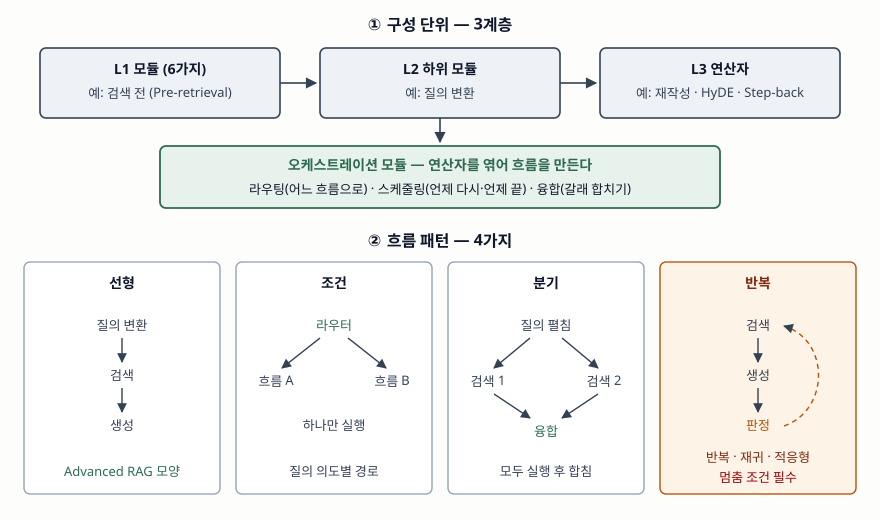

> 실행 검증 없음. Modular RAG 원 논문(Gao 등, 2024)과 같은 연구진의 RAG 서베이,
> RAG 제안 논문의 정의와 분류만으로 정리했다. 성능 수치는 싣지 않는다.

## 들어가며

사내 문서에 RAG를 붙이면 처음에는 "규정 문서에서 휴가 일수 찾기" 같은 질의가 잘 풀린다.
곧 "작년과 올해 규정에서 바뀐 항목을 비교해 줘", "이 부서의 지난 분기 비용을 DB에서
뽑아 정책과 맞는지 봐 줘" 같은 질의가 들어오고, 검색 한 번에 생성 한 번인 직선 파이프라인은
여기서 막힌다. 시험에서 Modular RAG를 묻는 이유가 이것이다. 검색 품질을 높이는 기법의
목록이 아니라 **질의마다 다른 경로를 짜는 시스템 구조**를 쓸 수 있는지를 본다.

## 정의

**Modular RAG** 는 RAG 시스템을 **모듈 → 하위 모듈 → 연산자의 3계층으로 분해하고,
오케스트레이션 모듈의 라우팅·스케줄링·융합으로 연산자를 엮어 선형·조건·분기·반복 흐름을
구성하는 재구성 가능한 RAG 프레임워크**다(Gao 등, 2024).

원 논문은 이를 "독립적이면서 긴밀히 조정되는 여러 모듈로 이루어진 시스템"으로 쓰고,
레고 블록처럼 조립한다는 비유를 제목에 붙였다. 정의의 근거가 되는 RAG 자체는 Lewis 등(2020)이
제안했다. 언어 모델의 매개변수 안 지식(parametric memory)에 외부 색인을 검색한 결과
(non-parametric memory)를 더해 답을 생성하는 방식이다.

## 등장 배경

같은 연구진의 서베이(2024-03)는 RAG의 발전을 **3가지 패러다임**으로 나눈다.

- **Naive RAG** — 색인 → 검색 → 생성의 3단계를 한 번 지나는 "Retrieve-Read" 구조다.
  서베이는 검색의 정밀도·재현율 부족, 문맥에 근거하지 않는 생성, 검색 결과를 매끄럽게
  합치지 못하는 문제를 든다.
- **Advanced RAG** — 같은 직선 흐름에 검색 전 최적화(색인 세분화·메타데이터·질의 재작성)와
  검색 후 최적화(재순위화·컨텍스트 압축)를 덧붙였다. 단계는 좋아졌지만 **흐름은 하나**다.
- **Modular RAG** — 흐름 자체를 바꿀 수 있게 했다.

Modular RAG 논문은 Advanced RAG가 남긴 과제를 **4가지**로 든다. 표·지식 그래프 같은 이질
데이터의 통합, 시스템의 해석·통제·유지보수 요구, 여러 신경망 구성요소의 선택과 조정,
순서·병렬·LLM 판단이 섞인 흐름 제어다. 넷 모두 단계를 하나씩 개선해서는 풀리지 않는다.
경로가 하나뿐이면 질의 종류가 늘어날 때 대응할 수단이 없다.

## 구성요소

### 3계층

| 계층 | 원 논문 정의 | 예 |
|---|---|---|
| L1 모듈 | RAG 시스템의 핵심 처리 단계 | 검색 전 |
| L2 하위 모듈 | 모듈 안의 기능 단위 | 질의 변환 |
| L3 연산자 | 모듈·하위 모듈 안의 구체적인 기능 구현 | 재작성, HyDE, Step-back 프롬프팅 |

연산자는 함수 하나로 표현되는 최소 실행 단위다. 그래서 "검색기를 밀집에서 하이브리드로
바꾼다"는 결정이 연산자 하나를 갈아 끼우는 일이 된다.

### 모듈 6가지

| 모듈 | 하위 모듈 → 연산자 예 |
|---|---|
| ① 인덱싱 | 청크 최적화(슬라이딩 윈도·메타데이터 부착·small-to-big), 구조 조직(계층 색인·지식 그래프 색인) |
| ② 검색 전 | 질의 확장(다중 질의·하위 질의), 질의 변환(재작성·HyDE·Step-back), 질의 구성(Text-to-SQL·Text-to-Cypher) |
| ③ 검색 | 검색기 선택(희소·밀집·하이브리드), 검색기 미세조정 |
| ④ 검색 후 | 재순위화(규칙 기반·모델 기반), 압축, 선별 |
| ⑤ 생성 | 생성기 미세조정, 검증(지식 기반·모델 기반) |
| ⑥ 오케스트레이션 | 라우팅, 스케줄링, 융합 |

①~⑤는 처리 단계이고 ⑥만 성격이 다르다. ⑥은 데이터를 바꾸지 않고 **다음에 무엇을 실행할지**를 정한다.

### 오케스트레이션 3요소 — 각각 3가지

| 요소 | 결정하는 것 | 원 논문의 방식 3가지 |
|---|---|---|
| 라우팅 | 질의를 어느 흐름으로 보낼지 | 메타데이터 라우팅(질의의 키워드·개체를 청크 메타데이터와 대조), 의미 라우팅(미리 정한 의도 중 확률이 가장 높은 것), 혼합 라우팅(두 점수를 가중합) |
| 스케줄링 | 언제 다시 검색하고 언제 끝낼지 | 규칙 판정(생성 토큰 확률을 임계값과 비교), LLM 판정(프롬프트로 묻거나, 미세조정으로 특수 토큰을 내게 함), 지식 유도(지식 그래프에서 추론 사슬을 뽑아 노드별로 검색·생성) |
| 융합 | 여러 갈래의 결과를 어떻게 합칠지 | LLM 융합(갈래별 답을 요약해 다시 LLM에 입력), 가중 앙상블(문서-질의 유사도로 가중), RRF(여러 순위 목록을 하나로 합침) |

### 흐름 패턴 4가지

원 논문 초록이 드는 흐름 패턴은 **선형·조건·분기·반복의 4가지**다.

1. **선형** — 모듈을 고정 순서로 한 번 지난다. 질의 재작성 → 검색 → 생성의 RRR이 예다.
2. **조건** — 라우터가 질의 의도에 따라 서로 다른 흐름 중 **하나**를 고른다.
3. **분기** — 여러 갈래를 **모두** 실행한 뒤 융합한다. 질의를 하위 질의로 펼쳐 각각 검색하는
   **검색 전 분기**와, 한 번 검색한 문서마다 따로 생성해 합치는 **검색 후 분기**(REPLUG)의 2가지다.
4. **반복** — 검색과 생성을 되풀이한다. 하위 유형이 3가지다.
   - 반복 검색 — 정해진 횟수 안에서 검색 증강 생성과 생성 증강 검색을 번갈아 한다(ITER-RETGEN)
   - 재귀 검색 — 앞 단계가 만든 새 질의로 트리 모양으로 파고든다(Tree of Clarifications)
   - 적응형(능동) 검색 — LLM이 검색할 시점과 끝낼 시점을 스스로 정한다(FLARE, Self-RAG)

논문 본문은 이와 별도로 검색기·생성기·둘 다를 미세조정하는 **튜닝 패턴**을 한 절로 다룬다.
튜닝 패턴은 실행 시점의 흐름이 아니라 **학습 시점의 구성**이므로 위 4가지와 층위가 다르다.
답안에서 "흐름 패턴 4가지"로 쓰고 튜닝은 따로 한 줄 붙이면 두 판본과 모두 어긋나지 않는다.

## 도식

> **출처**: [Gao et al., Modular RAG: Transforming RAG Systems into LEGO-like Reconfigurable Frameworks §III Framework and notation · §IV-F Orchestration · §V RAG Flow and Flow Pattern (arXiv:2407.21059v1, 2024-07)](https://arxiv.org/abs/2407.21059)

답안지에는 위쪽 3칸(모듈 → 하위 모듈 → 연산자)과 오케스트레이션 띠, 아래 네 칸의 화살표
모양만 옮기면 된다. 선형은 직선, 조건은 갈래 중 하나, 분기는 갈래를 모아 합침, 반복은
되돌아가는 점선이다.

## 비교

### 세 패러다임의 포함 관계

원 논문은 **Advanced RAG를 Modular RAG의 특수한 경우로, Naive RAG를 Advanced RAG의
특수한 경우로** 본다. 즉 Naive ⊂ Advanced ⊂ Modular다. 오케스트레이션이 늘 같은 선형
경로만 고르면 Advanced RAG가 되고, 거기서 검색 전·후 모듈을 빼면 Naive RAG가 된다.

| 비교 항목 | Naive RAG | Advanced RAG | Modular RAG |
|---|---|---|---|
| 구성 | 색인·검색·생성 3단계 | 3단계 + 검색 전·후 최적화 | 모듈 6가지 × 하위 모듈 × 연산자 |
| 흐름 | 선형 1회 | 선형 1회 | 선형·조건·분기·반복 |
| 경로 결정 | 설계 시점 고정 | 설계 시점 고정 | 실행 시점에 오케스트레이션이 결정 |
| 개선 방법 | — | 단계별 기법 추가 | 연산자 교체, 흐름 재배선 |
| 맞는 질의 | 단일 문서로 답이 나오는 질의 | 같은 유형이되 검색 품질이 문제인 질의 | 유형이 섞이고 다단계 추론·이질 데이터가 필요한 질의 |
| 운영 부담 | 낮음 | 낮음 | 질의마다 경로가 달라 추적·비용 관리가 어려움 |

### 서베이(2024-03)와 Modular RAG 논문(2024-07)의 모듈 구성

같은 연구진이 넉 달 사이에 분류를 다시 짰다. 서베이는 Modular RAG의 새 모듈로 검색(Search)·
메모리·라우팅·예측(Predict)·태스크 어댑터·RAG-Fusion의 6가지를 든다. 논문은 이를 인덱싱부터
오케스트레이션까지 처리 단계 기준의 6가지 모듈로 바꾸고, 라우팅과 융합을 오케스트레이션
아래로 넣었다. **개수는 둘 다 6이지만 내용이 다르다.** 정의가 정립되는 중인 개념이므로
답안에서는 어느 판을 따르는지 밝힌다.

## 적용 시 고려사항

1. **질의 분포를 먼저 잰다.** 대부분이 단일 문서형 질의면 오케스트레이션은 지연과 비용만 늘린다.
   질의 로그를 유형별로 나눠, 조건·분기·반복이 필요한 비율이 얼마인지 보고 도입 범위를 정한다.
2. **라우팅 결정을 질의 단위로 기록한다.** 경로가 질의마다 다르면, 틀린 답이 라우터의 오분류에서
   왔는지 검색에서 왔는지 생성에서 왔는지 기록 없이는 가를 수 없다. 거친 모듈, 반복 횟수,
   모듈별 지연과 토큰 수를 한 추적 단위로 남긴다.
3. **반복에는 멈춤 조건과 예산을 규칙으로 건다.** 적응형 검색은 종료를 LLM 판단에 맡기므로
   끝나지 않을 수 있다. 최대 반복 횟수와 토큰·시간 상한은 LLM 판정 바깥의 규칙으로 둔다.
4. **모듈 단위로 평가한다.** 검색이 틀리면 생성은 맞출 수 없다. 검색의 재현율과 생성의 충실도를
   따로 재야 연산자를 바꿨을 때 무엇이 좋아졌는지 알 수 있다.

## 정리

암기 단서는 **"3계층 · 모듈 6 · 오케스트레이션 3×3 · 흐름 4"**다.

- 정의: 모듈→하위 모듈→연산자로 분해하고 라우팅·스케줄링·융합으로 흐름을 짜는 재구성 가능한 RAG
- 모듈 6: 인덱싱 · 검색 전 · 검색 · 검색 후 · 생성 · 오케스트레이션
- 오케스트레이션 3: 라우팅(어디로) · 스케줄링(언제) · 융합(어떻게 합칠지)
- 흐름 4: 선형 · 조건(하나 선택) · 분기(모두 실행 후 융합) · 반복(반복·재귀·적응형)
- 포함 관계: Naive ⊂ Advanced ⊂ Modular. Advanced RAG는 선형 패턴 하나만 쓰는 Modular RAG다

> 개념 연결: [컨텍스트 엔지니어링 — 추론 시점에 모델에 들어가는 토큰을 고르는 기술](../2026-09-29-context-engineering-token-curation/index.md) — 검색 결과를 프롬프트에 어떻게 담을지의 문제

> 기출 답안: [기출문제 — Advanced RAG와 Modular RAG 비교](../../exam/2026-10-08-advanced-rag-vs-modular-rag/index.md)

## 참고 자료

- [Y. Gao, Y. Xiong, M. Wang, H. Wang, "Modular RAG: Transforming RAG Systems into LEGO-like Reconfigurable Frameworks", arXiv:2407.21059v1 (2024-07-26)](https://arxiv.org/abs/2407.21059) — §III 3계층 표기, §IV 모듈 6가지와 오케스트레이션, §V 흐름 패턴과 튜닝 패턴, 포함 관계
- [Y. Gao et al., "Retrieval-Augmented Generation for Large Language Models: A Survey", arXiv:2312.10997v5 (2024-03-27)](https://arxiv.org/abs/2312.10997) — §II Naive·Advanced·Modular RAG 3가지 패러다임, 서베이판 새 모듈 6가지
- [P. Lewis et al., "Retrieval-Augmented Generation for Knowledge-Intensive NLP Tasks", NeurIPS 2020 (arXiv:2005.11401)](https://arxiv.org/abs/2005.11401) — RAG 원 정의
