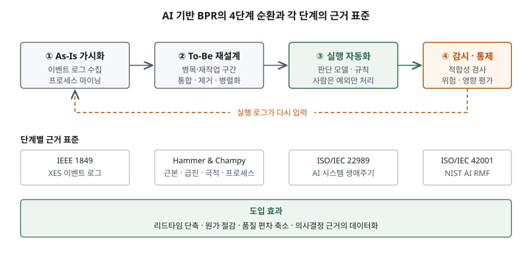

기출문제에서 묻는 것은 두 가지다. AI를 적용한 업무 프로세스 재설계가 무엇이고,
그것을 도입했을 때 무엇이 달라지는가.

> 실행 검증 없음. 개념 정리 문제이므로 표준 문서와 원 저작의 정의를 근거로 정리했다.

---

## Ⅰ. 정의

BPR은 비용·품질·서비스·속도 같은 핵심 성과 척도에서 극적인 개선을 얻기 위해
업무 프로세스를 **근본적으로 다시 생각하고 급진적으로 다시 설계**하는 활동이다
(Hammer & Champy, 1993). 정의를 지탱하는 핵심어는 **4개** — 근본적(fundamental),
급진적(radical), 극적(dramatic), 프로세스(process)다. 답안 첫 줄은 이 네 단어를
박아 넣는 것으로 시작한다.

AI 기반 BPR은 여기에 한 가지를 더한다. 재설계의 근거를 **담당자의 기억과 인터뷰가 아니라
시스템이 남긴 실행 데이터**에서 뽑고, 재설계된 프로세스의 판단 단계를 학습 모델이
대신 수행하게 하는 것이다. 기존 BPR이 "무엇을 없앨지"를 사람이 정했다면,
AI 기반 BPR은 그 판단의 입력을 데이터로 바꾼다.

## Ⅱ. 구성요소 — 4단계 순환

> **구조 근거**: [IEEE 1849-2016 XES Standard](https://www.tf-pm.org/resources/xes-standard/for-researchers/ieee-1849-2016-xes) · [ISO/IEC 42001:2023 §4–§10](https://www.iso.org/standard/42001) · [NIST AI RMF 1.0 §5 (GOVERN·MAP·MEASURE·MANAGE)](https://www.nist.gov/itl/ai-risk-management-framework)

| 단계 | 하는 일 | 근거 |
|---|---|---|
| ① As-Is 가시화 | 정보시스템의 이벤트 로그를 표준 형식으로 모아 실제 수행된 프로세스를 복원 | IEEE 1849 XES — 사례 ID·활동·타임스탬프를 가진 이벤트의 교환 형식 |
| ② To-Be 재설계 | 병목·재작업·우회 경로를 찾아 통합·제거·병렬화 | Hammer & Champy의 4개 핵심어 |
| ③ 실행 자동화 | 규칙과 학습 모델이 판단을 수행, 사람은 예외만 처리 | ISO/IEC 22989 AI 시스템 생애주기 |
| ④ 감시·통제 | 설계한 모델과 실제 실행의 차이를 측정하고 위험·영향을 평가 | ISO/IEC 42001, NIST AI RMF |

④의 산출물이 다시 ①의 입력이 되므로 **일회성 프로젝트가 아니라 순환 구조**다.
1990년대 BPR이 한 번 갈아엎고 끝난 것과 갈리는 지점이 여기다.

## Ⅲ. 도입 효과와 고려사항

### 도입 효과 — 4가지

1. **리드타임 단축** — 로그에서 대기 시간이 실제로 어디에 쌓이는지가 드러나므로,
   체감이 아니라 측정값을 근거로 단계를 없애거나 병렬로 돌릴 수 있다.
2. **원가 절감** — 판단이 필요했던 단계가 모델로 넘어가면서 사람은 예외 처리와
   설계로 이동한다. 인력을 줄이는 효과가 아니라 **투입 지점을 옮기는** 효과로 쓴다.
3. **품질 편차 축소** — 담당자·근무조에 따라 달랐던 판정 기준이 하나의 모델로 수렴한다.
   다만 모델이 틀리면 편차 없이 일관되게 틀린다는 점이 뒤집힌 위험이다.
4. **의사결정 근거의 데이터화** — 재설계 전후를 같은 지표로 비교할 수 있게 되어
   개선 효과를 사후에 입증할 수 있다.

### 고려사항 — 3가지

- **로그 품질이 상한을 정한다.** 타임스탬프가 배치로 한꺼번에 찍히거나 사례 ID가 끊기면
  복원된 프로세스가 실제와 달라진다. 자동화보다 로그 설계가 먼저다.
- **자동화 대상과 재설계 대상을 구분한다.** 잘못된 프로세스를 그대로 자동화하면
  잘못을 더 빨리 반복할 뿐이다. 1990년 원 논문의 논지가 정확히 이것이었다.
- **AI 도입 자체가 새 위험을 만든다.** 모델 편향, 설명 책임, 학습 데이터의 개인정보가
  기존 BPR에는 없던 항목이다. ISO/IEC 42001의 AI 영향평가와 NIST AI RMF의
  네 기능(GOVERN·MAP·MEASURE·MANAGE)을 통제 장치로 함께 세운다.

> 개념 정리: [업무 프로세스 재설계(BPR) — 원안과 AI 도입 이후](../../it-management/2026-09-21-bpr-reengineering-and-ai/index.md)

끝

## 답안 작성 메모

- **먼저 쓸 것**: 정의 한 줄과 4개 핵심어. 여기서 점수가 먼저 붙는다.
  "AI가 더해져 무엇이 달라지는가"를 한 문장으로 못 쓰면 나머지가 일반론이 된다.
- **점수가 갈리는 지점**: 효과를 나열만 하면 누구나 쓰는 답안이다. 효과마다
  **뒤집힌 위험**을 한 줄씩 붙이면(품질 편차는 줄지만 틀릴 때 일관되게 틀린다)
  채점자가 읽은 티가 난다.
- **시간이 모자라면**: 4단계 표를 버리고 도식만 그린 뒤 효과 4개·고려사항 3개로 간다.
  단답형은 개수를 채우는 쪽이 설명을 늘리는 쪽보다 낫다.
- 로그·프로세스 마이닝을 언급할 때 IEEE 1849를 적어 두면 근거가 붙는다.

## 참고 자료

- Michael Hammer, "Reengineering Work: Don't Automate, Obliterate", Harvard Business Review, 1990
- Michael Hammer, James Champy, *Reengineering the Corporation: A Manifesto for Business Revolution*, HarperBusiness, 1993
- [IEEE 1849-2016 / 1849-2023 — eXtensible Event Stream (XES)](https://ieeexplore.ieee.org/document/7740858/)
- [ISO/IEC 22989:2022 — Artificial intelligence concepts and terminology](https://www.iso.org/standard/74296.html)
- [ISO/IEC 42001:2023 — Artificial intelligence management system](https://www.iso.org/standard/42001)
- [NIST AI Risk Management Framework (AI RMF 1.0), 2023-01-26](https://www.nist.gov/itl/ai-risk-management-framework)
