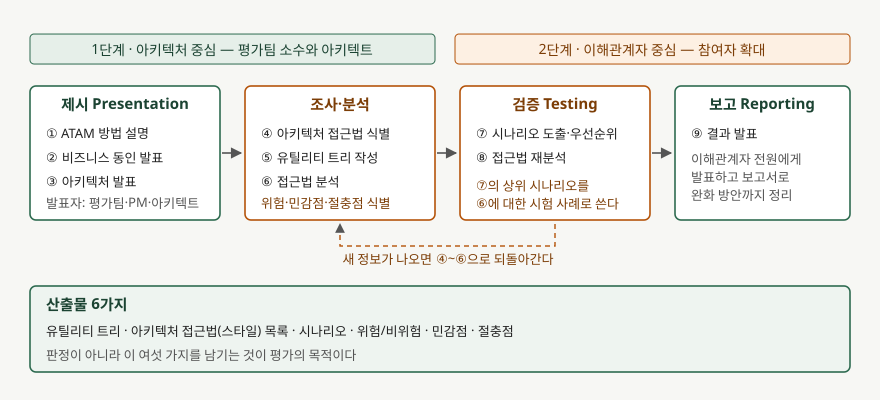

기출문제에서 ATAM을 묻는다. 이름 한가운데에 trade-off가 들어 있으므로 답안의 축도
거기에 둔다. 9단계를 순서대로 옮겨 적기만 하면 절차를 외운 답안이 되고,
"무엇과 무엇이 맞물려 있는지 찾아내는 방법"이라는 성격이 빠진다.

> 실행 검증 없음. 개념 문제이므로 문서 근거만으로 정리했다. 정의·단계·용어는 원 저자들의
> 기술보고서 CMU/SEI-2000-TR-004(Kazman·Klein·Clements, 2000.8)를 따랐다.

---

## Ⅰ. 정의

ATAM은 **아키텍처 결정이 품질속성 요구를 달성할 수 있는지 시나리오를 기준으로 따지고,
속성들 사이의 절충점을 드러내는 소프트웨어 아키텍처 평가 방법**이다. SEI가 3년간
실무에 적용하며 다듬은 뒤 2000년 기술보고서로 낸 것이다.

전제가 하나 깔려 있다. **아키텍처 스타일(접근법)이 품질속성을 결정한다**는 것이다.
그래서 평가는 비즈니스 목표에서 출발해 품질속성 목표를 끌어내고, 그것을 시나리오
수준까지 구체화한 다음, 그 시나리오를 아키텍처에 부딪혀 본다.

답안에서 놓치기 쉬운 단서는 **ATAM이 합격·불합격을 판정하지 않는다**는 점이다.
보고서는 상세한 정량 모델을 만드는 것이 방법의 의도가 아니라고 못 박는다. 목적은
민감점과 절충점이 어디에 있는지를 찾아 그 지점을 이후 심층 분석 대상으로 넘기는 데 있다.

## Ⅱ. 구성 — 9단계와 4묶음

> **출처**: [Kazman, Klein, Clements, *ATAM: Method for Architecture Evaluation*, CMU/SEI-2000-TR-004, §3 A Brief Introduction to the ATAM, §7 Outputs of the ATAM, §9 The Two Phases of ATAM](https://www.sei.cmu.edu/library/atam-method-for-architecture-evaluation/)

9단계는 성격에 따라 **4묶음**으로 나뉜다. 제시(①~③), 조사·분석(④~⑥),
검증(⑦~⑧), 보고(⑨)다. 번호가 붙어 있지만 폭포수는 아니어서, 새 정보가 나오면
앞 단계로 되돌아간다.

진행은 **2단계**로 끊는다. 1단계는 아키텍처 중심이라 평가팀 소수와 아키텍트가
정보를 모으고, 아키텍처 문서가 평가할 수 있을 만큼 갖춰졌는지를 판단한다.
2단계는 이해관계자 중심이라 참여자를 넓혀 1단계 결과를 검증한다.
1단계에서 문서가 모자라다고 판명되면 2단계로 넘어가지 않는다.

### 핵심 용어 4가지

| 용어 | 정의 |
|---|---|
| 민감점 sensitivity point | 특정 품질속성 응답을 달성하는 데 결정적인, 컴포넌트나 그 관계의 속성 |
| 절충점 tradeoff point | 둘 이상의 속성에 영향을 주면서 그 둘 모두에 대해 민감점인 속성 |
| 위험 risk | 문제가 될 수 있는 아키텍처 결정. **아직 내리지 않은 결정도 포함한다** |
| 비위험 non-risk | 암묵적 가정 위에서 성립하는 좋은 결정 |

암호화 강도가 대표 예다. 강도를 올리면 기밀성 예측치는 좋아지지만 처리 시간이 늘어난다.
기밀 메시지에 경성 실시간 지연 요구가 걸려 있으면 암호화 강도는 절충점이 된다.
민감점이 곧 위험은 아니다. 민감점에 **특정 값이 들어갔을 때** 위험이 된다.

### 시나리오 3종과 산출물

시나리오는 **3종**을 쓴다. 현재 시스템의 전형적 사용을 다루는 사용 사례 시나리오,
예상되는 변경을 다루는 성장 시나리오, 극단적 변경을 다루는 탐색 시나리오다.
⑤단계에서 유틸리티 트리로 우선순위를 매긴 시나리오가 분석 범위를 정하고,
⑦단계에서 이해관계자 전원이 도출·투표한 시나리오가 그 분석의 시험 사례가 된다.

산출물은 **6가지**다. 유틸리티 트리, 아키텍처 접근법 목록, 시나리오,
위험·비위험, 민감점, 절충점이다.

## Ⅲ. 적용 시 고려사항 — 3가지

- **문서가 없으면 평가도 없다.** 1단계를 따로 두는 이유가 아키텍처가 평가 가능한
  수준으로 표현되어 있는지 확인하기 위해서다. 문서화가 부족하면 어떤 문서를 어떤
  형태로 더 만들지부터 합의하고, 그 뒤에 2단계를 잡는다.
- **이해관계자 구성이 결과를 좌우한다.** 보고서는 3~5명 규모부터 40~50명 규모까지
  모두 수행해 봤다고 적는다. 단계마다 필요한 참여자가 다르므로 전원을 전 단계에
  부르지 않는다. 안전이 중요한 시스템이면 안전 전문가를 평가팀에 넣는 식으로 구성한다.
- **비위험도 근거와 함께 기록한다.** 비위험은 가정 위에 성립한다. 메시지 도착률이나
  상위 우선순위 프로세스 수 같은 가정이 바뀌면 비위험 판정은 다시 정당화해야 한다.
  기록해 두지 않으면 나중에 판단을 재현할 수 없다.

끝

## 답안 작성 메모

- **먼저 쓸 것**: 정의 한 줄과 "판정이 아니라 절충점 발굴"이라는 단서. 이 단서가
  들어가야 이름값을 아는 답안이 된다.
- **점수가 갈리는 지점**: 민감점과 절충점을 구분해 쓰는 것. 절충점은 "민감점이면서
  둘 이상의 속성에 걸리는 것"이라는 포함 관계를 한 줄로 밝히면 변별이 된다.
  암호화 강도 예시 하나면 충분하다.
- **시간이 모자라면**: 9단계 중 단계명만 4묶음으로 묶어 적고 산출물 6가지를 남긴다.
  단계 설명을 한 줄씩 붙이는 것보다 묶음과 산출물이 점수에 가깝다.
- 개수를 반드시 붙인다 — 9단계·4묶음·2단계·산출물 6가지·시나리오 3종.
- 이후 판본에서는 준비(Phase 0)와 후속조치(Phase 3)를 더한 4단계로 설명하기도 한다.
  단답형에서는 원 보고서의 2단계로 쓰고, 4단계 확장이 있다는 사실만 한 줄 붙인다.

## 참고 자료

- [Rick Kazman, Mark Klein, Paul Clements, *ATAM: Method for Architecture Evaluation*, CMU/SEI-2000-TR-004, Software Engineering Institute, 2000.8](https://www.sei.cmu.edu/library/atam-method-for-architecture-evaluation/)
- [Paul Clements, Rick Kazman, Mark Klein, *Evaluating Software Architectures: Methods and Case Studies*, Addison-Wesley, 2002 — Phase 0~3의 4단계 확장](https://www.informit.com/store/evaluating-software-architectures-methods-and-case-9780201704822)
