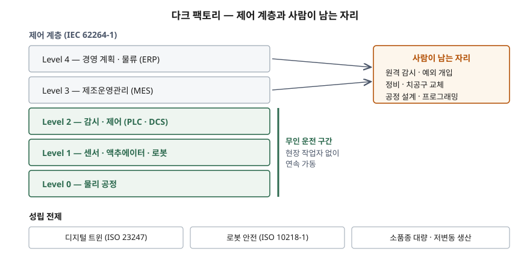

기출문제에서 다크 팩토리를 묻는다. 용어 자체는 마케팅 문헌에서 먼저 굳은 말이라
정의를 어디서 가져오느냐가 답안의 첫 갈림길이 된다.

> 실행 검증 없음. 개념 문제이므로 문서 근거만으로 정리했다.
>
> **용어 자체는 1차 자료가 없다.** 다크 팩토리를 정의한 표준·규격을 찾지 못해
> 독립된 2차 자료 3건(설비 공급사·산업 협회·정비 서비스 기업)을 교차 확인해 정의를 잡았고,
> 이를 구성하는 기술 요소만 1차 표준으로 근거를 붙였다. 확인한 2차 자료 3건은 모두
> 발행일을 표기하지 않는 상설 페이지였다. (§10)

---

## Ⅰ. 정의

다크 팩토리(dark factory), 영문 문헌에서는 **lights-out manufacturing**으로 더 자주
쓰이는 말이다. 현장에 상주하는 작업자 없이 생산 설비가 연속 가동되는 공장을 가리킨다.
조명이 필요 없다는 데서 이름이 왔다. 확인한 세 출처가 공통으로 말하는 요건은 **2가지**다.

- 물류·가공·검사까지 **한 사이클이 사람의 개입 없이 수행된다**
- 사람은 **현장이 아니라 원격에서** 감시하고 예외일 때만 들어온다

주의할 점은 "무인"이 "인력 불필요"가 아니라는 것이다. 세 출처 모두 정비·프로그래밍·
공정 설계 인력을 전제로 들고 있으므로, 답안에서 완전 무인으로 단정하면 감점 요인이 된다.

## Ⅱ. 구성 — 제어 계층과 성립 전제

> **출처**: [IEC 62264-1 / ISA-95 기능 계층 Level 0–4](https://www.isa.org/standards-and-publications/isa-standards/isa-95-standard) · [ISO 23247-1:2021 Digital twin framework for manufacturing](https://www.iso.org/standard/75066.html) · [ISO 10218-1:2025 Robotics — Safety requirements](https://www.iso.org/standard/73933.html) — 계층은 1차 표준, 무인 운전 구간의 구분은 (2차 자료 기반)

IEC 62264-1의 기능 계층으로 보면 다크 팩토리는 **Level 0~2를 무인으로 운영하는 것**이다.
Level 3(MES)과 Level 4(ERP)는 여전히 사람이 다루되 자리를 현장 밖으로 옮긴다.
성립 전제는 **3가지**다.

| 전제 | 내용 | 근거 |
|---|---|---|
| 상태 동기화 | 관측 가능한 제조 요소를 디지털 표현과 동기화해 원격에서 현재 상태를 판단 | ISO 23247-1:2021 |
| 안전 설계 | 사람이 없어도 예기치 않은 기동·정지가 안전하게 처리되고, 비인가 접근·조작 위험까지 설계 단계에서 다뤄짐 | ISO 10218-1:2025 |
| 생산 특성 | 변동이 적고 물량이 큰 품목 — 교체·재설정이 잦으면 사람이 다시 들어온다 | 2차 자료 3건 공통 |

## Ⅲ. 활용과 고려사항

### 기대 효과 — 3가지

1. **가동 시간 확대** — 교대·휴식에 묶이지 않아 설비를 연속으로 돌릴 수 있다.
2. **품질 편차 축소** — 수작업 개입이 빠지면서 공정 간 산포가 줄어든다.
3. **부대비용 절감** — 조명·공조 등 사람을 위한 환경 유지비가 줄어든다.

세 출처가 공통으로 드는 효과다. **구체적 절감률이나 생산성 배수는 원 출처가
1차 자료가 아니어서 싣지 않는다.** 답안에서도 수치 대신 방향만 쓰는 편이 안전하다.

### 고려사항 — 3가지

- **무인화는 정비 성숙도에 종속된다.** 사람이 없으므로 이상을 조기에 잡지 못하면
  손실이 야간 내내 누적된다. 예지정비와 원격 감시가 먼저 서야 무인이 성립한다.
- **안전과 보안이 한 묶음이 된다.** 현장에 사람이 없다는 말은 물리적 비상 정지를
  누를 사람도 없다는 뜻이다. 제어망 침해가 곧 설비 사고로 이어지므로
  기능 안전과 OT 보안을 분리해 다루면 안 된다.
- **적용 범위를 공정 단위로 끊는다.** 공장 전체를 한 번에 무인화하는 대신
  변동이 작은 공정부터 무인으로 돌리고 넓히는 접근이 현실적이다.

> 개념 정리: [다크 팩토리 — 무인화가 성립하기 위한 전제](../../emerging-tech/2026-09-21-dark-factory-prerequisites/index.md)

끝

## 답안 작성 메모

- **먼저 쓸 것**: 정의 한 줄과 "무인 ≠ 인력 불필요"라는 단서. 이 단서가 있고 없고로
  개념을 아는 답안인지 들은 말을 옮긴 답안인지 갈린다.
- **점수가 갈리는 지점**: IEC 62264 계층을 끌어와 **어느 레벨까지 무인인지**를
  구획하는 것. 용어 설명만 늘어놓으면 변별이 안 된다.
- **시간이 모자라면**: 효과 3가지를 한 줄씩으로 줄이고 계층 도식과 고려사항을 남긴다.
  단답형은 도식 하나가 설명 다섯 줄을 대신한다.
- 수치를 쓰고 싶어지는 문제다. 출처를 댈 수 없는 숫자는 쓰지 않는 편이 낫다.

## 참고 자료

- [IEC 62264-1 / ANSI-ISA-95 — Enterprise-control system integration, Part 1: Models and terminology](https://www.isa.org/standards-and-publications/isa-standards/isa-95-standard)
- [ISO 23247-1:2021 — Automation systems and integration: Digital twin framework for manufacturing, Part 1](https://www.iso.org/standard/75066.html)
- [ISO 10218-1:2025 — Robotics: Safety requirements, Part 1: Industrial robots](https://www.iso.org/standard/73933.html)
- 2차 자료 (용어 정의 교차 확인, 세 건 모두 발행일 미표기)
  - [Siemens, "Lights-out factory"](https://www.siemens.com/en-us/technology/lights-out-factory/)
  - [AMT/IMTS, "Automated Factory Guide: Lights-Out and Dark Manufacturing"](https://www.imts.com/read/article-details/Automated-Factory-Guide-Lights-Out-and-Dark-Manufacturing/1206/type/Read/1)
  - [Advanced Technology Services, "What is 'Lights Out' Dark Manufacturing?"](https://www.advancedtech.com/blog/what-is-lights-out-dark-manufacturing/)
