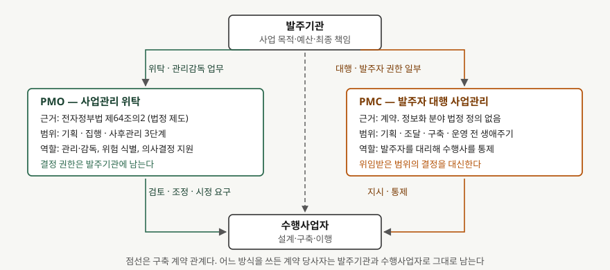

기출문제에서 PMC와 PMO를 비교하라고 묻는다. 둘 다 발주기관이 부족한 사업관리
역량을 외부에서 조달하는 방식이지만, 근거와 권한이 다르다. 정보관리기술사 답안이므로
축은 "정보화사업에서 누가 무엇을 결정하고 무엇을 남기는가"에 둔다.

> 실행 검증 없음. 개념 문제이므로 문서 근거만으로 정리했다.
>
> **PMO는 1차 자료가 있고 PMC는 없다.** PMO는 「전자정부법」과 행정규칙에 정의가
> 있으나, PMC는 정보화 분야에 법정 정의가 없어 엔지니어링·플랜트 분야의 독립된
> 2차 자료 3건(해외 컨설팅사 용어집 2012.5, 국내 업계 매체 2014.7·2019.10)을
> 교차 확인해 잡았다. **세 자료 모두 2년이 훨씬 지난 것이므로** 정의가 굳어 있다고
> 보기 어렵다. 답안에서도 "정보화 분야에는 법정 정의가 없다"를 함께 쓴다. (§10)

---

## Ⅰ. 정의

**PMO(Project Management Office)** — 「전자정부법」 제64조의2는 행정기관등의 장이
전자정부사업의 **관리·감독 업무의 전부 또는 일부를 전문지식과 기술능력을 갖춘 자에게
위탁**할 수 있다고 정한다. 여기서 위탁받아 사업관리를 수행하는 조직이 PMO다.
대상은 **2가지**로, 대국민 서비스나 행정 효율성에 미치는 영향이 큰 사업과
난이도가 높아 특별한 관리가 필요한 사업이다. 세부 범위와 수탁자 자격요건은
시행령과 행정안전부 고시 「전자정부사업관리 위탁에 관한 규정」이 정한다.

일반론으로는 PMI가 통제 수준에 따라 지원형·통제형·지시형 **3가지**로 나눈다.
전자정부사업관리 위탁은 이 가운데 통제형에 가깝다. 방법과 산출물을 강제하고
점검하지만, 사업을 대신 수행하지는 않는다.

**PMC(Project Management Consultancy)** — 발주자를 대리해 기획부터 조달·구축·운영까지
사업 전 생애주기의 관리를 수행하는 **용역 계약 형태**다. 교차 확인한 세 자료가
공통으로 드는 특징은 **2가지**다. 설계나 구축을 직접 하지 않는 순수 관리 용역이라는
점, 그리고 발주자 권한의 일부를 위임받아 수행사를 통제한다는 점이다.

## Ⅱ. 비교

> **출처**: [전자정부법 제64조의2(전자정부사업관리의 위탁)](https://www.law.go.kr/%EB%B2%95%EB%A0%B9/%EC%A0%84%EC%9E%90%EC%A0%95%EB%B6%80%EB%B2%95) · [전자정부사업관리 위탁에 관한 규정 제4조·제14조](https://www.law.go.kr/%ED%96%89%EC%A0%95%EA%B7%9C%EC%B9%99/%EC%A0%84%EC%9E%90%EC%A0%95%EB%B6%80%EC%82%AC%EC%97%85%EA%B4%80%EB%A6%AC%EC%9C%84%ED%83%81%EC%97%90%EA%B4%80%ED%95%9C%EA%B7%9C%EC%A0%95) — PMC 쪽 권한 표기는 (2차 자료 기반)

| 구분 | PMO | PMC |
|---|---|---|
| 근거 | 전자정부법 제64조의2 (법정 제도) | 발주자와의 계약. 정보화 분야 법정 정의 없음 |
| 대상 범위 | 기획·집행·사후관리 3단계. 위탁 특성에 따라 기획·사후관리는 제외 가능 | 기획·조달·구축·운영 전 생애주기 |
| 권한 | 관리·감독과 의사결정 **지원**. 결정은 발주기관이 한다 | 위임받은 범위에서 발주자를 **대리해 결정** |
| 수행사와의 관계 | 검토·조정·시정 요구 | 지시·통제 |
| 책임 | 관리 부실에 대한 용역 책임 | 위임 범위만큼 확대된 관리 책임 |
| 구축 계약 당사자 | 발주기관 ↔ 수행사업자 (불변) | 발주기관 ↔ 수행사업자 (불변) |

핵심 차이는 한 줄로 정리된다. **PMO는 결정을 돕고, PMC는 결정을 대신한다.**
범위의 넓고 좁음이 아니라 권한 위임 여부가 두 방식을 가른다.

## Ⅲ. 적용 시 고려사항 — 3가지

- **위임 범위를 계약서에 항목으로 쪼개 적는다.** "사업관리를 맡긴다"로 끝내면
  요구사항 변경 승인권, 검수 판정권, 일정 변경 결정권이 어디에 있는지가 분쟁 때
  갈린다. 정보화사업에서 다투는 지점은 대부분 이 세 가지다.
- **발주기관에 남는 것은 문서와 데이터뿐이다.** 관리를 외부에 맡길수록 요구사항
  추적표, 형상관리 이력, 시험 결과, 인수 산출물을 발주기관 자산으로 넘겨받는
  조항이 중요해진다. 위탁이 끝난 뒤 시스템을 운영·개선할 근거가 그것뿐이다.
- **이해상충을 계약 단계에서 끊는다.** 관리를 맡은 쪽이 후속 구축까지 가져가면
  자기가 통제한 결과를 자기가 검수하게 된다. 감리가 별도 제도로 남아 있는 이유와
  같은 문제다. PMO든 PMC든 후속 사업 참여 제한을 조건으로 건다.

끝

## 답안 작성 메모

- **먼저 쓸 것**: "PMO는 결정을 돕고 PMC는 결정을 대신한다"는 한 줄. 비교 문제는
  대비축을 먼저 세우고 표로 받는 편이 채점자가 읽기 좋다.
- **점수가 갈리는 지점**: PMO의 법적 근거를 대는 것. 전자정부법 제64조의2와
  위탁 3단계(기획·집행·사후관리)를 쓰면 제도를 아는 답안이 된다. 반대로 PMC는
  법정 정의가 없다는 사실 자체를 밝히는 것이 정확하다.
- **빠지기 쉬운 함정**: 도메인 이야기로 흘러 건설·플랜트 발주 방식만 설명하는 것.
  답안의 축은 정보화사업의 요구사항·산출물·검수 기준이어야 한다.
- **시간이 모자라면**: 비교표를 근거·권한·책임 3행만 남기고 고려사항 3가지를 지킨다.
- 개수를 붙인다 — 위탁 대상 2가지, PMO 유형 3가지, 위탁 3단계, 고려사항 3가지.

## 참고 자료

- [전자정부법 제64조의2(전자정부사업관리의 위탁) — 국가법령정보센터](https://www.law.go.kr/%EB%B2%95%EB%A0%B9/%EC%A0%84%EC%9E%90%EC%A0%95%EB%B6%80%EB%B2%95)
- [전자정부사업관리 위탁에 관한 규정(행정안전부 고시, 2024.6.27 일부개정) — 제4조 위탁 범위, 제14조 단계별 업무](https://www.law.go.kr/%ED%96%89%EC%A0%95%EA%B7%9C%EC%B9%99/%EC%A0%84%EC%9E%90%EC%A0%95%EB%B6%80%EC%82%AC%EC%97%85%EA%B4%80%EB%A6%AC%EC%9C%84%ED%83%81%EC%97%90%EA%B4%80%ED%95%9C%EA%B7%9C%EC%A0%95)
- [한국지능정보사회진흥원, 「전자정부사업관리 위탁(PMO) 도입·운영 가이드 2.1」](https://www.nia.or.kr/site/nia_kor/ex/bbs/View.do?cbIdx=99852&bcIdx=23222&parentSeq=23222)
- PMC 정의 교차 확인용 2차 자료 3건
  - [2B1st Consulting, "PMC" 용어집 (2012.5.24)](https://2b1stconsulting.com/pmc/)
  - [엔지니어링데일리, "PMC라는 이름의 터부" (2014.7.17)](https://www.engdaily.com/news/articleView.html?idxno=3432)
  - [대한경제, "엔지니어링산업 미래 'PMC' 도입·활성화 박차" (2019.10.18)](https://www.dnews.co.kr/uhtml/view.jsp?idxno=201910171356293570490)
