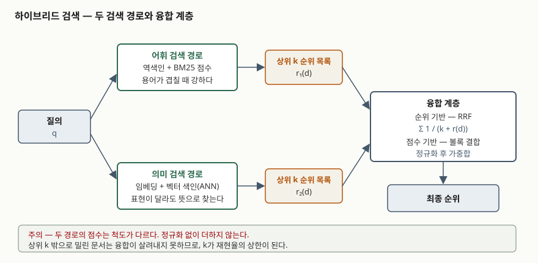

기출문제에서 어휘 검색과 의미 검색을 결합한 하이브리드 검색을 묻는다. 최신 용어처럼
보이지만 뿌리는 오래된 문제다. 단어가 겹쳐야 찾히는 검색과 뜻이 비슷하면 찾히는 검색은
서로 못 찾는 것이 다르고, 그래서 둘을 붙이면 각자보다 낫다는 것이 이 방식의 근거다.
답안의 축은 **"무엇을 붙이는가"가 아니라 "어떻게 붙이는가"**에 둔다. 두 검색의 점수는
척도가 달라서 그냥 더할 수 없고, 이 문제를 푸는 방식이 곧 하이브리드 검색의 설계다.

> 실행 검증 없음. 개념 문제이므로 문서 근거만으로 정리했다. 융합 식과 실험 수치는
> 원 논문(RRF는 SIGIR 2009, 선형 결합과 정확도는 DPR 논문, 융합 함수 비교는
> ACM TOIS 2023)을 따랐다.

---

## Ⅰ. 정의

하이브리드 검색은 **같은 질의에 대해 어휘 검색과 의미 검색을 각각 수행한 뒤, 두
순위 목록을 하나의 순위로 합쳐 내놓는 검색 방식**이다. 두 방식이 적합성을 서로 다르게
모형화하므로 보완 관계가 성립한다는 전제 위에 서 있다.

**어휘 검색**은 역색인에서 질의어와 문서의 용어 일치를 세어 BM25 같은 점수 함수로
순위를 매긴다. **의미 검색**은 질의와 문서를 각각 임베딩 벡터로 바꾸고 벡터 공간의
근접도로 순위를 매기며, 문서 수가 많으면 근사 최근접 이웃 탐색으로 후보를 좁힌다.

두 방식의 약점이 서로 다르다는 것이 결합의 근거다. 어휘 검색은 **어휘 불일치**에
약하다. Furnas 등의 1987년 연구는 같은 대상을 두 사람이 같은 단어로 부를 확률이
어느 영역에서도 0.20 미만이며, 설계자가 고른 단어 하나로만 접근하게 하면 실패율이
80~90%에 이른다고 보고했다. 반대로 의미 검색은 **드문 고유명사·식별자·오탈자**처럼
정확 일치가 필요한 질의에 약하다.

## Ⅱ. 구성 — 3계층과 융합 방식 2가지



> **출처**: [Cormack, Clarke, Büttcher, *Reciprocal Rank Fusion outperforms Condorcet and individual Rank Learning Methods*, SIGIR '09, 1절](https://dl.acm.org/doi/10.1145/1571941.1572114)

| 계층 | 하는 일 | 대표 기법 |
|---|---|---|
| 어휘 검색 경로 | 역색인 조회 후 용어 빈도 기반 점수로 상위 k개 | BM25 |
| 의미 검색 경로 | 질의 임베딩의 근사 최근접 이웃으로 상위 k개 | 이중 인코더 + 벡터 색인 |
| 융합 계층 | 두 목록을 하나의 순위로 합침 | RRF, 볼록 결합 |

### 융합 방식 2가지

**① 순위 기반 — 역수 순위 융합(RRF)**

문서 d에 대해 각 순위 목록이 매긴 순위 r(d)의 역수를 더한다.

```text
RRFscore(d) = Σ  1 / (k + r(d))
             r∈R
```

원 논문은 예비 실험에서 k = 60을 정한 뒤 검증 단계에서 바꾸지 않았다. 상수 k는
한 시스템이 유별나게 높게 올린 문서의 영향을 눌러 주는 구실을 한다. 이 방식의 이점은
**점수를 아예 쓰지 않는다**는 데 있다. 두 검색기의 점수 척도가 달라도 순위만 있으면
합쳐지므로, 정규화가 필요 없고 시스템별로 따로 계산해 더할 수 있다.

**② 점수 기반 — 볼록 결합**

두 점수를 같은 범위로 정규화한 뒤 가중합한다. DPR 논문은 두 방식으로 각각 상위 2,000건을
뽑아 합집합을 `BM25(q,p) + λ·sim(q,p)`로 다시 정렬했고, λ는 개발 집합 정확도를 보고
1.1로 정했다. 가중치를 대상 영역에 맞출 수 있다는 것이 이점이고, 대신 그 가중치를
정할 학습 데이터가 필요하다.

### 결합이 항상 이기지는 않는다

DPR 논문의 상위 20건 정확도를 보면 방향이 갈린다. SQuAD에서는 BM25 68.8, DPR 63.2,
결합 71.5로 **의미 검색이 지는 영역에서도 결합이 둘 다를 넘었다.** 반면 Natural
Questions에서는 DPR 78.4, 결합 76.6으로 **결합이 단독 의미 검색보다 낮았다.**
한쪽이 압도적으로 좋은 영역에서는 약한 쪽을 섞는 것이 순위를 끌어내린다.

## Ⅲ. 적용 시 고려사항 — 3가지

- **점수 척도가 다르다는 것을 먼저 처리한다.** BM25 점수는 상한이 없고 질의 길이에
  따라 크기가 달라지지만, 코사인 유사도는 정해진 범위 안에 있다. 정규화 없이 더하면
  질의마다 어느 쪽이 이길지가 뒤바뀐다. RRF가 순위만 쓰는 것은 이 문제를 피하기 위해서다.
- **RRF가 무조정 기법은 아니다.** 상수 k를 기본값 그대로 쓰는 구현이 많지만,
  융합 함수를 비교한 2023년 연구는 RRF가 매개변수에 민감하며 볼록 결합이 학습 영역과
  미학습 영역 모두에서 더 나았고 적은 표본으로도 조정이 된다고 보고했다.
  **기본값을 근거 없이 최적으로 취급하지 않는다.**
- **후보 창 크기가 재현율의 상한이다.** 융합은 두 목록 안에 들어온 문서만 다시
  줄 세울 뿐, 상위 k 밖으로 밀린 문서를 살려내지 못한다. k를 키우면 재현율은 오르지만
  융합 대상이 늘어 지연이 커진다. 여기에 색인을 두 벌 유지하고 질의를 두 번 던지는
  비용이 더해지므로, **결합으로 얻는 정확도 이득이 이 비용을 넘는지**를 영역별로
  측정해 정해야 한다. 앞의 Natural Questions 사례처럼 넘지 못하는 경우가 있다.

> 개념 정리: [BM25 — 확률적 적합성 프레임워크가 낳은 순위 함수와 두 매개변수](../../software-engineering/2026-09-22-bm25-probabilistic-relevance/index.md)

끝

## 답안 작성 메모

- **먼저 쓸 것**: 정의 한 줄과 "두 검색이 못 찾는 것이 서로 다르다"는 보완 근거.
  이 근거가 없으면 기법 나열이 된다.
- **점수가 갈리는 지점**: **점수 척도가 달라 그냥 더할 수 없다**는 문제를 짚고,
  RRF가 순위만 쓰는 이유를 거기에 연결하는 것. 식을 외워 적는 것보다 이 연결이 변별이 크다.
- **시간이 모자라면**: 볼록 결합 쪽의 λ 값과 실험 수치를 버리고 RRF 식과 k = 60만 남긴다.
  모식도는 3계층만 그리면 되므로 마지막까지 버리지 않는다.
- 개수를 반드시 붙인다 — 3계층, 융합 방식 2가지, 고려사항 3가지.
- 수치를 쓸 때는 어느 데이터셋의 상위 몇 건 정확도인지까지 적는다. 조건 없이
  "결합이 더 낫다"고 쓰면 반례(Natural Questions)가 있는 문장이 된다.
- 최신 용어(RAG, 재순위화)를 끌어오고 싶어도 묻지 않은 것은 한 줄로 끊는다.
  하이브리드 검색은 RAG의 검색 단계에 쓰이지만, 답안의 주어는 검색이지 생성이 아니다.

## 참고 자료

- [Gordon V. Cormack, Charles L. A. Clarke, Stefan Büttcher, *Reciprocal Rank Fusion outperforms Condorcet and individual Rank Learning Methods*, SIGIR '09, ACM, 2009](https://dl.acm.org/doi/10.1145/1571941.1572114)
- [Vladimir Karpukhin 외, *Dense Passage Retrieval for Open-Domain Question Answering*, EMNLP 2020 — 5절 선형 결합과 표 2 검색 정확도](https://arxiv.org/abs/2004.04906)
- [Sebastian Bruch, Siyu Gai, Amir Ingber, *An Analysis of Fusion Functions for Hybrid Retrieval*, ACM Transactions on Information Systems, 2023](https://dl.acm.org/doi/10.1145/3596512)
- [George W. Furnas, Thomas K. Landauer, Louis M. Gomez, Susan T. Dumais, *The Vocabulary Problem in Human-System Communication*, Communications of the ACM 30(11), 1987](https://dl.acm.org/doi/10.1145/32206.32212)
- [Stephen Robertson, Hugo Zaragoza, *The Probabilistic Relevance Framework: BM25 and Beyond*, Foundations and Trends in Information Retrieval 3(4), 2009](https://dl.acm.org/doi/10.1561/1500000019)
- [Elasticsearch 레퍼런스 — Reciprocal rank fusion. `rank_constant` 기본값 60](https://www.elastic.co/docs/reference/elasticsearch/rest-apis/reciprocal-rank-fusion)
