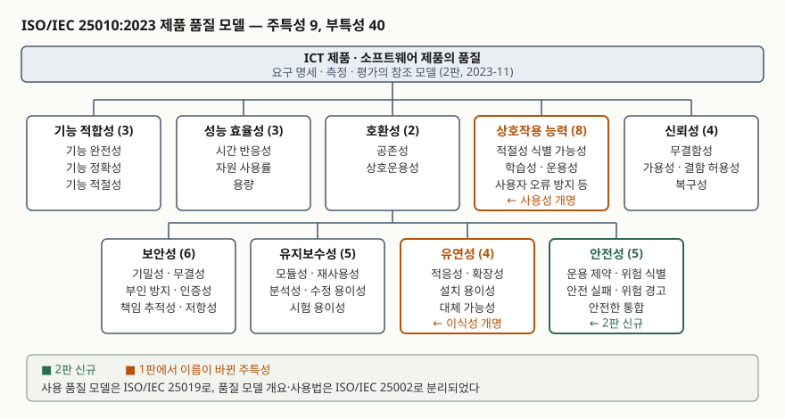

기출문제에서 ISO/IEC 25010의 주특성과 부특성을 묻는다. 목록을 외워 적는 문제처럼
보이지만, 이 표준은 2023년 11월에 2판이 나오면서 주특성 개수와 이름이 바뀌었다.
8개라고 쓰면 구판 기준이고, 9개라고 쓰면 현행 기준이다. **어느 판을 쓰는지 밝히지
않으면 채점자가 틀렸다고 볼지 맞다고 볼지 알 수 없다.** 답안의 첫 갈림길이 여기다.

> 실행 검증 없음. 개념 문제이므로 문서 근거만으로 정리했다. 주특성·부특성의 이름과
> 개수, 1판 대비 변경 사항은 ISO/IEC 25010:2023 본문의 적용 범위(1절)·용어와 정의(3절)·
> 머리말의 주요 변경 목록을 따랐다.

---

## Ⅰ. 정의

ISO/IEC 25010은 **ICT 제품과 소프트웨어 제품의 품질을 9개 주특성과 그 아래 40개
부특성으로 나눈 참조 모델**이다. SQuaRE(ISO/IEC 25000~25099) 표준군의 품질 모델 부문에
속하며, 요구사항을 도출하고 설계·시험 목표와 인수 기준을 정하고 평가하는 데 쓰인다.

정의에서 빠뜨리면 안 되는 단어가 **참조 모델**이다. 이 표준은 무엇을 어떻게 측정하라고
말하지 않는다. 측정은 품질 측정 부문(2502n)이 맡고, 25010은 "무엇을 품질이라 부를지"의
목록과 이름만 정한다. 그래서 대상 제품의 성격에 따라 필요한 특성만 골라 쓰는 것이 전제다.

2판이 되면서 문서의 범위 자체도 줄었다. 1판은 제품 품질 모델과 사용 품질 모델을 한
문서에 담았지만, 2판은 **제품 품질 모델만 남기고** 사용 품질 모델은 ISO/IEC 25019:2023으로,
품질 모델 개요와 사용법은 ISO/IEC 25002:2024로 옮겼다. 2판은 1판을 폐지하고 대체한다.

## Ⅱ. 구성 — 주특성 9개와 부특성 40개

> **출처**: [ISO/IEC 25010:2023, Systems and software Quality Requirements and Evaluation (SQuaRE) — Product quality model, 1절 Scope 및 3절 Terms and definitions](https://www.iso.org/standard/78176.html)

| 주특성 | 부특성 |
|---|---|
| 기능 적합성 (3) | 기능 완전성, 기능 정확성, 기능 적절성 |
| 성능 효율성 (3) | 시간 반응성, 자원 사용률, 용량 |
| 호환성 (2) | 공존성, 상호운용성 |
| 상호작용 능력 (8) | 적절성 식별 가능성, 학습성, 운용성, 사용자 오류 방지, 사용자 참여, 포용성, 사용자 지원, 자기 서술성 |
| 신뢰성 (4) | 무결함성, 가용성, 결함 허용성, 복구성 |
| 보안성 (6) | 기밀성, 무결성, 부인 방지, 책임 추적성, 인증성, 저항성 |
| 유지보수성 (5) | 모듈성, 재사용성, 분석성, 수정 용이성, 시험 용이성 |
| 유연성 (4) | 적응성, 확장성, 설치 용이성, 대체 가능성 |
| 안전성 (5) | 운용 제약, 안전 실패, 위험 식별, 위험 경고, 안전한 통합 |

### 1판에서 바뀐 것 — 6가지

표준 머리말이 변경 사항을 항목으로 열거한다. 답안에서 변별이 나는 대목이므로 묶어 둔다.

1. **안전성 추가** — 주특성이 8개에서 9개가 되었다. 부특성 5개를 함께 신설했다
2. **사용성 → 상호작용 능력**, **이식성 → 유연성**으로 이름이 바뀌었다
3. 상호작용 능력에 **포용성·자기 서술성**, 보안성에 **저항성**, 유연성에 **확장성**이 추가되었다
4. **사용자 인터페이스 심미성 → 사용자 참여**, **성숙성 → 무결함성**으로 대체되었다
5. 접근성이 **포용성과 사용자 지원 둘로 분리**되었다
6. 모델의 적용 대상이 소프트웨어에서 **ICT 제품과 정보시스템 전반**으로 넓어졌다

이름이 왜 바뀌었는지는 표준의 용어 정의에 단서가 있다. 상호작용 능력은 사용자
인터페이스를 통해 정보를 주고받을 수 있는 제품 자체의 능력이고, 사용성은 특정 사용
맥락에서 사용자가 실제로 목표를 달성했는지를 보는 결과 쪽 개념이다. 표준은
**상호작용 능력이 사용성의 전제**라고 적고, 사용성 쪽은 사용 품질 모델(25019)로 넘겼다.
제품이 가진 성질과 사용해 본 결과를 한 모델에 섞지 않겠다는 정리다.

## Ⅲ. 적용 시 고려사항 — 3가지

- **판을 명시하고 쓴다.** 1판 기준 8주특성 31부특성과 2판 기준 9주특성 40부특성은
  둘 다 현장에서 통용된다. 조달 문서나 평가 기준에 인용할 때 판을 적지 않으면
  안전성과 확장성이 요구에 포함되는지가 갈린다.
- **측정 지표는 이 표준에 없다.** 25010은 이름과 분류까지다. 실제로 값을 재려면
  품질 측정 부문의 표준으로 내려가 측정 지표를 정의해야 하고, 그 과정에서
  "무결함성을 무엇으로 잴 것인가" 같은 결정이 따로 필요하다.
- **아홉 개를 전부 요구하지 않는다.** 표준은 대상 제품의 성격에 따라 필요한 특성을
  고르는 것을 전제한다. 안전성은 물리적 위해가 가능한 제품에서 의미가 있고,
  내부 배치용 도구에 상호작용 능력 8개를 모두 요구하는 것은 비용만 늘린다.
  **어느 특성을 뺐는지와 그 이유를 남기는 것**이 고르는 일의 절반이다.

> 개념 정리: [SQuaRE 표준군 구조 — 5개 부문과 확장 부문, 그리고 품질 모델 4종](../../software-engineering/2026-09-22-square-standard-family-structure/index.md)

끝

## 답안 작성 메모

- **먼저 쓸 것**: "주특성 9개 / 부특성 40개, ISO/IEC 25010:2023 기준"을 첫 줄에 박는다.
  판과 개수를 먼저 적어야 뒤의 목록이 근거를 갖는다.
- **점수가 갈리는 지점**: 9개를 다 적는 것보다 **2판 변경 6가지**를 묶어 적는 쪽이
  변별이 크다. 안전성 신설, 사용성·이식성 개명 이 세 개만이라도 들어가야 한다.
- **시간이 모자라면**: 부특성은 개수만 괄호로 적고 이름은 상호작용 능력·보안성·안전성
  셋만 풀어 쓴다. 나머지는 1판과 같으므로 채점자가 읽어 낸다.
- 개수를 반드시 붙인다 — 주특성 9, 부특성 40, 변경 6가지, 안전성 부특성 5.
- 사용 품질(25019)과 제품 품질(25010)을 섞어 쓰지 않는다. 효과성·효율성·만족도는
  사용 품질 쪽 용어다. 이 문제에서 꺼내면 감점 요인이다.
- 한국어 용어는 번역이 갈리는 대목이 있다(상호작용 능력/상호작용성, 무결함성/무장애성).
  **영문 원어를 괄호로 병기**해 두면 번역 차이로 감점되지 않는다.

## 참고 자료

- [ISO/IEC 25010:2023, Systems and software engineering — Systems and software Quality Requirements and Evaluation (SQuaRE) — Product quality model, 2판, 2023-11](https://www.iso.org/standard/78176.html)
- [ISO/IEC 25010:2023 공개 미리보기 — 머리말의 주요 변경 목록, 1절 Scope, 3절 용어와 정의](https://cdn.standards.iteh.ai/samples/78176/13ff8ea97048443f99318920757df124/ISO-IEC-25010-2023.pdf)
- [ISO/IEC 25019:2023, Quality-in-use model — 2판에서 분리된 사용 품질 모델. 주특성 3개](https://www.iso.org/standard/78177.html)
- [ISO/IEC 25002:2024, Quality model overview and usage — 2판에서 분리된 품질 모델 개요와 사용법](https://www.iso.org/standard/78175.html)
- [ISO/IEC 25010:2011 (1판) — 주특성 8개, 부특성 31개](https://www.iso.org/standard/35733.html)
