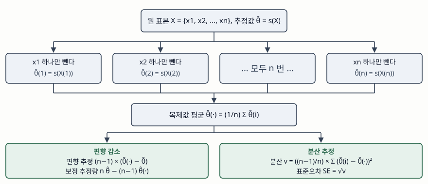

기출문제에서 잭나이프 기법을 묻는다. 분포를 가정할 수 없는 지표에 오차 범위를
붙여야 하는 상황이 답안의 출발점이다. 정보관리기술사 답안이므로 축은 통계 이론
자체가 아니라 **시스템이 산출한 추정값을 어떤 절차로 신뢰할 수 있게 만드는가**에
둔다. 모델 평가 지표, 용량 산정값, 샘플링으로 뽑은 품질 측정값이 모두 이 절차를
거쳐야 하는 대상이다.

> 알고리즘 문제이므로 답안의 수식을 다섯 개짜리 표본에서 직접 계산해 검산했다.
> 계산 기록은 [code/output.txt](code/output.txt)에 있다. (§7)

---

## Ⅰ. 정의

**잭나이프(Jackknife)** 는 크기 n인 표본에서 관측치를 하나씩 뺀 n개의 부분표본으로
추정량을 다시 계산하고, 그 복제값들의 흩어짐으로 **추정량의 편향과 분산을 재는
재표집(resampling) 기법**이다. Quenouille가 1949년에 제안하고 1956년 논문에서
편향 보정 절차로 정리했으며, Tukey가 1958년에 이름을 붙이면서 분산과 신뢰한계
추정으로 넓혔다.

부트스트랩이 복원추출을 난수로 수백 번 반복하는 것과 달리, 잭나이프는 **비복원으로
정확히 n번만** 계산한다. 같은 표본에 같은 절차를 돌리면 항상 같은 값이 나오므로
재현이 필요한 검증 절차에 넣기 쉽다.

## Ⅱ. 구성요소 — 4가지

> **출처**: [A. I. McIntosh, "The Jackknife Estimation Method" §2 (arXiv:1606.00497, 2016)](https://arxiv.org/abs/1606.00497) · [B. Efron, C. Stein, "The Jackknife Estimate of Variance", Ann. Statist. 9(3):586–596 (1981)](https://doi.org/10.1214/aos/1176345462)

**① 잭나이프 표본과 복제값** — i번째 관측치만 뺀 표본 X(i)에 같은 추정 함수 s를
적용한 값 θ̂(i)가 복제값이다. 복제값은 n개, 복제값 평균은 θ̂(·)로 쓴다.

**② 편향 추정과 보정 추정량** — 편향은 `(n−1) × (θ̂(·) − θ̂)`로 잡고, 원 추정값에서
이것을 빼 `n θ̂ − (n−1) θ̂(·)`를 얻는다. 편향이 `b₁/n + b₂/n² + …` 꼴로 전개될 때
1차 항이 상쇄되므로, **O(1/n)이던 편향이 O(1/n²)으로 내려간다.**

**③ 유사값(pseudovalue)** — `n θ̂ − (n−1) θ̂(i)`를 i마다 만든 값이다. 이들의 평균이
곧 보정 추정량이고, 서로 독립인 관측치처럼 다뤄 t 분포 신뢰구간을 만든다.

**④ 분산 추정** — `((n−1)/n) × Σ(θ̂(i) − θ̂(·))²`이다. 앞의 계수가 `1/n(n−1)`이
아니라 `(n−1)/n`인 점이 잭나이프 분산식의 특징이다.

### 검산 — 표본 {2, 4, 4, 5, 10}

추정량을 **1/n으로 나눈 표본분산**으로 잡으면 편향이 정확히 `−σ²/n`이므로, 보정이
제대로 되는지 눈으로 확인할 수 있다.

| 항목 | 값 | 확인 |
|---|---|---|
| 원 추정값 θ̂ | 36/5 = 7.2 | 1/n으로 나눈 표본분산 |
| 복제값 평균 θ̂(·) | 27/4 = 6.75 | 복제값 5개의 평균 |
| 편향 추정 | −9/5 = −1.8 | `−S²/n`과 정확히 일치 |
| 보정 추정값 | 9 | **불편분산 S²와 정확히 일치** |
| 표본평균의 잭나이프 분산 | 9/5 = 1.8 | `S²/n`과 정확히 일치 |

부동소수점이 아니라 유리수로 계산했으므로 "거의 같다"가 아니라 **항등**이다.
잭나이프가 표본평균에서는 이미 아는 표준오차를 그대로 되돌려주고, 편향이 있는
추정량에서는 그 편향을 정확히 덜어낸다는 사실이 여기서 확인된다.

## Ⅲ. 적용 시 고려사항 — 4가지

- **매끄럽지 않은 추정량에는 쓰지 않는다.** 중앙값이 대표적이다. 같은 표본에서
  중앙값의 복제값은 서로 다른 값이 **2개뿐**이었다. 하나를 빼도 가운데 값이 거의
  움직이지 않기 때문인데, 표본이 커져도 이 성질이 그대로라 분산 추정이 수렴하지
  않는다. Shao와 Wu는 d개를 빼는 delete-d 잭나이프가 이 경우 일치추정량임을 보였다.
- **분산 추정값은 위로 치우친다.** Efron과 Stein은 대칭 통계량에 대해 잭나이프
  분산 추정의 기댓값이 참값 이상임을 증명했다. 신뢰구간이 실제보다 넓게 나오므로,
  성능 기준선을 잡는 용도라면 **보수적인 쪽으로 틀린다**는 점을 알고 써야 한다.
- **관측치가 독립이어야 한다.** 하나를 빼도 나머지의 분포가 변하지 않는다는 전제
  위에서 성립한다. 시계열 로그나 같은 세션에서 나온 요청처럼 서로 얽힌 데이터에
  그대로 적용하면 값은 나오지만 근거가 없다. 블록 단위 재표집으로 바꿔야 한다.
- **계산 비용은 n배다.** 추정 함수를 n번 돌리므로, 학습 한 번이 오래 걸리는 모델에
  건건이 적용할 수 없다. 대신 결과가 난수에 흔들리지 않아 **회귀 검증에 넣기 좋다.**

> 개념 정리: [부트스트랩 재표집 — 복원추출로 추정량의 분포를 세우는 절차](../../data-analysis/2026-09-22-bootstrap-resampling/index.md)

끝

## 답안 작성 메모

- **먼저 쓸 것**: "관측치를 하나씩 빼 다시 계산한다"는 한 줄과 편향식
  `(n−1)(θ̂(·) − θ̂)`. 이 두 개가 없으면 나머지를 아무리 써도 점수가 안 붙는다.
- **점수가 갈리는 지점**: 편향 차수가 O(1/n)에서 O(1/n²)로 내려간다는 서술과,
  분산식 계수가 `(n−1)/n`이라는 것. 부트스트랩과의 대비(비복원·n회 고정·재현 가능)를
  한 줄 붙이면 답안이 닫힌다.
- **빠지기 쉬운 함정**: 분산식 계수를 표본평균 표준오차의 `1/n(n−1)`로 잘못 쓰는 것.
  그리고 중앙값에 그대로 적용하는 것 — 한계를 묻는 문제가 여기서 나온다.
- **시간이 모자라면**: 유사값 항을 버린다. 정의 → 절차 4단계 → 한계 2가지 순서를 지킨다.
- 개수를 붙인다 — 구성요소 4가지, 고려사항 4가지, 복제값 n개.

## 참고 자료

- [B. Efron, C. Stein, "The Jackknife Estimate of Variance", The Annals of Statistics 9(3):586–596 (1981)](https://doi.org/10.1214/aos/1176345462) — 분산 추정이 위로 치우친다는 정리
- [J. Shao, C. F. J. Wu, "A General Theory for Jackknife Variance Estimation", The Annals of Statistics 17(3):1176–1197 (1989)](https://doi.org/10.1214/aos/1176347263) — delete-d 잭나이프의 일치성
- [B. Efron, "Bootstrap Methods: Another Look at the Jackknife", The Annals of Statistics 7(1):1–26 (1979)](https://doi.org/10.1214/aos/1176344552)
- [A. I. McIntosh, "The Jackknife Estimation Method" (arXiv:1606.00497, 2016)](https://arxiv.org/abs/1606.00497) — 복제값·편향·유사값·분산식 정의
- M. H. Quenouille, "Notes on Bias in Estimation", Biometrika 43(3/4):353–360 (1956) · J. W. Tukey, "Bias and Confidence in Not-quite Large Samples (abstract)", Ann. Math. Statist. 29(2):614 (1958)
