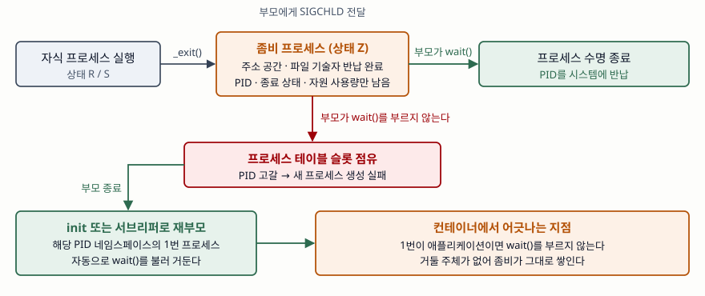

기출문제에서 좀비 프로세스를 묻는다. 서버가 멀쩡히 돌다가 어느 순간 새 프로세스를
만들지 못하는 장애의 원인으로 자주 지목되는 개념이다. 답안의 축은 운영 사고담이
아니라 **운영체제가 종료 상태를 부모에게 건네주는 규약**에 둔다. 그 규약을 지키지
않는 코드가 어떤 자원을 잠그는지까지 내려가야 정보관리기술사 답안이 된다.

> 실행 검증 없음. 이 환경에는 리눅스 계열 실행 수단이 없어 규격과 매뉴얼 근거로만
> 정리했다. 출력·측정값은 싣지 않는다. (§6)

---

## Ⅰ. 정의

POSIX.1-2024의 좀비 프로세스 항목(§3.426 Zombie Process)은 이를 **실행이 종료되었으나
그 프로세스 ID가 아직 시스템에 반납되지 않은 프로세스**로 규정한다. 같은 표준의
프로세스 수명 항목(§3.285 Process Lifetime)은 수명을 생성 시점부터 PID가 반납되는
시점까지로 잡으므로, 좀비는 **실행이 끝난 뒤에도 수명이 이어지고 있는 구간**이다.

`_Exit()` 규격은 종료한 프로세스가 좀비로 바뀌고, 그 상태 정보가 부모에게
제공된다고 정한다. 부모가 `wait()`·`waitpid()`·`waitid()`로 상태를 가져가면 그때
수명이 끝난다. 즉 좀비는 결함이 아니라 **종료 상태를 유실 없이 건네주기 위해
규격이 정해 둔 정상 상태**다. 문제가 되는 것은 거두는 쪽이 없어 쌓일 때다.

## Ⅱ. 특징 — 4가지

> **출처**: [POSIX.1-2024 §3.426 Zombie Process, §3.285 Process Lifetime](https://pubs.opengroup.org/onlinepubs/9799919799/basedefs/V1_chap03.html) · [POSIX.1-2024 `_Exit()` DESCRIPTION](https://pubs.opengroup.org/onlinepubs/9799919799/functions/_Exit.html) · [Linux man-pages `wait(2)` NOTES](https://man7.org/linux/man-pages/man2/wait.2.html) · [`pid_namespaces(7)`](https://man7.org/linux/man-pages/man7/pid_namespaces.7.html)

**① 남는 것과 사라지는 것이 갈린다** — 주소 공간, 열린 파일 기술자, 스택은 종료
시점에 이미 반납된다. 커널이 붙들고 있는 것은 **PID, 종료 상태, 자원 사용량**뿐이다.
따라서 좀비는 메모리 누수가 아니라 **PID와 프로세스 테이블 슬롯의 누수**다.

**② 거두는 경로는 하나뿐이다** — 자식이 종료하면 부모에게 SIGCHLD가 전달되고,
부모가 대기 계열 함수를 불러 상태를 가져가야 소멸한다. 리눅스 매뉴얼은 거두지
않은 좀비가 프로세스 테이블 슬롯을 차지하며, 그 표가 차면 더 이상 프로세스를
만들 수 없다고 적는다.

**③ 부모가 먼저 죽으면 자동으로 정리된다** — 남은 자식과 좀비의 부모 PID는 구현이
정하는 시스템 프로세스로 바뀐다. 리눅스에서는 `init` 또는 `prctl(2)`로 지정한 가장
가까운 서브리퍼가 받아 자동으로 거둔다. **좀비가 무한히 쌓이려면 부모가 살아 있어야
한다**는 점이 원인 추적의 출발점이다.

**④ 식별과 대응 수단이 다르다** — `/proc/[pid]/stat`의 상태 문자는 `Z`이고, `ps`
매뉴얼은 이 상태를 "종료했으나 부모가 거두지 않은" 것으로 적으며 명령 자리에
`<defunct>`를 찍는다. **좀비는 시그널로 종료시킬 수 없다.** 이미 종료해서 시그널을
처리할 실행 흐름이 없기 때문이다. 당장 걷어내려면 부모를 종료시켜 ③의 재부모
경로를 타게 하는 방법뿐이다.

| 구분 | 좀비 프로세스 | 고아 프로세스 |
|---|---|---|
| 상태 | 종료함 (상태 `Z`) | 실행 중 |
| 원인 | 부모가 상태를 거두지 않음 | 부모가 먼저 종료 |
| 점유 자원 | PID·프로세스 테이블 슬롯 | 실행에 필요한 자원 전부 |
| 해소 | 부모의 `wait()` 호출 | 재부모 후 종료 시 자동 |

## Ⅲ. 적용 시 고려사항 — 4가지

- **SIGCHLD 처리기에서 `WNOHANG` 반복문으로 거둔다.** 같은 시그널이 겹쳐 오면
  한 번으로 합쳐지므로, 처리기가 한 자식만 거두면 나머지가 남는다. 더 거둘 자식이
  없다는 응답이 올 때까지 도는 형태가 기본이다.
- **종료 상태가 필요 없으면 명시적으로 포기한다.** SIGCHLD의 처리 방식을 무시로
  두거나 `SA_NOCLDWAIT`를 걸면 자식이 좀비가 되지 않는다. 다만 이때 대기 함수는
  모든 자식이 끝난 뒤 `ECHILD`로 실패하므로, 종료 코드를 보는 코드와 함께 쓸 수 없다.
- **컨테이너의 1번 프로세스를 설계 항목으로 다룬다.** 애플리케이션이 그대로 1번이
  되면 고아를 거두는 init 역할을 아무도 하지 않아 좀비가 쌓인다. Docker는
  `--init` 옵션으로 시그널 전달과 거두기를 맡는 init을 1번에 넣는다. 반대로
  PID 네임스페이스의 1번이 종료하면 커널이 그 네임스페이스 전체를 강제 종료하므로,
  1번을 무엇으로 둘지는 장애 전파 범위까지 바꾸는 결정이다.
- **좀비 수를 감시 지표에 넣는다.** PID 고갈은 특정 기능이 아니라 프로세스 생성
  자체를 막으므로 원격 접속과 상태 점검까지 함께 실패한다. 재시작은 증상만 지운다.
  근본 원인은 자식을 만들고 거두지 않는 부모 코드에 있다.

끝

## 답안 작성 메모

- **먼저 쓸 것**: "종료했지만 PID가 아직 반납되지 않은 상태"라는 정의 한 줄과,
  부모의 `wait()`가 유일한 해소 경로라는 문장. 이 둘이 답안의 뼈대다.
- **점수가 갈리는 지점**: 좀비를 결함이 아니라 **규격이 정한 정상 상태**로 설명하는
  것. 그리고 누수되는 자원이 메모리가 아니라 PID·프로세스 테이블 슬롯이라는 점.
  여기를 틀리면 "좀비가 메모리를 먹는다"는 흔한 오답이 된다.
- **빠지기 쉬운 함정**: 좀비를 `kill`로 없앤다고 쓰는 것. 이미 종료한 프로세스라
  시그널이 닿지 않는다. 부모를 정리해 재부모를 유도한다고 써야 맞다.
- **시간이 모자라면**: 비교표를 상태·원인·해소 3행만 남긴다. 고려사항은 거두는
  코드와 컨테이너 1번, 두 가지만 지킨다.
- 개수를 붙인다 — 특징 4가지, 고려사항 4가지, 남는 정보 3가지(PID·종료 상태·자원 사용량).

## 참고 자료

- [The Open Group Base Specifications Issue 8 / IEEE Std 1003.1-2024, §3.426 Zombie Process · §3.285 Process Lifetime](https://pubs.opengroup.org/onlinepubs/9799919799/basedefs/V1_chap03.html)
- [POSIX.1-2024, `_Exit()`, `_exit()` — 종료 시 좀비 전환과 자식의 재부모](https://pubs.opengroup.org/onlinepubs/9799919799/functions/_Exit.html)
- [POSIX.1-2024, `wait()`, `waitpid()`](https://pubs.opengroup.org/onlinepubs/9799919799/functions/wait.html)
- [Linux man-pages, `wait(2)` — 좀비가 점유하는 자원과 서브리퍼 재부모](https://man7.org/linux/man-pages/man2/wait.2.html)
- [Linux man-pages, `proc_pid_stat(5)` — 상태 문자 `Z`](https://man7.org/linux/man-pages/man5/proc_pid_stat.5.html)
- [Linux man-pages, `ps(1)` — PROCESS STATE CODES의 `Z`와 `<defunct>` 표기](https://man7.org/linux/man-pages/man1/ps.1.html)
- [Linux man-pages, `pid_namespaces(7)` — 네임스페이스 1번 프로세스의 역할](https://man7.org/linux/man-pages/man7/pid_namespaces.7.html)
- [Docker Engine, `docker container run` — `--init` 옵션](https://docs.docker.com/reference/cli/docker/container/run/)
