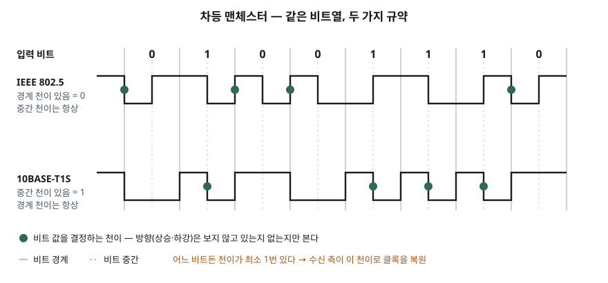

기출문제에서 차등 맨체스터 부호화의 방법을 묻는다. 물리 계층 문항은 정의 한 줄과
파형 하나로 점수가 거의 정해지는데, 이 부호는 **표준마다 0과 1에 붙인 규약이
반대**라서 파형을 그리는 순간 틀리기 쉽다. 답안은 규약을 먼저 밝히고 그 규약으로
파형을 그리는 순서로 쓴다.

> 부호화 규칙은 표준 문서로 확인했고, 답안의 파형은 8비트 입력을 두 규약으로 직접
> 부호화·복호해 검산했다. 계산 기록은 [code/output.txt](code/output.txt)에 있다. (§7)
>
> IEEE 802.5 원문은 유료라 직접 열람하지 못했다. 802.5 규약은 그 표준을 근거로 인용한
> 미국 특허(US4675884A, 1987)와 2차 자료 2건(Held 2003, Teledyne LeCroy 2021)을 교차 확인했다.

---

## Ⅰ. 정의

**차등 맨체스터 부호화(Differential Manchester Encoding, DME)** 는 비트 하나를 반 비트
두 칸으로 나누고, 정해진 자리에서 **신호 레벨이 바뀌었는지(천이 유무)** 로 비트 값을
나타내는 자기 동기식 2레벨 선로 부호다. 비트마다 천이가 최소 1번 있어 수신 측이 데이터
흐름에서 클록을 복원하고, 레벨이나 천이 방향이 아니라 유무만 보므로 **극성과 무관하게
복호된다.** 10BASE-T1S 표준 초안(147.1.2)은 DME를 자기 동기식이며 본질적으로 균형 잡힌
부호로 기술한다.

## Ⅱ. 부호화 방법 — 규약 2가지



> **출처**: [IEEE 802.3cg Draft D0.3 §147.4.2 PMA Transmit function](https://www.ieee802.org/3/cg/public/Nov2017/8023cg_D0p3_T1S_revB.PDF) · [US4675884A Decoding circuit (IEEE 802.5 초안 인용)](https://patents.google.com/patent/US4675884A/en) — 파형은 [code/output.txt](code/output.txt)의 실제 부호화 결과

두 규약 모두 **천이 2자리 중 한 자리는 항상 천이, 다른 한 자리의 천이 유무가 데이터**다.
어느 자리를 데이터로 쓰느냐만 반대다.

| 구분 | IEEE 802.5 (Token Ring) | IEEE 802.3cg 10BASE-T1S |
|---|---|---|
| 항상 있는 천이 | 비트 **중간** | 비트 **시작** (클록 천이) |
| 데이터를 싣는 자리 | 비트 **시작** | 비트 **중간** (데이터 천이) |
| 0 | 시작에 천이 **있음** | 중간에 천이 **없음** |
| 1 | 시작에 천이 **없음** | 중간에 천이 **있음** |
| 다른 이름 | — | Biphase Mark Code와 같은 형태 |

8비트 `01001110`을 두 규약으로 부호화한 결과다. 반 비트 한 칸이 문자 하나다.

```text
[IEEE 802.5]
  파형          : _‾‾_‾_‾__‾‾__‾_‾
  비트당 천이 수: [2, 1, 2, 2, 1, 1, 1, 2]
[10BASE-T1S]
  파형          : __‾_‾‾__‾_‾_‾_‾‾
  비트당 천이 수: [1, 2, 1, 1, 2, 2, 2, 1]
```

비트당 천이는 1번 또는 2번이다. 0번인 칸은 없다. 이것이 클록 복원의 근거이며,
대가로 **신호가 바뀌는 빈도가 비트율의 최대 2배**가 된다. 10BASE-T1S는 10 Mb/s 데이터를
4B5B로 바꾼 뒤 그 부호 비트를 12.5 MBd로 DME 전송한다. 초안의 타이밍 표는 클록 천이
간격 80 ns, 클록 천이에서 데이터 천이까지 40 ns를 공칭값으로 둔다(147.4.2).

## Ⅲ. 특징과 고려사항

### 특징 — 3가지

1. **극성 무관** — 선로 두 가닥을 바꿔 꽂아 신호가 뒤집혀도 천이 유무는 그대로다.
   검산에서 반전 파형을 복호한 값이 두 규약 모두 원래 `[0, 1, 0, 0, 1, 1, 1, 0]`이었다.
   10BASE-T1S 초안(147.4.2)도 천이 유무로 부호화하므로 극성은 무관하다고 적는다.
2. **자기 동기** — 비트마다 천이가 있어 별도 클록 선이 필요 없다.
3. **부호 위반 심벌** — 802.5는 중간 천이가 없는 **J(경계 천이 없음)·K(경계 천이 있음)**
   를 두어 프레임 시작·끝 구분자로 쓴다. 시작 구분자 `J K 0 J K 0 0 0`을 부호화하면
   J·K 자리의 천이 수가 0·1로, 데이터 비트에서는 나올 수 없는 모양이 된다.

### 맨체스터 부호와의 비교

| 항목 | 맨체스터 | 차등 맨체스터 |
|---|---|---|
| 비트 판별 기준 | 중간 천이의 **방향**(상승·하강) | 정해진 자리 천이의 **유무** |
| 극성 반전 시 | 0과 1이 뒤바뀐다 | 그대로 복호된다 |
| 앞 비트 의존 | 없음 | 있음 — 앞 반 비트 레벨과 비교 |

### 고려사항 — 3가지

- **규약부터 밝힌다.** 같은 이름으로 0·1 규약이 반대인 표준이 있다. 답안에서 규약을 적지
  않고 파형만 그리면 채점자가 어느 쪽으로 읽느냐에 따라 오답이 된다.
- **대역폭 비용.** 신호 천이 빈도가 비트율의 최대 2배라 같은 선로에서 낼 수 있는 비트율이
  낮아진다. 쓰이는 곳도 토큰링과 10 Mb/s의 10BASE-T1S처럼 저속 구간이다.
- **앞 칸 의존.** 802.5 규약은 경계 천이를 앞 반 비트 레벨과 비교해 판별하므로 한 칸을
  잘못 읽으면 그 판단이 다음 비트까지 이어진다. 복호기를 설계할 때 비교 기준이 되는
  직전 레벨을 어떻게 잡는지(프레임 시작의 동기 패턴)를 함께 정해야 한다.

끝

## 답안 작성 메모

- **먼저 쓸 것**: 정의 한 줄과 "방향이 아니라 유무"라는 한 구절. 맨체스터와 갈리는
  지점이 이것 하나다.
- **점수가 갈리는 지점**: 파형. 규약을 적고, 비트 경계·중간을 점선으로 나눈 뒤 그린다.
  802.5 규약이면 **중간 천이를 먼저 전부 그려 놓고** 경계 천이를 0에만 넣으면 틀리지 않는다.
- **시간이 모자라면**: 맨체스터 비교표를 버리고 파형과 규약 표를 남긴다.
- 시험장에서 규약을 하나만 쓴다면 문항이 토큰링을 언급하는지 본다. 언급이 없으면
  802.5 규약을 쓰고 "10BASE-T1S는 반대 규약"이라고 한 줄 붙인다.

## 참고 자료

- [IEEE 802.3cg Task Force, Draft D0.3 — Clause 147 10BASE-T1S PCS/PMA (2017-11)](https://www.ieee802.org/3/cg/public/Nov2017/8023cg_D0p3_T1S_revB.PDF) — 초안이며 최종 표준에서 절 번호가 달라졌을 수 있다
- [US4675884A, Decoding circuit, Hitachi (1987-06-23 공개)](https://patents.google.com/patent/US4675884A/en) — IEEE 802.5 초안을 인용해 0·1·J·K를 정의
- 2차 자료 (802.5 규약 교차 확인)
  - Gilbert Held, [Enhancing LAN Performance §2.2 Token Ring Frame Formats](https://flylib.com/books/en/1.180.1.20/1/) (2003) — 시작·끝 구분자 패턴
  - [Teledyne LeCroy, "What Is Differential Manchester Encoding?"](https://blog.teledynelecroy.com/2021/11/what-is-differential-manchester-encoding.html) (2021-11-22)
  - [Wikipedia, Differential Manchester encoding](https://en.wikipedia.org/wiki/Differential_Manchester_encoding) — 별칭(Biphase Mark Code)과 사용처
