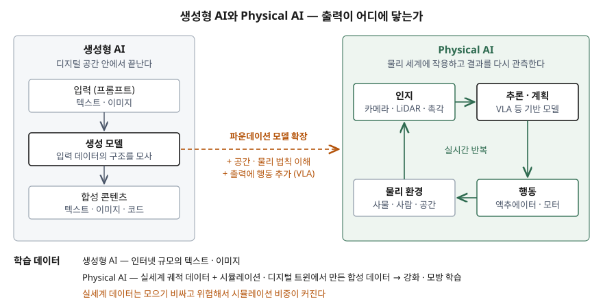

기출문제에서 Physical AI와 생성형 AI의 비교를 묻는다. 둘 다 같은 기반 모델 계열에서
나왔기 때문에 "로봇에 들어간 생성형 AI" 정도로 뭉뚱그리기 쉽다. 점수는 둘이 **어디서
갈라지는가** — 출력이 닿는 곳, 학습 데이터, 오류의 결과 — 를 시스템 관점으로 짚는 데서
난다.

> 실행 검증 없음. 개념 문제이므로 문서 근거만으로 정리했다.
>
> **Physical AI는 1차 자료 없음.** 용어를 정의한 표준·공공 문서를 찾지 못해 독립된
> 2차 자료 3건(NVIDIA 용어집, 발행일 미표기 / IBM Think, 2026-01-19 / WEF·BCG 백서,
> 2025-09)을 교차 확인했다. 생성형 AI 정의는 1차 자료(NIST AI 600-1)를, 두 개념을 잇는
> VLA 모델은 원 논문(RT-2)을 근거로 했다. (§10)

---

## Ⅰ. 정의

**생성형 AI** 는 NIST AI 600-1이 쓰는 정의로, **입력 데이터의 구조와 특성을 모사해
파생된 합성 콘텐츠를 생성하는 AI 모델의 부류**다. 합성 콘텐츠는 텍스트·이미지·영상·
음성 같은 디지털 콘텐츠다.

**Physical AI** 는 **센서로 물리 환경을 인지하고, 추론해 행동을 정하고, 액추에이터로
실제 세계에 작용하는 AI 시스템**이다. 정의가 정립되는 중이며 출처마다 강조점이 다르다.

| 출처 | 무엇을 중심에 두는가 |
|---|---|
| NVIDIA 용어집 | 생성형 AI에 **3차원 공간 관계와 물리 법칙 이해를 더한 확장** |
| IBM Think | 소프트웨어 안에만 있지 않고 **물리 세계에서 동작하는 AI 시스템** |
| WEF·BCG 백서 | **인지·추론·행동을 결합한 지능형 로봇 시스템** |

세 출처가 공통으로 드는 요소는 **인지·추론·행동 3가지**다.

## Ⅱ. 비교

> **출처**: [NIST AI 600-1 Generative AI Profile](https://www.nist.gov/publications/artificial-intelligence-risk-management-framework-generative-artificial-intelligence) · [NVIDIA Glossary, What is Physical AI?](https://www.nvidia.com/en-us/glossary/generative-physical-ai/) · [WEF, Physical AI §1.1 Technological breakthroughs](https://reports.weforum.org/docs/WEF_Physical_AI_Powering_the_New_Age_of_Industrial_Operations_2025.pdf) — Physical AI 쪽은 (2차 자료 기반)

| 항목 | 생성형 AI | Physical AI |
|---|---|---|
| 출력 | 합성 콘텐츠 (텍스트·이미지·코드) | 물리적 행동 (이동·파지·조작) |
| 입력 | 프롬프트 | 카메라·LiDAR·촉각 센서의 실시간 신호 |
| 학습 데이터 | 인터넷 규모의 텍스트·이미지 | 실세계 궤적 + 시뮬레이션·디지털 트윈의 합성 데이터 |
| 학습 방식 | 대규모 사전학습 | 사전학습 모델 위에 강화학습·모방학습 |
| 실시간 제약 | 응답이 늦어도 결과물은 같다 | 제어 주기 안에 행동을 정해야 한다 — 엣지 장치에 배치 |
| 오류의 결과 | 잘못된 콘텐츠 (NIST가 드는 위험 12가지 중 작화 등) | 물리적 사고 — 기능 안전이 전제 조건 |
| 대표 예 | GPT, Llama | Gemini Robotics, Isaac GR00T, RT-2 |

두 개념을 잇는 것이 **VLA(Vision-Language-Action) 모델**이다. RT-2 논문은 로봇 행동을
텍스트 토큰으로 표현해 시각·언어 데이터와 한 학습 집합에 넣는 방식으로, 인터넷 규모
시각·언어 지식을 로봇 제어로 옮겼다. 생성형 AI의 출력 공간에 **행동을 추가**한 것이다.

## Ⅲ. 고려사항

### 정보시스템 관점 — 3가지

- **학습 데이터 파이프라인이 달라진다.** 실세계 데이터는 모으기 비싸고 위험하므로
  시뮬레이션·디지털 트윈에서 합성 데이터를 만들어 학습한다. WEF 백서는 물리 시뮬레이터와
  조명·마찰 같은 파라미터를 무작위로 바꾸는 도메인 무작위화로 **시뮬레이션과 현실의
  차이**를 줄인다고 적는다. 이 차이를 검증하는 절차가 데이터 관리의 일부가 된다.
- **추론이 엣지로 내려간다.** 행동은 실시간이어야 하므로 모델을 장치 안에서 돌린다.
  모델 배포·버전 관리가 데이터센터 한 곳이 아니라 현장 장치 전체를 대상으로 한다.
- **안전과 보안이 한 묶음이다.** 생성형 AI의 오류는 콘텐츠로 남지만 Physical AI의 오류는
  설비·사람에 닿는다. 로봇 안전 규격(ISO 10218-1:2025)이 전제 조건이 되고, 제어망
  침해가 곧 물리 사고가 되므로 OT 보안을 같이 설계해야 한다.

### 적용 판단

WEF 백서는 로봇 시스템을 **규칙 기반·학습 기반·맥락 기반 3가지**로 나누고, 셋이 대체
관계가 아니라 **공존하는 계층형 자동화**라고 본다. 변동이 적은 반복 공정은 규칙 기반이
여전히 맞고, Physical AI는 변동이 크거나 처음 보는 환경에서 값을 한다.

> 개념 정리: [Physical AI — 인지·추론·행동 순환과 시뮬레이션 기반 학습](../../emerging-tech/2026-09-23-physical-ai-perception-action-loop/index.md)
>
> 개념 정리: [다크 팩토리 — 무인화가 성립하기 위한 전제](../../emerging-tech/2026-09-21-dark-factory-prerequisites/index.md)

끝

## 답안 작성 메모

- **먼저 쓸 것**: 두 정의를 한 줄씩, 그리고 "출력이 콘텐츠냐 행동이냐"라는 기준 하나.
  비교표 항목은 이 기준에서 전부 파생된다.
- **점수가 갈리는 지점**: 비교표에 **학습 데이터(합성 데이터·시뮬레이션)** 와
  **오류의 결과(안전)** 를 넣는지. 출력 차이만 쓰면 누구나 쓰는 답안이다.
  VLA를 한 줄 넣으면 두 개념이 별개가 아니라 이어져 있다는 것을 보여줄 수 있다.
- **시간이 모자라면**: 정의 비교 표(출처별 강조점)를 버리고 "정의가 정립되는 중" 한 문장만
  남긴다. 도식과 비교표는 버리지 않는다.
- 시장 규모·성능 배수를 쓰고 싶어지는 주제다. 원 출처가 1차인 수치를 못 찾았으므로
  싣지 않았다. WEF 백서의 사례 수치도 기업 발표를 옮긴 것이라 쓰지 않는다.

## 참고 자료

- [NIST AI 600-1, Artificial Intelligence Risk Management Framework: Generative Artificial Intelligence Profile (2024-07)](https://www.nist.gov/publications/artificial-intelligence-risk-management-framework-generative-artificial-intelligence)
- [Brohan et al., RT-2: Vision-Language-Action Models Transfer Web Knowledge to Robotic Control, arXiv:2307.15818 (2023-07)](https://arxiv.org/abs/2307.15818)
- [ISO 10218-1:2025 — Robotics: Safety requirements, Part 1: Industrial robots](https://www.iso.org/standard/73933.html)
- 2차 자료 (Physical AI 정의 교차 확인)
  - [NVIDIA Glossary, "What is Physical AI?"](https://www.nvidia.com/en-us/glossary/generative-physical-ai/) — 발행일 미표기
  - [IBM Think, Cole Stryker, "What is physical AI?"](https://www.ibm.com/think/topics/physical-ai) — 2026-01-19
  - [World Economic Forum · BCG, "Physical AI: Powering the New Age of Industrial Operations"](https://reports.weforum.org/docs/WEF_Physical_AI_Powering_the_New_Age_of_Industrial_Operations_2025.pdf) — 2025-09
