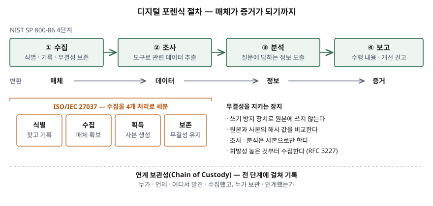

기출문제에서 디지털 포렌식을 묻는다. 익숙한 주제라 "증거를 수집해 분석하는 기술" 한
줄로 끝내기 쉽다. 점수는 **절차를 표준 이름과 개수로** 쓰고, 증거가 법정·징계 절차에서
받아들여지게 하는 **무결성과 연계 보관성**을 어떤 장치로 지키는지 쓰는 데서 난다.

> 실행 검증 없음. 개념 문제이므로 표준 문서 근거만으로 정리했다.

---

## Ⅰ. 정의

**디지털 포렌식(Digital Forensics)** 은 NIST SP 800-86이 쓰는 정의로, **정보의 무결성을
보존하고 엄격한 연계 보관성(chain of custody)을 유지하면서 데이터를 식별·수집·조사·분석하는
데 과학을 적용하는 것**이다. 같은 문서는 컴퓨터·네트워크 포렌식이라고도 부르며, 정의가
여러 가지라는 점을 함께 밝힌다.

ISO/IEC 27037은 대상이 되는 **디지털 증거**를 "이진 형태로 저장·전송되어 증거로 쓰일 수
있는 정보나 데이터"로 정의한다.

## Ⅱ. 구성요소

> **출처**: [NIST SP 800-86 §3 Performing the Forensic Process, Figure 3-1](https://csrc.nist.gov/pubs/sp/800/86/final) · [ISO/IEC 27037:2012 §5.4 Digital evidence handling processes](https://www.iso.org/standard/44381.html) · [RFC 3227 §2.1 Order of Volatility](https://www.rfc-editor.org/rfc/rfc3227) — ISO 4과정을 NIST 수집 단계 아래에 놓은 것은 답안 구성을 위한 대응

### 가. 절차 4단계 — NIST SP 800-86

| 단계 | 하는 일 | 변환 |
|---|---|---|
| ① 수집(Collection) | 사건 관련 데이터를 식별·표시·기록·수집하고 무결성을 보존 | — |
| ② 조사(Examination) | 데이터 유형에 맞는 도구로 관련 정보를 추출 | 매체 → 데이터 |
| ③ 분석(Analysis) | 조사 결과로 조사를 시작하게 한 질문에 답을 도출 | 데이터 → 정보 |
| ④ 보고(Reporting) | 수행 내용, 추가 조치, 정책·도구 개선 권고 | 정보 → 증거 |

### 나. 증거 처리 4과정 — ISO/IEC 27037

NIST의 수집 단계를 증거 취급 관점에서 넷으로 나눈다.

| 과정 | 표준의 정의 |
|---|---|
| ① 식별(Identification) | 잠재적 디지털 증거를 찾고, 알아보고, 문서화 |
| ② 수집(Collection) | 증거가 담긴 **물리적 매체**를 확보 |
| ③ 획득(Acquisition) | 정해진 범위의 데이터로 **사본**을 생성 |
| ④ 보존(Preservation) | 증거의 무결성·원래 상태를 유지하고 보호 |

수집과 획득을 구분하는 것이 요점이다. 수집은 매체를 가져오는 일이고 획득은 사본을 만드는
일이다. 멈출 수 없는 운영 서버처럼 매체를 가져올 수 없으면 현장에서 획득만 하게 된다.

### 다. 증거 처리 요구사항 4가지 — ISO/IEC 27037

| 요구사항 | 뜻 |
|---|---|
| 감사 가능성(Auditability) | 제3자가 각 행위를 독립적으로 평가할 수 있다 |
| 반복성(Repeatability) | **같은** 환경에서 같은 절차로 같은 결과가 나온다 |
| 재현성(Reproducibility) | **다른** 환경·다른 수행자로도 같은 결과가 나온다 |
| 정당성(Justifiability) | 택한 행위와 방법이 최선이었음을 설명할 수 있다 |

### 라. 무결성을 지키는 장치 4가지

- **쓰기 방지 장치(write-blocker)**: 이미징할 때 원본 매체에 쓰기가 일어나지 않게 막는다
- **해시 비교**: 원본과 사본의 메시지 다이제스트를 계산해 같은지 확인한다
- **사본 분석**: 조사·분석은 사본으로만 하고 원본은 보관한다
- **휘발성 순서**: RFC 3227은 레지스터·캐시 → 라우팅 표·ARP 캐시·프로세스 표·메모리 →
  임시 파일 시스템 → 디스크 → 원격 로그 → 물리 구성·네트워크 구성도 → 보관 매체의
  **7단계** 순으로, 사라지기 쉬운 것부터 수집하라고 적는다

## Ⅲ. 활용 및 고려사항

### 활용 — 4가지 (NIST SP 800-86)

법적 절차의 증거 수집, 내부 징계 절차, 악성코드 사고 대응, 원인이 드러나지 않는 운영
장애 분석.

### 정보시스템이 미리 갖출 것 — 포렌식 준비도

ISO/IEC 27037은 사건 뒤의 대응 절차만 다루고, 미리 대비하는 **포렌식 준비도(forensic
readiness)** 는 범위 밖이라고 밝힌다. 그러나 준비도가 없으면 위 절차는 수집할 것이 없다.

- **로그 보존**: 운영체제·애플리케이션·네트워크 로그를 사건 뒤에도 남도록 별도 저장소에
  보관한다. 로그가 공격 대상 서버에만 있으면 함께 지워진다
- **시각 동기화**: RFC 3227은 시스템 시계가 UTC와 얼마나 어긋나 있는지 기록하라고 한다.
  여러 시스템의 로그를 한 줄의 시간 순서로 엮으려면 시각이 맞아야 한다
- **절차와 기록 양식**: 연계 보관성 기록(누가·언제·어디서 발견·수집했고 누가 보관·인계했는가)
  양식과 도구 사용 지침을 미리 정해 둔다
- **법적 검토**: NIST SP 800-86은 조직마다 적용 법규가 다르므로 법률 자문과 함께 절차를
  세우라고 적는다

끝

## 답안 작성 메모

- **먼저 쓸 것**: NIST 정의 한 줄(무결성 + 연계 보관성이 정의 안에 들어 있다)과 4단계 표.
  이것만으로 답안의 뼈대가 선다.
- **점수가 갈리는 지점**: NIST 4단계에서 끝내지 않고 ISO/IEC 27037의 **수집과 획득의
  구분**, 요구사항 4가지를 쓰는지. 반복성과 재현성을 "같은 환경 / 다른 환경"으로 갈라 쓰면
  둘을 뭉뚱그린 답안과 차이가 난다. Ⅲ에서 **포렌식 준비도**로 정보시스템이 미리 갖출 것을
  쓰면 정보관리 답안이 된다.
- **시간이 모자라면**: 요구사항 표의 "뜻" 칸과 활용 항목을 버린다. 휘발성 순서는 7단계를
  다 쓰지 못하면 "메모리 → 디스크 → 원격 로그 → 보관 매체" 넷으로 줄인다.
- 국내 수험서에 자주 나오는 5대 원칙(정당성·재현성·신속성·연계 보관성·무결성)은 이번에
  확인한 표준 문서에 그 묶음으로 나오지 않는다. 쓰려면 표준 용어를 먼저 쓰고 덧붙인다.

## 참고 자료

- [NIST SP 800-86, Guide to Integrating Forensic Techniques into Incident Response (2006-08)](https://csrc.nist.gov/pubs/sp/800/86/final)
- [ISO/IEC 27037:2012, Guidelines for identification, collection, acquisition and preservation of digital evidence](https://www.iso.org/standard/44381.html)
- [RFC 3227, Guidelines for Evidence Collection and Archiving (2002-02)](https://www.rfc-editor.org/rfc/rfc3227)
