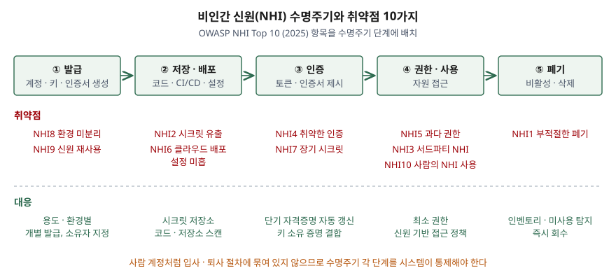

기출문제에서 비인간 신원(NHI)의 보안 취약점을 묻는다. 사람 계정의 IAM 이야기로
흘러가기 쉬운 문제다. 점수는 **사람 계정과 무엇이 달라서 취약해지는가** — 누가
만들고, 어디에 저장되고, 언제 없어지는가 — 를 짚고, 취약점을 **개수와 함께** 나열하는
데서 난다.

> 실행 검증 없음. 개념 문제이므로 문서 근거만으로 정리했다.
>
> NHI라는 용어 자체를 정의한 ISO·NIST 표준은 찾지 못했다. 취약점 목록은 이 목록을 만든
> OWASP 프로젝트의 공식 문서(2025판)를, 워크로드 신원과 자격증명 관리는 NIST SP 800-207A와
> IETF WIMSE 작업반 초안을 근거로 했다. WIMSE 문서는 아직 RFC가 아닌 인터넷 초안이다.

---

## Ⅰ. 정의

**비인간 신원(NHI, Non-Human Identity)** 은 OWASP NHI Top 10이 쓰는 정의로, **소프트웨어
주체가 보호된 자원에 접근할 때 그 주체를 식별·인증·인가하는 데 쓰는 신원**이다.
백엔드의 서비스 계정, 클라우드 서비스의 역할(role), 마이크로서비스의 API·접근 키,
서드파티 연동 애플리케이션이 여기에 든다.

NIST SP 800-207A는 같은 대상을 **서비스·애플리케이션 신원**이라 부르고, 제로 트러스트
환경에서 네트워크 위치가 아니라 이 신원을 기준으로 인증·인가 정책을 건다고 본다.

사람 신원과 갈리는 지점은 3가지다.

| 구분 | 사람 신원 | 비인간 신원 |
|---|---|---|
| 생성 주체 | 인사 절차에 따라 IAM 관리자가 만든다 | 개발자·파이프라인이 필요할 때 만든다 |
| 인증 수단 | 비밀번호 + 사람이 응답하는 추가 인증 | 키·토큰·인증서 자체 — 가진 쪽이 곧 주체다 |
| 폐기 계기 | 퇴사·전보 | 서비스 종료 — 인사 이벤트가 없어 놓치기 쉽다 |

## Ⅱ. 보안 취약점 10가지

> **출처**: [OWASP Non-Human Identities Top 10 — 2025](https://owasp.org/www-project-non-human-identities-top-10/2025/top-10-2025/) · [IETF draft-ietf-wimse-arch-08 §Security Considerations](https://datatracker.ietf.org/doc/html/draft-ietf-wimse-arch-08) — 수명주기 단계로 묶은 것은 답안 구성을 위한 정리

OWASP NHI Top 10(2025)의 10개 항목을 **수명주기 5단계**에 배치하면 다음과 같다.

| 단계 | 항목 | 취약한 이유 |
|---|---|---|
| ① 발급 | NHI8 환경 미분리 | 개발·테스트·운영에 같은 신원을 써서 하위 환경 침해가 운영으로 번진다 |
| | NHI9 신원 재사용 | 여러 서비스가 한 자격증명을 공유해 한 곳의 유출이 전체 침해가 된다 |
| ② 저장·배포 | NHI2 시크릿 유출 | 키·토큰을 코드에 박아 넣거나 허가되지 않은 저장소에 올린다 |
| | NHI6 클라우드 배포 설정 미흡 | CI/CD의 정적 자격증명, 또는 주체(`sub`) 조건 없이 신뢰한 OIDC 토큰 |
| ③ 인증 | NHI4 취약한 인증 | 폐기 예정이거나 알려진 공격에 약한 인증 방식을 쓴다 |
| | NHI7 장기 시크릿 | 만료가 아주 멀거나 없어, 유출되면 공격자가 오래 접근한다 |
| ④ 권한·사용 | NHI5 과다 권한 | 기능에 필요한 것보다 넓은 권한이 붙는다 |
| | NHI3 서드파티 NHI | 연동한 확장·SaaS가 침해되면 넘겨 준 권한이 그대로 악용된다 |
| | NHI10 사람의 NHI 사용 | 사람이 수작업에 서비스 계정을 써서 감사 추적이 끊긴다 |
| ⑤ 폐기 | NHI1 부적절한 폐기 | 서비스를 내려도 자격증명이 살아 있다 |

IETF WIMSE 아키텍처 초안은 이 취약점들이 공통으로 기대는 원인을 **베어러(bearer)
자격증명**에서 찾는다. 다른 정보에 묶이지 않은 토큰은 시스템 사이를 오가며 노출되기 쉽고,
훔친 쪽이 다른 곳에서 그대로 재사용할 수 있다.

## Ⅲ. 대응 방안

### 수명주기별 통제 — 5가지

- **발급**: 용도·환경마다 신원을 따로 발급하고 **소유자를 지정**한다. NHI8·NHI9를 막고,
  NHI1의 원인인 소유자 불명을 없앤다.
- **저장·배포**: 시크릿을 전용 저장소(vault)에 두고 코드·저장소를 스캔한다. CI/CD는
  정적 자격증명 대신 **OIDC로 발급받는 단기 토큰**을 쓰되, 발급자·대상(audience)·주체
  클레임을 엄격히 검증한다 (OWASP NHI6 권고).
- **인증**: WIMSE 초안이 권하는 대로 자격증명을 **짧게 유효하게 하고 자동 갱신**하며,
  암호 키에 결합해 **소유 증명(proof-of-possession)** 을 요구한다. 훔친 토큰만으로는
  인증이 되지 않는다.
- **권한·사용**: 최소 권한을 적용하고, 인증 성공을 곧 인가로 보지 않는다. NIST SP
  800-207A처럼 **서비스 신원을 기준으로 한 접근 정책**을 호출마다 적용한다.
  사람의 작업은 사람 신원으로 하게 해 감사 추적을 남긴다.
- **폐기**: NHI **인벤토리**를 유지하고 주기적으로 재인증(recertification)해, 쓰이지 않거나
  소유자가 없는 신원을 회수한다. OWASP는 인사·IAM 시스템을 연동해 퇴사 시 그 사람이 만든
  NHI까지 점검하라고 권한다.

### 정보시스템 관점의 고려사항

NHI는 사람이 로그인하지 않으므로 이상 징후도 사람이 먼저 알아채지 못한다. 신원별 호출
기록을 모아 **평소와 다른 사용 패턴**을 탐지하는 감사 체계가 있어야 위 통제가 운영 중에도
유지된다.

끝

## 답안 작성 메모

- **먼저 쓸 것**: 정의 한 줄과 "사람 신원과 무엇이 다른가" 비교표. 취약점이 전부 이
  차이(인사 절차 밖, 키 자체가 주체)에서 나온다는 흐름을 잡아 두면 나열이 산만해지지 않는다.
- **점수가 갈리는 지점**: 취약점 **10개를 개수와 함께** 쓰는지, 그리고 그것을 수명주기로
  묶었는지. 10개를 순서대로만 외워 쓰면 채점자가 구조를 볼 수 없다. 베어러 자격증명이라는
  공통 원인을 한 줄 넣으면 대응(단기 자격증명·소유 증명)으로 자연스럽게 넘어간다.
- **시간이 모자라면**: 표의 "취약한 이유" 칸을 버리고 항목 이름만 단계별로 적는다.
  도식은 버리지 않는다 — 박스 5개와 아래 이름만 쓰면 2분이면 된다.
- NHI 수가 사람 계정의 몇 배라는 수치가 자주 인용되지만, 원 출처가 벤더 조사라 싣지 않았다.

## 참고 자료

- [OWASP Non-Human Identities Top 10 — 2025](https://owasp.org/www-project-non-human-identities-top-10/2025/top-10-2025/)
  - [NHI1:2025 Improper Offboarding](https://owasp.github.io/www-project-non-human-identities-top-10/2025/1-improper-offboarding/)
  - [NHI6:2025 Insecure Cloud Deployment Configurations](https://owasp.github.io/www-project-non-human-identities-top-10/2025/6-insecure-cloud-deployment-configurations/)
- [NIST SP 800-207A, A Zero Trust Architecture Model for Access Control in Cloud-Native Applications in Multi-Cloud Environments (2023-09)](https://csrc.nist.gov/pubs/sp/800/207/a/final)
- [IETF, Workload Identity in a Multi System Environment (WIMSE) Architecture, draft-ietf-wimse-arch-08 (2026-07)](https://datatracker.ietf.org/doc/html/draft-ietf-wimse-arch-08) — 인터넷 초안
