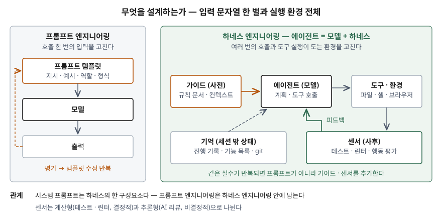

기출문제에서 프롬프트 엔지니어링과 하네스 엔지니어링의 비교를 묻는다. 둘 다 "모델을
원하는 대로 움직이게 하는 기술"이라서, 하네스를 "긴 프롬프트" 정도로 적기 쉽다. 점수는
**설계하는 대상이 어디까지인가** — 호출 한 번의 입력인가, 에이전트가 여러 번 호출하고
도구를 실행하는 환경 전체인가 — 를 짚는 데서 난다.

> 실행 검증 없음. 개념 문제이므로 문서 근거만으로 정리했다.
>
> **하네스 엔지니어링은 1차 자료 없음.** 용어를 정의한 표준이나 동료 심사를 거친 논문을
> 찾지 못해 독립된 2차 자료 3건(Anthropic 엔지니어링 블로그, 2025-11-26 / Thoughtworks
> Birgitta Böckeler의 martinfowler.com 글, 2026-04-02 / Google Developers Blog,
> 2026-09-09)을 교차 확인했다. 프롬프트 엔지니어링은 1차 자료(프롬프트 기법 서베이 논문
> The Prompt Report와 Anthropic 공식 문서)를 근거로 했다. (§10)

---

## Ⅰ. 정의

**프롬프트 엔지니어링** 은 The Prompt Report가 쓰는 정의로, **프롬프팅 기법을 바꿔 가며
프롬프트를 개발하는 반복 과정**이다. 같은 논문은 이 과정을 **3단계 반복** — 데이터셋에 대한
추론, 성능 평가, 프롬프트 템플릿 수정 — 으로 그린다.

**하네스 엔지니어링** 은 **모델을 뺀 에이전트의 나머지 전부(하네스) — 컨텍스트 공급,
도구, 검증 루프, 세션 밖 상태 — 를 설계해 에이전트가 믿을 수 있게 동작하도록 만드는
활동**이다. 정의가 정립되는 중이며 출처마다 강조점이 다르다.

| 출처 | 무엇을 중심에 두는가 |
|---|---|
| Thoughtworks (martinfowler.com) | **에이전트 = 모델 + 하네스.** 행동 전에 조종하는 가이드와 행동 뒤에 관측하는 센서 |
| Anthropic Engineering | 기억이 없는 세션이 이어지도록 **여러 컨텍스트 창에 걸쳐 작업을 잇는 구조** |
| Google Developers Blog | 모델이 바뀌어도 **에이전트 행동을 계속 검증하는 평가 기반** |

세 출처가 공통으로 드는 것은 **모델 바깥에 두는 장치**이고, 그 장치가 **사전 조종·사후
검증·상태 보존 3가지** 일을 한다는 점이다.

## Ⅱ. 비교

> **출처**: [The Prompt Report §1.2 Terminology, Figure 1.4](https://arxiv.org/abs/2406.06608) · [Böckeler, Harness engineering for coding agent users](https://martinfowler.com/articles/harness-engineering.html) · [Anthropic, Effective harnesses for long-running agents](https://www.anthropic.com/engineering/effective-harnesses-for-long-running-agents) — 하네스 쪽은 (2차 자료 기반)

| 항목 | 프롬프트 엔지니어링 | 하네스 엔지니어링 |
|---|---|---|
| 설계 대상 | 모델에 넣는 입력 문자열 (프롬프트 템플릿) | 모델을 둘러싼 실행 환경 전체 |
| 작업 단위 | 호출 한 번, 또는 몇 개를 잇는 프롬프트 체인 | 도구 실행이 수십 번 오가는 다회 세션 |
| 수단 | 지시 문구·예시·역할 부여·출력 형식·단계적 추론 유도 | 규칙 문서·도구 인터페이스·테스트·린터·진행 기록·권한 |
| 규칙이 지켜지는 방식 | 모델이 지시를 따르기를 기대한다 | 계산형 센서(테스트·린터)는 결정적으로 막는다 |
| 실패했을 때 | 프롬프트 문구를 고친다 | 같은 실수가 다시 나지 않도록 가이드나 센서를 추가한다 |
| 상태 | 대화 안(컨텍스트 창)에만 있다 | 진행 기록 파일·기능 목록·git 커밋으로 세션 밖에 둔다 |
| 평가 | 데이터셋 추론 → 평가 → 템플릿 수정 | 행동 단위 평가 + 종단 간 벤치마크 |

둘은 대체 관계가 아니다. Thoughtworks 글은 시스템 프롬프트를 에이전트에 내장된 하네스의
일부로 보고, Google 글도 시스템 프롬프트를 하네스 구성요소로 든다. **프롬프트 엔지니어링은
하네스 엔지니어링 안의 한 층으로 남는다.**

## Ⅲ. 고려사항

### 정보시스템 관점 — 4가지

- **결정적으로 검사할 수 있는 규칙은 검사로 옮긴다.** Thoughtworks 글은 센서를 계산형
  (테스트·린터·타입 검사 — 빠르고 결정적)과 추론형(AI 코드 리뷰 — 느리고 비결정적)으로
  나눈다. "코딩 규칙을 지켜라"를 프롬프트에 적는 것보다 린터가 막는 편이 확실하다.
- **상태를 컨텍스트 밖에 둔다.** Anthropic 글이 짚는 문제는 새 세션이 앞선 작업을 기억하지
  못한다는 것이다. 진행 기록 파일, 처음엔 전부 실패로 표시된 기능 목록(JSON), 설명이 붙은
  git 커밋으로 상태를 저장소에 남겨 다음 세션이 이어받게 한다.
- **모델 교체를 회귀 시험으로 다룬다.** Google 글은 종단 간 벤치마크 점수보다 단위 시험처럼
  잘게 나눈 **행동 평가**를 신뢰의 근거로 든다. 모델 버전이 바뀔 때마다 같은 평가를 돌려야
  하네스가 자산으로 남는다.
- **프롬프트로 풀 문제와 아닌 문제를 가른다.** Anthropic 공식 문서는 모든 실패가 프롬프트로
  풀리지는 않으며, 지연·비용은 모델을 바꾸는 편이 쉬울 수 있다고 적는다. 성공 기준과 평가
  방법이 먼저 있어야 한다는 점은 두 기법에 공통이다.

> 개념 정리: [하네스 엔지니어링 — 가이드·센서·세션 밖 상태로 에이전트를 통제하는 구조](../../emerging-tech/2026-09-28-harness-engineering-guides-sensors/index.md)
>
> 개념 정리: [컨텍스트 엔지니어링 — 추론 시점에 모델에 들어가는 토큰을 고르는 기술](../../emerging-tech/2026-09-29-context-engineering-token-curation/index.md)

끝

## 답안 작성 메모

- **먼저 쓸 것**: 두 정의를 한 줄씩, 그리고 "설계 대상이 입력 한 벌이냐 실행 환경 전체냐"라는
  기준 하나. 비교표의 나머지 항목은 이 기준에서 파생된다.
- **점수가 갈리는 지점**: 하네스를 "잘 쓴 긴 프롬프트"로 적으면 감점이다. **센서(테스트·린터)로
  결정적으로 막는다**와 **상태를 세션 밖에 둔다** 두 가지가 들어가야 차이가 드러난다.
  마지막에 "대체가 아니라 포함 관계"를 한 줄 넣으면 두 개념을 이어서 이해했다는 것을 보여준다.
- **시간이 모자라면**: 출처별 정의 표를 버리고 "정의가 정립되는 중" 한 문장만 남긴다.
  도식과 비교표는 버리지 않는다.
- 하네스 개선 사례에 붙는 "코드 n줄을 사람이 한 줄도 안 썼다" 같은 수치는 기업 발표라
  싣지 않았다. OpenAI의 하네스 엔지니어링 글(2026-02)은 이 용어를 널리 알린 글로 자주
  인용되지만 본문을 받아 볼 수 없어 근거로 세지 않았다.
- 컨텍스트 엔지니어링과의 관계는 출처마다 다르다. Anthropic은 컨텍스트 엔지니어링을
  프롬프트 엔지니어링이 발전한 형태로 보고, Thoughtworks는 하네스 엔지니어링을 컨텍스트
  엔지니어링의 특수한 형태로 본다. 세 개념을 묻는 문제가 나오면 이 차이를 적는다.

## 참고 자료

- [Schulhoff et al., The Prompt Report: A Systematic Survey of Prompt Engineering Techniques, arXiv:2406.06608v6 (2025-02)](https://arxiv.org/abs/2406.06608)
- [Anthropic, Prompt engineering overview — Claude Docs](https://platform.claude.com/docs/en/build-with-claude/prompt-engineering/overview)
- [Anthropic Engineering, Effective context engineering for AI agents (2025-09-29)](https://www.anthropic.com/engineering/effective-context-engineering-for-ai-agents)
- 2차 자료 (하네스 엔지니어링 정의 교차 확인)
  - [Anthropic Engineering, Justin Young, "Effective harnesses for long-running agents"](https://www.anthropic.com/engineering/effective-harnesses-for-long-running-agents) — 2025-11-26
  - [Birgitta Böckeler (Thoughtworks), "Harness engineering for coding agent users", martinfowler.com](https://martinfowler.com/articles/harness-engineering.html) — 2026-04-02
  - [Google Developers Blog, Taylor Mullen · Christian Gunderman, "The Anatomy of Harness Engineering"](https://developers.googleblog.com/the-anatomy-of-harness-engineering-how-to-evaluate-iterate-and-guard-ai-coding-agents/) — 2026-09-09
