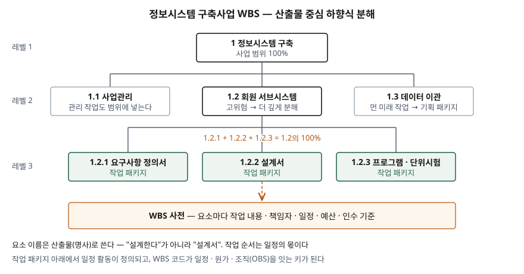

기출문제에서 WBS를 어떻게 작성하는지 묻는다. WBS를 안다는 사람은 많지만 답안에는 트리
하나 그리고 "업무를 잘게 나눈 것"으로 끝나는 경우가 많다. 점수는 **작성 규칙** — 100% 규칙,
산출물 중심 분해, 작업 패키지에서 멈추는 기준, WBS 사전 — 을 개수와 함께 적는 데서 난다.

> 실행 검증 없음. 개념 문제이므로 표준·공공기관 문서 근거만으로 정리했다.

---

## Ⅰ. 정의

**WBS(Work Breakdown Structure, 작업 분할 구조)** 는 ISO 21511:2018의 정의로, **프로젝트나
프로그램의 정의된 범위를 점점 낮은 수준의 작업 요소로 분해한 구조**다. NASA WBS Handbook은
여기에 **산출물 중심(product-oriented)** 이라는 조건을 붙여, 만들어야 할 하드웨어·소프트웨어·
서비스를 계층으로 나누고 각 작업 요소를 최종 산출물과 잇는 구조로 정의한다.

WBS는 **무엇을 만드는가(범위)** 를 정의한다. **어떻게·언제 하는가(활동·순서)** 는 WBS가 아니라
일정의 몫이다 (ISO 21511 작성 특성 e항).

## Ⅱ. 작성 방법

> **출처**: [ISO 21511:2018 §3.1 100 % rule, §5.1 Characteristics, §5.2.2 Creation](https://www.iso.org/standard/69702.html) · [NASA WBS Handbook REV1 §3.4.3 Element Tree Diagrams, Appendix B Glossary](https://ntrs.nasa.gov/api/citations/20160014629/downloads/20160014629.pdf)

### 가. 작성 접근 — 3가지 (ISO 21511 작성 절 5.2.2)

| 접근 | 방법 | 맞는 경우 |
|---|---|---|
| ① 하향식 | 최종 산출물을 먼저 정하고 관리 가능한 단위까지 차례로 나눈다 | 신규 사업, 범위가 요구사항으로 정해진 경우 |
| ② 상향식 | 범위 요소를 먼저 뽑고 묶고 분류해 계층으로 올린다 | 유사 사업 경험이 적어 작업을 먼저 모아야 하는 경우 |
| ③ 혼합 | 상위는 하향식, 하위는 상향식으로 채운다 | 대부분의 정보시스템 구축사업 |

유사 사업의 이전 WBS는 새 사업의 범위를 식별하는 템플릿으로 쓸 수 있다.

### 나. 분해 절차 — 5단계 (PMBOK 6판 WBS 작성 프로세스의 분해 기법)

- ① **산출물과 관련 작업 식별·분석** — 승인된 요구사항과 범위 기술서에서 뽑는다
- ② **WBS 구조 결정** — 1레벨을 무엇으로 나눌지 정한다. ISO 21511은 제품·산출물·결과
  중심 외에 단계·분야·위치 기준도 허용한다. 정보시스템 사업이면 서브시스템(산출물) 또는
  분석·설계·구현·시험(단계)이다
- ③ **상위 요소를 하위 구성요소로 분해** — 작업 패키지 수준까지
- ④ **식별 코드 부여** — 요소마다 고유 식별자. NASA는 레벨마다 두 자리 번호를 마침표로 잇는다
- ⑤ **분해 수준 검증** — 너무 얕아 통제가 안 되거나, 너무 깊어 관리 비용이 커지지 않았는지

### 다. 작성 규칙 — 7가지 (ISO 21511 특성 5.1 · 요소 기술 5.2.3)

| 규칙 | 내용 |
|---|---|
| ① 100% 규칙 | 하위 요소의 합이 상위 요소 작업의 **100%**. 사업관리 작업도 범위에 넣는다 |
| ② 자식 수 | 상위 요소는 자식이 **0개 또는 2개 이상** — 1개로만 나누면 분해가 아니다 |
| ③ 중복 금지 | 하나의 산출물은 **한 요소에만** 나타난다 |
| ④ 고유 식별자 | 요소마다 코드를 붙인다 — 일정·원가·조직을 잇는 키 |
| ⑤ 단일 책임 | 요소마다 책임자(사람·조직) 하나를 지정할 수 있어야 한다 |
| ⑥ 명사형 | 요소는 산출물로 쓴다 — WBS는 작업 구조를 정의하지 수행 과정을 정의하지 않는다 |
| ⑦ 가변 깊이 | 모든 가지를 같은 깊이로 나눌 필요 없다. **고비용·고위험·고가시성** 요소는 더 깊게 |

### 라. 멈추는 수준 — 작업 패키지

분해는 **작업 패키지(Work Package)** 에서 멈춘다. NASA WBS Handbook은 작업 패키지의
특성을 **7가지** 로 든다 — 실제 작업이 수행되는 수준, 다른 패키지와 구분됨, 단일 조직
배정, 시작·완료 일정, 예산(금액·공수), 짧은 기간 또는 측정 가능한 마일스톤, 상세 일정과의
통합. 이 조건이 갖춰지면 더 나누지 않는다.

먼 미래 작업은 지금 작업 패키지로 나누지 않고 **기획 패키지(Planning Package)** 로 요약해
둔다. 가까운 작업만 상세화하고 나머지는 시기가 오면 나누는 **연동 기획(rolling wave
planning)** 이다.

### 마. 산출물 — 3가지

- ① **WBS** — 트리·개요·표 형식 (ISO 21511이 드는 흔한 형식 3가지)
- ② **WBS 사전** — 요소마다 작업 내용을 기술한 문서. 책임자, 일정, 예산, 인수 기준을 적는다
- ③ **범위 기준선** — 승인된 범위 기술서 + WBS + WBS 사전. 이후 변경은 공식 변경 통제를 거친다 (PMBOK)

## Ⅲ. 활용 / 고려사항

- **WBS 코드가 관리정보시스템의 키다.** NASA는 기술 WBS와 회계 WBS를 똑같이 맞추게 해
  WBS 번호가 곧 원가 집계 코드가 된다. WBS 요소와 조직 분해 구조(OBS)가 만나는 자리가
  **통제 계정(Control Account)** 이고, 획득가치관리(EVM)의 성과 측정이 이 단위에서 된다.
  1레벨을 잘못 나누면 원가·성과 데이터가 자동으로 집계되지 않는다.
- **범위가 확정되지 않은 사업은 아는 만큼만 100%.** ISO 21511은 애자일·연동 기획을 쓰는
  사업이면 WBS가 **작성 시점에 알려진 범위의 100%** 를 나타낸다고 본다. 반복마다 드러난
  범위를 부모–자식 관계를 유지하며 추가한다.
- **활동 목록과 섞지 않는다.** "요구사항 분석하기"처럼 동사로 쓰면 일정 활동과 구분되지 않고
  중복·누락 검사가 안 된다. 요소는 산출물, 순서·기간은 일정에서 다룬다.
- **이해관계자 합의로 만든다.** ISO 21511은 WBS를 사업 팀과 이해관계자가 합의한 분해로 보고,
  변경할 때마다 수행 조직과 함께 검토하게 한다. 발주자와 수행사 간 범위 분쟁의 기준 문서가 된다.

끝

## 답안 작성 메모

- **먼저 쓸 것**: 정의 한 줄, 트리 도식(코드 번호와 작업 패키지 표시), 그리고 **100% 규칙**.
  이 셋이 없으면 WBS 답안이 아니다.
- **점수가 갈리는 지점**: 작성 규칙을 개수와 함께 적는지(7가지), 작업 패키지에서 멈추는
  기준을 적는지, **WBS 사전·범위 기준선**까지 가는지. 트리만 그리고 끝내는 답안과 여기서
  갈린다. "명사형으로 쓴다"는 한 줄이 WBS와 활동 목록을 구분할 줄 안다는 표시다.
- **시간이 모자라면**: 작성 접근 표(가)를 한 줄("하향식·상향식·혼합 3가지")로 줄인다.
  작성 규칙 표와 도식은 버리지 않는다.
- IT 답안으로 만드는 곳은 Ⅲ의 첫 항목이다. WBS 코드가 일정·원가·조직 데이터를 잇는
  키라는 점 — 사업관리 정보시스템이 WBS 위에서 돈다는 것 — 을 적어야 경영 일반론이 아니라
  정보관리 답안이 된다.
- 흔히 인용되는 "8/80 규칙"(작업 패키지는 8~80시간)은 이번에 확인한 1차 자료(ISO 21511,
  NASA Handbook)에 없어 싣지 않았다.

## 참고 자료

- [ISO 21511:2018 Work breakdown structures for project and programme management](https://www.iso.org/standard/69702.html) — 용어 정의(§3), 개념(§4), 특성·작성(§5.1~5.2)
- [NASA/SP-2016-3404/REV1, NASA Work Breakdown Structure (WBS) Handbook (2018-01)](https://ntrs.nasa.gov/api/citations/20160014629/downloads/20160014629.pdf) — §3.4 코드·트리, §4.4 Cost Management, Appendix B Glossary
- PMI, A Guide to the Project Management Body of Knowledge (PMBOK Guide) 6th Edition (2017) — §5.4 Create WBS
