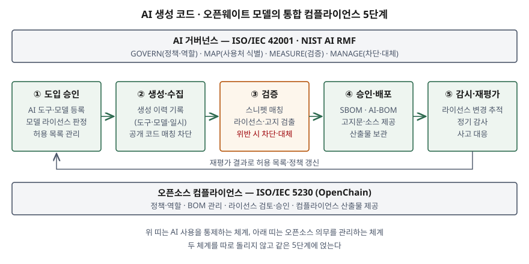

기출문제에서 AI가 생성한 소스코드와 오픈웨이트 모델을 쓸 때의 오픈소스 라이선스 위험과
대응을 세 갈래로 묻는다. 어떤 의무가 따라오고 무엇이 위험한지, 무엇을 점검하는지,
AI 거버넌스 안에서 어떤 프로세스와 도구로 검증하는지다.
"GPL 코드가 섞일 수 있으니 조심한다" 수준에서 멈추면 평이한 답안이 된다. 점수는
**위험이 들어오는 경로가 코드와 모델 두 갈래**라는 것을 먼저 세우고, 점검항목을
**국제표준(ISO/IEC 5230)의 틀에 개수로** 얹고, 프로세스를 **AI 거버넌스와 오픈소스
컴플라이언스가 하나의 흐름을 공유하는 구조**로 그리는 데서 난다.

> 실행 검증 없음. 개념 문제이므로 표준 문서, 라이선스 원문, 미국 저작권청 보고서,
> 동료 심사 전 논문(arXiv), 도구 공식 문서를 근거로 정리했다. 법률 해석은 관할마다 다르므로
> 답안은 **정보시스템이 무엇을 기록·검증해야 하는가**에 초점을 둔다.

---

## Ⅰ. 개요

### 가. 위험이 들어오는 두 경로

AI 도입 이전에 오픈소스는 **사람이 고른 패키지 단위로** 들어왔다. 패키지에는 라이선스
파일이 붙어 있어 무엇을 가져왔는지와 어떤 의무가 따르는지가 함께 보였다. AI가 개입하면
경로가 둘로 늘어난다.

- **AI 생성 코드** — 모델이 학습한 공개 코드가 **출처 표시 없이 조각 단위로** 제안된다.
  14개 LLM을 평가한 LiCoEval 연구는 생성 코드의 0.88~2.01%가 기존 오픈소스 구현과
  뚜렷하게 유사했고, 대부분의 모델이 **특히 카피레프트 코드의 라이선스 정보를 정확히
  제시하지 못했다**고 보고한다
- **오픈웨이트 모델** — 가중치는 공개되지만 라이선스는 OSI 승인 라이선스가 아닌
  **제공자 고유 라이선스**인 경우가 많다. 사용 목적 제한, 이용자 규모 조건, 명명·표시 의무가
  붙는다

### 나. 기존 오픈소스 관리와 무엇이 다른가

| 구분 | 기존 오픈소스 도입 | AI 생성 코드 | 오픈웨이트 모델 |
|---|---|---|---|
| 들어오는 단위 | 패키지·라이브러리 | 함수·스니펫 조각 | 가중치 파일 + 모델 카드 |
| 라이선스 식별 근거 | 패키지 메타데이터·LICENSE 파일 | **없다** — 스캔으로 역추적 | 제공자 라이선스 문서 |
| 출처 추적 | 저장소·버전 | 원 저장소를 모른다 | 기반 모델 → 파생 모델 계보 |
| 의무의 형태 | 고지·소스 공개·동일 라이선스 | 원 코드의 의무가 그대로 따라온다 | 사용 제한·규모 조건·명명 의무 |
| 권리 귀속 | 원 저작자 | **불확실** — 사람의 기여에 따라 갈린다 | 제공자 |

## Ⅱ. AI 생성 코드 활용 시 주요 오픈소스 라이선스 의무사항 및 위험

### 가. 주요 라이선스 의무사항 — 6종

AI가 만든 코드라도 **원 코드가 섞여 있으면 원 코드의 라이선스 의무가 그대로 적용된다.**
따라서 의무는 AI 도구의 약관이 아니라 섞여 들어온 코드와 모델의 라이선스로 판단한다.

| 유형 | 라이선스 | 핵심 의무 | 의무가 생기는 시점 |
|---|---|---|---|
| ① 허용형 | MIT · BSD | 저작권 고지와 허가 문구 유지 | 배포 |
| ② 허용형(특허) | Apache-2.0 | 라이선스 사본 제공, 변경 파일 표시, NOTICE 파일 유지. 특허 소송을 걸면 특허 허락이 끝난다 | 배포 |
| ③ 강한 카피레프트 | GPL-3.0 | 결합 저작물 전체를 같은 라이선스로, 소스 제공 | 배포 |
| ④ 네트워크 카피레프트 | AGPL-3.0 | ③에 더해 **네트워크로 서비스만 제공해도** 수정본 소스를 제공 | 서비스 제공 |
| ⑤ 모델 고유 라이선스 | Llama 3.1 Community License | 재배포 시 계약 사본 제공, "Built with Llama" 표시, 파생 모델 이름 앞에 "Llama", NOTICE 문구 유지, 허용 사용 정책(AUP) 준수. 월간 활성 이용자 **7억 명 초과**면 별도 허락 | 재배포·서비스 |
| ⑥ 사용 제한 라이선스 | OpenRAIL-M 계열 | 금지 용도(Attachment A) 준수, 파생물 배포 시 **같은 사용 제한을 계약에 강제 조항으로 넣어** 넘긴다 | 사용·재배포 |

④가 특히 중요하다. SaaS로만 운영해 배포가 없으니 GPL 의무가 없다고 판단한 시스템도,
섞인 코드가 AGPL이면 서비스 제공만으로 소스 제공 의무가 생긴다.

### 나. 위험 — 5가지

| 위험 | 내용 | 근거 |
|---|---|---|
| ① 카피레프트 전파 | 생성 코드에 GPL·AGPL 조각이 섞이면 그 코드와 결합된 자사 코드까지 공개 의무 대상이 될 수 있다 | GPL-3.0, AGPL-3.0 원문 |
| ② 고지 누락 | 허용형이라도 저작권 고지 없이 들어오면 위반이다. 모델이 출처를 알려 주지 않으므로 고지할 대상을 모른다 | LiCoEval |
| ③ 권리 귀속 불확실 | 미국 저작권청은 **프롬프트만으로는** 이용자가 결과물의 저작자가 되기에 충분한 통제를 하지 못한다고 결론냈다. 사람이 표현 요소를 정하거나 수정·배열한 부분은 보호될 수 있다 | U.S. Copyright Office Part 2 |
| ④ 오픈웨이트 오인 | "가중치 공개"를 "오픈소스"로 읽고 사용 제한·규모 조건·명명 의무를 놓친다. 파인튜닝한 파생 모델에도 의무가 이어진다 | OSI OSAID 1.0, Llama 3.1 라이선스 |
| ⑤ 학습 데이터 출처 불투명 | 모델이 무엇으로 학습됐는지 모르면 위 위험을 사전에 가늠할 수 없다. EU AI 법은 범용 AI 모델 제공자에게 저작권 준수 정책과 학습 데이터 요약 공개를 요구한다 | EU AI Act 제53조 |

③은 두 방향으로 작동한다. 자사 제품의 AI 생성 부분에 **저작권을 주장하기 어려워지고**,
그 부분에 자사가 원하는 라이선스를 붙일 근거도 약해진다. 그래서 어느 코드를 사람이 쓰고
어느 코드를 AI가 제안했는지 **생성 이력을 남기는 것**이 법적 판단의 전제 자료가 된다.

④에서 OSI의 오픈소스 AI 정의 1.0(OSAID)은 사용·연구·수정·공유 **4가지 자유**를 요구하고,
그 자유를 행사하려면 **데이터 정보·코드·파라미터 3가지**를 모두 OSI 승인 조건으로 내놓아야
한다고 본다. 가중치만 공개하고 용도를 제한하면 이 정의에 맞지 않는다. 답안에는
**"오픈웨이트 ≠ 오픈소스"** 를 한 줄로 쓴다.

## Ⅲ. 오픈소스 라이선스 위험에 대한 컴플라이언스 주요 점검항목

ISO/IEC 5230(OpenChain)은 오픈소스 라이선스 컴플라이언스 프로그램이 갖출 요구를
**6개 영역**으로 둔다 — 프로그램 기반, 업무 정의와 지원, 오픈소스 콘텐츠 검토·승인,
컴플라이언스 산출물 생성·제공, 커뮤니티 참여 이해, 요구 준수. 이 뼈대를 그대로 쓰고
각 영역에 AI 항목을 더해 **4개 영역 12가지**로 점검한다.

| 영역 (ISO/IEC 5230 대응) | 점검항목 | AI로 인해 달라지는 점 |
|---|---|---|
| **가. 정책·조직** (프로그램 기반, 업무 정의와 지원) | ① 오픈소스 정책이 AI 코딩 도구와 외부 모델을 적용 범위에 넣었는가 | 정책 범위(§3.1.4)에 AI 유입 경로가 빠지기 쉽다 |
| | ② 허용 AI 도구·모델 목록과 승인 절차가 있는가 | 개발자가 개인 계정 도구를 쓰면 통제 밖이다 |
| | ③ 라이선스 판단 담당과 교육이 있는가 | 모델 고유 라이선스를 해석할 역량이 필요하다 |
| **나. 코드 검토** (콘텐츠 검토·승인) | ④ AI 생성 코드에 생성 이력(도구·모델·일시)이 남는가 | 권리 귀속 판단과 사후 역추적의 근거 |
| | ⑤ 공개 코드와 일치하는 제안을 차단·표시하도록 도구를 설정했는가 | 생성 시점의 1차 방어 |
| | ⑥ 병합 전에 스니펫 수준 스캔을 하는가 | 패키지 스캔은 조각을 잡지 못한다 |
| | ⑦ 검출된 라이선스와 자사 배포 방식(배포·SaaS)의 호환성을 판정하는가 | AGPL은 SaaS에서도 의무가 생긴다 |
| **다. 모델 검토** (콘텐츠 검토·승인) | ⑧ 모델 라이선스가 OSI 승인인지 고유 라이선스인지 식별했는가 | 오픈웨이트 오인 방지 |
| | ⑨ 사용 제한(AUP·금지 용도)과 규모 조건이 자사 용도와 충돌하지 않는가 | 서비스 확장 시 조건 재확인 |
| | ⑩ 파생 모델의 명명·표시 의무와 사용 제한 승계를 반영했는가 | 파인튜닝 결과물 배포 시 |
| **라. 산출물·감사** (산출물 생성·제공, 요구 준수) | ⑪ BOM에 AI 생성 코드와 모델·데이터셋을 함께 기록하는가 | BOM 관리 요구(§3.3.1)를 AI-BOM으로 넓힌다 |
| | ⑫ 고지문·소스 제공물을 만들어 보관하고 정기 재점검하는가 | 모델 라이선스가 판마다 바뀐다 |

ISO/IEC 5230의 라이선스 컴플라이언스 요구(§3.3.2)는 바이너리 배포, 소스 배포, 수정본,
**라이선스 비호환**, 저작자 표시 요구를 다루는 절차를 요구한다. ⑦과 ⑫가 이 요구에 대응한다.

## Ⅳ. AI 거버넌스 관점의 통합 컴플라이언스 프로세스 및 기술적 검증 도구

### 가. 통합 컴플라이언스 프로세스 — 5단계

AI 사용 통제(ISO/IEC 42001, NIST AI RMF)와 오픈소스 의무 관리(ISO/IEC 5230)를 따로
운영하면 같은 코드를 두 번 심사하거나 한쪽이 놓친다. 두 체계를 **같은 5단계에 얹는다.**

> **출처**: [ISO/IEC 5230:2020 (OpenChain Specification 2.1) §3 Requirements](https://github.com/OpenChain-Project/License-Compliance-Specification/blob/master/Official/en/2.1/openchainspec-2.1.md) · [NIST AI RMF 1.0 §5 Core (GOVERN·MAP·MEASURE·MANAGE)](https://www.nist.gov/itl/ai-risk-management-framework) · [ISO/IEC 42001:2023](https://www.iso.org/standard/42001) — 5단계 구분은 두 체계를 합쳐 답안용으로 정리한 것이다

| 단계 | 하는 일 | AI RMF 기능 | ISO/IEC 5230 대응 |
|---|---|---|---|
| ① 도입 승인 | AI 도구·모델을 등록하고 모델 라이선스를 판정해 허용 목록에 올린다 | GOVERN · MAP | 정책, 업무 정의 |
| ② 생성·수집 | 도구의 공개 코드 매칭 차단을 켜고, 생성 이력을 커밋 메타데이터로 남긴다 | MAP | — |
| ③ 검증 | CI에서 스니펫 매칭·라이선스 검출을 돌리고, 정책 규칙으로 위반을 판정한다. 위반이면 병합을 막고 대체 구현을 요구한다 | MEASURE · MANAGE | 콘텐츠 검토·승인 |
| ④ 승인·배포 | SBOM·AI-BOM을 만들고 고지문·소스 제공물을 배포물에 넣는다 | MANAGE | 산출물 생성·제공 |
| ⑤ 감시·재평가 | 모델 라이선스 개정·이용자 규모 변화를 추적하고 정기 감사한다. 결과로 ①의 허용 목록을 고친다 | GOVERN · MANAGE | 요구 준수 |

⑤가 ①로 되돌아가므로 **일회성 심사가 아니라 순환**이다. ISO/IEC 42001이 요구하는 경영시스템의
지속적 개선이 이 되돌림에 해당한다.

### 나. 기술적 검증 도구 — 단계별 5종

| 단계 | 도구 | 하는 일 |
|---|---|---|
| ② 생성 시점 | AI 코딩 도구의 공개 코드 매칭 기능 (예: GitHub Copilot code referencing) | 제안 코드와 주변 약 150자를 공개 저장소 색인과 비교해, 일치하면 원 파일 URL과 라이선스를 보여 주거나 제안을 막는다 |
| ③ 스니펫 매칭 | SCANOSS | 파일·패키지 단위로 일치하지 않을 때 **코드 조각의 해시**를 지식베이스와 비교해 출처를 찾는다 |
| ③ 라이선스·저작권 검출 | ScanCode Toolkit | 라이선스 원문 데이터베이스와 전체 비교해 라이선스·저작권 문구를 찾고, SPDX·CycloneDX로 내보낸다 |
| ③ 파이프라인·정책 판정 | OSS Review Toolkit (ORT) | 의존성 분석 → 소스 수집 → 스캔 → 취약점 조회 → **정책 규칙 평가** → 고지문·BOM 보고를 한 흐름으로 돌린다 |
| ④ BOM 형식 | SPDX 3.0 AI·Dataset 프로필, CycloneDX ML-BOM (ECMA-424) | 모델을 패키지처럼 기술한다. SPDX의 AI 패키지는 선언 라이선스와 판정 라이선스를 반드시 하나씩 가진다 |

### 다. 도구의 한계와 보완 — 3가지

- **색인 밖은 못 잡는다.** Copilot 문서는 색인이 몇 달마다 갱신되고 GitHub 공개 저장소만
  대상이라고 밝힌다. 최신 코드나 다른 호스팅의 코드는 걸리지 않으므로 ③의 독립 스캔을 겹친다
- **짧거나 변형된 조각은 판정이 흔들린다.** 스니펫 매칭은 최소 일치 줄 수 같은 문턱값에
  기대므로, 문턱값을 정책으로 정하고 경계 사례는 사람이 판정한다
- **모델 라이선스는 문서 판독이 필요하다.** 사용 제한·규모 조건은 스캐너가 판단하지 못한다.
  ①에서 담당자가 판정한 결과를 AI-BOM에 기록해 두고 ⑤에서 개정 여부를 다시 본다

## Ⅴ. 결론

AI는 오픈소스가 들어오는 단위를 패키지에서 **조각과 가중치**로 바꿨다. 조각은 라이선스
표시 없이 들어오고, 가중치는 오픈소스가 아닌 고유 라이선스를 달고 온다. 따라서 대응은
새 제도를 만드는 일이 아니라 **기존 오픈소스 컴플라이언스(ISO/IEC 5230)의 적용 범위를 AI
유입 경로까지 넓히고, 그것을 AI 거버넌스(ISO/IEC 42001, NIST AI RMF)의 순환 안에 넣는 일**이다.
정보시스템 쪽에서는 생성 이력 기록, CI의 스니펫 스캔과 정책 판정, 모델까지 담는 AI-BOM
세 가지가 갖춰져야 이 프로세스가 문서에 머물지 않고 실제로 수행된다.

끝

## 답안 작성 메모

- **먼저 쓸 것**: Ⅰ-나의 비교표(기존 / AI 생성 코드 / 오픈웨이트)와 Ⅳ의 5단계 모식도.
  "위험이 두 경로로 들어온다"가 서면 (가)(나)(다)가 모두 그 두 경로를 따라 전개된다.
- **점수가 갈리는 지점**:
  - (가)에서 **AGPL의 네트워크 조항**과 **"오픈웨이트 ≠ 오픈소스"** 를 쓰는지. 둘 다
    실무에서 가장 자주 놓치는 판단이다
  - (나)를 체크리스트 나열로 끝내지 않고 **ISO/IEC 5230의 영역에 얹어** 쓰는지.
    표준 이름이 붙으면 점검항목이 임의 목록이 아니라는 근거가 된다
  - (다)를 도구 이름 나열로 끝내지 않고 **어느 단계에서 무엇을 잡는지**와 한계까지 쓰는지
- **시간이 모자라면**: Ⅱ-가의 의무 표에서 ①② 허용형을 한 줄로 합치고, Ⅳ-다의 한계를
  한 문장으로 줄인다. 모식도와 Ⅰ-나 비교표는 버리지 않는다. 모식도는 박스 5개와 위아래
  띠 2개만 그리면 3분 안에 된다.
- 저작권 귀속은 나라마다 판단이 다르다. 답안에서는 미국 저작권청 보고서를 **예로** 들고,
  결론은 "생성 이력을 남겨 판단 근거를 확보한다"는 시스템 쪽 대책으로 맺는다.
- AI 생성 코드의 유사 비율(0.88~2.01%)은 LiCoEval 논문의 실험 조건에서 나온 값이다.
  쓴다면 출처와 함께 쓰고, 일반화하지 않는다.

## 참고 자료

- [ISO/IEC 5230:2020 — OpenChain Specification (2.1)](https://github.com/OpenChain-Project/License-Compliance-Specification/blob/master/Official/en/2.1/openchainspec-2.1.md) · [OpenChain License Compliance](https://www.openchainproject.org/license-compliance)
- [ISO/IEC 42001:2023 — Artificial intelligence management system](https://www.iso.org/standard/42001)
- [NIST AI Risk Management Framework (AI RMF 1.0), 2023-01](https://www.nist.gov/itl/ai-risk-management-framework)
- [NIST SP 800-218A, Secure Software Development Practices for Generative AI and Dual-Use Foundation Models (2024-07)](https://csrc.nist.gov/pubs/sp/800/218/a/final)
- [U.S. Copyright Office, Copyright and Artificial Intelligence Part 2: Copyrightability (2025-01)](https://www.copyright.gov/ai/Copyright-and-Artificial-Intelligence-Part-2-Copyrightability-Report.pdf)
- [OSI, The Open Source AI Definition 1.0 (2024-10)](https://opensource.org/ai/open-source-ai-definition)
- [Llama 3.1 Community License Agreement (2024-07-23)](https://github.com/meta-llama/llama-models/blob/main/models/llama3_1/LICENSE)
- [CreativeML Open RAIL-M License (2022-08-22)](https://huggingface.co/spaces/CompVis/stable-diffusion-license/blob/main/license.txt)
- [GNU General Public License v3.0](https://www.gnu.org/licenses/gpl-3.0.html) · [GNU Affero General Public License v3.0](https://www.gnu.org/licenses/agpl-3.0.html) · [Apache License 2.0](https://www.apache.org/licenses/LICENSE-2.0)
- [EU AI Act, Article 53 — Obligations for Providers of General-Purpose AI Models](https://artificialintelligenceact.eu/article/53/)
- [Xu, Gao, He, Zhou, LiCoEval: Evaluating LLMs on License Compliance in Code Generation, arXiv:2408.02487 (2024-08, 개정 2025-02)](https://arxiv.org/abs/2408.02487) — 동료 심사 전 사전 공개본
- [GitHub Docs — GitHub Copilot code referencing](https://docs.github.com/en/copilot/concepts/completions/code-referencing)
- [SPDX 3.0.1 — AI Profile](https://spdx.github.io/spdx-spec/v3.0.1/model/AI/AI/)
- [CycloneDX ML-BOM (ECMA-424)](https://cyclonedx.org/capabilities/mlbom/)
- [ScanCode Toolkit](https://github.com/aboutcode-org/scancode-toolkit) · [SCANOSS Engine](https://github.com/scanoss/engine) · [OSS Review Toolkit](https://github.com/oss-review-toolkit/ort)
