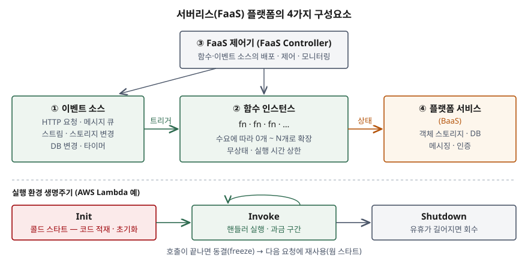

기출문제에서 서버리스 컴퓨팅을 세 갈래로 나눠 묻는다. 정의와 특징, 구성요소와 장단점,
도입할 때 고려할 점이다. "서버 관리가 필요 없는 클라우드" 한 줄과 장단점 나열로 끝내면
평이한 답안이 된다. 점수는 **정의를 출처별로 세우고**, 구성요소를 **개수로** 쓰고,
고려사항을 "어떤 워크로드를 올리고 무엇을 밖으로 빼는가"라는 **시스템 설계 판단**으로
내려가는 데서 난다.

> 실행 검증 없음. 개념 문제이므로 CNCF 백서, 버클리 논문, AWS 공식 문서 근거만으로 정리했다.

---

## Ⅰ. 개요

### 가. 등장 배경

클라우드가 서버를 빌려주기 시작한 뒤에도 사용자는 여전히 서버를 **운영**해야 했다.
버클리 논문은 가상 머신 위에 서비스를 올릴 때 사용자가 직접 해결해야 하는 일을
**8가지**로 든다. 가용성을 위한 중복, 지역 분산, 부하 분산, 자동 확장, 모니터링, 로깅,
보안 패치를 포함한 업그레이드, 새 인스턴스로의 이전이다.

서버리스는 이 8가지를 클라우드 제공자에게 넘기고, 사용자는 **함수와 그 함수를 깨울
이벤트**만 정하는 모델이다. 과금 단위도 "할당한 서버"에서 "실행한 시간"으로 바뀐다.

### 나. 서비스 모델에서의 위치

CNCF 백서는 클라우드 네이티브 배포 모델을 셋으로 나누고, 서버리스를 **인프라에서 가장
멀리 추상화된 모델**로 둔다. 버클리 논문은 서버리스와 기존 방식을 연속선의 양 끝으로
보고, 쿠버네티스 같은 컨테이너 오케스트레이션을 그 중간에 놓는다.

## Ⅱ. 서버리스 컴퓨팅의 정의 및 특징

### 가. 정의 — 출처 2가지

| 출처 | 정의 |
|---|---|
| CNCF 백서 v1.0 | **서버 관리가 필요 없는** 애플리케이션을 만들고 실행하는 개념. 함수 단위로 올린 코드가 그 순간의 수요에 맞춰 실행·확장·과금된다 |
| 버클리 논문 | **서버리스 = FaaS + BaaS.** 명시적 프로비저닝 없이 자동으로 확장되고 사용량으로 과금되어야 서버리스로 본다 |

- **FaaS(Function as a Service)**: 이벤트나 HTTP 요청으로 호출되는 코드 단위를 올리면
  플랫폼이 실행·확장한다
- **BaaS(Backend as a Service)**: 애플리케이션 기능의 일부를 대신하는 서드파티 API 서비스.
  객체 스토리지, 데이터베이스, 메시징, 인증이 여기 든다

CNCF는 **운영 모델**(서버 관리 없음)로, 버클리는 **구성**(FaaS + BaaS)과 **판정 조건**
(자동 확장 + 사용량 과금)으로 정의한다. 답안에는 둘을 함께 쓴다.

### 나. 특징 — 5가지

버클리 논문이 드는 서버 기반 방식과의 **결정적 차이 3가지**(①②③)에 CNCF 백서의
설명(④⑤)을 더한다.

| 특징 | 내용 |
|---|---|
| ① 계산과 저장의 분리 | 계산과 저장이 따로 확장·과금된다. 저장은 별도 서비스가 맡고 **계산은 무상태**다 |
| ② 자원 할당 없는 실행 | 자원을 요청하지 않고 코드를 올리면 클라우드가 실행 자원을 자동 할당한다 |
| ③ 사용량 비례 과금 | VM 크기·개수가 아니라 **실행 시간** 같은 실행 차원으로 과금된다. 유휴 시 비용 없음 |
| ④ 이벤트 구동 | HTTP 요청, 큐 메시지, 스트림 레코드, 스토리지·DB 변경이 함수를 깨운다 |
| ⑤ 단기 실행 · 짧은 수명 | 함수는 무상태이고 수명이 짧다. AWS Lambda 표준 함수는 최대 15분까지 실행된다 |

### 다. 다른 배포 모델과의 비교

| 구분 | IaaS | 컨테이너 오케스트레이션 | PaaS | 서버리스(FaaS) |
|---|---|---|---|---|
| 사용자가 관리 | OS·런타임·확장 전부 | 컨테이너 이미지·클러스터 설정 | 애플리케이션 | **함수 코드와 이벤트 연결** |
| 확장 | 사용자가 설계 | 오케스트레이터 규칙 | 플랫폼 | 요청 단위로 자동, **0까지 축소** |
| 과금 기준 | 할당한 인스턴스·시간 | 할당한 노드 | 할당한 인스턴스 | **실행한 시간·횟수** |
| 상태 | 어디든 둘 수 있다 | 볼륨으로 유지 | 대체로 외부 | **외부 저장소에만** |
| 맞는 워크로드 | 제어가 필요한 전부 | 이식성·고성능 마이크로서비스 | 전형적 HTTP 서비스 | **이벤트 구동, 예측 어려운 부하** |

> 비교 축과 "맞는 워크로드" 칸은 CNCF 백서의 배포 모델 비교(Which Cloud Native Deployment
> Model Should You Use?)와 버클리 논문 Table 2를 합쳐 정리했다.

## Ⅲ. 서버리스 컴퓨팅의 구성요소 및 장단점

### 가. 구성요소 — FaaS 플랫폼 4가지

> **출처**: [CNCF Serverless Whitepaper v1.0 — Detail View: Serverless Processing Model](https://github.com/cncf/wg-serverless/blob/master/whitepapers/serverless-overview/README.md) · [AWS Lambda Developer Guide — Understanding the Lambda execution environment lifecycle](https://docs.aws.amazon.com/lambda/latest/dg/lambda-runtime-environment.html) — 아래 생명주기 띠는 AWS Lambda 사례로, CNCF 백서의 공통 모델이 아니다

| 구성요소 | 역할 |
|---|---|
| ① 이벤트 소스(Event sources) | 함수 인스턴스로 이벤트를 발생시키거나 흘려 보낸다 |
| ② 함수 인스턴스(Function instances) | 하나의 함수 또는 마이크로서비스. 수요에 따라 늘고 준다 |
| ③ FaaS 제어기(FaaS Controller) | 함수 인스턴스와 이벤트 소스를 배포·제어·모니터링한다 |
| ④ 플랫폼 서비스(Platform services) | FaaS가 쓰는 클러스터·클라우드 서비스. BaaS가 여기 해당한다 |

함수 하나를 정의할 때 붙는 메타데이터도 구성의 일부다. CNCF 백서는 이름·버전·핸들러·
런타임·코드 위치와 함께 **실행 역할(권한), 자원 한도(CPU·메모리), 실행 제한 시간,
실패 처리(데드 레터 큐)** 를 든다. 이 값들이 곧 운영 설정이다.

이벤트가 함수를 부르는 방식은 **4가지**다.

| 호출 유형 | 예 |
|---|---|
| 동기 요청(Req/Rep) | HTTP 요청에 바로 응답 |
| 비동기 메시지 큐 | 발행·구독 |
| 메시지·레코드 스트림 | 순서가 있는 레코드를 차례로 처리(Kafka, Kinesis) |
| 배치 작업 | ETL처럼 작업을 나눠 병렬 처리 |

### 나. 장점 — 3가지 (CNCF 백서)

| 장점 | 내용 | 정보시스템에서의 의미 |
|---|---|---|
| ① 서버 운영 없음(Zero Server Ops) | 서버 프로비저닝·패치·관리 불필요 | 운영 인력이 인프라에서 업무 로직으로 옮겨 간다 |
| ② 유연한 확장 | 요청에 맞춰 자동·즉시 확장 | 행사·월말처럼 튀는 부하에 용량 계획을 미리 세우지 않는다 |
| ③ 유휴 시 비용 없음 | 코드가 돌지 않으면 과금되지 않는다 | 간헐적 배치·내부 도구의 상시 서버 비용이 사라진다 |

### 다. 단점 — 5가지

| 단점 | 내용 | 출처 |
|---|---|---|
| ① 콜드 스타트 | 한동안 쓰이지 않은 뒤의 첫 호출은 인스턴스 기동·런타임 초기화·사용자 초기화 코드 때문에 늦다 | CNCF, 버클리 3.4 |
| ② 상태 관리의 어려움 | 함수가 무상태·단수명이라 상태는 외부 저장소를 거쳐야 한다. 세밀한 조정·통신 패턴에서 성능이 떨어진다 | 버클리 3.1~3.3 |
| ③ 플랫폼 종속 | 프로그래밍 모델, 이벤트·메시지 인터페이스, BaaS가 제공자마다 다르다 | CNCF, 버클리 |
| ④ 디버깅·관측의 어려움 | IaaS·PaaS보다 디버깅이 어렵다 | CNCF |
| ⑤ 실행 제한 | 실행 시간·메모리·로컬 저장 공간에 상한이 있다 | 버클리 Table 2 |

## Ⅳ. 서버리스 컴퓨팅 도입 시 고려사항

도입 판단은 **"무엇을 함수로 올리고 무엇을 BaaS로 남기는가"** 를 나누는 일이다.
정보시스템 쪽에서 판단할 항목을 **7가지**로 정리한다.

### 가. 설계 — 3가지

① **워크로드 적합성**
- 맞는 것: 이벤트로 시작해 짧게 끝나는 처리. 파일 업로드 뒤 변환, DB 변경 감지(CDC),
  IoT 메시지 수집, REST API, 예약 배치 (CNCF 사용 사례)
- 맞지 않는 것: 장시간 실행, 노드 간 직접 통신, 쓰기가 잦은 상태 중심 처리.
  버클리 논문은 OLTP 데이터베이스 같은 상태 중심 애플리케이션이 **BaaS로 남을 것**이라고 본다

② **상태와 데이터의 위치**
- 함수에는 상태를 두지 않고 세션·중간 결과는 외부 저장소로 뺀다
- 실행 환경은 재사용될 수도 있고 몇 시간마다 교체되기도 하므로, AWS 문서는 실행 환경이
  계속 남는다고 가정하지 말라고 적는다
- 함수 인스턴스가 늘면 인스턴스마다 DB 연결을 맺는다. 관계형 DB의 **최대 연결 수**를
  동시 실행 수와 함께 설계한다

③ **함수 분해 단위**
- 함수를 너무 잘게 나누면 함수 간 호출이 네트워크를 탄다. 버클리 논문은 VM 안에서 합쳐
  보낼 수 있던 데이터를 함수마다 따로 보내야 해서 통신량이 커진다고 분석한다
- 여러 함수를 잇는 흐름은 워크플로 기능(상태 기계)으로 순서·분기·재시도를 정의한다

### 나. 운영 — 3가지

④ **성능 예측성**
- 응답 시간 요구가 엄격한 서비스는 콜드 스타트를 전제로 설계한다
- 완화책: 초기화 코드와 의존 라이브러리를 줄인다, 미리 초기화해 두는 기능
  (AWS Provisioned Concurrency)을 쓴다. 미리 띄워 둔 만큼은 "유휴 시 비용 없음"이 깨진다

⑤ **관측과 장애 대응**
- 요청 하나가 여러 함수·BaaS를 거치므로 **분산 추적**과 중앙 로그 수집을 먼저 갖춘다
- 실패한 이벤트가 사라지지 않게 재시도 정책과 데드 레터 큐를 함수 정의에 넣는다

⑥ **보안과 권한**
- 함수마다 실행 역할을 두고 **최소 권한**만 준다. 함수가 많아지면 권한도 함수 수만큼 늘어난다
- 이벤트 입력은 외부에서 들어오는 값이므로 함수 단위로 검증한다

### 다. 거버넌스 — 1가지

⑦ **종속성과 비용**
- 이벤트 형식은 CNCF CloudEvents 같은 공통 규격에 맞추고, 업무 로직을 제공자 SDK에서
  분리해 이전 비용을 낮춘다
- 과금이 실행 시간 기준이므로 **상시 고부하 워크로드는 할당 과금보다 싸다는 보장이 없다.**
  예상 호출 수와 실행 시간으로 컨테이너·VM 방식과 비교해 결정한다

## Ⅴ. 결론

서버리스 컴퓨팅은 서버 운영 8가지를 제공자에게 넘기고, 사용자는 함수와 이벤트만 다루게
하는 모델이다. 이득은 운영 부담과 유휴 비용이 없다는 데 있고, 대가는 **상태를 밖으로
빼야 한다는 설계 제약**과 콜드 스타트·종속성이다. 따라서 도입은 "전부 서버리스로"가
아니라, 이벤트 구동의 단기 처리는 FaaS로 올리고 데이터베이스처럼 상태가 무거운 부분은
BaaS나 기존 방식에 남기는 **혼합 구성**으로 판단한다. CNCF가 이벤트 형식과 배포 명세의
상호운용 표준을 과제로 든 것처럼, 이식성이 확보될수록 선택의 폭이 넓어진다.

> 개념 정리: [서버리스 컴퓨팅 — FaaS·BaaS와 콜드 스타트](../../cloud/2026-09-29-serverless-computing-faas-baas/index.md)

끝

## 답안 작성 메모

- **먼저 쓸 것**: Ⅱ의 정의 표(CNCF / 버클리 두 줄)와 Ⅲ의 구성요소 4가지 모식도.
  "서버리스 = FaaS + BaaS"와 4가지 구성요소가 서면 나머지는 살을 붙이는 일이다.
- **점수가 갈리는 지점**: 특징을 버클리의 **결정적 차이 3가지**(계산·저장 분리, 자원 할당 없는
  실행, 사용량 비례 과금)로 쓰는지. Ⅳ를 "콜드 스타트 주의, 종속성 주의" 나열로 끝내지 않고
  **무엇을 FaaS로, 무엇을 BaaS로 남기는가**와 DB 연결 수·상태 위치 같은 시스템 설계 판단으로
  쓰면 정보관리 답안이 된다.
- **시간이 모자라면**: Ⅱ-다의 비교표에서 컨테이너·PaaS 열을 버리고 IaaS와 서버리스만 남긴다
  (논술형은 비교표가 최소 1개 있어야 하므로 표 자체는 남긴다). 호출 유형 4가지 표와
  함수 메타데이터 문단도 버릴 수 있다.
- 모식도의 생명주기 띠(Init → Invoke → Shutdown)는 AWS Lambda 문서 기준이다. 제품 이름을
  쓰기 싫으면 "기동(콜드 스타트) → 실행 → 회수"로 바꿔 그린다.
- 콜드 스타트 소요 시간 같은 수치는 제품·런타임·시점마다 달라 답안에 쓰지 않았다.

## 참고 자료

- [CNCF Serverless Whitepaper v1.0 (2018-02)](https://github.com/cncf/wg-serverless/blob/master/whitepapers/serverless-overview/README.md)
- [CNCF, "CNCF takes first step towards serverless computing" (2018-02-14)](https://www.cncf.io/blog/2018/02/14/cncf-takes-first-step-towards-serverless-computing/)
- [Jonas et al., Cloud Programming Simplified: A Berkeley View on Serverless Computing, UC Berkeley EECS-2019-3 (2019-02)](https://www2.eecs.berkeley.edu/Pubs/TechRpts/2019/EECS-2019-3.html) · [arXiv:1902.03383](https://arxiv.org/abs/1902.03383)
- [AWS Lambda Developer Guide — Understanding the Lambda execution environment lifecycle](https://docs.aws.amazon.com/lambda/latest/dg/lambda-runtime-environment.html)
- [CloudEvents Specification](https://github.com/cloudevents/spec)
