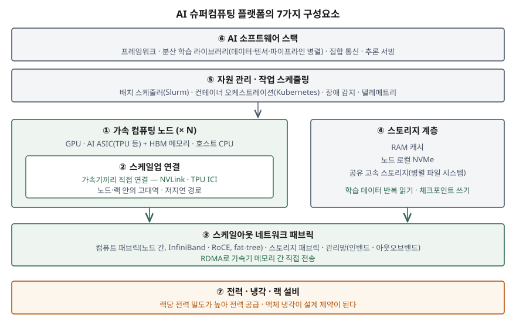

기출문제에서 AI 슈퍼컴퓨팅 플랫폼을 세 갈래로 나눠 묻는다. 개념과 등장 배경, 구성요소별
역할, 그리고 전통적 슈퍼컴퓨터·클라우드 컴퓨팅과의 비교다. "GPU를 많이 모은 슈퍼컴퓨터"
한 줄과 GPU·네트워크·스토리지 나열로 끝내면 평이한 답안이 된다. 점수는 **왜 네트워크와
스토리지가 연산 장치만큼 중요해졌는지**를 LLM 학습 방식에서 끌어내고, 비교를 **연산 정밀도·
자원 할당·네트워크 결합도** 같은 축으로 세우는 데서 난다.

> 실행 검증 없음. 개념 문제이므로 공개 문서 근거만으로 정리했다.
>
> 용어 "AI 슈퍼컴퓨팅 플랫폼"은 가트너가 2025년 10월 전략 기술 트렌드에서 붙인 이름이라
> 표준 정의(1차 자료)가 없다. 용어 정의는 가트너 발표(2차)를 쓰고, 같은 대상을 다룬
> 1차 자료 — 구글 TPU v4 논문, NVIDIA DGX SuperPOD 참조 아키텍처, NIST 클라우드 정의,
> TOP500 — 로 구성요소와 비교를 세웠다.

---

## Ⅰ. 개요

### 가. 문제의 초점

LLM과 멀티모달 모델은 수천 개 이상의 가속기가 **하나의 작업을 몇 주에 걸쳐 함께** 수행해야
학습된다. 이때 성능은 가속기 한 개의 속도보다 가속기 사이의 통신, 데이터를 대 주는
스토리지, 그리고 그 규모의 자원을 끊김 없이 돌리는 운영 체계에서 결정된다.
AI 슈퍼컴퓨팅 플랫폼은 이 전체를 **하나의 시스템으로 설계·운영하는 대상**으로 묶은 개념이다.

### 나. 답안의 구성

Ⅱ에서 정의와 등장 배경을, Ⅲ에서 7가지 구성요소의 역할을, Ⅳ에서 전통적 슈퍼컴퓨터·
클라우드 컴퓨팅과의 비교를 다룬다.

## Ⅱ. AI 슈퍼컴퓨팅 플랫폼의 개념 및 등장 배경

### 가. 개념 — 출처 3가지

| 출처 | 무엇으로 보는가 |
|---|---|
| 가트너 전략 기술 트렌드 2026 (2025-10, 2차) | CPU·GPU·AI 전용 ASIC·뉴로모픽 등 **서로 다른 연산 방식을 통합**하고, 고성능 프로세서·대용량 메모리·전용 하드웨어·오케스트레이션 소프트웨어를 묶어 ML·시뮬레이션·분석 워크로드를 처리하는 플랫폼 |
| 구글 TPU v4 논문 (ISCA 2023, 1차) | ML 모델용 **도메인 특화 슈퍼컴퓨터.** 4,096개 칩을 광 회선 스위치(OCS)로 묶고 연결 토폴로지를 동적으로 재구성한다 |
| NVIDIA DGX SuperPOD 참조 아키텍처 (1차) | 연산·스토리지·네트워크·관리를 **통합한 데이터센터 단위 플랫폼.** 확장 단위(SU)를 반복 배치해 규모를 키운다 |

세 출처가 공통으로 가리키는 것은 두 가지다. 첫째, **이종 가속기 중심의 연산 자원**이고,
둘째, 그것을 **연결·저장·관리까지 하나로 설계한 시스템**이라는 점이다.
답안 첫 줄에는 다음처럼 쓴다.

> AI 슈퍼컴퓨팅 플랫폼은 GPU·AI 전용 가속기 등 이종 연산 자원과 고대역 인터커넥트,
> 계층형 스토리지, 자원 관리·AI 소프트웨어를 하나의 시스템으로 통합하여 초거대 AI 모델의
> 학습과 추론을 수행하는 컴퓨팅 플랫폼이다.

### 나. 등장 배경 — 4가지

| 배경 | 내용 | 근거 |
|---|---|---|
| ① 모델·데이터 규모의 증가 | 메타는 이전 인프라(V100 GPU 22,000개)로는 조 단위 파라미터 모델을 엑사바이트급 데이터로 학습하기 어려워 전용 AI 슈퍼컴퓨터(RSC)를 새로 구축했다고 밝혔다 (2022-01) | Meta AI 블로그 |
| ② 연산 정밀도의 분리 | 과학 계산은 대부분 64비트 정밀도가 필요하지만 ML은 32비트 이하로도 원하는 결과를 얻는다. 저정밀 연산에 맞춘 가속기가 따로 발전했다 | HPL-MxP |
| ③ 통신이 병목이 됨 | 모델 하나를 수천 GPU에 나눠 학습하면 노드 간 통신 비용 때문에 확장이 막힌다. 데이터·텐서·파이프라인 병렬을 조합하고 통신 경로를 나눠 설계해야 한다 | Megatron-LM (SC21) |
| ④ 이종 연산의 통합 운영 | GPU·ASIC·CPU를 워크로드에 따라 배치하고 비용·거버넌스를 통제할 운영 계층이 필요해졌다 | 가트너 |

## Ⅲ. AI 슈퍼컴퓨팅 플랫폼의 구성요소별 역할

### 가. 구성도 — 7가지

> **출처**: [NVIDIA DGX SuperPOD GB200 Reference Architecture — Key Components · Network Fabrics · Storage Architecture](https://docs.nvidia.com/dgx-superpod/reference-architecture-scalable-infrastructure-gb200/latest/dgx-superpod-components.html) · [Jouppi et al., TPU v4, ISCA 2023](https://arxiv.org/abs/2304.01433) · [Narayanan et al., Megatron-LM, SC21](https://arxiv.org/abs/2104.04473) — 층 구분은 두 참조 아키텍처의 공통 요소를 묶은 것이다

### 나. 구성요소별 역할

| 층 | 구성요소 | 역할 | 정보시스템 관점에서 볼 것 |
|---|---|---|---|
| 연산 | ① 가속 컴퓨팅 노드 | GPU·AI ASIC이 행렬 연산을 수행하고, 가속기에 붙은 HBM이 모델 파라미터와 중간값을 담는다. CPU는 데이터 적재와 제어를 맡는다 | 가속기 종류별로 맞는 워크로드(학습·추론)를 나눠 배치 |
| 연결 | ② 스케일업 연결 | 노드·랙 안의 가속기를 직접 연결한다. GB200 NVL72는 랙 안의 GPU 72개를 하나의 NVLink 영역으로 묶고, TPU v4는 칩 간 연결(ICI)과 OCS로 토폴로지를 재구성한다 | 통신량이 가장 많은 병렬화(텐서 병렬)를 이 영역 안에 둔다 |
| 연결 | ③ 스케일아웃 패브릭 | 노드 간 통신을 맡는다. DGX SuperPOD는 컴퓨트 패브릭(노드 간, InfiniBand)·스토리지 패브릭·인밴드 관리망·아웃오브밴드 관리망을 **물리적으로 나눈다** | 학습 트래픽이 스토리지·관리 트래픽과 경합하지 않도록 망을 분리 |
| 저장 | ④ 스토리지 계층 | RAM 캐시 → 로컬 NVMe → 공유 고속 스토리지의 계층으로 학습 데이터를 대 준다. 학습의 핵심 I/O는 같은 데이터의 **반복 읽기**이고, 장애 대비 **체크포인트 쓰기**가 주기적으로 몰린다 | 데이터 파이프라인, 체크포인트 주기와 보존 정책 |
| 운영 | ⑤ 자원 관리·스케줄링 | 배치 스케줄러(Slurm)와 컨테이너 오케스트레이션(Kubernetes)으로 수천 GPU를 작업에 할당하고, 장애 노드를 감지해 격리한다 | 작업 우선순위, 부서별 할당량, 사용량 측정·과금 |
| 운영 | ⑥ AI 소프트웨어 스택 | 딥러닝 프레임워크 위에서 분산 학습 라이브러리가 모델을 데이터·텐서·파이프라인으로 나누고, 집합 통신 라이브러리가 가속기 간 데이터를 교환한다 | 스택 버전 표준화, 컨테이너 이미지 관리 |
| 설비 | ⑦ 전력·냉각·랙 설비 | GB200 SuperPOD는 GPU·CPU를 액체 냉각하고, 랙 전원 선반 하나가 최대 33kW를 공급한다 | 기존 전산실 설비로 수용 가능한지가 도입의 선결 조건 |

연결을 ②와 ③ 두 단으로 나누는 이유는 병렬화 방식마다 통신량이 다르기 때문이다.
Megatron-LM 논문은 모델 한 층의 행렬을 여러 GPU가 나눠 계산하는 **텐서 병렬**을 쓰면
층마다 GPU 사이에 결과를 모아야 하므로, 이를 노드 간으로 넓히면 통신 비용이 확장을 막는다고
분석한다. 그래서 통신이 가장 잦은 텐서 병렬은 대역폭이 큰 스케일업 영역 안에 두고, 층 단위로
나누는 **파이프라인 병렬**과 데이터를 나누는 **데이터 병렬**은 스케일아웃 패브릭에 맡긴다.
네트워크 구성이 곧 모델을 어떻게 나눌지를 정하는 설계 입력이 되는 것이다.

스토리지를 계층으로 두는 이유도 같은 논리다. 참조 아키텍처는 데이터가 첫 읽기 때 캐시되어
이후에는 네트워크를 거치지 않는 것을 이상적인 상태로 본다. 원격 스토리지는 전체 데이터를
보관하고 체크포인트를 받아 두는 역할에 집중한다.

### 다. 구성요소가 함께 움직이는 방식 — 학습 한 단계

1. ⑤가 작업에 필요한 노드 묶음을 할당하고 ⑥이 모델을 나눠 각 가속기에 올린다
2. ④에서 학습 데이터를 읽어 ①의 가속기 메모리로 보낸다. 반복 읽기는 로컬 캐시에서 처리한다
3. 각 가속기가 연산을 수행하고, 같은 층을 나눠 가진 가속기끼리는 ②로, 다른 노드와는 ③으로
   중간값과 기울기를 교환한다
4. 일정 주기마다 체크포인트를 ④에 쓴다. 노드가 고장 나면 ⑤가 그 노드를 빼고 마지막
   체크포인트부터 다시 시작한다

이 흐름에서 가장 느린 구성요소가 전체 속도를 정한다. AI 슈퍼컴퓨팅을 **가속기의 합이 아니라
플랫폼**으로 보는 이유다.

## Ⅳ. 전통적 슈퍼컴퓨터, 클라우드 컴퓨팅, AI 슈퍼컴퓨팅 플랫폼의 비교

### 가. 비교표

| 비교 항목 | 전통적 슈퍼컴퓨터 (HPC) | 클라우드 컴퓨팅 | AI 슈퍼컴퓨팅 플랫폼 |
|---|---|---|---|
| 주 목적 | 과학·공학 시뮬레이션 | 범용 IT 서비스의 주문형 제공 | 초거대 AI 모델의 학습·추론 |
| 연산 정밀도 | **64비트 배정밀도 중심** | 워크로드마다 다름 | **16비트 이하 저정밀·혼합 정밀도 중심** |
| 주 연산 장치 | CPU 중심, 최근 GPU 결합 | 범용 CPU 가상 머신 중심 | GPU·AI ASIC 등 **이종 가속기** |
| 네트워크 | 노드 간 저지연 밀결합 연결 | 범용 이더넷, 다중 사용자 공유 | **스케일업 + 스케일아웃 2단 구성**, 용도별 망 분리 |
| 자원 할당 | 배치 작업 대기열 | 주문형 셀프서비스, 빠른 탄력성 | 대규모 자원을 **한 작업이 장기간 연속 점유** |
| 공유 모델 | 연구기관 공동 이용 | 다중 사용자 자원 풀링 | 전용 구축 또는 클라우드에서 전용 클러스터로 제공 |
| 성능을 보는 기준 | TOP500의 HPL(64비트 선형 방정식 풀이) | 가용성·확장성, 사용량 측정 | 혼합 정밀도 성능(HPL-MxP), 모델 학습 완료까지의 시간 |
| 운영의 초점 | 작업 처리량, 계산 정확도 | 서비스 수준(SLA), 비용 최적화 | 가속기 가동률, 장애 복구(체크포인트), 전력 |

> 전통적 슈퍼컴퓨터 칸은 TOP500 Linpack 설명과 HPL-MxP, 클라우드 칸은 NIST SP 800-145의
> 5가지 필수 특성(주문형 셀프서비스·광대역 네트워크 접근·자원 풀링·빠른 탄력성·측정 서비스),
> AI 슈퍼컴퓨팅 칸은 DGX SuperPOD 참조 아키텍처와 TPU v4 논문을 근거로 정리했다.

### 나. 비교에서 끌어낼 점 — 3가지

① **정밀도가 설계를 가른다.** 전통적 슈퍼컴퓨터는 64비트 정확도를, AI 슈퍼컴퓨팅은 저정밀
연산의 처리량을 목표로 설계된다. HPL-MxP가 따로 만들어진 것도 저정밀 가속기의 성능을
64비트 기준만으로는 잴 수 없기 때문이다.

② **클라우드와는 자원을 쓰는 방식이 다르다.** 클라우드는 NIST 정의대로 작은 단위의 자원을
여러 사용자가 풀링해 탄력적으로 쓴다. LLM 학습은 수천 가속기를 **한 작업이 동시에** 붙잡아야
하므로, 클라우드 위에서도 전용 클러스터로 따로 구성된다. 마이크로소프트가 2020년 5월 OpenAI
전용으로 Azure에 단일 시스템 슈퍼컴퓨터를 구축했다고 발표한 것이 그 예다.

③ **셋은 대립하지 않고 수렴한다.** 슈퍼컴퓨터는 AI용 가속기를 실어 HPL-MxP로도 성능을 재고,
클라우드는 AI 슈퍼컴퓨터를 서비스로 제공하며, AI 슈퍼컴퓨팅 플랫폼은 HPC의 배치 스케줄러와 클라우드의 컨테이너
오케스트레이션을 함께 쓴다. 구분의 기준은 장비가 아니라 **어떤 워크로드를 위해 설계했는가**다.

### 다. 도입 시 정보시스템 관점의 고려사항 — 4가지

| 고려사항 | 판단할 것 |
|---|---|
| ① 구축 방식 | 자체 구축(온프레미스)·클라우드 전용 클러스터·혼합 중 무엇을 택할지. 가동률이 꾸준히 높으면 구축, 간헐적이면 클라우드 쪽이 유리하다 |
| ② 데이터 거버넌스 | 학습 데이터의 위치와 암호화. 메타 RSC는 데이터를 종단 간 암호화하고 메모리 안에서만 복호화하도록 설계했다고 밝혔다 |
| ③ 자원 배분과 비용 통제 | 부서·과제별 GPU 할당량과 사용량 측정. 가트너도 이 트렌드의 조건으로 거버넌스와 비용 통제를 든다 |
| ④ 장애 복구 설계 | 가속기 수가 늘수록 학습 중 장애가 잦아지므로 체크포인트 주기, 장애 노드 자동 격리, 재시작 절차를 운영 체계에 넣는다 |

## Ⅴ. 결론

AI 슈퍼컴퓨팅 플랫폼은 이종 가속기, 2단 인터커넥트, 계층형 스토리지, 자원 관리와 AI
소프트웨어를 한 시스템으로 설계한 것이다. 전통적 슈퍼컴퓨터와는 **연산 정밀도**가, 클라우드와는
**자원을 점유하는 방식**이 다르다. 따라서 도입은 GPU 수량을 정하는 일이 아니라 네트워크 분리,
데이터 파이프라인, 체크포인트, 전력 설비까지 포함한 **플랫폼 설계**로 접근해야 하며, 조직
안에서는 가속기 자원을 공동 자산으로 배분·측정하는 거버넌스를 함께 갖춰야 한다.

> 개념 정리: [LLM 분산 학습 병렬화 — 데이터·텐서·파이프라인 병렬](../../system/2026-09-30-llm-parallelism-data-tensor-pipeline/index.md)

끝

## 답안 작성 메모

- **먼저 쓸 것**: Ⅱ-가의 한 줄 정의와 Ⅲ-가의 7가지 구성도. 구성도는 "연산 → 연결(2단) →
  저장 → 운영 → 설비"의 층으로 그리면 5분 안에 옮길 수 있다.
- **점수가 갈리는 지점**: 연결을 **스케일업(노드·랙 안)과 스케일아웃(노드 간)** 두 단으로
  나눠 쓰는지, 그리고 그 이유를 병렬화 방식(통신이 가장 많은 병렬을 노드 안에 둔다)에서
  설명하는지. 비교표에 **연산 정밀도(64비트 대 저정밀)** 와 **자원 점유 방식** 축이 들어가면
  나열식 비교와 차이가 난다.
- **시간이 모자라면**: Ⅲ-다의 학습 한 단계 흐름과 Ⅳ-다의 고려사항 표를 버린다. 비교표는
  논술형에 필수이므로 남기되 "공유 모델"·"운영의 초점" 행을 줄인다.
- 제품 이름(NVLink, InfiniBand, TPU)은 예시로 한 번씩만 쓰고, 답안의 틀은 "스케일업 연결",
  "스케일아웃 패브릭"처럼 일반 명칭으로 세운다.
- 가트너가 함께 낸 도입률 예측치는 원 출처가 애널리스트 예측이라 답안에 쓰지 않았다.
  GPU 속도 배수 같은 벤더 수치도 넣지 않았다.

## 참고 자료

- [Gartner, "Gartner Identifies the Top Strategic Technology Trends for 2026" (2025-10-20)](https://www.gartner.com/en/newsroom/press-releases/2025-10-20-gartner-identifies-the-top-strategic-technology-trends-for-2026) — 2차(애널리스트)
- [Network World, "AI dominates Gartner's top strategic technology trends for 2026" (2025-10-21)](https://www.networkworld.com/article/4076316/ai-dominates-gartners-top-strategic-technology-trends-for-2026.html) — 가트너 발표 내용 확인용
- [Jouppi et al., TPU v4: An Optically Reconfigurable Supercomputer for Machine Learning with Hardware Support for Embeddings, ISCA 2023](https://arxiv.org/abs/2304.01433)
- [NVIDIA DGX SuperPOD GB200 Reference Architecture — Key Components](https://docs.nvidia.com/dgx-superpod/reference-architecture-scalable-infrastructure-gb200/latest/dgx-superpod-components.html) · [Network Fabrics](https://docs.nvidia.com/dgx-superpod/reference-architecture-scalable-infrastructure-gb200/latest/network-fabrics.html) (2025-11 갱신)
- [NVIDIA DGX SuperPOD H100 Reference Architecture — Storage Architecture](https://docs.nvidia.com/dgx-superpod/reference-architecture-scalable-infrastructure-h100/latest/storage-architecture.html) (2025-11 갱신)
- [Narayanan et al., Efficient Large-Scale Language Model Training on GPU Clusters Using Megatron-LM, SC21](https://arxiv.org/abs/2104.04473)
- [NIST SP 800-145, The NIST Definition of Cloud Computing (2011-09)](https://csrc.nist.gov/pubs/sp/800/145/final)
- [TOP500, The Linpack Benchmark](https://www.top500.org/project/linpack/)
- [HPL-MxP Mixed-Precision Benchmark](https://hpl-mxp.org/)
- [Meta AI, "Introducing the AI Research SuperCluster" (2022-01-24)](https://ai.meta.com/blog/ai-rsc/) — 2차(기업 엔지니어링 블로그)
- [Microsoft, "Microsoft announces new supercomputer, lays out vision for future AI work" (2020-05-19)](https://news.microsoft.com/source/features/ai/openai-azure-supercomputer/) — 2차(기업 발표)
