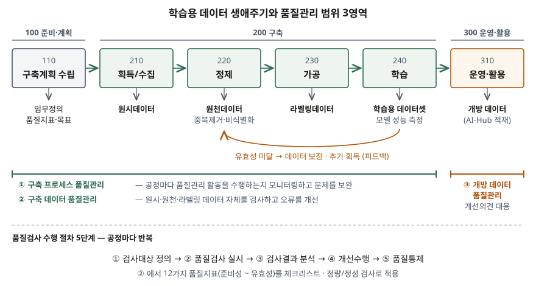

기출문제에서 AI 학습용 데이터의 품질관리를 세 갈래로 나눠 묻는다. 데이터의 특성과 생애주기,
품질관리 원칙, 품질관리 범위와 활동이다. "좋은 데이터가 좋은 모델을 만든다"와 품질 특성
나열로 끝내면 평이한 답안이 된다. 점수는 **생애주기 단계마다 검사 대상 데이터가 바뀐다**는
점을 도식으로 보이고, 원칙과 범위를 **개수로** 쓰고, 활동을 검사 절차·지표·그것을 받치는
정보시스템까지 내려 쓰는 데서 난다.

> 실행 검증 없음. 개념 문제이므로 NIA 가이드라인과 ISO/IEC 표준 근거만으로 정리했다.
> NIA 가이드라인 v3.1은 제1권(공통 품질관리)과 제2권(초거대 AI 데이터)으로 나뉜다. 제1권 원문은
> 파일이 커서 받지 못했고, **제1권의 체계를 준용한다고 밝힌 제2권**에서 원칙·범위·생애주기·
> 검사 절차·지표를 확인했다. 제2권이 초거대 AI용으로 고친 표현은 그렇다고 적었다.

---

## Ⅰ. 개요

### 가. AI 학습용 데이터 품질의 정의

| 출처 | 정의 |
|---|---|
| ISO/IEC 5259-1:2024 (5259-4의 원칙 절이 인용) | 데이터 품질은 **지정된 맥락에서 조직의 요구사항을 충족하는** 데이터의 특성이다 |
| NIA 가이드라인 v3.1 | 학습용 데이터 품질은 AI 학습에 필요한 품질을 확보해 **사용자에게 유용한 가치를 줄 수 있는 수준**이다. 품질관리는 이를 위한 조직·절차·품질기준·관리 방법을 정의하고 **점검·조치하는 일련의 활동**이다 |

두 정의 모두 품질을 데이터 자체의 성질이 아니라 **쓰임새에 대한 충족도**로 본다. 같은 데이터가
어느 모델에는 충분하고 다른 모델에는 모자랄 수 있다는 뜻이다.

### 나. 품질관리가 필요한 이유

ISO/IEC 5259-4는 지도·준지도·비지도·강화학습 어느 방식이든 데이터 품질이 학습과 평가의 주된
관심사가 된다고 적고, 지도학습에는 **과업별로 라벨이 붙은 대량의 데이터**가 필요하므로 정확히
라벨링된 데이터가 핵심 자원이 된다고 본다. NIA 가이드라인 제2권은 초거대 AI의 환각과 편향이
생기는 주요 원인으로 정제되지 않은 데이터를 든다. 모델의 결함이 데이터 단계에서 만들어지므로,
품질은 모델을 만든 뒤가 아니라 **데이터를 만드는 공정마다** 관리해야 한다.

## Ⅱ. 인공지능 학습용 데이터 특성 및 생애주기

### 가. 학습용 데이터의 특성 — 7가지

NIA 가이드라인의 지표·프레임워크 서술과 ISO/IEC 표준에서 학습용 데이터가 일반 업무 데이터와
다르게 다뤄지는 지점을 모아 7가지로 묶었다. 묶음 자체는 답안 작성용 정리다.

| 특성 | 내용 | 품질관리에 주는 뜻 | 근거 |
|---|---|---|---|
| ① 목적 종속성 | 품질이 특정 과업·임무정의에 대한 충족도로 판정된다 | 구축 전에 **임무정의와 품질 목표**를 먼저 세워야 검사 기준이 생긴다 | ISO/IEC 5259-1, NIA 유용성 지표 |
| ② 단계적 변환 | 원시 → 원천 → 라벨링 → 학습용 데이터로 형태가 바뀐다 | 단계마다 **검사 대상 데이터가 다르다** | NIA 프레임워크 |
| ③ 라벨 의존 | 지도학습은 정답 라벨이 곧 학습 신호다. 초거대 AI 말뭉치는 라벨이 없거나 일부만 있다 | 라벨 오류가 그대로 모델 오류가 된다. 라벨링 기준과 검수가 품질의 중심 | ISO/IEC 5259-4, NIA 제2권 |
| ④ 분할 구성 | 학습·검증·테스트로 나눠 쓴다. 초거대 AI는 정해진 비율로 못 나누고 평가용을 따로 만들기도 한다 | 분할 간 **중복·누설**을 막아야 성능 측정이 믿을 만하다 | NIA 제2권 |
| ⑤ 분포 요구 | 수집처·클래스·인스턴스가 고르게 분포해야 한다 | 건별 정확성만으로는 부족하다. **데이터셋 단위의 다양성·편향**을 잰다 | NIA 다양성·편향성 지표 |
| ⑥ 권리 제약 | 저작권·초상권·개인정보 검토 결과가 데이터와 함께 다녀야 한다 | 법적 근거 없는 데이터는 정확해도 쓸 수 없다 | NIA 준비성 지표, ISO/IEC 8183 데이터 계획 단계 |
| ⑦ 사후 판정 | 학습시킨 모델의 성능으로 데이터 품질이 최종 확인된다 | 학습 결과를 앞 단계로 되돌리는 **피드백 경로**가 필요하다 | NIA 유효성 지표, ISO/IEC 8183 피드백 경로 |

### 나. 생애주기 — NIA 3영역 6프로세스

NIA 가이드라인은 생애주기를 **준비·계획, 구축, 운영·활용** 3영역으로 나누고, 품질관리
프레임워크의 프로세스를 번호로 붙인다. 초거대 AI 데이터는 구축 영역에서 학습을 떼어 4영역
(준비·계획, 구축, 학습, 운영·활용)으로 그린다.

> **출처**: [NIA 인공지능 학습용 데이터 품질관리 가이드라인 v3.1 제2권 — Ⅰ장 4 품질관리 범위·품질검사 수행 절차, Ⅱ장 1 데이터 생애주기·프레임워크 프로세스 정의(표 Ⅱ-1)](https://www.nia.or.kr/site/nia_kor/ex/bbs/View.do?cbIdx=26537&bcIdx=26624&parentSeq=26624) · [ISO/IEC 8183:2023 Figure 1 Data life cycle framework](https://www.iso.org/standard/83002.html) — 피드백 화살표의 근거

| 영역 | 프로세스 | 하는 일 | 산출 데이터 |
|---|---|---|---|
| 100 준비·계획 | 110 구축계획 수립 | 구축 목적의 일치성·일관성을 위한 계획, 참여기관 역할 정의, **품질지표·목표·점검 기준 수립** | 계획서·품질지표 |
| 200 구축 | 210 데이터 획득/수집 | 학습에 필요한 데이터를 획득·수집 | 원시데이터 |
| | 220 데이터 정제 | 중복제거·비식별화 등 정제 | 원천데이터 |
| | 230 데이터 가공 | 학습할 수 있는 형태로 가공(라벨링). 초거대 AI는 적응 학습 데이터 구축 | 라벨링데이터 |
| | 240 데이터 학습 | 학습데이터셋으로 모델을 학습시키고 성능을 보정 | 학습용 데이터셋 |
| 300 운영·활용 | 310 데이터 운영·활용 | AI-Hub에 적재해 개방, 하자 보수·유지보수 | 개방 데이터 |

초거대 AI 데이터는 이 흐름이 한 번으로 끝나지 않는다. 정제된 말뭉치는 가공을 거치지 않고
사전학습에 바로 쓰이고, 적응 학습 데이터는 획득·정제·가공을 **병렬·반복**한다(NIA 제2권).

### 다. 국제표준 생애주기와의 대응

ISO/IEC 8183은 AI 시스템에서 데이터가 거치는 단계를 **10단계**로 정한다. NIA 생애주기와
맞대면 다음과 같다. 대응 관계는 단계 정의를 비교해 정리한 것이다.

| ISO/IEC 8183 단계 | NIA 프로세스 | 차이 |
|---|---|---|
| 1 아이디어 구상 · 2 비즈니스 요구사항 | 110 (임무정의) | 8183은 데이터 처리 경계 **밖**의 시스템 단계로 둔다 |
| 3 데이터 계획 | 110 구축계획 수립 | 8183은 양·출처·형식·라이선스·보안·프라이버시를 여기서 정한다 |
| 4 데이터 획득 | 210 획득/수집 | 같다 |
| 5 데이터 준비 | 220 정제 · 230 가공 | NIA는 정제와 가공(라벨링)을 나눈다 |
| 6 모델 구축 | 240 학습 | NIA는 데이터 품질 확인 수단으로서 학습을 둔다 |
| 7 시스템 배포 · 8 시스템 운영 | 310 운영·활용 | NIA는 **데이터 개방**, 8183은 **AI 시스템 운영**을 다룬다 |
| 9 데이터 폐기 | 제2권에서 확인되지 않음 | 8183은 안전한 삭제·보관·용도 전환을 별도 단계로 둔다 |
| 10 시스템 폐기 | 해당 없음 | 데이터 구축 사업은 시스템을 소유하지 않는다 |

## Ⅲ. 인공지능 학습용 데이터 품질관리 원칙

### 가. NIA 품질관리 원칙 — 2개 측면 9가지

NIA 가이드라인은 원칙을 **관리체계가 지켜야 할 것(품질관리 측면)** 과 **데이터 자체가 갖춰야
할 것(데이터 측면)** 으로 나눈다.

| 측면 | 원칙 |
|---|---|
| 품질관리 측면 (4) | ① **전 생애주기**에 걸쳐 품질을 보장한다 |
| | ② 상시적·지속적으로 품질을 **개선**할 수 있어야 한다 |
| | ③ 품질관리 **조직**을 구성하고 정해진 역할과 책임에 따라 수행한다 |
| | ④ 교육 등 품질관리 **역량 지원체계**를 확보한다 |
| 데이터 측면 (5) | ⑤ 모델 학습에 필요한 **요구사항**을 충족한다 |
| | ⑥ **법률적 제약 없이** 누구나 활용할 수 있어야 한다 |
| | ⑦ 학습 목적에 맞게 획득·수집하고, **중복 없이** 목적에 따라 정제한다 |
| | ⑧ **편향성·유해성**을 정제하고 의미적 정확성·사실성을 확보한다 |
| | ⑨ 학습모델을 통해 목표로 한 **유효성**을 확보한다 |

> 제2권의 원칙 표(표 Ⅰ-4)는 제1권의 기본 원칙을 준용한다고 밝힌다. ⑧의 사실성은 제2권이
> 초거대 AI의 환각 방지를 위해 강조한 항목이다.

### 나. ISO/IEC 5259-4 데이터 품질 프로세스 원칙 — 8가지

ISO/IEC 5259-4는 데이터 생애주기 전체에 걸쳐 쓰일 일반 원칙을 조직이 정의·문서화하라고 하며,
고려할 측면을 8가지로 든다.

1. 데이터·데이터셋이 지정된 ML·분석 과업에 **적합**할 것
2. 품질 특성에 기반한 **데이터 품질 모델**을 쓸 것
3. 품질 요구사항에 따라 **측정값과 목표치**로 검증할 것
4. 각 단계에서 목표를 향해 가고 있는지 **단계별로 확인**할 것
5. 적대적 시험 같은 기법으로 **정확성·강건성**을 시험할 것
6. 보안·프라이버시·공정성·윤리에 관한 **조직 요구사항과 정렬**할 것
7. 라벨링 작업자 등 참여자의 **건강과 안녕을 보호**할 것
8. 진행 상황과 원칙 준수를 **문서화**할 것

### 다. 두 원칙 체계의 비교

| 비교 축 | NIA 가이드라인 v3.1 | ISO/IEC 5259-4:2024 |
|---|---|---|
| 성격 | 공공 구축사업 수행기관이 따르는 **실무 지침** | 조직 유형과 무관한 **국제 프로세스 표준** |
| 목적 적합성 | ⑤ 요구사항 충족, ⑦ 목적에 맞는 수집 | 1 과업 적합성 |
| 측정 체계 | 12가지 품질지표(Ⅳ장) | 2 품질 모델, 3 측정값·목표치 (측정은 5259-2) |
| 생애주기 | ① 전 생애주기 보장 | 4 단계별 확인 (생애주기 모델은 5259-1) |
| 법·윤리 | ⑥ 법률적 제약 없음, ⑧ 편향성·유해성 | 6 보안·프라이버시·공정성·윤리 |
| 조직 | ③ 조직·역할, ④ 역량 지원 | 원칙 목록에 없다. 관리 요구사항은 5259-3, 거버넌스는 5259-5가 다룬다 |
| 모델 검증 | ⑨ 유효성 | 5 정확성·강건성 시험 |
| NIA 원칙 표에 없는 것 | — | 7 작업자 보호, 8 문서화 |

NIA는 **조직과 역량**을 원칙에 직접 넣었고, ISO는 이를 시리즈의 다른 파트에 맡기는 대신 **작업자 보호와
문서화**를 원칙에 넣었다. 공공 사업을 여러 기관이 나눠 수행하는 구조와, 어느 조직에나 붙일 수
있어야 하는 표준의 성격 차이가 드러난다.

## Ⅳ. 인공지능 학습용 데이터 품질관리 범위 및 활동

### 가. 품질관리 범위 — 3영역

| 영역 | 대상 | 내용 | 수행 주체 |
|---|---|---|---|
| ① 구축 프로세스 품질관리 | 획득·정제·가공 공정 | 공정마다 품질관리 활동을 수행하는지 **모니터링**하고 문제를 보완 | 사업수행기관 자체 |
| ② 구축 데이터 품질관리 | 원시·원천·가공 데이터 | 데이터 **자체**를 검사하고 오류를 개선 | 사업수행기관 자체 |
| ③ 개방 데이터 품질관리 | AI-Hub 적재 데이터 | 운영·활용 단계에서 품질을 지속 향상하고, 사용자 **개선의견**에 대응 | 사업관리기관이 검토 → 수행기관이 개선 |

①은 **만드는 과정**, ②는 **만들어진 결과**, ③은 **내보낸 뒤**를 본다. ①만 보면 절차는 지켰는데
결과가 나쁜 데이터를 놓치고, ②만 보면 같은 오류가 공정에서 계속 만들어진다.

### 나. 품질관리 활동 ① — 생애주기 단계별 활동

| 단계 | 품질관리 활동 |
|---|---|
| 110 구축계획 수립 | 임무정의 적절성 검토, 품질지표·목표치·점검 기준 확정, 참여기관 역할 분담 |
| 210 획득/수집 | 데이터 소스 선정, 저작권·개인정보 등 **법적 근거 검토**, 원시데이터 수집 완전성 검사 |
| 220 정제 | 중복제거, **비식별화**, 유해표현 정제, 정제 완전성 검사 |
| 230 가공 | 라벨링 방법·기준 정의, 라벨 결과 검사, 가공 완전성·의미 정확성 검사 |
| 240 학습 | 학습·검증·테스트 데이터 구성, 모델 학습 후 **유효성** 측정, 미달 시 앞 단계 보정 |
| 310 운영·활용 | 개방 데이터 하자 보수, 사용자 개선의견 접수·반영 |

### 다. 품질관리 활동 ② — 품질검사 수행 절차 5단계

| 단계 | 내용 |
|---|---|
| ① 검사대상 정의 | 원시·원천·라벨링 데이터 중 검사대상을 정하고 품질검사 계획 수립 |
| ② 품질검사 실시 | 품질지표별로 체크리스트 등 검사기법을 적용. 정량·정성 검사 |
| ③ 검사결과 분석 | 주요 품질문제를 식별하고 **근본 원인**을 찾아 개선 기회 도출 |
| ④ 개선수행 | 개선계획·우선순위를 정해 데이터 보정·추가 작업 |
| ⑤ 품질통제 | 개선 결과 확인, 품질 목표 재설정, **재발 방지** |

ISO/IEC 5259-4의 데이터 품질 프로세스 프레임워크도 같은 순환을 **4가지 구성요소**로 둔다.
품질 계획(planning) → 품질 평가(evaluation) → 품질 개선(improvement) → 품질 프로세스 검증
(process validation)이다. 검증은 데이터가 요구사항을 충족하는지 평가해 필요하면 개선으로
되돌리고, 프레임워크의 산출물에는 품질 계획·요구사항·측정 결과와 함께 데이터 **사용 승인**이 든다.

### 라. 품질관리 활동 ③ — 품질지표 12가지

| 구분 | 지표 | 무엇을 보는가 |
|---|---|---|
| 구축공정 (3) | ① 준비성 | 정책·규정(저작권·초상권·개인정보 검토 포함)·조직·절차·도구·위험관리 |
| | ② 완전성 | 정의한 형식·입력값 범위대로 저장되도록 설계·구축됐는가 |
| | ③ 유용성 | 수요기관 요구사항과 임무정의의 범위·상세화 수준을 충족하는가 |
| 데이터 적합성 (5) | ④ 기준 적합성 | 다양성·신뢰성·충분성·균일성·사실성·공평성 |
| | ⑤ 기술 적합성 | 파일 포맷·해상도·문장 길이·음질 |
| | ⑥ 다양성 | 구조적(문장 길이·어휘 수)·내용적(클래스·인스턴스 분포) 다양성 |
| | ⑦ 유사성(중복성) | 내용 중복과 도메인 유사도 |
| | ⑧ 편향성(유해성) | 성별·인종·나이 경향성, 혐오표현 포함 여부 |
| 데이터 정확성 (2) | ⑨ 구문 정확성 | 데이터 구조·입력값 범위·데이터 형식 |
| | ⑩ 의미 정확성 | 구축 목적에 맞는 의미, 라벨·응답이 내용을 바르게 전달하는가 |
| 학습모델 (2) | ⑪ 알고리즘 적정성 | 학습모델의 과업이 적정한가 |
| | ⑫ 유효성 | 학습 후 측정한 모델 성능이 목표를 넘는가 |

> 지표 12가지의 구성은 NIA 제2권 표 Ⅲ-1 기준이다. 제2권은 다양성·유사성·편향성·의미 전달성·
> 유효성을 초거대 AI 특성에 맞게 고쳤지만 기본 체계는 제1권과 같다고 밝힌다.

일반 데이터 품질 표준인 ISO/IEC 25012의 15개 특성(정확성·완전성·일관성·신뢰성·현재성 등)과
견주면, ⑥ 다양성·⑦ 유사성·⑧ 편향성·⑪ 알고리즘 적정성·⑫ 유효성은 **25012에 대응 특성이
없다.** 건 단위가 아니라 데이터셋 단위로, 또는 학습시킨 모델을 거쳐야 잴 수 있는 지표이기
때문이다. 학습용 데이터 품질관리가 기존 데이터 품질관리의 확장이면서 별도 체계가 필요한 이유다.

### 마. 품질관리 활동 ④ — 정보시스템으로 받치는 부분

위 활동을 사람이 문서로만 돌리면 12가지 지표를 공정마다 반복 검사할 수 없다. 정보시스템 쪽에서
설계할 것을 4가지로 정리한다.

| 대상 | 설계 내용 | 받치는 활동 |
|---|---|---|
| ① 자동 검사 파이프라인 | 구문 정확성·완전성은 스키마·형식 검증으로, 중복성은 해시·유사도 계산으로 적재 시점에 자동 판정 | 검사 절차 ②, 지표 ②⑦⑨ |
| ② 계보·메타데이터 관리 | 원시 → 원천 → 라벨링 → 학습용 데이터의 파생 관계, 비식별화 적용 여부, 권리 검토 결과를 메타데이터로 보존. ISO/IEC 5259-1은 데이터 출처(provenance)를 품질 개념 틀에 넣는다 | 원인 분석(③), 준비성 ① |
| ③ 데이터셋 버전 관리 | 학습·검증·테스트 분할과 데이터셋 버전을 고정해 두고, 모델 성능을 어느 버전에서 쟀는지 연결 | 유효성 ⑫, 피드백 |
| ④ 개선의견 처리 체계 | 개방 데이터에 대한 사용자 의견을 접수 → 관리기관 검토 → 수행기관 개선 → 재배포로 추적 | 범위 ③ 개방 데이터 |

## Ⅴ. 결론

AI 학습용 데이터의 품질은 데이터 자체의 성질이 아니라 **과업에 대한 충족도**이고, 데이터가
원시에서 학습용까지 형태를 바꾸므로 **단계마다 검사 대상이 달라진다.** 그래서 품질관리는
전 생애주기 보장을 첫 원칙으로 두고, 범위를 공정·결과·개방 후의 3영역으로 나누며,
검사 → 분석 → 개선 → 통제의 절차를 공정마다 되풀이한다. 기존 데이터 품질과 갈리는 지점은
다양성·편향성·유효성처럼 **데이터셋 단위나 모델을 거쳐야 보이는 지표**다. 이 지표를 반복해
잴 수 있으려면 계보·버전·자동 검사를 갖춘 정보시스템이 품질관리의 기반이 되어야 하고,
ISO/IEC 5259 시리즈가 국제 기준을 마련한 만큼 국내 가이드라인과 용어·지표를 맞춰 가는 것이
과제다.

> 개념 정리: [ISO/IEC 5259 — 분석·머신러닝용 데이터 품질 표준 시리즈](../../data-analysis/2026-09-30-iso-iec-5259-data-quality-series/index.md)

끝

## 답안 작성 메모

- **먼저 쓸 것**: Ⅱ-나의 생애주기 모식도(6개 프로세스 + 산출 데이터 + 범위 3영역)와
  Ⅲ-가의 원칙 표. 도식 하나로 (가)와 (다)의 범위가 같이 서므로 시간 대비 점수가 가장 크다.
- **점수가 갈리는 지점**: 원칙을 "품질관리 측면 4 / 데이터 측면 5"로 **나눠서 개수로** 쓰는지,
  범위 3영역을 "과정·결과·개방 후"로 구분해 쓰는지. Ⅳ를 지표 나열로 끝내지 않고 검사 절차 5단계와
  **정보시스템(계보·버전·자동 검사)** 까지 내려 쓰면 정보관리 답안이 된다.
- **시간이 모자라면**: Ⅱ-다의 ISO/IEC 8183 대응표를 버리고 "국제표준은 10단계"라는 한 줄만 남긴다.
  Ⅲ-나의 ISO 원칙 8가지는 Ⅲ-다 비교표에 흡수되므로 비교표만 남겨도 된다(논술형은 비교표가 최소
  1개 있어야 한다). 지표 12가지는 4개 구분과 개수만 쓰고 설명을 줄인다.
- 특성 7가지는 가이드라인이 그 개수로 제시한 목록이 아니라 지표·프레임워크 서술을 묶은 것이다.
  답안에는 "학습용 데이터의 특성"으로 쓰되, 출처 질문이 나오면 그렇게 답한다.
- 구축 사업 규모나 데이터 종수 같은 수치는 해마다 바뀌어 답안에 쓰지 않았다.

## 참고 자료

- [NIA, 2024년 인공지능 학습용 데이터 품질관리 가이드라인 v3.1 (2024-01 발간, 2024-04-05 게시) — 제1권 품질관리 가이드라인, 제2권 초거대AI 데이터 품질관리 가이드라인, 별권 산출물 양식](https://www.nia.or.kr/site/nia_kor/ex/bbs/View.do?cbIdx=26537&bcIdx=26624&parentSeq=26624)
- [AI-Hub, 인공지능 학습용 데이터 품질관리 가이드라인 v3.1](https://aihub.or.kr/aihubnews/qlityguidance/view.do?currMenu=135&topMenu=103&nttSn=10269)
- [ISO/IEC 5259-1:2024 Artificial intelligence — Data quality for analytics and machine learning (ML) — Part 1: Overview, terminology, and examples](https://www.iso.org/standard/81088.html)
- [ISO/IEC 5259-4:2024 Part 4: Data quality process framework — Clause 5 Data quality process principles, Clause 6 Data quality process framework](https://www.iso.org/standard/81093.html)
- [ISO/IEC 8183:2023 Information technology — Artificial intelligence — Data life cycle framework](https://www.iso.org/standard/83002.html)
- [ISO/IEC 25012:2008 Software engineering — Software product Quality Requirements and Evaluation (SQuaRE) — Data quality model](https://www.iso.org/standard/35736.html)
