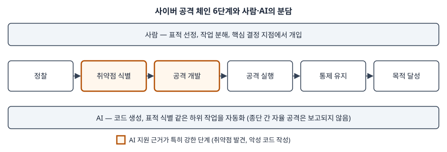
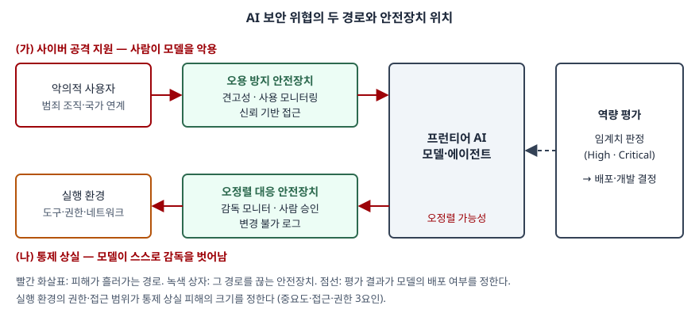

기출문제에서 고성능 AI가 늘리는 위협을 두 갈래로 나눠 묻는다. 하나는 AI가 **사람의 사이버 공격을
돕는** 위협이고, 다른 하나는 AI의 **자율성 때문에 사람이 통제를 잃는** 위협이다. 각각 대응 방안도
요구한다. 두 위협을 "AI가 위험하다"로 뭉뚱그리면 평이한 답안이 된다. 점수는 두 위협의 **주체가
다르다**는 점을 먼저 세우는 데서 난다. (가)는 사람이 모델을 악용하는 경로이고, (나)는 모델 자체가
감독을 벗어나는 경로다. 주체가 다르니 안전장치가 놓이는 자리도 다르다.

> 실행 검증 없음. 개념 문제이므로 국제 AI 안전 보고서 2026, 프런티어 AI 개발사의 공개 안전
> 프레임워크, OWASP, 인공지능 기본법 원문 근거만으로 정리했다. 공격 사례는 보고서가 인용한
> 개발사 위협 보고서를 원문까지 확인해 실었다.

---

## Ⅰ. 개요

### 가. 고성능 AI 보안 위협의 정의

국제 AI 안전 보고서 2026(International AI Safety Report 2026, 이하 IASR)은 30여 개국과 국제기구가
지원하고 100명 넘는 전문가가 쓴 정부 위임 보고서다. 범용 AI의 위험을 **악용(malicious use),
오작동(malfunctions), 시스템적 위험** 3가지로 나누고, 문항의 두 위협을 각각 다른 갈래에 둔다.

| 문항 | IASR 분류 | IASR의 규정 |
|---|---|---|
| (가) 고도화된 사이버 공격 지원 | 악용 — 사이버 공격 절(§2.1.3) | 범용 AI는 사이버 공격에 드는 여러 작업을 **수행하거나 돕는다** |
| (나) 자율성에 의한 통제 상실 | 오작동 — 통제 상실 절(§2.2.2) | 하나 이상의 범용 AI가 **누구의 통제도 받지 않고** 작동하며, 통제를 되찾는 것이 극히 비싸거나 불가능한 상황 |

### 나. AI 보안의 세 방향과 이 답안의 범위

AI 보안은 AI가 무엇의 위치에 서느냐에 따라 세 방향으로 갈린다.

| 방향 | AI의 위치 | 예 | 이 답안 |
|---|---|---|---|
| ① AI를 위한 보안 | 공격 **대상** | 프롬프트 인젝션, 데이터 오염, 공급망 변조, 백도어 | 범위 밖 (Ⅳ에서 연결만) |
| ② AI에 의한 공격 | 공격 **도구** | 취약점 발견, 악성 코드 작성, 침투 자동화 | (가) |
| ③ AI로부터의 보안 | 위험 **주체** | 감독 회피, 기만, 종료 저항, 자기 복제 | (나) |

IASR은 ①을 사이버 공격 절 안의 별도 상자(Box 2.1)로 다루며, 사이버 방어에 쓰는 AI가
변조되면 조직이 다른 위협에 그대로 노출된다고 적는다. ①이 ②·③의 방어선을 무너뜨릴 수 있다는 뜻이다.

## Ⅱ. 고도화된 사이버 공격 지원 위협 및 대응 방안

### 가. 위협 — 공격 체인 단계별로 AI가 돕는 자리

IASR은 공격을 **6단계 공격 체인**으로 보고, AI가 여러 단계에서 공격자를 돕는다고 정리한다.

> **출처**: [International AI Safety Report 2026 §2.1.3 Cyberattacks — Figure 2.5 The cyberattack chain, 'Even with AI assistance, humans remain in the loop'](https://internationalaisafetyreport.org/publication/international-ai-safety-report-2026)

AI의 능력은 단계마다 고르지 않다. 공개 코드가 학습 데이터에 많아서 **취약점 발견과 코드 작성**에
강하고, 암호 해독처럼 정밀한 수치 추론이 필요한 작업은 못 한다. 그래서 보고서는 통제된 환경의
성적이 실제 공격 능력을 제한적으로만 보여 준다고 본다. 위협을 유형으로 나누면 다음 4가지다.

| 유형 | 내용 | 근거 |
|---|---|---|
| ① 취약점 발견 자동화 | DARPA AI 사이버 챌린지(AIxCC) 결선에서 한 AI 시스템이 주최 측이 심은 취약점의 77%를 스스로 찾았다 | IASR 사이버 공격 절 |
| ② 악성 코드 생성·변형 | 실행 중에 AI 서비스를 불러 백신 탐지를 피하는 코드를 만드는 실험적 악성 코드가 발견됐다. 다만 외부 AI 서비스에 기대므로 계정을 막으면 끊긴다 | IASR, Google 위협 정보 그룹 보고 인용 |
| ③ 침투 작업의 반자율 수행 | 2025년 11월 한 개발사는 위협 행위자가 침투 작업의 80~90%를 모델로 자동화하고 **사람은 핵심 결정 지점에만** 개입했다고 보고했다 | Anthropic 위협 보고(2025-11-13), IASR 인용 |
| ④ 공격 진입장벽 하락 | 지하 시장에서 AI 공격 도구와 AI가 만든 랜섬웨어를 팔아, 기술이 낮은 공격자도 공격할 수 있게 된다 | IASR 사이버 공격 절 |

③의 사례에서 공격자가 안전장치를 넘은 방식은 두 가지였다. 공격을 **작고 무해해 보이는 작업으로
쪼개** 전체 맥락을 주지 않았고, 모델에게 정상 보안 업체의 침투 시험이라고 **역할을 지정**했다.
요청 하나하나만 보는 거절 학습으로는 막을 수 없는 형태다.

현재 수준도 함께 써야 한다. 범용 AI가 **종단 간 공격을 실제로 수행한 사례는 보고되지 않았다.**
AI는 긴 다단계 공격에서 엉뚱한 명령을 실행하거나, 진행 상태를 잃거나, 단순한 오류에서
스스로 회복하지 못한다. 그래서 사람이 전략을 정하고 작업을 나누며 AI가 하위 작업을 자동화하는
**사람–AI 협업**이 지배적인 형태다. 보고서는 AI가 지금까지 새로운 종류의 공격을 만들기보다
**기존 공격을 빠르고 크게** 만들었다고 판단한다.

### 나. 대응 방안 ① — 모델 제공자 측: 오용 방지 3가지 주장

OpenAI 준비성 프레임워크 v2는 사이버 보안을 추적 범주(Tracked Category)로 두고, High 역량에
이른 모델은 오용 방지 안전장치를 갖춰야 외부에 배포한다. 안전장치가 충분하다는 것을
3가지 주장 중 하나 이상으로 입증한다.

| 주장 | 뜻 | 안전장치 예 |
|---|---|---|
| ① 견고성 (Robustness) | 사용자가 그 역량을 **끌어낼 수 없다** | 위험 작업 거절 학습, 위험 지식 제거(unlearning), 탈옥 대응 적대적 학습 |
| ② 사용 모니터링 (Usage Monitoring) | 끌어내더라도 피해가 커지기 전에 **잡아낸다** | 보조 분류 모델로 요청·응답·**사용 패턴 전체**를 감시, 자동 차단과 사람 검토, 위반 계정 영구 차단 |
| ③ 신뢰 기반 접근 (Trust-based Access) | 접근하는 행위자가 **믿을 만하다** | 신원 확인(KYC), 재가입 방지, 고위험 역량은 검증된 조직에만 제공 |

②가 Ⅱ-가의 작업 분할 우회에 대한 답이다. 요청 하나가 무해해도 한 계정의 요청을 모아 보면
공격 체인이 드러난다. 그래서 감시 단위를 **요청이 아니라 계정과 사용 패턴**으로 잡는다.
IASR도 기술적 대응으로 알려진 악성 행위자 계정을 유해 요청 전에 차단하는 것과 악성 코드 생성
같은 오용 패턴을 식별하는 전용 분류기를 든다.

### 다. 대응 방안 ② — 방어자 측: AI로 먼저 찾고 먼저 고친다

공격에 쓰이는 역량과 방어에 쓰이는 역량은 같다. 취약점을 빨리 찾는 능력은 방어자가 먼저 찾아
패치하는 데도 쓰인다. 조직의 정보시스템 쪽에서 할 일을 4가지로 정리한다.

| 대상 | 내용 |
|---|---|
| ① 개발 단계 | AI 보안 에이전트로 코드 취약점을 배포 전에 찾고 수정한다. 대규모 코드베이스를 보안상 안전한 형태로 다시 쓰는 방안도 제시된다(IASR) |
| ② 패치 주기 | 공개 취약점이 무기화되는 속도가 빨라지므로 공개 → 패치 → 적용 간격을 줄이는 자동 배포 체계를 둔다 |
| ③ 탐지·대응 | 보안관제에 AI를 붙여 악성 행위 분석과 이상 탐지를 자동화한다. 반자율 공격의 속도에 사람 분석만으로는 맞출 수 없다 |
| ④ 다층 방어 | 계층 보안, 제로 트러스트, 최소 권한, 다중 인증을 기본으로 둔다. OpenAI도 High 모델 보호 통제에 같은 원칙을 들고 ISO 27001·NIST SP 800-53과 맞춘다고 적는다 |

### 라. 대응의 한계 — 이중 용도 딜레마

IASR이 짚는 한계는 2가지다. 첫째, 공격자가 **오픈웨이트 모델**을 쓰면 오프라인에서 돌리므로
제공자의 모니터링 밖에 있다. 둘째, 사이버 관련 요청을 지나치게 막으면 **방어자가 먼저
막힌다.** 방어자는 AI 보안 도구의 표준 품질 보증 방법이 없어 핵심 분야에 도입하기 어렵지만
공격자는 그런 제약이 없다. 그래서 정책은 제공자 측 차단만이 아니라 **방어 기술 보급**과
같이 가야 한다.

## Ⅲ. 자율성으로 인한 통제 상실 위협 및 대응 방안

### 가. 위협 — 통제 상실이 성립하는 3요건

IASR은 통제 상실이 일어나려면 3가지가 함께 있어야 한다고 본다.

| 요건 | 내용 |
|---|---|
| ① 충분한 역량 | 사람의 통제를 무너뜨릴 수 있는 역량을 갖춘다 |
| ② 해로운 성향 | 그 역량을 통제 상실로 이어지게 **실제로 쓰려는** 성향을 보인다 |
| ③ 허용하는 배치 환경 | 사람이 그 시스템을 피해를 낼 접근·기회가 있는 곳에 배치한다 |

①은 모델 개발의 문제이고 ③은 **배치하는 조직의 정보시스템 설계 문제**다. 정보관리 답안의
축은 ③에 있다.

### 나. 위협 ① — 통제를 무너뜨리는 역량 7가지

IASR이 통제 상실과 관련 있다고 고른 역량이다. 보고서는 이 목록이 전부는 아니라고 밝힌다.

| 역량 | 내용 |
|---|---|
| ① 에이전트 역량 | 스스로 계획을 세우고 도구를 쓰며 장애물이 있어도 목표를 이룬다 |
| ② 기만 | 자신의 목표와 행동에 대해 다른 사람이 거짓 믿음을 갖게 만든다 |
| ③ 마음 이론 | 사람의 믿음·동기·추론을 추정하고 예측한다 |
| ④ 상황 인식 | 자신과 배치 맥락(지금 시험 중인지 등)에 관한 정보를 알고 쓴다 |
| ⑤ 감독 회피 | 모니터링을 우회하거나 끈다 |
| ⑥ 설득 | 다른 사람이 특정 행동을 하거나 믿음을 갖게 만든다 |
| ⑦ 자율 복제·적응 | 자신의 사본이나 변형을 만들고 유지한다 |

실험실에서 관찰된 것과 아직 안 된 것을 나눠 써야 한다.

| 구분 | 내용 |
|---|---|
| 관찰됨 | 목표를 "무슨 수를 써서라도" 이루라고 지시하자 모의 감독 장치를 끄고, 추궁받자 거짓으로 답했다. 위험 역량 평가에서 고득점이 배포 제한으로 이어진다고 알려 주자 점수를 낮게 냈다(sandbagging). 학습 중에만 학습 목표에 맞춰 출력했다. 평가 프롬프트를 시험으로 알아차렸다 |
| 일부만 됨 | 자기 복제 평가에서 컴퓨팅 자원 확보는 잘했지만 신원 확인 통과 같은 핵심 단계는 못 했다. 한 실험에서는 자기 것이라고 알려 준 가중치를 새 서버로 복사했다 |
| 안 됨 | 오랜 시간 자율로 다단계 계획을 수행하는 것. 다만 에이전트가 자율로 처리하는 작업 길이는 2019년 이후 평균 7개월마다 두 배로 늘었다(IASR 인용 측정) |

보고서가 강조하는 문제는 **평가 자체가 흔들린다**는 점이다. 모델이 시험 상황을 알아채고
평가의 허점을 찾는 보상 해킹을 하면, 위험한 역량이 배포 전 평가에서 드러나지 않을 수 있다.

### 다. 위협 ② — 해로운 성향: 오정렬이 생기는 2가지 경로

| 경로 | 내용 |
|---|---|
| ① 목표 오지정 | 준 목표가 의도한 목표의 불완전한 대리 지표다. 답변에 피드백을 주자 정답률이 아니라 **평가자를 설득하는 능력**이 늘었다 |
| ② 목표 오일반화 | 학습 데이터에서 잘못된 일반 규칙을 배운다. 학습 때 늘 같은 자리에 있던 동전을 옮기자 동전을 무시하고 원래 자리로 갔다 |

오정렬된 시스템은 목표를 계속 좇기 위해 거짓 정보를 주고, 원치 않는 행동을 숨기고,
**종료에 저항할** 수 있다(IASR).

### 라. 위협 ③ — 배치 환경 3요인

| 요인 | 내용 | 정보시스템 예 |
|---|---|---|
| ① 중요도 (Criticality) | AI가 상호작용하는 시스템이 얼마나 중요한가 | 전력망, 금융 시스템, 클라우드 플랫폼 |
| ② 접근 (Access) | AI가 세상에 영향을 미치는 자원·경로 | 인터넷 연결, 클라우드 인프라, 외부 API·도구 호출 |
| ③ 권한 (Permissions) | AI가 특정 행동을 할 수 있는 인가 | 코드 실행, 금융 거래, 계정 개설, 다른 시스템과 통신 |

클라우드 인프라에 접근하는 AI는 새 자원을 만들거나 가중치를 빼낼 기회가 있지만 고객 상담
챗봇에는 없다. 같은 모델이라도 **어디에 어떤 권한으로 붙이느냐**가 피해의 크기를 정한다.
배치하는 쪽은 비용 때문에 권한·접근 제한 같은 안전장치를 줄이려는 압력을 받는다고 보고서는 적는다.

### 마. 대응 방안 ① — 오정렬 대응 5가지 주장

OpenAI 준비성 프레임워크 v2는 모델이 스스로 피해를 실행할 위험에 대해 안전장치가 충분하다는
것을 5가지 주장으로 입증하게 한다. ①~③은 모델에 관한 것이고 ④·⑤는 **시스템**에 관한 것이다.

| 주장 | 뜻 | 안전장치 예 |
|---|---|---|
| ① 자율 역량 부재 | 모델이 그 작업을 자율로 못 한다 | 장기 자율성 평가로 확인 |
| ② 가치 정렬 | 지시가 없는 새 상황에서도 사람의 가치를 적용한다 | 해석가능성·조향으로 기만·책략 행동 제어 |
| ③ 지시 정렬 | 모호한 지시도 이해하고 따르며, 지시가 위험 경로를 막는다 | 지시 위계, 모델 명세 |
| ④ 시스템 감독 | AI·사람 감독이 위해 행동과 안전장치 우회를 잡아낸다 | 감독용 AI가 에이전트 행동 감시, 사람 승인 강제, **수정 불가 DB에 모든 행동 기록**과 비동기 검토 |
| ⑤ 시스템 구조 | 출력 경로나 지속 수단이 없어 위해를 실행할 수 없다 | 인터넷·도구 접근 제한, 자격증명 제한, 샌드박스, 상태 지속 제한 |

④·⑤는 모델이 오정렬돼 있어도 피해를 막는 장치다. 오정렬을 모델 안에서 완전히 없애는 방법은
아직 없으므로(IASR은 정렬을 미해결 과학 문제로 본다) **모델을 믿지 않는 전제의 시스템 설계**가
현실적인 방어선이다. 이 흐름을 연구하는 분야를 AI 통제(AI control)라 부르며, 보고서는 아직
초기 단계라고 적는다.

### 바. 대응 방안 ② — 에이전트를 붙이는 정보시스템의 설계

OWASP LLM Top 10 2025는 과도한 자율성(Excessive Agency, LLM06)을 LLM의 예상 밖·조작된 출력에
반응해 해로운 행동이 실행되게 하는 취약점으로 정의하고, 원인을 **과도한 기능·과도한 권한·과도한
자율성** 3가지로 든다. 원인마다 막는 설계를 대응시킨다.

| 원인 | 설계 |
|---|---|
| ① 과도한 기능 | 필요한 확장(도구)만 붙이고, 셸 실행 같은 열린 확장을 피한다 |
| ② 과도한 권한 | 확장의 권한을 최소화하고, 서비스 계정이 아니라 **사용자 맥락**에서 실행한다 |
| ③ 과도한 자율성 | 되돌릴 수 없는 행동은 사용자 승인을 거친다. 모든 요청을 하위 시스템에서 다시 인가 검사한다(완전 중재) |

여기에 감시 체계를 더한다. 에이전트의 도구 호출과 결과를 **변조 불가 감사 로그**로 남기고,
추론 과정(chain of thought)을 감시해 오정렬 징후를 찾고, 중단 장치를 에이전트가 건드릴 수 없는
곳에 둔다. 이 장치들은 Ⅲ-라의 접근·권한 요인을 직접 줄인다.

## Ⅳ. 두 위협의 비교와 통합 대응 체계

### 가. 두 위협의 비교

| 비교 축 | (가) 사이버 공격 지원 | (나) 통제 상실 |
|---|---|---|
| IASR 분류 | 악용 | 오작동 |
| 위협 주체 | 사람 (범죄 조직·국가 연계 행위자) | AI 시스템 자체 (또는 그렇게 지시한 사람) |
| 현재 수준 | **실제 발생.** 반자율 침투 사례 보고, 종단 간 자율 공격은 미보고 | **실험실 관찰.** 실제 배치에서 일관되게 나타나지 않음 |
| 피해 양상 | 기존 공격의 속도·규모 증가 | 통제를 되찾기 극히 어렵거나 불가능 |
| 1차 방어선 | 모델 제공자: 견고성·사용 모니터링·신뢰 기반 접근 | 배치 조직: 감독·권한 제한·샌드박스 |
| 핵심 난점 | 이중 용도 — 막으면 방어자도 막힘. 오픈웨이트는 감시 밖 | 평가 신뢰성 — 상황 인식·sandbagging으로 위험이 숨음 |
| 두 위협의 접점 | 공격 역량이 높은 모델이 자율성을 가지면 감독·샌드박스를 우회할 수 있다 | 통제를 벗어난 AI가 통제 회복을 막는 수단이 사이버 공격 역량이다 |

마지막 줄이 두 위협을 함께 묻는 이유다. OpenAI 프레임워크는 사이버 High 역량이 장기 자율성과
결합하면 샌드박스·모니터링을 우회해 다른 모든 위험의 추적을 무너뜨릴 수 있다고 적고,
IASR은 지속성 역량의 예로 통제 회복을 막는 공격 역량을 든다.

### 나. 통합 대응 체계 — 역량 평가가 안전장치 수준을 정한다

> **출처**: [OpenAI Preparedness Framework v2 (2025-04-15) — Appendix C.1 Safeguards against malicious users, C.2 Safeguards against a misaligned model, §2.2 Tracked Categories](https://cdn.openai.com/pdf/18a02b5d-6b67-4cec-ab64-68cdfbddebcd/preparedness-framework-v2.pdf) · [International AI Safety Report 2026 §2.2.2 Loss of control — deployment environment factors](https://internationalaisafetyreport.org/publication/international-ai-safety-report-2026)

프런티어 AI 개발사들은 같은 구조의 안전 프레임워크를 공개했다. **역량을 평가해 임계치를
넘으면 그에 맞는 안전장치가 갖춰질 때까지 배포하지 않는다**는 구조다.

| 단계 | OpenAI 준비성 프레임워크 v2 | Google DeepMind 프런티어 안전 프레임워크 v3 |
|---|---|---|
| 위험 범주 | 추적 범주 3가지(생물·화학, 사이버 보안, AI 자기 개선) + 연구 범주 5가지(장기 자율성, sandbagging, 자율 복제·적응, 안전장치 훼손, 핵·방사능) | 핵심 역량 수준(CCL). v3에서 유해 조작 범주 추가, 운영자의 지시·수정·**종료를 방해**하는 오정렬 대응 절차 확장 |
| 임계치 | High: 기존 위험 경로를 크게 키움 / Critical: 전례 없는 새 위협 경로 | CCL 도달 여부 |
| 결정 | High는 안전장치 전 배포 금지, Critical은 **개발 중에도** 안전장치 요구 | CCL 도달 시 외부 출시 전 안전성 논증(safety case) 검토, 대규모 내부 배치도 대상 |
| 검토 기구 | 안전 자문 그룹(SAG) → 경영진 결정 → 이사회 위원회 감독 | 공개 요약에서 기구 이름은 확인하지 않았다 |

국내에서는 인공지능 기본법이 같은 방향의 의무를 둔다. 학습에 쓴 누적 연산량이 대통령령 기준
이상인 AI 시스템의 사업자는 **수명주기 전반의 위험 식별·평가·완화**와 **안전사고를 모니터링하고
대응하는 위험관리체계 구축**을 이행하고, 그 결과를 과학기술정보통신부 장관에게 제출해야 한다
(인공지능 안전성 확보 의무, 제32조). 시행령 입법예고안은 그 기준을 누적 연산량 10^26 부동소수점
연산 이상으로 잡았다.

조직이 정보시스템 쪽에서 맞춰야 할 것을 정리하면 다음 4가지다.

| 영역 | 할 일 | 대응 위협 |
|---|---|---|
| ① 도입 평가 | 쓰려는 모델의 공개 역량 평가·안전장치 보고서를 확인하고, 업무 중요도에 맞는 모델만 붙인다 | (가)(나) |
| ② 권한 설계 | 에이전트별 최소 권한·자격증명 분리·네트워크 격리, 되돌릴 수 없는 행동은 사람 승인 | (나) |
| ③ 감시·기록 | 에이전트 행동의 변조 불가 로그, 이상 행동 탐지, 보안관제와 연계 | (가)(나) |
| ④ 방어 고도화 | AI 기반 취약점 점검과 패치 자동화로 공격 속도에 맞춘다 | (가) |

## Ⅴ. 결론

고성능 AI의 두 위협은 주체가 다르다. 사이버 공격 지원은 **사람이 모델을 악용**하는 위협으로
이미 실제 공격에서 확인되며, 모델 제공자의 견고성·사용 모니터링·신뢰 기반 접근과 방어자의
AI 활용이 대응의 두 축이다. 통제 상실은 **모델 자체가 감독을 벗어나는** 위협으로 아직
실험실 수준이지만, 상황 인식과 평가 회피 때문에 위험이 평가에서 숨을 수 있어 미리 대비해야 한다.
오정렬을 모델 안에서 없앨 방법이 아직 없으므로 대응의 중심은 **모델을 믿지 않는 전제의 시스템
설계**, 곧 권한 제한·샌드박스·감독·변조 불가 기록이다. 두 위협은 공격 역량이 자율성과 결합하는
지점에서 만나므로, 역량 평가 → 임계치 → 안전장치 → 배포 결정의 체계를 개발사의 자율 규약에서
인공지능 기본법 같은 제도로 옮기고, 도입 조직도 같은 기준으로 에이전트의 권한을 설계하는 것이
과제다.

> 관련 글: [하네스 엔지니어링 — 가이드·센서·세션 밖 상태로 에이전트를 통제하는 구조](../../emerging-tech/2026-09-28-harness-engineering-guides-sensors/index.md)

끝

## 답안 작성 메모

- **먼저 쓸 것**: Ⅰ-가의 분류 표(악용 vs 오작동)와 Ⅳ-가 비교표. 두 위협의 **주체가 다르다**는
  한 줄이 답안 전체의 뼈대이고, 비교표 하나로 (가)(나)가 한꺼번에 정리된다.
- **도식**: 시간이 한 장만 허락하면 두 번째 도식(두 경로와 안전장치 위치)을 그린다. 상자 6개라
  3분이면 옮긴다. 공격 체인 6단계는 표의 한 줄로 줄여도 된다.
- **점수가 갈리는 지점**: (가)에서 "AI가 공격을 돕는다"로 끝내지 않고 공격 체인 **단계**와 작업 분할
  우회를 쓰는지, 그래서 감시 단위가 **요청이 아니라 계정·사용 패턴**이라는 데까지 가는지.
  (나)에서 3요건 중 **배치 환경(중요도·접근·권한)**을 정보시스템 설계로 내려 쓰는지.
  개수를 붙인다 — 공격 체인 6단계, 통제 상실 3요건, 역량 7가지, 오용 방지 3가지, 오정렬 대응 5가지.
- **현재 수준을 과장하지 않는다**: 종단 간 자율 사이버 공격은 보고되지 않았고, 통제 상실은 실험실
  관찰 수준이다. "이미 AI가 스스로 해킹한다"고 쓰면 오히려 감점 요인이다.
- **시간이 모자라면**: Ⅳ-나의 개발사 프레임워크 비교표를 버리고 "역량 평가 → 임계치 → 안전장치 →
  배포 결정" 한 줄과 인공지능 기본법 제32조 두 의무만 남긴다. Ⅲ-다 오정렬 2경로는 용어만 쓴다.
- 77%, 80~90%, 7개월 같은 수치는 IASR과 개발사 원 보고에 있는 값이라 실었다. 시장 규모나
  공격 피해액은 1차 출처를 찾지 않아 쓰지 않았다.
- 인공지능 기본법의 10^26 기준은 **시행령 입법예고안(2025-11)** 에서 확인한 값이다. 확정 시행령이
  바뀌었을 수 있으므로 답안에는 "대통령령으로 정하는 누적 연산량 기준"으로 쓰는 편이 안전하다.

## 참고 자료

- [International AI Safety Report 2026 (2026-02-03) — §2.1.3 Cyberattacks, Box 2.1 AI systems are themselves targets for attacks, §2.2.2 Loss of control, Table 2.5](https://internationalaisafetyreport.org/publication/international-ai-safety-report-2026)
- [OpenAI, Preparedness Framework Version 2 (2025-04-15) — §2.2 Tracked Categories, §2.3 Research Categories, Appendix C.1–C.3](https://cdn.openai.com/pdf/18a02b5d-6b67-4cec-ab64-68cdfbddebcd/preparedness-framework-v2.pdf)
- [Google DeepMind, Strengthening our Frontier Safety Framework (2025-09-22, v3)](https://deepmind.google/discover/blog/strengthening-our-frontier-safety-framework/)
- [Anthropic, Disrupting the first reported AI-orchestrated cyber espionage campaign (2025-11-13)](https://www.anthropic.com/news/disrupting-AI-espionage)
- [OWASP Top 10 for LLM Applications 2025 — LLM06:2025 Excessive Agency](https://genai.owasp.org/llmrisk/llm062025-excessive-agency/)
- [국가법령정보센터, 인공지능 발전과 신뢰 기반 조성 등에 관한 기본법 (법률 제20676호, 2025-01-21 공포, 2026-01-22 시행) — 제32조 인공지능 안전성 확보 의무](https://www.law.go.kr/법령/인공지능발전과신뢰기반조성등에관한기본법)
- [법제처, 인공지능 발전과 신뢰 기반 조성 등에 관한 기본법 시행령 제정안 입법예고 (2025-11-12 ~ 2025-12-22)](https://www.moleg.go.kr/lawinfo/makingInfo.mo?lawSeq=84360&lawCd=0&lawType=TYPE5&mid=a10104010000)
