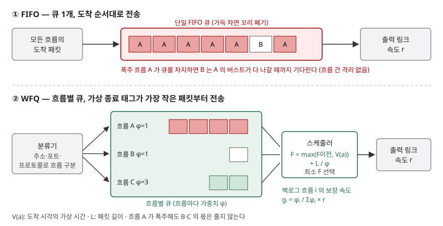

기출문제에서 라우터·스위치의 출력 큐를 다루는 두 방식, FIFO와 WFQ를 비교하라고 묻는다.
"FIFO는 먼저 온 것부터, WFQ는 가중치대로"라는 한 줄 대비와 장단점 나열로 끝내면 평이한
답안이 된다. 점수는 **WFQ가 무엇을 근사하는 방식인지(GPS)** 와 **가상 종료 태그로 전송 순서를
정하는 원리**를 쓰고, 비교를 **흐름 간 격리·지연 상한·구현 비용** 같은 축으로 세우는 데서 난다.

> 근거는 1차 자료다. WFQ를 처음 제안한 Demers·Keshav·Shenker 논문(1989), 그 이론적 근거인
> Parekh·Gallager의 GPS 논문(1993), 큐 관리 권고인 RFC 7567, 구현 사례인 Cisco IOS 설정
> 가이드를 썼다. 답안의 스케줄링 동작은 Parekh·Gallager 논문의 예제(Table I)를 파이썬으로
> 다시 계산해 **출발 시각이 논문 값과 같은지 검산했다.**

---

## Ⅰ. 개요

### 가. 문제의 초점

출력 링크보다 많은 패킷이 한꺼번에 몰리면 라우터는 패킷을 큐에 쌓는다. 이때 **어느 패킷을
먼저 내보낼지(스케줄링)** 가 흐름별 지연과 대역폭을 결정한다. FIFO는 도착 순서 하나만 보고,
WFQ는 흐름을 나눠 가중치에 비례한 몫을 보장한다. 두 방식의 차이는 결국 **한 흐름의 폭주가
다른 흐름에 전달되는가**다.

### 나. 답안의 구성

Ⅱ에서 FIFO의 동작과 한계를, Ⅲ에서 WFQ의 원리와 구성요소를, Ⅳ에서 두 방식을 비교하고
계산으로 차이를 확인한다.

## Ⅱ. FIFO(First In First Out) 방식

### 가. 정의

> FIFO는 모든 흐름의 패킷을 **하나의 큐**에 도착 순서대로 넣고 그 순서대로 전송하는 스케줄링
> 방식이다. 큐가 가득 차면 새로 도착한 패킷을 버린다(꼬리 폐기, tail drop).

Cisco 설정 가이드는 FIFO에 **우선순위나 트래픽 클래스라는 개념이 없고**, 버스트를 보내는
송신원이 시간에 민감한 트래픽을 지연시킬 수 있다고 적는다.

### 나. 특징 — 3가지

| 특징 | 내용 |
|---|---|
| ① 단순성 | 큐 1개와 포인터 두 개로 끝난다. 패킷당 처리가 상수 시간이라 고속 인터페이스에 맞는다 |
| ② 순서 보존 | 같은 흐름의 패킷이 뒤바뀌지 않는다 |
| ③ 무차별성 | 흐름·클래스를 구분하지 않으므로 서비스 품질을 구분해 줄 수 없다 |

### 다. 한계 — 3가지

① **흐름 간 격리가 없다.** RFC 7567은 꼬리 폐기 큐가 한 연결 또는 소수의 흐름이 큐 공간을
독점해 다른 연결을 굶기게 둔다고 지적하고, 이를 **잠김(lock-out) 문제**라 부른다.

② **큐가 가득 찬 상태로 오래 머문다.** 꼬리 폐기는 큐가 완전히 찼을 때만 혼잡 신호(폐기)를
내므로, 큐가 오랫동안 거의 가득 찬 채로 유지된다. RFC 7567이 든 **가득 찬 큐(full queues)
문제**이고, 모든 흐름의 큐잉 지연이 함께 커진다.

③ **지연 상한을 보장할 수 없다.** Parekh·Gallager는 FCFS(=FIFO)에서는 한 세션의 지연이
**다른 세션의 큐와 도착에 좌우된다**는 점을 GPS와 대비해 지적한다. 음성·영상처럼 지연 상한이
필요한 트래픽에 약속을 할 근거가 없다.

Nagle은 RFC 970에서 이 문제를 먼저 짚었다. 패킷을 많이 보낼수록 큐에서 더 많은 몫을 차지하는
구조라 **잘못 동작하는 호스트가 대역폭을 차지하는 것을 막을 수 없고**, 그래서 송신원별 큐를 두고
라운드 로빈으로 돌리는 공정 큐잉을 제안했다.

## Ⅲ. WFQ(Weighted Fair Queuing) 방식

### 가. 정의

> WFQ는 패킷을 흐름별 큐로 나누고, 이상적인 유체 모델인 GPS(Generalized Processor Sharing)에서
> 각 패킷이 전송을 마칠 **가상 종료 시각**을 계산해 그 값이 가장 작은 패킷부터 전송함으로써,
> 백로그된 흐름마다 **가중치에 비례한 대역폭**을 보장하는 스케줄링 방식이다.

Demers·Keshav·Shenker(1989)가 Nagle의 제안을 확장해 제시했고, Parekh·Gallager(1993)는 같은
방식을 독립적으로 PGPS(Packet-by-packet GPS)라는 이름으로 분석하면서 **WFQ와 같은 것**이라고
밝혔다.

### 나. 이론적 기준 — GPS

GPS는 서버가 여러 세션을 **동시에, 비트 단위로 나눠** 서비스한다고 가정한 이상적 모델이다.
세션 i에 가중치 φᵢ를 주면, 백로그된 두 세션이 받는 서비스량의 비는 가중치의 비 이상이 된다.
그 결과 세션 i는 다음 속도를 **다른 세션의 수요와 무관하게** 보장받는다.

```text
gᵢ = φᵢ / Σⱼ φⱼ × r        (r: 링크 속도)
```

GPS는 패킷을 통째로 보내지 않으므로 실제로 구현할 수 없다. WFQ는 **GPS에서 먼저 끝날 패킷을
먼저 보내는 방식으로 GPS를 패킷 단위로 근사한 것**이다.

### 다. 구성 및 동작 — 4단계



> **출처**: [Parekh & Gallager, A Generalized Processor Sharing Approach to Flow Control in Integrated Services Networks, IEEE/ACM ToN 1(3), 1993 — §II GPS Multiplexing · §III PGPS](https://pbg.cs.illinois.edu/courses/cs598fa09/readings/pg93.pdf) · [RFC 7567 §2 The Need for Active Queue Management](https://www.rfc-editor.org/rfc/rfc7567.html#section-2) · [Cisco IOS QoS Configuration Guide 12.2SR — Congestion Management Overview](https://www.cisco.com/c/en/us/td/docs/ios/qos/configuration/guide/12_2sr/qos_12_2sr_book/congstion_mgmt_oview.html)

| 단계 | 하는 일 | 근거·구현 예 |
|---|---|---|
| ① 흐름 분류 | 헤더로 흐름을 식별해 흐름별 큐에 넣는다 | Demers 등은 **송신·수신 쌍(대화)** 단위를 효율과 보안의 절충으로 택했다. Cisco는 주소·프로토콜·포트로 흐름을 나눈다 |
| ② 가상 시간 갱신 | GPS의 진행을 나타내는 가상 시간 V(t)를 계산한다. V(t)는 **r / (백로그된 흐름의 가중치 합)** 의 속도로 증가한다 | Parekh·Gallager의 가상 시간 구현 |
| ③ 가상 종료 태그 부여 | 도착한 패킷에 `F = max(F이전, V(a)) + L / φ` 를 붙인다. 같은 흐름의 앞 패킷이 끝나야 시작하므로 max를 취한다 | Demers 등의 종료 라운드 번호 |
| ④ 최소 태그 선택·전송 | 링크가 비면 도착해 있는 패킷 가운데 **F가 가장 작은 것**을 통째로 보낸다 (비선점) | PGPS의 선택 규칙 |

태그 F는 같은 가중치라면 패킷이 길수록, 가중치가 작을수록 커진다. 그래서 짧은 패킷을 드문드문
보내는 흐름은 태그가 작아 빨리 나가고, 버스트를 쏟아 넣는 흐름은 자기 태그만 계속 커진다.
Cisco 가이드가 **적은 양의 트래픽이 우선 서비스를 받고, 많은 양의 트래픽은 남은 용량을 가중치
비율로 나눈다**고 설명하는 이유다.

### 라. 지연 상한 — WFQ가 GPS에서 얼마나 벗어나는가

WFQ는 비선점이라 긴 패킷이 이미 나가고 있으면 태그가 더 작은 패킷도 기다린다. Parekh·Gallager의
**정리 1**은 그 차이에 상한이 있음을 보인다.

```text
F̂ₚ − Fₚ ≤ Lmax / r      (F̂: WFQ 출발 시각, F: GPS 출발 시각, Lmax: 최대 패킷 길이)
```

GPS에서 구한 지연 상한에 `Lmax / r`만 더하면 WFQ의 지연 상한이 된다. 송신원을 리키 버킷으로
제한하면 GPS의 최악 지연을 계산할 수 있으므로, WFQ로 **지연 상한을 약속하는 것이 가능해진다.**

## Ⅳ. FIFO와 WFQ의 비교

### 가. 비교표

| 비교 항목 | FIFO | WFQ |
|---|---|---|
| 큐 구성 | 인터페이스당 큐 1개 | 흐름(또는 클래스)별 큐 여러 개 |
| 전송 순서 기준 | 도착 시각 | GPS 기준 가상 종료 태그 |
| 대역폭 배분 | 많이 보내는 흐름이 많이 차지 | 백로그 흐름마다 `φᵢ / Σφⱼ × r` 보장 |
| 흐름 간 격리 | 없음 (잠김 문제) | 있음. 폭주 흐름은 자기 큐만 늘린다 |
| 지연 | 다른 흐름의 버스트에 좌우, 상한 없음 | GPS 상한 + `Lmax / r` 로 상한 계산 가능 |
| 차등 서비스 | 불가 | 가중치로 가능 (Cisco는 IP 우선순위 +1 비율) |
| 패킷당 처리 비용 | 상수 시간 | 흐름 분류 + 가상 시간 갱신 + 최소 태그 탐색 |
| 상태 정보 | 없음 | 흐름별 큐와 마지막 태그 |
| 폐기 | 꼬리 폐기 | 혼잡 폐기 임계치를 넘으면 많은 양을 보내는 흐름의 새 패킷부터 폐기 (Cisco) |
| 적합한 곳 | 고속 코어 링크, 혼잡이 드문 구간 | 저속 WAN 링크, 음성·대화형 트래픽이 섞인 구간 |

> Cisco IOS는 **E1(2.048Mbps) 이하 속도의 대부분 직렬 인터페이스에서 흐름 기반 WFQ를 기본**으로
> 쓴다. 그보다 빠른 인터페이스에서는 기본으로 켜지지 않는다.

### 나. 계산으로 본 차이

Parekh·Gallager 논문 Fig. 1의 도착 패턴(세션 1: 시각 1·2·3·11에 길이 1·1·2·2, 세션 2: 시각
0·5·9에 길이 3·2·2, 링크 속도 1)으로 GPS·WFQ·FIFO를 모두 계산했다. 태그 계산의 핵심은 다음과 같다.

```python
while i < len(arrivals) and arrivals[i].arrival == t:
    p = arrivals[i]
    p.tag = max(last_tag[p.session], v) + p.size / phi[p.session]
    last_tag[p.session] = p.tag
    pending.append(p)
    i += 1
backlogged = {p.session for p in pending}
...
v_speed = rate / sum(phi[s] for s in backlogged)   # V(t)의 증가 속도
```

> 전체 소스: [code/wfq_sim.py](code/wfq_sim.py) · 실행 기록: [code/output.txt](code/output.txt)

가중치를 `2φ1 = φ2`로 준 경우의 결과다.

```text
  가중치 2φ1 = φ2
  패킷  도착  크기  태그F   GPS종료  WFQ종료  FIFO종료  WFQ지연  FIFO지연
  1-1      1     1   1.50        4        4         4        3         3
  1-2      2     1   2.50        5        5         5        3         3
  1-3      3     2   4.50        9        9         7        6         4
  1-4     11     2   7.50       13       13        13        2         2
  2-1      0     3   1.50        4        3         3        3         3
  2-2      5     2   3.50        8        7         9        2         4
  2-3      9     2   5.50       11       11        11        2         2
  논문 Table I 과 일치: 예
  WFQ 가 GPS 보다 늦은 최대 시간 = 0  (정리 1 상한 Lmax/r = 3)
```

GPS·WFQ 출발 시각이 논문 Table I과 두 가중치 모두에서 같다. 패킷 2-2는 도착이 1-3보다 늦지만
가중치가 두 배라 태그가 3.5로 작아 **먼저 나간다(시각 7)**. FIFO에서는 1-3 뒤에 서서 9에 나간다.
같은 도착에서 가중치만으로 순서가 바뀌는 것이 WFQ다.

폭주하는 흐름과 섞였을 때의 차이는 더 크다. 세션 1이 시각 0에 길이 1인 패킷 8개를 한꺼번에
넣고 세션 2가 시각 0.5와 3에 하나씩 보내는 경우다(가중치 1:1).

```text
  세션 1 평균 지연  WFQ 6  FIFO 4.50
  세션 2 평균 지연  WFQ 1.75  FIFO 7.75
```

FIFO에서 세션 2는 세션 1의 버스트가 다 나갈 때까지 기다려 평균 7.75를 기다린다. WFQ에서는 1.75로
줄고, 늘어난 지연은 **버스트를 보낸 세션 1이 떠안는다.** 가중치 3:1인 두 세션이 동시에 12개씩
쌓아 둔 경우에는 처음 8시간 동안 WFQ가 6개:2개로 가중치 비율 그대로 보냈고, FIFO는 먼저 큐에
들어간 세션 2만 8개를 보냈다.

단, 첫 시나리오에서 가중치가 같을 때(`φ1 = φ2`)는 WFQ와 FIFO의 출발 시각이 모두 같았다
([code/output.txt](code/output.txt)). 흐름 사이 경쟁이 약하면 두 방식의 차이가 드러나지 않는다.
**WFQ의 효과는 혼잡이 있고 흐름의 행동이 서로 다를 때 나타난다.**

### 다. 적용 시 정보시스템 관점의 고려사항 — 4가지

| 고려사항 | 판단할 것 |
|---|---|
| ① 흐름 식별 단위 | 흐름을 5-튜플로 나눌지, 클래스(DSCP·IP 우선순위)로 묶을지. 흐름 단위는 공정하지만 흐름 수만큼 상태가 늘고, 클래스 단위(CBWFQ)는 관리 가능한 수로 줄인다 |
| ② 지연에 민감한 트래픽 | WFQ만으로는 음성처럼 엄격한 저지연이 필요한 트래픽에 부족할 수 있다. Cisco는 CBWFQ에 **엄격 우선순위 큐를 더한 LLQ**를 둔다 |
| ③ 큐 길이 관리 | RFC 7567은 스케줄링만으로는 전체 큐 크기를 제어하지 못하므로 **스케줄링과 AQM(능동 큐 관리)을 함께 써야 한다**고 권고한다 |
| ④ 처리 비용과 링크 속도 | 흐름 수가 많은 고속 링크에서는 태그 계산이 부담이 된다. 그 구간은 FIFO + AQM으로 두고 저속 병목 구간에 WFQ를 거는 식으로 나눈다 |

## Ⅴ. 결론

FIFO는 도착 순서 하나로 동작해 단순하고 빠르지만, 흐름 사이를 격리하지 못해 한 흐름의 버스트가
모든 흐름의 지연으로 번지고 지연 상한을 약속할 수 없다. WFQ는 GPS를 패킷 단위로 근사해 가상
종료 태그가 가장 작은 패킷부터 보내며, 백로그 흐름마다 가중치에 비례한 대역폭과 `Lmax / r` 이내의
GPS 근사를 보장한다. 따라서 망 설계에서는 두 방식 가운데 하나를 고르는 것이 아니라, **고속 코어는
FIFO와 AQM으로, 혼잡이 생기는 저속 병목 구간은 클래스 기반 WFQ와 우선순위 큐로** 구간에 따라
배치하고 QoS 정책(트래픽 분류·가중치)을 조직의 서비스 수준 목표와 맞춰 관리해야 한다.

> 개념 정리: [패킷 스케줄링 기법 — PQ·WRR·DRR·WFQ](../../network/2026-10-01-packet-scheduling-pq-wrr-drr-wfq/index.md)
> · [능동 큐 관리(AQM) — RED와 CoDel](../../network/2026-10-01-active-queue-management-red-codel/index.md)

끝

## 답안 작성 메모

- **먼저 쓸 것**: Ⅱ·Ⅲ의 한 줄 정의와 도식. 도식은 "큐 1개 → 링크" 와 "분류기 → 흐름별 큐 →
  스케줄러(최소 F) → 링크" 두 줄이면 5분 안에 옮길 수 있다. 태그 식
  `F = max(F이전, V(a)) + L/φ` 를 스케줄러 박스 안에 적는다.
- **점수가 갈리는 지점**: WFQ를 "가중치 라운드 로빈" 정도로 쓰지 않고 **GPS의 패킷 단위 근사**로
  설명하는지, 그리고 보장 속도 `gᵢ = φᵢ/Σφⱼ × r` 와 지연 상한 `Lmax/r` 을 쓰는지. FIFO의 한계는
  RFC 7567의 **잠김·가득 찬 큐** 두 용어로 쓰면 근거가 선다.
- **시간이 모자라면**: Ⅳ-나의 계산 예를 버리고 "폭주 흐름의 지연이 자기 큐에 갇힌다"는 한
  문장만 남긴다. 비교표는 논술형 필수이므로 남기되 "상태 정보"·"폐기" 행을 줄인다.
- 비교 끝에 "WFQ가 항상 낫다"로 끝내지 않는다. 경쟁이 약하면 결과가 FIFO와 같고 처리 비용만
  든다는 점이 구간별 배치라는 결론의 근거가 된다.
- 변형(DRR·SCFQ·WF²Q)은 이름만 한 줄 언급할 수 있으나 이번 답안의 축이 아니므로 넣지 않았다.

## 참고 자료

- [A. K. Parekh, R. G. Gallager, "A Generalized Processor Sharing Approach to Flow Control in Integrated Services Networks: The Single-Node Case", IEEE/ACM Transactions on Networking 1(3), pp. 344–357, 1993-06](https://pbg.cs.illinois.edu/courses/cs598fa09/readings/pg93.pdf) — §II GPS Multiplexing, §III PGPS, 정리 1, Table I (일리노이대 강의 자료로 공개된 논문 사본)
- [A. Demers, S. Keshav, S. Shenker, "Analysis and Simulation of a Fair Queueing Algorithm", ACM SIGCOMM 1989](https://dl.acm.org/doi/10.1145/75247.75248)
- [J. Nagle, RFC 970, On Packet Switches With Infinite Storage (1985-12)](https://www.rfc-editor.org/rfc/rfc970)
- [RFC 7567, IETF Recommendations Regarding Active Queue Management (2015-07) — §2 The Need for AQM, §2.1 AQM and Multiple Queues](https://www.rfc-editor.org/rfc/rfc7567.html#section-2)
- [Cisco IOS QoS Configuration Guide 12.2SR — Congestion Management Overview](https://www.cisco.com/c/en/us/td/docs/ios/qos/configuration/guide/12_2sr/qos_12_2sr_book/congstion_mgmt_oview.html)
- [Cisco IOS QoS: Congestion Management Configuration Guide 15M&T — Configuring Weighted Fair Queueing](https://www.cisco.com/c/en/us/td/docs/ios-xml/ios/qos_conmgt/configuration/15-mt/qos-conmgt-15-mt-book/qos-conmgt-cfg-wfq.html)
