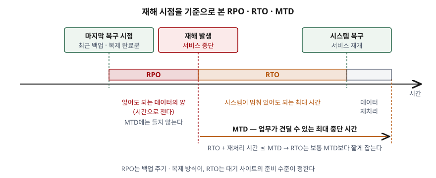
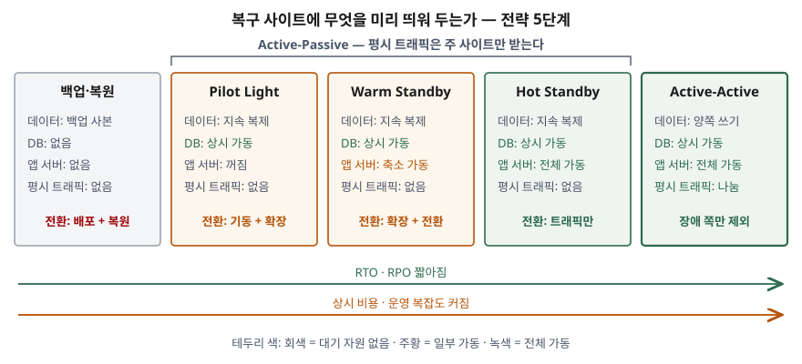

기출문제에서 클라우드 네이티브로 무중단을 지향하는 시스템이라도 재해복구 전략은
따로 세워야 한다는 전제를 깔고, 두 가지를 묻는다. 복구 목표인 RTO·RPO가 무엇인지,
그리고 Active-Active·Active-Passive·Pilot Light 세 방식이 무엇인지다. 용어 정의만
나열하면 평이한 답안이 된다. 점수는 **세 방식이 같은 층위의 용어가 아니라는 점**
(Pilot Light는 Active-Passive의 한 형태다)을 짚고, 각 방식이 **복구 사이트에 무엇을 미리
띄워 두느냐**로 RTO·RPO와 비용이 갈린다는 것을 하나의 축으로 묶는 데서 난다.

> 실행 검증 없음. 개념 문제이므로 NIST SP 800-34 Rev.1, AWS 재해복구 백서,
> Azure Well-Architected Framework 공식 문서 근거만으로 정리했다.

---

## Ⅰ. 개요

### 가. 무중단 아키텍처로 막지 못하는 것 — 가용성과 재해복구의 차이

클라우드 네이티브 시스템은 가용 영역(AZ) 여러 곳에 나눠 배포하고, 오토스케일링과
상태 점검으로 장애 인스턴스를 바꿔 끼운다. 이것은 **가용성(availability)** 을 높이는
설계다. AWS 재해복구 백서는 둘을 다음처럼 구분한다.

| 구분 | 가용성 | 재해복구(DR) |
|---|---|---|
| 대상 사건 | 부품 고장, 네트워크 문제, 소프트웨어 결함, 부하 급증 같은 **잦고 작은 장애** | 업무에 심각한 영향을 주는 **일회성 재해** |
| 목표 지표 | 기간 평균값 — MTBF, MTTR, 가용률("나인") | 사건 한 번에 대한 목표 — **RTO, RPO** |
| 목적 | 업무 기능을 수행할 수 있는 시간을 최대화 | **업무 연속성** 유지 |

무중단 설계로도 남는 위험이 **3가지** 있다.

- ① **리전 단위 재해**: 다중 AZ는 데이터센터 하나·여럿의 손실을 견디지만, 리전 전체를
  잃는 재해는 다른 리전으로 옮겨 가야 막는다
- ② **데이터 재해**: 지속 복제는 손상·삭제·악의적 변경도 그대로 복제한다. 백서는 지속
  복제가 데이터 손상과 무단 삭제를 시점 백업만큼 막지 못한다고 적는다
- ③ **규제 요건**: 백서는 재해의 정의가 리전 손실까지 가거나 규제가 요구하면
  Pilot Light 이상의 다중 리전 전략을 검토하라고 적는다

### 나. 재해복구 전략 수립 절차 — 4단계

| 단계 | 내용 | 근거 |
|---|---|---|
| ① 업무 영향 분석(BIA) | 업무 프로세스별로 중단 시 영향을 따지고 **MTD·RTO·RPO**를 정한다 | NIST SP 800-34 업무 영향 분석 절차(§3.2) |
| ② 위험 평가 | 재해 유형·지리적 범위별 발생 확률을 따진다 | AWS 백서 BCP 절 |
| ③ 전략 선택 | 복구 목표와 비용 한도를 동시에 만족하는 방식을 고른다 | AWS 백서 DR 선택지 절 |
| ④ 시험·유지 | 정기 훈련으로 목표 달성 여부를 확인하고 계획을 갱신한다 | Azure RE:09 |

AWS 백서는 재해복구 계획이 **업무 연속성 계획(BCP)의 일부**여야 하고 단독 문서가
되어서는 안 된다고 적는다. 시스템이 살아도 물류처럼 다른 업무 요소가 멈추면 복구
목표가 뜻을 잃기 때문이다.

## Ⅱ. (가) RTO와 RPO

### 가. 정의 — 출처 3가지

| 지표 | NIST SP 800-34 Rev.1 | AWS 재해복구 백서 | Azure WAF |
|---|---|---|---|
| **RTO** (Recovery Time Objective, 목표 복구 시간) | 시스템 자원이 다른 자원·업무 프로세스·MTD에 감내할 수 없는 영향을 주기 전까지 **사용 불가 상태로 있을 수 있는 최대 시간** | 서비스 중단부터 **서비스 복구까지 허용할 수 있는 최대 지연** | 재해 뒤 업무 운영을 **복구하는 데 허용되는 최대 시간** |
| **RPO** (Recovery Point Objective, 목표 복구 시점) | 중단 뒤 데이터를 **어느 시점까지 되살려야 하는가** — 중단 이전의 시점 | **마지막 복구 지점 이후 허용할 수 있는 최대 시간** | **시간으로 잰 허용 가능한 최대 데이터 손실** |

세 출처 모두 RTO는 **"얼마나 오래 멈춰도 되는가"**, RPO는 **"얼마만큼의 데이터를
잃어도 되는가(시간으로)"** 로 정의한다. NIST는 두 값을 시스템 소유자와 업무 관리자가
BIA에서 함께 정한다고 적고, AWS 백서는 두 값을 **조직이 정한다**고 적는다. 기술팀이
정하는 값이 아니라 업무가 정하고 기술이 맞추는 값이다.

### 나. 모식도 — 재해 시점 기준의 세 값

> **출처**: [NIST SP 800-34 Rev.1 §3.2.1 Determine Business Processes and Recovery Criticality](https://nvlpubs.nist.gov/nistpubs/Legacy/SP/nistspecialpublication800-34r1.pdf) · [AWS, Disaster Recovery of Workloads on AWS — Recovery objectives (RTO and RPO)](https://docs.aws.amazon.com/whitepapers/latest/disaster-recovery-workloads-on-aws/business-continuity-plan-bcp.html#recovery-objectives-rto-and-rpo)

### 다. MTD와의 관계 — 3가지

NIST SP 800-34는 BIA에서 정할 중단 허용치를 **MTD·RTO·RPO 3가지**로 든다.

- ① **MTD**(Maximum Tolerable Downtime, 최대 허용 중단 시간)는 업무 프로세스가 중단돼도
  조직이 감수할 수 있는 **전체 시간**이다. 업무 관점의 한계다
- ② **RTO는 MTD를 넘지 않게 정해야 하므로 보통 MTD보다 짧다.** 시스템이 돌아와도 중단
  동안 못 한 데이터를 다시 처리하는 시간이 더 들고, 그 시간까지 MTD 안에 들어야 한다
- ③ **RPO는 MTD에 들지 않는다.** 시간이 아니라 복구 과정에서 견딜 수 있는 **데이터 손실량**의
  문제이기 때문이다

### 라. RTO와 RPO의 비교

| 구분 | RTO | RPO |
|---|---|---|
| 묻는 것 | 얼마나 오래 **멈춰도** 되는가 | 얼마만큼 **잃어도** 되는가 |
| 시간 축 방향 | 재해 시점 **이후** | 재해 시점 **이전** |
| 결정하는 기술 요소 | 복구 사이트의 준비 수준, 배포 자동화(IaC), 전환 절차 | 백업 주기, 복제 방식(동기·비동기), 시점 복구(PITR) |
| 0에 가깝게 하려면 | 복구 사이트에 전체 규모를 상시 가동 | 동기 복제 — 쓰기 지연이 커진다 |
| MTD와의 관계 | MTD 안에 들어야 한다 | MTD와 별개 |

두 값을 줄일수록 비용과 복잡도가 커진다. AWS 백서는 **복구 전략의 비용이 장애·손실
비용보다 크면 규제 같은 별도 이유가 없는 한 도입하지 말라**고 적는다. 따라서 목표는
업무 등급마다 다르게 잡는다. Azure WAF는 업무를 중요도 등급으로 나누고 등급마다
RTO·RPO를 따로 도출하라고 권한다.

## Ⅲ. (나) Active-Active, Active-Passive, Pilot Light

### 가. 세 용어의 층위 — 먼저 짚을 것

세 용어는 같은 수준의 선택지가 아니다.

- **Active-Active / Active-Passive**는 **평시에 어느 사이트가 트래픽을 받는가**로 나눈
  **운영 형태**다
- **Pilot Light**는 Active-Passive 안에서 **대기 사이트를 얼마나 준비해 두는가**로 나눈
  단계 중 하나다

AWS 백서는 재해복구 전략을 **4가지**(백업·복원, Pilot Light, Warm Standby, Multi-site
Active/Active)로 나누고, Pilot Light와 Warm Standby를 Active/Passive 전략으로 묶는다.
Warm Standby를 전체 규모로 올린 형태는 **Hot Standby**라고 따로 부른다. Azure WAF는
Active-Passive를 Cold Standby와 Warm Standby로 나눈다.

> **출처**: [AWS, Disaster Recovery of Workloads on AWS — Disaster recovery options in the cloud](https://docs.aws.amazon.com/whitepapers/latest/disaster-recovery-workloads-on-aws/disaster-recovery-options-in-the-cloud.html) · [Azure Well-Architected Framework — Architecture strategies for disaster recovery (Definitions)](https://learn.microsoft.com/en-us/azure/well-architected/reliability/disaster-recovery)

### 나. Active-Active (Multi-site Active/Active)

**정의**: 여러 사이트(리전)에 워크로드를 동시에 운영하고 **모든 사이트가 평시 트래픽을
나눠 받는** 방식.

| 항목 | 내용 |
|---|---|
| 장애 시 동작 | 전환(failover)이라는 단계가 따로 없다. 장애 사이트로 가는 트래픽을 빼고 나머지가 전체 부하를 받는다 |
| RTO·RPO | 대부분의 재해에서 복구 시간을 **0에 가깝게** 할 수 있다. 다만 데이터 손상은 백업에 기대야 하므로 RPO가 0이 아니다 |
| 비용·복잡도 | 4가지 중 **가장 크다** |
| 핵심 설계 과제 | **쓰기 일관성** — 어느 사이트에서 쓰기를 받을지 정해야 한다 |

AWS 백서가 드는 쓰기 전략은 **3가지**다.

- ① **write global**: 쓰기는 한 리전에만 보내고, 그 리전이 죽으면 다른 리전을 승격한다
- ② **write local**: 가까운 리전에서 쓰기를 받고, 동시 갱신은 마지막 쓰기 우선(last writer
  wins) 같은 규칙으로 맞춘다
- ③ **write partitioned**: 사용자 ID 같은 분할 키로 쓰기 리전을 정해 충돌을 피한다

### 다. Active-Passive

**정의**: 주(active) 사이트가 평시 트래픽을 모두 받고, 대기(passive) 사이트는 **전환이
일어나기 전까지 트래픽을 받지 않는** 방식.

| 항목 | 내용 |
|---|---|
| 장애 시 동작 | 트래픽을 대기 사이트로 **전환**한다. DNS 장애 조치, 전역 부하분산기 같은 트래픽 관리 계층이 이 일을 한다 |
| RTO·RPO | 대기 사이트를 얼마나 준비해 두는가에 따라 갈린다. 백서는 이 형태에서 RTO·RPO가 **0보다 크다**고 적는다 |
| 쓰기 | 주 사이트에서만 받는다. 데이터 일관성 문제가 Active-Active보다 단순하다 |
| 세부 단계 | Pilot Light → Warm Standby → Hot Standby 순으로 준비 수준이 높아진다 |

**전환을 누가 시작하는가**가 판단 지점이다. 백서는 상태 점검·경보에 따른 자동 전환을
**신중하게** 쓰라고 적는다. 오경보로 전환하면 그 자체로 가용성과 데이터를 잃기 때문이다.
그래서 **수동으로 시작하되 절차는 자동화해 버튼 한 번으로 끝나게** 만드는 방식을 흔히 쓴다.

### 라. Pilot Light

**정의**: 데이터를 다른 리전으로 복제하고 **핵심 인프라(DB·저장소)만 상시 가동**하며,
애플리케이션 서버는 코드·설정만 준비한 채 **꺼 두는** Active-Passive 방식.

- **꺼 둔다의 뜻**: 백서는 리소스를 아예 배포하지 않고, **필요할 때 배포할 수 있는 설정과
  능력**을 갖춰 두는 것을 모범 사례로 든다
- **전환 시 할 일**: 애플리케이션 서버를 켜고(배포), 필요하면 핵심 외 인프라를 추가하고,
  전체 규모로 확장한 뒤 트래픽을 넘긴다
- **Warm Standby와의 차이**: Pilot Light는 **추가 조치 없이는 요청을 처리할 수 없고**,
  Warm Standby는 축소 규모로나마 **바로 처리할 수 있다.** 백서가 직접 짚는 구분점이다
- **백업·복원과의 차이**: 핵심 인프라가 늘 떠 있어 데이터 복원과 인프라 재구축을 건너뛴다

### 마. 비교

| 구분 | 백업·복원 | Pilot Light | Warm Standby | Hot Standby | Active-Active |
|---|---|---|---|---|---|
| 운영 형태 | — | Active-Passive | Active-Passive | Active-Passive | Active-Active |
| 복구 사이트의 DB | 없음, 백업에서 복원 | 상시 가동(복제 수신) | 상시 가동 | 상시 가동 | 상시 가동·쓰기 가능 |
| 복구 사이트의 앱 서버 | 없음, IaC로 재배포 | 꺼짐·미배포 | 축소 규모 가동 | 전체 규모 가동 | 전체 규모·서비스 중 |
| 전환 시 할 일 | 인프라 배포 + 데이터 복원 | 서버 기동 + 확장 + 전환 | 확장 + 전환 | 트래픽 전환 | 장애 사이트 제외 |
| RPO를 정하는 것 | 백업 주기 | 복제 지연 | 복제 지연 | 복제 지연 | 복제 지연·쓰기 전략 |
| 상시 비용 | 가장 낮다 | 낮다 | 중간 | 높다 | 가장 높다 |
| 대응하는 전통 사이트 | 콜드 사이트 | 콜드~웜 사이트 | 웜 사이트 | 핫 사이트 | 핫 사이트(부하 분산형) |

> 마지막 행은 AWS 백서와 NIST SP 800-34의 대체 처리 시설 분류(§5.1.5, 콜드·웜·핫)를
> 대조해 붙였다. NIST는 콜드 사이트 복구에 **며칠~몇 주**, 웜 사이트에 **몇 시간~며칠**이
> 걸릴 수 있다고 적고, 핫 사이트의 예로 **두 지역에서 동시에 운영하며 데이터를 계속
> 동기화하는 구성**을 든다. 클라우드 전략과 일대일 대응은 아니며, 준비 수준의 순서가 같다는
> 뜻이다.

## Ⅳ. 클라우드 네이티브 환경에서 전략 수립 시 고려사항

재해복구 전략은 결국 **데이터를 어떻게 옮기고, 복구 사이트를 어떻게 세우고, 트래픽을
어떻게 넘기는가**의 설계다. 정보시스템 쪽에서 판단할 항목을 **6가지**로 정리한다.

### 가. 데이터 계층 — 2가지

① **복제 방식이 RPO를 정한다**
- **동기 복제**: 여러 위치에 동시에 써서 데이터 손실이 없지만 쓰기 지연이 커진다.
  Azure WAF는 AZ 사이처럼 가까운 거리의 우선순위 높은 데이터에 쓰라고 권한다
- **비동기 복제**: 주 위치에 먼저 쓰고 나중에 복사한다. 지연은 작지만 복제 지연만큼 데이터를
  잃을 수 있다. 리전 사이 복제가 여기에 해당한다
- 데이터 저장소가 여럿이면 저장소마다 복제 지연이 달라, 복구 뒤 저장소끼리 시점이 어긋날
  수 있다. Azure WAF는 데이터 저장소 간 의존성을 고려하고 복구 중 무결성 점검을 자동화하라고 적는다

② **복제와 별개로 시점 백업을 둔다**
- 복제는 손상도 복제한다. 버전 관리나 **시점 복구(PITR)** 가 있어야 손상 이전으로 돌아간다
- 백서는 데이터 손상·삭제 재해에서는 Active-Active라도 복구 시간이 0보다 크고, 복구 시점은
  **재해를 발견하기 전의 어느 시점**이 된다고 적는다
- 백업을 **다른 계정**으로 복사하면 자격증명 탈취·내부자 위협에서도 사본이 남는다

### 나. 인프라·전환 계층 — 3가지

③ **복구 사이트를 코드로 세운다**
- 백업·복원과 Pilot Light는 전환 때 인프라를 배포해야 한다. IaC(인프라 코드) 없이 손으로
  세우면 복구 시간이 늘어 RTO를 넘길 수 있다
- 주 리전에는 전체 규모, 복구 리전에는 축소 규모를 같은 템플릿에서 조건으로 갈라 배포해야
  두 사이트의 구성이 어긋나지 않는다
- 복구 리전의 **서비스 할당량(quota)** 이 전체 규모를 수용할 만큼인지 미리 맞춘다

④ **전환 경로가 제어 평면에 기대지 않게 한다**
- 백서는 서비스를 실시간 처리를 맡는 **데이터 평면**과 환경 설정을 맡는 **제어 평면**으로 나누고,
  전환 작업에는 **데이터 평면 작업만** 쓰라고 권한다. 데이터 평면의 가용성 설계 목표가 더 높기 때문이다
- 오토스케일링 확장, 백업 복원, 가중치 라우팅 변경은 제어 평면 작업이다. Warm Standby가
  확장에 기대면 그만큼 복구 전략의 회복력이 낮아진다. 이 의존을 없앤 것이 Hot Standby다

⑤ **전환 판단과 복귀(failback)를 절차로 고정한다**
- 무엇을 재해로 선언할지 **활성화 기준**을 미리 정하고 모니터링에 넣는다 (Azure WAF)
- 자동 전환은 오경보 비용을 따져 쓰고, 수동 시작이라도 절차는 자동화한다
- 복귀는 전환과 **별개의 계획**으로 둔다. Azure WAF는 복귀를 전환과 같은 원칙으로 따로
  관리하지 않으면 복원이 불완전해지거나 중단이 길어질 수 있다고 적는다

### 다. 운영 계층 — 1가지

⑥ **훈련으로 목표를 검증한다**
- Azure WAF는 탁상 훈련, 비운영 환경 예행, 운영 수준 훈련을 계획에 넣고, **운영 수준 훈련만이
  실제 조건에서 RTO·RPO 달성을 확인하는 방법**이라고 적는다. 다만 운영 환경 훈련은 예상치 못한
  장애를 부를 수 있으므로 비운영 환경에서 먼저 검증한다
- DNS 전파처럼 내가 통제하지 못하는 지연도 측정해 복구 시간에 넣는다
- 계획서·스크립트·자격증명은 **장애 리전 밖에서도 꺼낼 수 있게** 복제해 둔다

## Ⅴ. 결론

무중단 아키텍처는 잦고 작은 장애를 흡수하는 **가용성** 설계이고, 리전 손실과 데이터 손상
같은 일회성 재해는 따로 세운 **재해복구** 전략이 막는다. 그 전략의 출발점은 BIA에서 업무가
정한 RTO·RPO이며, RTO는 MTD 안에 들어야 하고 RPO는 복제·백업 방식이 정한다.
Active-Active·Active-Passive는 평시 트래픽을 받는 사이트의 수로, Pilot Light는
Active-Passive 안에서 대기 사이트의 준비 수준으로 나뉜다. 대기 사이트에 미리 띄워 두는
범위가 넓을수록 RTO·RPO는 짧아지고 상시 비용은 커지므로, **업무 등급마다 다른 전략을
섞어 쓰고, 어느 전략이든 시점 백업과 정기 훈련을 함께 갖추는 것**이 클라우드 네이티브
환경의 재해복구 설계다.

끝

## 답안 작성 메모

- **먼저 쓸 것**: Ⅱ의 RTO·RPO 타임라인 모식도와 Ⅲ의 5단계 비교표. 두 개가 서면 정의와
  비교가 한꺼번에 채워진다. 모식도에는 MTD 화살표까지 그린다 — RTO만 그리는 답안과 갈린다.
- **점수가 갈리는 지점**:
  - Ⅲ-가에서 **세 용어의 층위가 다르다**(Pilot Light ⊂ Active-Passive)는 것을 먼저 쓰는지.
    셋을 같은 층위로 나란히 놓으면 문항의 의도를 놓친 답안으로 보인다
  - Ⅰ-가에서 **가용성과 재해복구를 구분**하고, 무중단 설계로도 남는 위험(리전 재해·데이터
    재해·규제)을 드는지. 문항의 전제("무중단이라도 DR은 필수")에 답하는 부분이다
  - Ⅳ를 "주기적 훈련 필요" 나열로 끝내지 않고 **동기·비동기 복제와 RPO, 제어 평면 의존,
    쓰기 전략** 같은 시스템 설계 판단으로 쓰는지
- **시간이 모자라면**: Ⅰ-나의 수립 절차 표, Ⅱ-가의 정의 표에서 Azure 열, Ⅲ-나의 쓰기 전략
  3가지를 버린다. Ⅲ-마의 비교표에서 백업·복원과 Hot Standby 열을 빼고 문항이 물은 셋만
  남겨도 된다. 단, 논술형은 비교표가 최소 1개 있어야 하므로 표 자체는 남긴다.
- 클라우드 제품 이름(Aurora, Route 53 등)은 답안에 쓰지 않았다. "전역 데이터베이스 복제",
  "DNS 장애 조치"처럼 기능 이름으로 쓴다.
- 제품별 복제 지연·승격 시간 같은 수치는 제품과 시점마다 달라 쓰지 않았다. 숫자로 쓴 것은
  NIST가 적은 콜드·웜 사이트 복구 소요 범위뿐이다.

## 참고 자료

- [NIST SP 800-34 Rev.1, Contingency Planning Guide for Federal Information Systems (2010-05)](https://nvlpubs.nist.gov/nistpubs/Legacy/SP/nistspecialpublication800-34r1.pdf) — §3.2.1 MTD·RTO·RPO, §5.1.5 대체 처리 시설
- [NIST CSRC Glossary — Recovery Time Objective](https://csrc.nist.gov/glossary/term/recovery_time_objective) · [Recovery Point Objective](https://csrc.nist.gov/glossary/term/recovery_point_objective) · [Maximum Tolerable Downtime](https://csrc.nist.gov/glossary/term/maximum_tolerable_downtime)
- [AWS, Disaster Recovery of Workloads on AWS: Recovery in the Cloud (2021-02-12)](https://docs.aws.amazon.com/whitepapers/latest/disaster-recovery-workloads-on-aws/disaster-recovery-workloads-on-aws.html)
  - [Introduction — Disaster recovery and availability](https://docs.aws.amazon.com/whitepapers/latest/disaster-recovery-workloads-on-aws/introduction.html)
  - [Business Continuity Plan (BCP) — Recovery objectives (RTO and RPO)](https://docs.aws.amazon.com/whitepapers/latest/disaster-recovery-workloads-on-aws/business-continuity-plan-bcp.html)
  - [Disaster recovery options in the cloud](https://docs.aws.amazon.com/whitepapers/latest/disaster-recovery-workloads-on-aws/disaster-recovery-options-in-the-cloud.html)
  - [Disaster recovery is different in the cloud](https://docs.aws.amazon.com/whitepapers/latest/disaster-recovery-workloads-on-aws/disaster-recovery-is-different-in-the-cloud.html)
- [Microsoft, Azure Well-Architected Framework — Architecture strategies for disaster recovery (RE:09, 2026-08-20 갱신)](https://learn.microsoft.com/en-us/azure/well-architected/reliability/disaster-recovery)
