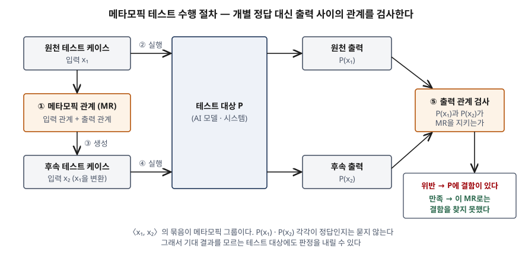

기출문제에서 AI 기반 시스템의 신뢰성을 확보하는 수단으로 메타모픽 테스트를 들고,
세 가지를 차례로 묻는다. 테스트 오라클 문제가 무엇이고 메타모픽 테스트가 왜 나왔는지,
핵심 구성요소인 메타모픽 관계와 수행 절차, 그리고 전통적 테스트와 무엇이 다른지다.
기법 소개만 하면 평이한 답안이 된다. 점수는 **"개별 출력의 정답을 몰라도 여러 출력 사이의
관계는 안다"** 는 한 가지 착상이 세 물음을 모두 관통한다는 것을 보이고, 그 대가로 생기는
한계(만족해도 정확성이 증명되지 않는다, 위반해도 어느 케이스가 틀렸는지 모른다)까지 쓰는
데서 난다.

> 실행 검증 없음. 개념 문제이므로 ISO/IEC/IEEE 29119-4:2021 용어 정의, ISTQB CT-AI
> 실러버스, 메타모픽 테스트 원 논문과 리뷰 논문, 테스트 오라클 서베이 논문 근거만으로 정리했다.

---

## Ⅰ. 개요

### 가. AI 시스템의 신뢰성과 테스트의 전제

전통적 테스트는 테스트 케이스마다 **기대 결과**를 미리 적어 두고, 실제 결과를 그것과
비교해 통과·실패를 정한다. ISO/IEC/IEEE 29119-4는 기대 결과를 "명세나 다른 근거에 따라
예측한, 특정 조건에서 관찰 가능한 테스트 대상의 동작"으로 정의한다. 기대 결과를 정할 수
있어야 테스트가 성립한다는 뜻이다.

AI 기반 시스템, 특히 기계학습(ML) 모델은 이 전제가 흔들린다. 동작이 명시적 규칙이 아니라
학습 데이터에서 만들어지므로, 입력 하나에 대해 **정답 출력이 무엇이어야 하는지를 사람이
계산해 낼 수 없는** 경우가 많다. 기대 결과가 없으면 테스트를 아무리 많이 돌려도 판정을
내리지 못한다.

### 나. 메타모픽 테스트의 위치

메타모픽 테스트(MT, Metamorphic Testing)는 이 문제를 **기대 결과를 정하는 대신 여러 실행
결과 사이의 관계를 검사하는** 방식으로 우회한다. 1998년 T. Y. Chen 등이 제안했고, ISO/IEC/IEEE
29119-4:2021은 이것을 **명세 기반 테스트 설계 기법**의 하나(§5.2.11)로 싣는다.
ISTQB의 AI 테스트 실러버스(CT-AI)는 AI 시스템의 오라클 문제를 덜어 주는 기법으로
A/B 테스트, 백투백 테스트와 함께 메타모픽 테스트를 든다.

## Ⅱ. (가) 테스트 오라클 문제와 메타모픽 테스트의 등장 배경

### 가. 테스트 오라클과 테스트 오라클 문제

| 용어 | 정의 | 출처 |
|---|---|---|
| **테스트 오라클** | 테스트의 기대 결과를 정하는 데 쓰는 근거 | ISTQB 용어집 (CT-AI 실러버스가 인용) |
| **테스트 오라클 문제** | 기대 결과를 정하기 어려워 테스트 통과·실패를 판정하지 못하는 문제 | ISTQB CT-AI 실러버스 테스트 오라클 절(§8.7) |
| | 주어진 입력에 대해 올바른 동작과 잘못된 동작을 가려내는 일의 어려움 | Barr 등, IEEE TSE 2015 |

CT-AI 실러버스는 오라클이 꼭 **기대값을 내놓는 것**일 필요는 없고, 시스템이 올바르게
동작하는지 **판정하는 메커니즘**이면 된다고 적는다. 메타모픽 테스트는 바로 이 "값 없이
판정만 하는" 오라클이다.

### 나. AI 시스템에서 오라클 문제가 커지는 이유 — 4가지

CT-AI 실러버스가 드는 원인을 정리하면 다음 4가지다.

- ① **실제 정답(ground truth)을 모른다**: 시스템이 예측하려는 현실의 정답 자체를 테스트
  시점에 알 수 없다. 비결정적·확률적 시스템일수록 심하다
- ② **시스템이 바뀐다**: 자가 학습 시스템은 스스로를 고치므로, 기대 동작을 그때마다 다시
  정해야 한다
- ③ **정답이 주관적이다**: 음성 비서처럼 사용자마다 기대가 다르고 말투에 따라 결과가 달라지는
  시스템은 하나의 기대 결과로 묶이지 않는다
- ④ **전문가 판정에 한계가 있다**: 전문가에게 기대 결과를 물을 수는 있으나, 전문가 사이에도
  의견이 갈리고 그 판단도 틀릴 수 있다

여기에 대규모 입력 공간이 겹친다. 오라클을 사람이 맡으면 테스트 케이스마다 사람이 출력을
확인해야 하므로, 테스트 자동화로 케이스를 수만 개 만들어도 판정 단계에서 막힌다. Barr 등은
이것을 **사람 오라클 비용 문제**(human oracle cost problem)로 따로 부른다.

### 다. 오라클 문제에 대한 접근 — 4가지 분류

Barr 등의 서베이는 오라클 문제의 해법을 4가지로 나누고, 메타모픽 테스트를 **유도 오라클**에
넣는다.

| 분류 | 판정 근거 | 예 | AI 시스템에서의 한계 |
|---|---|---|---|
| ① 명세 오라클 (specified) | 형식 명세·계약·단언 | 사전·사후 조건, 모델 기반 명세 | 학습으로 만든 동작은 형식 명세로 적기 어렵다 |
| ② 유도 오라클 (derived) | 다른 산출물에서 이끌어 낸 정보 | **메타모픽 관계**, 이전 버전과의 비교, 명세 추론 | 관계를 사람이 찾아야 한다 |
| ③ 암묵 오라클 (implicit) | 누구나 아는 명백한 결함 | 비정상 종료, 교착, 메모리 누수 | "틀린 예측"은 잡지 못한다 |
| ④ 오라클 없음 (human) | 사람의 판단 | 수작업 결과 확인 | 판정 비용이 케이스 수에 비례한다 |

### 라. 메타모픽 테스트의 등장 배경 — 3단계

① **성공한 테스트 케이스의 재활용 (1998)**: Chen 등은 "성공한 테스트 케이스는 쓸모없는가"를
다시 물었다. 결함을 드러내지 못한 케이스도 대상에 대한 정보를 담고 있으므로, 그 케이스를
변환해 **다음 테스트 케이스를 만드는** 방법으로 메타모픽 테스트를 제안했다. 원 기술 보고서는
대부분의 상황에서 테스트 오라클을 갖추는 것이 현실적으로 어렵다는 점을 출발점으로 삼는다.

② **오라클 완화 기법으로의 확장**: 원천 케이스가 성공했는지와 무관하게 쓸 수 있다는 점이
곧 드러났고, 메타모픽 테스트는 테스트 결과를 검증하는 **가벼운 오라클 메커니즘**으로
자리 잡았다 (Chen 등, ACM Computing Surveys 2018).

③ **표준·AI 테스트로의 편입**: 컴파일러·검색 엔진·생물정보 소프트웨어에서 실제 결함을
찾은 사례가 쌓였고, ISO/IEC/IEEE 29119-4:2021이 테스트 설계 기법으로 싣고 있다.
ISTQB CT-AI는 이미지 인식, 검색 엔진, 경로 최적화, 음성 인식에 메타모픽 테스트가 쓰였다고 적는다.

## Ⅲ. (나) 메타모픽 관계와 메타모픽 테스트 수행 절차

### 가. 정의

| 용어 | ISO/IEC/IEEE 29119-4:2021 | Chen 등 (2018) |
|---|---|---|
| **메타모픽 관계** (MR) | 테스트 입력의 변화가 기대 출력에 어떻게 영향을 주는지를 테스트 대상의 요구 동작에 근거해 기술한 것 (§3.34) | 대상 알고리즘 f가 **두 개 이상의 입력**과 그 출력들에 대해 반드시 지켜야 하는 성질 (Definition 1) |
| **메타모픽 테스트** | 기존 테스트 케이스와 메타모픽 관계를 바탕으로 테스트 케이스를 생성하는 명세 기반 테스트 설계 기법 (§3.35) | MR의 f를 구현 P로 바꾼 관계로, 원천·후속 케이스의 실행 결과를 검사하는 절차 (Definition 4) |

답안 첫 줄용 정의: **메타모픽 테스트란 테스트 대상이 여러 입력과 그 출력들 사이에서 반드시
지켜야 하는 관계(메타모픽 관계)를 이용해, 기존 테스트 케이스에서 후속 테스트 케이스를 만들고
그 출력들이 관계를 지키는지로 결함을 판정하는 테스트 설계 기법이다.**

### 나. 핵심 구성요소 — 4가지

| 구성요소 | 내용 | 최단 경로 예 (Chen 등 2018) |
|---|---|---|
| ① **메타모픽 관계 (MR)** | 입력 사이의 관계와 출력 사이의 관계를 묶은 필요 성질 | 시작·끝 정점을 바꿔도 최단 경로의 **길이는 같다** |
| ② **원천 테스트 케이스** (source) | 먼저 실행하는 기존 케이스. 정답을 몰라도 된다 | (G, a, b) |
| ③ **후속 테스트 케이스** (follow-up) | MR에 따라 원천 케이스(필요하면 그 출력까지)를 변환해 만든 케이스 | (G, b, a) |
| ④ **메타모픽 그룹** (MG) | 하나의 MR로 엮인 원천·후속 입력의 묶음. 판정의 단위 | 〈(G, a, b), (G, b, a)〉 |

판정은 |P(G, b, a)| = |P(G, a, b)|가 성립하는지만 본다. 큰 그래프에서 P가 낸 경로가 정말
최단인지 확인하려면 모든 경로를 나열해야 하지만, 두 결과의 길이가 같은지는 바로 비교된다.

### 다. 메타모픽 관계의 성질 — 3가지

Chen 등은 자주 오해되는 MR의 성질을 다음처럼 정리한다. 답안에서 MR을 정확히 아는지가
여기서 드러난다.

- ① **입력이 둘 이상이어야 한다**: −1 ≤ sin(x) ≤ 1처럼 입력 하나에 대한 성질은 MR이 아니라
  단언(assertion)이다. 같은 입력을 여러 버전에 넣어 비교하는 차분 테스트·N-버전 프로그래밍도
  **서로 다른 입력**이 없으므로 MR이 아니다
- ② **입력 관계·출력 관계로 늘 나뉘지는 않는다**: 최단 경로 위의 정점 c를 골라
  |P(G, a, c)| + |P(G, c, b)| = |P(G, a, b)|를 검사하는 MR은 후속 입력이 원천 **출력**에 기댄다
- ③ **등식일 필요가 없다**: 조건 c₁ ∨ … ∨ cₙ으로 조회하는 질의에서 조건 하나를 빼면 결과는
  원래 결과의 **부분집합**이어야 한다. 포함 관계도 MR이고, 확률적 관계로 넓힌 연구도 있다

AI 시스템에서 쓰이는 MR의 예는 다음과 같다.

| 대상 | 입력 변환 | 출력 관계 | 출처 |
|---|---|---|---|
| 평균 계산 | 원소 순서를 바꾼다 / 모든 원소에 2를 곱한다 | 결과가 같다 / 결과가 2배가 된다 | ISTQB CT-AI 메타모픽 테스트 절(§9.5) |
| 사망 연령 예측 모델 | 흡연량만 늘린다 | 예측 연령이 **줄거나 같다** | ISTQB CT-AI 메타모픽 테스트 절(§9.5) |
| 자율주행 조향 모델 | 같은 장면에 비·안개·밝기 변화를 입힌다 | 조향 판단이 원래 장면과 크게 달라지지 않아야 한다 | Tian 등, DeepTest (ICSE 2018) |

### 라. 수행 절차 — 5단계

> **출처**: [Chen et al., Metamorphic Testing: A Review of Challenges and Opportunities §2.2 Definition 1–4](https://doi.org/10.1145/3143561) · [ISTQB CT-AI Syllabus v1.0 §9.5 Metamorphic Testing](https://istqb.org/wp-content/uploads/2024/11/ISTQB_CT-AI_Syllabus_v1.0_mghocmT.pdf)

| 단계 | 할 일 | 정보시스템 관점의 산출물 |
|---|---|---|
| ① **MR 식별** | 요구사항·도메인 지식에서 대상이 지켜야 할 관계를 찾는다. 결과가 같은 MR과 달라지는 MR을 섞는다 | MR 목록 (입력 변환 규칙 + 출력 검사 규칙) |
| ② **원천 케이스 생성·실행** | 기존 케이스나 무작위·운영 데이터로 원천 입력을 만들고 실행한다 | 원천 입력·출력 기록 |
| ③ **후속 케이스 생성** | MR의 입력 관계로 원천 입력(필요하면 출력)을 변환한다. 자동화할 수 있다 | 후속 입력 (MG 단위로 묶어 저장) |
| ④ **후속 케이스 실행** | 같은 대상, 같은 환경에서 실행한다 | 후속 출력 기록 |
| ⑤ **MR 검사·판정** | 출력들이 MR의 출력 관계를 지키는지 본다. 위반이면 결함이다 | MR별 위반 목록 → 결함 보고 |

Chen 등의 정의(Definition 4)는 ②~⑤를 3단계로 적고 MR 식별을 전제로 둔다. 실무에서는 MR을
찾는 일이 가장 품이 드는 단계라 앞에 따로 세운다. ISTQB CT-AI 실습 항목도 MR 도출 → 원천
생성 → 후속 도출 → 실행 순서다.

## Ⅳ. (다) 전통적 테스트와 메타모픽 테스트의 차이

### 가. 비교

| 구분 | 전통적 테스트 | 메타모픽 테스트 |
|---|---|---|
| 기대 결과 | 케이스마다 **절대값**으로 미리 정한다 | 원천 케이스 결과에 대한 **상대적 관계**로만 정한다 |
| 오라클 | 반드시 필요하다 | 없어도 된다 (있어도 쓸 수 있다) |
| 판정 단위 | 테스트 케이스 1개 → 통과/실패 | 메타모픽 그룹 1개 → MR 만족/위반 |
| 케이스 설계 | 기법(동등 분할, 경계값 등)으로 입력을 고르고 기대 결과를 따로 계산한다 | MR 하나가 **후속 케이스 생성과 결과 판정을 함께** 정한다 |
| 실행 횟수 | 판정 1건에 1회 | 판정 1건에 2회 이상 |
| 실패 시 정보 | 어느 케이스가 틀렸는지 바로 안다 | 그룹 안의 **적어도 하나**가 결함과 관련된다는 것만 안다 |
| 통과의 의미 | 그 입력에서 기대 결과와 일치했다 | 그 관계에 대해 결함이 드러나지 않았을 뿐, 개별 출력이 맞다는 보장은 없다 |
| 필요 역량 | 명세에서 기대 결과를 계산하는 능력 | 도메인을 이해하고 관계를 찾는 능력 |

두 행이 이 비교의 핵심이다.

- **판정이 확정적이지 않다**: CT-AI 실러버스는 메타모픽 테스트의 기대 결과가 절대값이 아니라
  원천 케이스에 상대적이므로 **확정적인 결과를 내는 데는 맞지 않는다**고 적는다. 원천 출력과
  후속 출력이 똑같이 틀려 있으면 관계는 지켜진다
- **결함 위치가 흐리다**: Chen 등은 MR이 위반돼도 오라클이 없으면 그룹 안의 어느 케이스가
  잘못됐는지 알 수 없고, 이것이 메타모픽 테스트의 본래 성질이라 피할 수 없는 대가라고 적는다.
  디버깅·결함 위치 추정에 쓰려면 추가 장치가 필요하다

### 나. 다른 오라클 완화 기법과의 차이

AI 시스템 테스트에서는 메타모픽 테스트를 단독으로 쓰지 않고 다른 기법과 고른다.
CT-AI 실러버스의 기법 선택 절(§9.7)을 바탕으로 정리한다.

| 기법 | 무엇을 기준으로 판정하나 | 테스트 케이스 생성 | 맞는 상황 |
|---|---|---|---|
| **메타모픽 테스트** | 같은 시스템의 여러 출력 사이 관계 | MR로 자동 생성한다 | 오라클이 없고, 도메인 관계가 알려진 경우 |
| **백투백 테스트** | 독립적으로 만든 다른 시스템(유사 오라클)의 출력 | 따로 준비해야 한다 | 대체 구현이나 이전 버전이 있는 경우. 코드를 공유하면 같은 결함으로 일치할 수 있다 |
| **A/B 테스트** | 두 변형의 통계적 성능 비교 | 생성하지 않는다. 운영 입력을 쓴다 | 모델 갱신·자가 학습 시스템의 회귀 확인 |
| **단언·암묵 오라클** | 입력 하나에 대한 성질, 명백한 실패 | — | 범위 위반·비정상 종료 검출 |

### 다. 함께 쓰는 관계 — 대체가 아니라 보완

메타모픽 테스트는 전통적 테스트를 대체하지 않는다. Chen 등은 20년간 여러 테스트 선택 기법의
평가 기준으로 쓰여 온 Siemens 프로그램 묶음에서 메타모픽 테스트가 남아 있던 실제 결함 3건을
찾았다고 보고하며, 이것을 **기존 기법과 다른 관점으로 케이스를 만들기 때문**으로 설명한다.
오라클이 있는 부분은 전통적 테스트로, 오라클이 없는 AI 구성요소는 메타모픽 테스트로 맡기는
식으로 나눈다. CT-AI 실러버스도 AI 기반 시스템에는 AI 구성요소와 비AI 구성요소가 섞여 있고,
비AI 구성요소의 기법 선택은 기존과 같다고 적는다.

## Ⅴ. 결론

### 가. AI 시스템 테스트 체계에 적용할 때 고려사항 — 4가지

- ① **MR을 요구사항 산출물로 관리한다**: MR은 결국 "이 시스템이 반드시 지켜야 할 성질"이다.
  Chen 등은 현재의 명세 작성 관행이 MR 식별을 돕도록 되어 있지 않다는 점을 과제로 든다.
  요구사항 단계에서 불변 성질을 MR 목록으로 남기면 테스트 설계로 바로 이어진다
- ② **서로 다른 MR을 여러 개 쓴다**: Liu 등(IEEE TSE 2014)은 성격이 다른 MR 3~6개로 오라클
  기반 테스트가 찾을 수 있는 결함의 90% 이상을 찾았다고 보고한다. 같은 성질을 다르게 적은
  MR을 늘리는 것은 효과가 적다
- ③ **허용 오차를 명시한다**: ML 출력은 실수값·확률이므로 "같다"를 등식으로 두면 정상 동작도
  위반으로 잡힌다. 자율주행 조향처럼 **얼마나 달라지면 위반인지**를 기준으로 정해 둔다
- ④ **파이프라인에 넣어 자동으로 돌린다**: 후속 케이스 생성과 MR 검사는 자동화할 수 있으므로,
  모델을 다시 학습할 때마다 같은 MR 묶음을 회귀 테스트로 돌린다. 위반 그룹은 입력·출력과
  함께 저장해 결함 분석의 출발점으로 쓴다

### 나. 맺음

AI 시스템의 신뢰성 확보를 막는 것은 테스트 실행이 아니라 **판정**이다. 정답 출력을 정할 수
없으면 케이스를 늘려도 결함을 가려내지 못한다. 메타모픽 테스트는 개별 출력의 정답 대신
**여러 입력과 출력 사이의 필요 관계**를 오라클로 삼아 이 판정 문제를 덜고, MR 하나로 후속
케이스 생성과 결과 판정을 함께 해결한다. 다만 관계를 지켰다고 정확성이 증명되지는 않고
위반 시 결함 위치가 흐리므로, 오라클이 있는 부분의 전통적 테스트, 백투백·A/B 테스트와
**역할을 나눠 조합할 때** AI 시스템 검증 체계의 한 축이 된다.

끝

## 답안 작성 메모

- **먼저 쓸 것**: Ⅲ-라의 절차 모식도와 Ⅳ-가의 비교표. 모식도에 원천·후속·MR·출력 관계 검사가
  다 보이면 (나)의 구성요소와 절차가 한 번에 채워진다. 비교표는 논술형 필수 요건이다.
- **점수가 갈리는 지점**:
  - Ⅱ에서 오라클 문제를 정의만 하지 않고 **AI에서 왜 더 심해지는지**(정답 부재·자가 학습·
    주관성·전문가 한계)를 개수로 드는지. 문항이 AI 시스템을 앞에 세운 이유에 답하는 부분이다
  - Ⅲ-다에서 **MR은 두 개 이상의 입력에 걸친 관계**라는 점을 짚는지. 단언·차분 테스트와 구분하지
    못하면 MR을 정확히 모르는 답안으로 보인다
  - Ⅳ에서 장점만 쓰지 않고 **"만족 ≠ 정확", "위반 시 어느 케이스인지 모름"** 두 한계를 쓰는지.
    전통적 테스트와의 차이를 묻는 문항에서 가장 변별력이 큰 행이다
- **시간이 모자라면**: Ⅱ-다의 4분류 표를 한 줄("MT는 유도 오라클")로 줄이고, Ⅳ-나의 다른 기법
  비교표와 Ⅳ-다를 버린다. Ⅲ-다의 AI 예시 표는 행 하나(자율주행)만 남긴다.
- **수치**: 본문에 쓴 숫자는 Liu 등의 "MR 3~6개로 90% 이상"과 Siemens 결함 3건뿐이다. 둘 다
  원 논문(IEEE TSE, ACM CSUR)이 보고한 값이다. 도구별 성능이나 시장 수치는 쓰지 않았다.
- 문항이 "가. 나. 다."로 나눠 물었으므로 Ⅱ~Ⅳ를 그 순서 그대로 대항목으로 썼다.

## 참고 자료

- [ISO/IEC/IEEE 29119-4:2021, Software and systems engineering — Software testing — Part 4: Test techniques](https://www.iso.org/standard/79430.html) — §3.32 expected result, §3.34 metamorphic relation, §3.35 metamorphic testing, §5.2.11 Metamorphic testing ([iTeh 미리보기](https://cdn.standards.iteh.ai/samples/79430/6c93dfe4a05b46a8895e04dfd74ddd24/ISO-IEC-IEEE-29119-4-2021.pdf))
- [T. Y. Chen, S. C. Cheung, S. M. Yiu, Metamorphic Testing: A New Approach for Generating Next Test Cases, Technical Report HKUST-CS98-01 (1998)](https://arxiv.org/abs/2002.12543)
- [T. Y. Chen et al., Metamorphic Testing: A Review of Challenges and Opportunities, ACM Computing Surveys 51(1), Article 4 (2018-01)](https://doi.org/10.1145/3143561) — §2.1 등장 배경, §2.2 Definition 1–4, §3 Concept 1–4, §4.2 실제 결함 사례, §6 결함 위치 정밀도
- [E. T. Barr et al., The Oracle Problem in Software Testing: A Survey, IEEE TSE 41(5) (2015-05)](https://doi.org/10.1109/TSE.2014.2372785) — 오라클 4분류
- [ISTQB, Certified Tester AI Testing (CT-AI) Syllabus v1.0 (2021-10-01)](https://istqb.org/wp-content/uploads/2024/11/ISTQB_CT-AI_Syllabus_v1.0_mghocmT.pdf) — §8.7 Test Oracles for AI-Based Systems, §9.3~9.5, §9.7 Selecting Test Techniques
- [H. Liu, F.-C. Kuo, D. Towey, T. Y. Chen, How Effectively Does Metamorphic Testing Alleviate the Oracle Problem?, IEEE TSE 40(1) (2014)](https://doi.org/10.1109/TSE.2013.46)
- [Y. Tian, K. Pei, S. Jana, B. Ray, DeepTest: Automated Testing of Deep-Neural-Network-driven Autonomous Cars, ICSE 2018](https://arxiv.org/abs/1708.08559)
