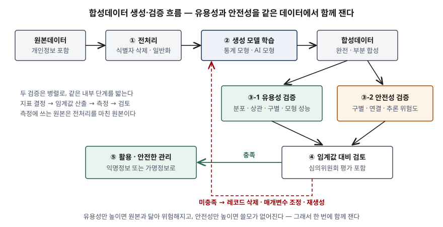

기출문제에서 AI 학습용 데이터를 확보하기 어려운 상황을 배경으로 합성데이터를 들고, 두 가지를
묻는다. 합성데이터가 무엇이고 어떤 기법으로 만드는지, 그리고 만든 합성데이터의 품질을 무엇으로
평가하는지다. 생성 모델 이름만 나열하면 평이한 답안이 된다. 점수는 **"품질"이 하나의 축이 아니라
유용성과 안전성 두 축이고, 둘이 서로 당긴다**는 것을 보이는 데서 난다. 원본과 너무 닮으면
개인이 드러나고, 너무 다르면 쓸모가 없다. 생성 기법의 선택도, 평가 지표의 구성도 이 상충에서
나온다.

> 실행 검증 없음. 개념 문제이므로 개인정보보호위원회 「합성데이터 생성·활용 안내서」(2024-12),
> NIST SP 800-188(2023-09), 평가 지표 원 논문 근거만으로 정리했다.

---

## Ⅰ. 개요

### 가. AI 학습 데이터 확보의 두 가지 제약

개인정보보호위원회 안내서는 합성데이터가 필요해진 이유를 두 가지로 든다.

- ① **법적 제약**: 현실에 맞는 AI 서비스에는 개인정보가 담긴 데이터가 필요하지만, 수집 목적
  외 이용·제3자 제공 제한 때문에 그대로 쓰기 어렵다
- ② **양적 제약**: 공개 데이터가 생기는 속도에는 한계가 있고, 희귀 질환·사고 장면처럼 원래
  드문 사례는 모을 수 있는 양 자체가 적다

기존 대응은 원본을 그대로 두고 식별자를 지우거나 준식별자를 바꾸는 **비식별 처리**였다.
이 방식은 원본 레코드와 처리된 레코드가 1:1로 남으므로, 준식별자를 더 많이 가릴수록 분석
가치가 떨어지고 덜 가리면 재식별 위험이 남는다.

### 나. 합성데이터의 위치

합성데이터는 원본 레코드를 고치는 대신 **원본의 분포를 학습한 모델로 새 레코드를 만든다.**
NIST SP 800-188은 합성데이터를 식별자 제거·준식별자 변환과 나란히 놓인 **비식별 기법의 한
갈래**로 다루고, 개인정보보호위원회 안내서는 이를 **개인정보 보호 강화 기술(PET)** 의 하나로
분류한다. 어느 쪽이든 목표는 같다. 원본의 통계적 성질은 남기고, 원본 속 개인과의 연결은 끊는다.

## Ⅱ. (가) 합성데이터의 개념과 생성 기법

### 가. 정의

| 출처 | 정의 |
|---|---|
| 개인정보보호위원회 안내서 (2024-12) | 특정 목적을 위해 원본데이터의 형식·구조·통계적 분포 특성과 패턴을 학습해 생성한 모의 또는 가상 데이터 |
| 같은 안내서 용어 정리 | 컴퓨터 시뮬레이션이나 알고리즘으로 생성한 정보로, 원본데이터의 구조적·통계적 속성을 재현한 데이터 |
| NIST SP 800-188 (2023-09) | 원본 데이터셋으로 모델을 만들고 그 모델로 만들어 낸 데이터셋. 원본과 레코드가 1:1로 대응하지 않으면 완전 합성이다 |

답안 첫 줄용 정의: **합성데이터란 원본데이터의 구조와 통계적 분포를 학습한 모델로 생성한 가상
데이터로, 원본의 분석 가치는 유지하면서 원본 속 개인과의 1:1 대응을 끊어 개인정보 노출 없이
데이터를 활용하게 하는 개인정보 보호 강화 기술이다.**

안내서는 synthetic data를 "재현데이터"로 옮기기도 하나 같은 뜻으로 쓴다고 밝힌다.

### 나. 유형 — 3가지 기준

| 기준 | 유형 | 내용 | 출처 |
|---|---|---|---|
| ① 합성 정도 | **완전 합성** | 원본 레코드가 전혀 없이 모두 생성한 데이터 | 개인정보보호위원회 안내서 · NIST SP 800-188 |
| | **부분 합성** | 일부 행·열·셀만 모델 값으로 바꾼 데이터. 원본 레코드가 남아 유용성은 높지만 원본과 연결될 가능성이 커진다 | 같음 |
| ② 원본 형태 | **정형** | 표(행·열) 데이터에서 만든 합성데이터. 수치·문자·범주·날짜 컬럼 | 개인정보보호위원회 안내서 |
| | **비정형** | 텍스트·이미지·영상·음성에서 만든 합성데이터 | 같음 |
| ③ 처리 목적 | 공개용 · 내부 분석·학습용 · 교육용 · 기술 검증용 | 기술 검증용은 IT 시스템 위탁 개발 시 실데이터 대신 테스트 데이터로 제공 | 같은 안내서 (UNECE 2022 인용) |

NIST는 여기에 원본을 쓰지 않고 형식만 맞춘 **테스트 데이터**와, 실데이터처럼 보이지만 기밀
정보에서 유래하지 않은 **현실적 테스트 데이터**를 구분해 둔다. 원본에서 학습하지 않았으므로
개인정보 위험이 없지만 분석 결과가 원본과 같다는 보장도 없다.

### 다. 생성 기법 — 2계열 6가지

개인정보보호위원회 안내서(부록1)는 생성 방법을 **통계 모형 기반**과 **AI 모형 기반** 두 계열로
나누고 각 3가지를 든다.

| 계열 | 기법 | 생성 원리 | 장점 | 단점 |
|---|---|---|---|---|
| **통계 모형** | ① 순차 조건부 생성 (synthpop, CART) | 컬럼을 하나씩 앞 컬럼에 대한 조건부 분포(의사결정나무·회귀)로 생성 | 빠르고, CART는 유용성이 높은 편 | CART는 원본과 같은 레코드가 나올 가능성이 상대적으로 높다 |
| | ② 가우시안 혼합 모델 (GMM) | 원본을 여러 정규분포의 혼합으로 가정하고 표본 추출 | 연속형 컬럼이 많을 때 효과적 | 정규분포 가정이 안 맞으면 품질이 떨어진다 |
| | ③ 베이지안 네트워크 | 변수 간 조건부 의존관계를 그래프로 두고 조건부 확률로 생성 | 변수 간 의존관계를 잘 재현 | 변수가 늘면 가능한 구조 수가 급격히 늘어 계산 비용이 커진다 |
| **AI 모형** | ④ 변분 오토인코더 (VAE) | 인코더가 원본을 잠재 공간의 분포(평균·분산)로 보내고, 디코더가 그 공간에서 표본을 복원 | GAN보다 계산량이 적다 | 복잡한 패턴 학습에 한계 |
| | ⑤ 생성적 적대 신경망 (GAN) | 생성자와 판별자가 경쟁하며 학습. 정형은 CTGAN, 이미지는 StyleGAN 같은 변형을 쓴다 | 이미지 등 비정형 합성 성능이 뛰어남 | 미세조정이 필요하고 생성 비용·시간이 크다 |
| | ⑥ 확산 모델 (Diffusion) | 원본에 잡음을 단계적으로 더한 뒤, 잡음을 걷어 내는 역과정을 학습해 생성 | 고차원 분포를 안정적으로 모형화, 고품질 | 학습·구현이 복잡하고 시간·비용이 크다 |

계열 사이의 차이는 다음 한 줄로 정리된다. 통계 모형은 **어떤 성질을 보존할지 사람이 모형에
적어 넣고**, AI 모형은 **데이터에서 성질을 스스로 학습한다.** NIST는 그 대가를 각각 적는다.
전통 모형은 모형에 넣지 않은 고차 상호작용을 합성데이터에서 찾기 어렵고, 딥러닝 모형은 학습
데이터를 얼마나 **기억해 그대로 다시 내놓는지**를 정량화하기 어렵다.

여기에 **차분 프라이버시(DP) 합성**이 보호 장치로 겹쳐진다. NIST SP 800-188의 차분 프라이버시
합성 절(§4.4.7)은 어떤 개인 한 명을 데이터에서 빼거나 넣어도 결과가 크게 달라지지 않게
잡음을 넣고, 그 정도를 프라이버시 손실 매개변수 ε로 조절한다고 설명한다. ε가 클수록 정확도는
오르고 프라이버시 손실도 커진다. 위 6가지 기법 어디에나 학습 단계에 결합할 수 있고, 안전성을
**사후 측정이 아니라 수학적 보장**으로 바꾼다는 점이 다르다.

어느 기법이든 안내서가 공통으로 요구하는 조건이 둘 있다. 생성 알고리즘과 코드를 공격자가
가져가도 원본을 역산할 수 없는 **비가역 알고리즘**이어야 하고, 원본 레코드에 난수를 더해 한 줄씩
변형하는 방식은 안전성을 보장하는 합성 방법으로 보지 않는다.

### 라. 생성·활용 절차 — 5단계

> **출처**: [개인정보보호위원회, 합성데이터 생성·활용 안내서 (2024-12) 제3장 1~5절, 3단계 안전성 및 유용성 검증](https://www.data.go.kr/data/15142321/fileData.do)

| 단계 | 할 일 | 정보시스템 관점의 산출물 |
|---|---|---|
| ① **사전준비** | 활용 목적·환경을 정하고 **안전기준을 먼저 설정**한다 | 활용 목적서, 안전 수준(공개용은 엄격·내부용은 완화) |
| ② **합성데이터 생성** | 탐색적 분석 → 전처리(식별자 삭제, 극단값·저빈도 범주 일반화) → 기법·매개변수 결정 → 생성 → 후처리(논리적 제약 위반 교정) | 개인정보 처리계획, 생성 모델과 매개변수 기록 |
| ③ **안전성·유용성 검증** | 두 검증을 병렬로. 각각 지표 결정 → 임계값 산출 → 측정 → 검토·후처리 | 지표별 측정값, 안전성 자체 검토 결과서 |
| ④ **심의위원회 평가** | 검증 결과와 절차의 적정성을 외부 시각으로 판단 | 평가 의견, 익명·가명 판정 |
| ⑤ **활용·안전한 관리** | 잔여 위험(멤버십 추론, 기술 발전에 따른 식별 가능성 증가)에 대비해 관리계획 이행 | 활용 이력 모니터링, 재검증 계획 |

## Ⅲ. (나) 합성데이터의 품질 평가 지표

### 가. 품질의 두 축과 세 성질

개인정보보호위원회 안내서는 합성데이터 검증을 **유용성 검증**과 **안전성 검증** 둘로 나눈다.

| 축 | 묻는 것 | 정의 (개인정보보호위원회 안내서 용어 정리) |
|---|---|---|
| **유용성** (utility) | 원본 대신 써도 되는가 | 합성데이터와 원본의 통계적 분포가 얼마나 유사한지, 같은 목표를 달성할 수 있는지 |
| **안전성** (privacy) | 원본 속 개인이 드러나는가 | 합성데이터를 통해 원본 속 개인이 식별될 가능성이 있는지 |

Alaa 등(ICML 2022)은 생성 모델 평가를 표본 단위의 세 성질로 더 쪼갠다. 유용성 축이 둘로 나뉘는
셈이다.

- ① **충실도** (fidelity, α-Precision): 합성 표본이 실제 데이터 분포가 있는 영역에 놓이는가
- ② **다양성** (diversity, β-Recall): 실제 분포의 영역을 빠짐없이 덮는가. 흔한 패턴만 반복하면
  충실도는 높아도 다양성이 낮다
- ③ **일반화** (generalization, Authenticity): 학습 데이터를 베끼지 않았는가. 안전성 축과 맞닿는다

### 나. 유용성 지표 — 정형 4가지

| 측도 | 무엇을 비교하나 | 대표 지표 | 해석 |
|---|---|---|---|
| ① **일차원 분포 유사성** | 컬럼 하나씩, 원본과 합성의 분포 | 얀센-섀넌 발산(JSD), 콜모고로프-스미르노프 통계량(연속형), 카이제곱 통계량(범주형) | JSD는 0에 가까울수록 좋다 |
| ② **이차원 관계 유사성** | 컬럼 쌍 사이의 상관관계 | 두 데이터의 상관계수 행렬 차이값의 표준편차. 수치형은 피어슨, 범주형은 크래머 V, 수치-범주는 분산분석의 SSB/SST | 0에 가까울수록 좋다. 선형 관계만 잡는다 |
| ③ **구별 불가능성** | 데이터 전체의 결합 분포 | 원본·합성을 섞어 둘을 가리는 분류 모형을 학습하고, 예측 확률로 계산한 성향점수 평균제곱오차(pMSE) | 0에 가까울수록 좋다. 분류기가 못 가릴수록 닮았다 |
| ④ **모형 성능 유사성** | 실제 과업에서의 쓸모 | 원본으로 학습한 모델과 합성으로 학습한 모델을 같은 실데이터로 평가해 정확도·재현율·정밀도·F1을 비교 (TSTR). 회귀는 회귀계수 신뢰구간 겹침 정도 | 차이가 작을수록, 신뢰구간 겹침이 1에 가까울수록 좋다 |

①→④로 갈수록 보는 범위가 넓어진다. ①은 컬럼 하나, ②는 컬럼 둘, ③은 데이터 전체의 결합
분포, ④는 활용 목적이다. ①만 통과하고 ②에서 떨어지는 데이터는 흔하다 — 컬럼마다 따로 표본을
뽑으면 각 컬럼의 분포는 맞지만 컬럼 사이 관계는 사라진다. 그래서 단계를 올라가며 함께 본다.

④의 방식은 Esteban 등(2017)이 **TSTR**(Train on Synthetic, Test on Real)로 이름 붙였다.
pMSE는 Snoke 등(2018)이 합성데이터의 **일반 유용성** 지표로 정리한 것이다.

### 다. 유용성 지표 — 비정형 3가지

| 측도 | 방법 |
|---|---|
| ① 모형 성능 | 원본 학습 모델과 합성 학습 모델의 정확도·재현율·정밀도·F1 비교 |
| ② 시각 튜링 테스트 | 사람이 원본과 합성을 섞은 이미지에서 원본을 맞히게 하고, 그 정확도를 본다 |
| ③ 이미지 품질 | Inception Score, FID 같은 분포 수준 품질 지표로 원본과 합성을 비교 |

### 라. 안전성 지표 — 정형 3가지

개인정보보호위원회 안내서는 EU 제29조 작업반의 익명화 평가 기준(Opinion 05/2014)을 가져와 세
위험도를 제시한다.

| 위험도 | 막으려는 공격 | 계산 | 해석 |
|---|---|---|---|
| ① **구별 위험도** (single out) | 합성 안에 원본 레코드가 그대로 있다 | 합성 레코드마다 원본에 같은 레코드가 있으면 1, 없으면 0을 매기고 평균 | 0에 가까울수록 안전 |
| ② **연결 위험도** (linkability) | 공격자가 원본의 준식별자를 알고 합성에서 민감정보를 알아낸다 | CAP(Correct Attribution Probability). 원본 레코드와 준식별자가 같은 합성 레코드 중 민감정보까지 같은 비율 | 0에 가까울수록 안전. 안내서는 임계값을 0.7 이하로 두기를 권한다 |
| ③ **추론 위험도** (inference) | 똑같지는 않지만 매우 가까운 합성 레코드로 개인을 추론한다 | 합성 레코드에서 가장 가까운 원본 레코드까지의 거리와, 그 원본 레코드에서 가장 가까운 다른 원본 레코드까지의 거리를 비교 | 1이면 위험, 0이면 안전하나 유용성이 매우 낮음, 0.5가 균형 |

①은 **같으냐**를, ③은 **가까우냐**를 본다. ①이 0이어도 ③이 높을 수 있다 — 원본 값에 아주 작은
변화만 준 레코드는 구별 위험도에 잡히지 않는다. 그래서 두 지표를 함께 쓴다. ③의 해석에서
0.5가 균형점이라는 것은 이 지표가 안전성과 유용성을 한 축에서 동시에 본다는 뜻이다.

### 마. 안전성 지표 — 비정형 2단계

이미지는 픽셀이 같아야 식별되는 것이 아니라 **비슷하면 식별된다.** 안내서는 정량 지표만으로는
한계가 있다고 보고 두 단계로 평가한다.

- ① **생성과정 평가**: 전처리로 식별 요소를 비식별 처리했는지, 비가역 알고리즘을 썼는지 등
  절차적 타당성을 본다
- ② **이미지 유사성 평가**: 절차를 지켰는데도 원본과 거의 같은 이미지가 나왔는지 본다. 구조적
  유사성(SSIM), 지각적 유사성(1 − LPIPS)으로 과도하게 닮은 이미지를 고르고 육안 검사를 더한다

### 바. 임계값 설정

측정값이 안전한지 판정하려면 기준이 필요하다. 안내서는 두 방식을 구분한다.

- **절대 임계값**: 지표 자체에 기준을 둘 수 있으면 그 값으로 정한다. 연결 위험도(CAP)가 그렇다
- **상대 임계값**: 절대 기준이 없으면 원본 종류와 활용 목적에 따라 정하고 **근거를 문서로 남긴다.**
  구별·추론 위험도가 그렇다. 공개용이면 엄격하게, 통제된 내부 활용이면 완화한다

임계값을 못 넘는 합성 레코드는 지우고, 남은 것이 목표 규모보다 많으면 유용성이 높은 순으로 고른다.

## Ⅳ. 유용성–안전성 상충과 기존 비식별 기법과의 비교

### 가. 상충 관계

안내서는 합성데이터 생성의 핵심을 **유용성과 안전성 사이의 균형점**으로 본다. NIST SP 800-188도
원본의 모든 성질을 충실히 재현하면서 강한 프라이버시 보장을 동시에 갖추는 합성은 **불가능하다**고
적는다. 두 축은 같은 데이터에서 반대 방향으로 움직이므로, 한쪽만 재면 다른 쪽이 무너진 것을
놓친다.

| 상황 | 유용성 지표 | 안전성 지표 | 원인 |
|---|---|---|---|
| 과적합 | 매우 높다 | 구별·추론 위험도 높음 | 생성 모델이 원본 레코드를 기억해 다시 낸다 |
| 학습 부족 | 낮다 | 안전 | 분포를 못 배워 잡음에 가깝다 |
| 범주형 컬럼 위주 | 높다 | 구별 위험도 상승 | 가능한 조합 수가 적어 원본과 같은 레코드가 우연히 나온다 |
| 균형 | 임계값 충족 | 임계값 충족 | 매개변수를 격자 탐색해 두 축을 같이 맞춘다 |

### 나. 기존 비식별 기법과의 비교

| 구분 | 식별자 제거·준식별자 변환 | 부분 합성 | 완전 합성 | 차분 프라이버시 완전 합성 |
|---|---|---|---|---|
| 원본 레코드와 1:1 대응 | 있다 | 일부 있다 | 없다 | 없다 |
| 원본 값 잔존 | 변환된 형태로 남는다 | 바꾸지 않은 셀은 그대로 | 없다 | 없다 |
| 안전성 판단 | 재식별 위험 평가 | 위험이 남아 익명·가명으로 단순 분류하기 어렵다 | 지표 측정 후 익명 또는 가명으로 판단 | ε로 프라이버시 손실을 수학적으로 보장 |
| 유용성 손실 | 준식별자를 많이 가릴수록 크다 | 작다 | 모형에 담긴 성질만 남는다 | 잡음만큼 추가로 줄어든다 |
| 근거 | NIST SP 800-188 §4.3 | 개인정보보호위원회 안내서 · NIST SP 800-188 §4.4.1 | 같음 §4.4.4 | NIST SP 800-188 §4.4.7 |

합성데이터가 원본과 무관해 보여도 **위험이 0은 아니다.** NIST는 완전 합성데이터도 비공개 정보에서
유래한 정보를 담고 있으므로 공개 위험이 0이 아니고, 차분 프라이버시 같은 형식적 모형 없이 전통적
통계 모형으로 만들면 위험이 더 클 수 있다고 적는다.

## Ⅴ. 결론

### 가. 정보시스템에 합성데이터를 도입할 때 고려사항 — 4가지

- ① **안전기준을 생성보다 먼저 정한다**: 공개용인지, 통제된 내부 분석용인지에 따라 임계값이
  달라진다. 기준 없이 생성부터 하면 유용성이 높게 나온 결과를 놓고 기준을 맞추게 된다
- ② **유용성과 안전성을 같은 파이프라인에서 함께 측정한다**: 일차원 분포만 보고 통과시키지
  않는다. 상관·pMSE·TSTR까지 올리고, 구별·연결·추론 위험도를 같은 실행에서 남긴다.
  측정 결과와 매개변수, 임계값 근거를 데이터 계보(lineage)와 함께 보관해야 심의와 재검증이 된다
- ③ **합성이라는 표시를 데이터 안에 남긴다**: NIST는 문서만으로는 부족하고, 데이터와 문서가
  떨어질 수 있으므로 값 자체에 합성 표시를 넣으라고 권한다. 합성 레코드가 실데이터로 흘러
  들어가면 운영 데이터 품질이 오염된다
- ④ **원본 검증 경로를 열어 둔다**: 합성데이터에서 찾은 패턴은 생성 과정이 만든 허상일 수 있다.
  NIST의 검증 동반 모델처럼 합성데이터로 만든 질의·모델을 원본에 돌려 결과 차이를 알려 주는
  창구를 둔다. 개인정보보호위원회 안내서도 낮은 품질의 합성데이터가 AI 학습에 들어가 허위정보를
  확대하는 문제를 막으려면 유용성 검증을 함께 해야 한다고 적는다

### 나. 맺음

합성데이터는 원본 레코드를 고치는 대신 원본의 분포를 학습한 모델로 새 레코드를 만들어, 기존
비식별 처리가 가진 유용성–재식별 위험의 상충을 다른 위치로 옮긴다. 생성 기법은 성질을 사람이
정하는 통계 모형과 데이터에서 배우는 AI 모형으로 나뉘고, 품질은 **원본처럼 쓸 수 있는가(유용성)** 와
**원본 속 개인이 드러나지 않는가(안전성)** 두 축을 함께 재야 판정된다. 상충은 없어지지 않으므로,
활용 목적에 맞춘 안전기준과 지표·임계값을 정보시스템의 데이터 품질 관리 절차 안에 고정해 두는
것이 합성데이터 도입의 핵심이다.

> 개념 정리: [합성데이터 — 유용성과 안전성의 상충, 구별·연결·추론 위험도](../../data-analysis/2026-10-03-synthetic-data-utility-privacy-tradeoff/index.md)
>
> 개념 정리: [차분 프라이버시(Differential Privacy) — 프라이버시 손실 매개변수 ε과 누적 손실](../../security/2026-10-03-differential-privacy-epsilon-composition/index.md)

끝

## 답안 작성 메모

- **먼저 쓸 것**: Ⅱ-라의 흐름 모식도와 Ⅱ-다의 생성 기법 표. 모식도에 유용성·안전성 검증이
  병렬로 그려지면 (나)의 두 축이 한 번에 예고된다. 비교표는 Ⅳ-나가 논술형 필수 요건을 채운다.
- **점수가 갈리는 지점**:
  - Ⅱ-나에서 **완전 합성과 부분 합성**을 구분하는지. 부분 합성은 원본 레코드가 남아 법적 성격이
    달라진다는 점까지 쓰면 정보관리 답안이 된다
  - Ⅲ에서 유용성 지표만 쓰지 않고 **안전성 지표를 같은 무게로** 쓰는지. 문항이 "품질"이라고만
    물어도 안전성을 빼면 절반만 답한 것이다
  - Ⅲ-라에서 **구별(같은가)과 추론(가까운가)** 을 구분하는지. 이것을 모르면 "원본과 같은 레코드가
    없으니 안전하다"는 틀린 결론을 쓰게 된다
  - Ⅳ에서 **완전 합성도 위험이 0이 아니다**를 쓰는지
- **시간이 모자라면**: Ⅲ-다 비정형 유용성 표와 Ⅲ-마를 한 줄씩으로 줄이고, Ⅳ-가의 상충 표를 버린다.
  Ⅱ-다의 기법 표는 장단점 열을 빼고 원리만 남긴다.
- **수치**: 본문에 쓴 숫자는 CAP 임계값 0.7 이하 권고와 추론 위험도 해석(0·0.5·1)뿐이다. 둘 다
  개인정보보호위원회 안내서가 제시한 값이다. 시장 규모나 생성 모델별 성능 수치는 쓰지 않았다.
- 문항이 (가)(나) 두 항목으로 물었으므로 Ⅱ·Ⅲ을 그 순서 그대로 대항목으로 썼다. Ⅳ는 두 항목을
  잇는 상충 관계와 비교표를 위해 덧붙였다.

## 참고 자료

- [개인정보보호위원회, 데이터의 안전한 활용을 위한 합성데이터 생성·활용 안내서 (2024-12, 발간등록번호 11-1790377-100001-01)](https://www.data.go.kr/data/15142321/fileData.do) — 제2장 1·2·4절 정의·유형·고려사항, 제3장 2·3절 생성·검증, 부록1 생성 방법론, 부록2 안전성 검증 기준, 부록3 유용성 검증 방법
- [NIST SP 800-188, De-Identifying Government Datasets: Techniques and Governance (2023-09)](https://doi.org/10.6028/NIST.SP.800-188) — §4.4 Synthetic Data, §4.4.1 Partially Synthetic Data, §4.4.4 Fully Synthetic Data, §4.4.5 Synthetic Data with Validation, §4.4.6 Synthetic Data and Open Data Policy, §4.4.7 Creating a Synthetic Dataset with Differential Privacy
- [A. Alaa, B. van Breugel, E. Saveliev, M. van der Schaar, How Faithful is your Synthetic Data? Sample-level Metrics for Evaluating and Auditing Generative Models, ICML 2022](https://arxiv.org/abs/2102.08921)
- [J. Snoke, G. Raab, B. Nowok, C. Dibben, A. Slavkovic, General and Specific Utility Measures for Synthetic Data, JRSS Series A 181(3) (2018)](https://doi.org/10.1111/rssa.12358)
- [C. Esteban, S. L. Hyland, G. Rätsch, Real-valued (Medical) Time Series Generation with Recurrent Conditional GANs (2017)](https://arxiv.org/abs/1706.02633) — TSTR
- J. Taub, M. Elliot, M. Pampaka, D. Smith, Differential Correct Attribution Probability for Synthetic Data: An Exploration, PSD 2018, LNCS 11126 — CAP
- [B. Nowok, G. Raab, C. Dibben, synthpop: Bespoke Creation of Synthetic Data in R, Journal of Statistical Software 74(11) (2016)](https://doi.org/10.18637/jss.v074.i11)
- [L. Xu, M. Skoularidou, A. Cuesta-Infante, K. Veeramachaneni, Modeling Tabular Data using Conditional GAN, NeurIPS 2019](https://arxiv.org/abs/1907.00503) — CTGAN
- [I. Goodfellow et al., Generative Adversarial Networks (2014)](https://arxiv.org/abs/1406.2661)
- [D. P. Kingma, M. Welling, Auto-Encoding Variational Bayes (2013)](https://arxiv.org/abs/1312.6114)
- [J. Ho, A. Jain, P. Abbeel, Denoising Diffusion Probabilistic Models, NeurIPS 2020](https://arxiv.org/abs/2006.11239)
- [Article 29 Data Protection Working Party, Opinion 05/2014 on Anonymisation Techniques (2014-04)](https://ec.europa.eu/justice/article-29/documentation/opinion-recommendation/files/2014/wp216_en.pdf)
