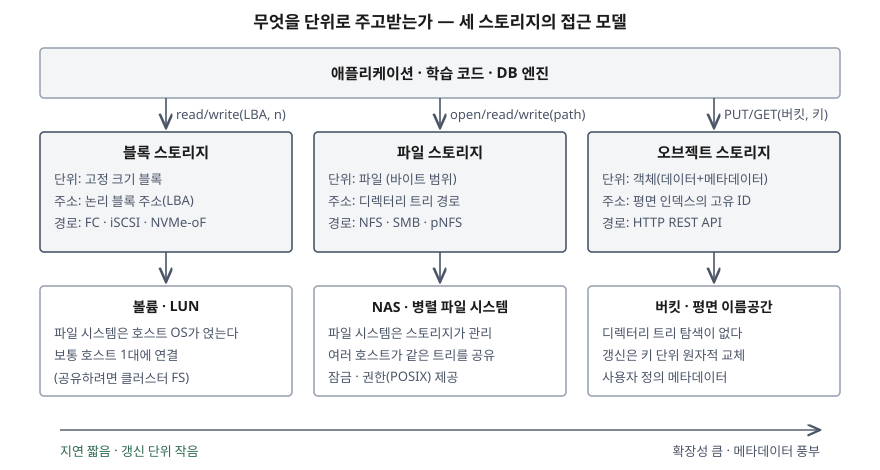
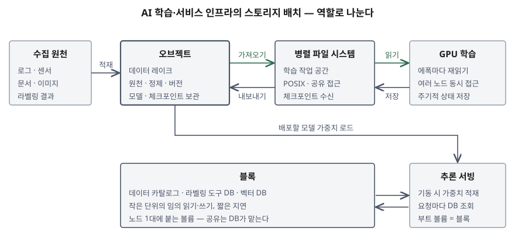

기출문제는 클라우드에서 대규모 AI 학습 데이터를 만들고 서비스 인프라를 꾸릴 때 쓰는
세 가지 스토리지, 곧 블록·파일·오브젝트를 비교하고 각각을 어디에 쓰는 것이 맞는지를
묻는다. 세 가지의 특징을 따로따로 나열하면 평이한 답안이 된다. 점수는 **셋을 가르는
축이 저장 매체가 아니라 접근 인터페이스**라는 점을 먼저 세우고, AI 파이프라인의
**단계마다 I/O 모양이 다르므로 한 가지로 통일하지 않고 역할을 나눠 배치한다**는 결론으로
묶는 데서 난다.

> 실행 검증 없음. 개념 문제이므로 NIST SP 800-209와 AWS·Google Cloud·Ceph 공식 문서
> 근거만으로 정리했다.

---

## Ⅰ. 개요

### 가. AI 인프라에서 스토리지 선택이 갈리는 이유

AI 학습 데이터 구축부터 서비스까지는 한 종류의 I/O로 이어지지 않는다. 단계마다 읽고
쓰는 모양이 다르다.

| 단계 | I/O 모양 | 스토리지에 요구되는 것 |
|---|---|---|
| ① 수집·적재 | 원천 데이터를 대량으로 한 번 쓴다 | 용량 확장, 낮은 저장 단가 |
| ② 정제·라벨링 | 변환 결과를 버전별로 남기고, 라벨링 작업자가 여럿이 붙는다 | 버전 관리, 메타데이터, 공유 |
| ③ 학습 | 같은 데이터셋을 여러 노드가 에폭마다 다시 읽는다 | 높은 읽기 처리량, 동시 접근 |
| ④ 체크포인트 | 학습 상태를 주기적으로 대량 기록한다 | 짧은 쓰기 지연, 공유 |
| ⑤ 서빙 | 모델 가중치를 기동 시 적재하고, 요청마다 DB를 조회한다 | 빠른 적재, 짧은 조회 지연 |

Google Cloud의 AI 스토리지 가이드도 데이터 준비·학습, 체크포인트, 모델 서빙 단계별로
1순위 스토리지를 따로 권고한다. **한 스토리지로 전 단계를 감당하면 어느 단계에서는
성능이, 다른 단계에서는 비용이 맞지 않는다**는 것이 이 문항의 전제다.

### 나. 스토리지 분류의 두 축 — NIST SP 800-209

NIST SP 800-209(저장 인프라 보안 지침)는 데이터 저장 기술을 **2가지 축**으로 나눈다.

- ① **위치 기준**: 저장 장치가 호스트에 바로 붙으면 DAS(Direct-Attached Storage),
  네트워크를 사이에 두면 네트워크 스토리지다. 네트워크 스토리지는 다시 파일 단위로
  접근하는 **NAS**와 블록 단위로 접근하는 **SAN**으로 나뉜다
- ② **접근 유형 기준**: 저장 시스템이 클라이언트에 내놓는 **서비스 인터페이스**로 나눈다.
  **블록·파일·오브젝트 스토리지 서비스**가 여기에 해당한다

문항이 묻는 셋은 ②의 분류다. NIST는 어느 서비스를 고를지가 데이터 양, 데이터에 대한
통제 요구, 성능, 데이터 표현 방식 같은 **사용 사례로 정해진다**고 적는다.

## Ⅱ. 블록·파일·오브젝트 스토리지의 비교

### 가. 정의 — 3가지

| 구분 | 정의 (NIST SP 800-209 기준) |
|---|---|
| **블록 스토리지** | **고정 크기 블록**을 읽고 쓰는 인터페이스를 제공하는 서비스. 블록 수준에서 넓은 대역폭과 짧은 지연으로 장치에 접근한다 |
| **파일 스토리지** | 저장 자원을 **볼륨 안의 디렉터리에 담긴 파일**이라는 파일 시스템 모델로 내놓는 서비스. NFS·SMB 같은 프로토콜로 여러 클라이언트가 같은 볼륨을 공유한다 |
| **오브젝트 스토리지** | 데이터를 버킷(컨테이너) 안의 **가변 크기 객체**로 내놓는 서비스. 객체마다 **고유 식별자**가 붙고 식별자들이 **평면 인덱스**로 모이며, 객체에 **동적 메타데이터**를 붙일 수 있다 |

### 나. 모식도 — 무엇을 단위로 주고받는가

> **출처**: [NIST SP 800-209 §2.1 Block Storage Service · §2.2 File Storage Service · §2.3 Object Storage Service](https://nvlpubs.nist.gov/nistpubs/SpecialPublications/NIST.SP.800-209.pdf) · [AWS, What's the Difference Between Block, Object, and File Storage?](https://aws.amazon.com/compare/the-difference-between-block-file-object-storage/) · [Amazon S3 User Guide — Amazon S3 data consistency model](https://docs.aws.amazon.com/AmazonS3/latest/userguide/Welcome.html#ConsistencyModel)

### 다. 비교표

| 비교 항목 | 블록 | 파일 | 오브젝트 |
|---|---|---|---|
| 데이터 단위 | 고정 크기 블록 | 파일(바이트 범위로 읽고 쓰기) | 객체 = 데이터 + 메타데이터 |
| 주소 방식 | 논리 블록 주소(LBA) | 디렉터리 트리 경로 | 버킷 + 키(고유 ID), 평면 인덱스 |
| 파일 시스템을 누가 관리하나 | **호스트 OS**가 블록 위에 얹는다 | **스토리지**가 관리한다 | 파일 시스템이 없다 |
| 메타데이터 | 최소한 | 이름·크기·시각·권한 정도로 고정 | 사용자 정의 메타데이터를 붙인다 |
| 접근 경로 | FC, iSCSI, NVMe-oF / 클라우드 볼륨 연결 | NFS, SMB, pNFS / POSIX 마운트 | HTTP REST API(PUT·GET·DELETE) |
| 갱신 방식 | 블록 단위 덮어쓰기 | 파일 안의 일부를 덮어쓰기 | 키 단위로 객체를 **원자적으로 교체** |
| 공유 | 보통 호스트 1대. 여러 대가 쓰려면 클러스터 파일 시스템 필요 | 여러 호스트가 같은 트리를 공유, 잠금 제공 | 네트워크로 어디서나 접근, 잠금 없음 |
| 확장성 | 볼륨 크기 안에서 | 파일 시스템 규모 안에서, 병렬 파일 시스템으로 확장 | 평면 인덱스라 매우 크게 확장 |
| 강점 | 짧은 지연, 작은 단위 임의 I/O | 기존 애플리케이션 그대로 공유 | 용량·처리량 확장, 낮은 단가, 메타데이터 |
| 대표 형태 | SAN, 클라우드 블록 볼륨 | NAS, 병렬 파일 시스템(Lustre) | 클라우드 오브젝트 저장소, Ceph RGW |

### 라. 세 스토리지를 가르는 축 — 3가지

비교표의 차이는 결국 세 축에서 나온다.

① **메타데이터를 누가 관리하는가**
- 블록은 메타데이터를 거의 갖지 않고 파일 시스템을 **호스트에 맡긴다.** 그래서 호스트
  하나가 블록 배치를 독점해야 하고, 여러 호스트가 같은 볼륨에 쓰면 서로의 파일 시스템
  구조를 깨뜨린다. AWS는 다중 연결 볼륨에 대해 ext4·XFS 같은 일반 파일 시스템이 여러
  서버의 동시 접근용으로 설계되지 않았으니 클러스터 파일 시스템을 쓰라고 적는다
- 파일은 스토리지가 디렉터리 트리를 관리하므로 여러 호스트가 공유할 수 있다. 대신 경로를
  따라 트리를 걸어 내려가는 조회가 규모에 따라 무거워진다
- 오브젝트는 트리를 버리고 평면 인덱스를 쓴다. NIST는 식별자와 객체 안의 오프셋만으로
  조회가 **2단계**에 끝나 디렉터리 트리를 여러 단계 걷는 방식보다 메타데이터 처리가 줄고,
  이것이 대규모로 갈수록 이점이 된다고 적는다

② **갱신 단위가 무엇인가**
- 블록·파일은 일부만 덮어쓸 수 있어 DB처럼 작은 단위를 자주 고치는 작업에 맞다
- 오브젝트는 키 단위로 통째로 교체한다. Amazon S3는 같은 키에 대한 갱신이 원자적이어서
  동시에 읽으면 이전 데이터나 새 데이터 중 하나를 받고, **여러 키에 걸친 원자적 갱신은
  없다**고 적는다. 동시 쓰기는 **마지막 쓰기 우선**으로 정해지고 잠금은 애플리케이션이 만들어야 한다

③ **누가 함께 쓰는가**
- 블록은 노드 1대, 파일은 같은 네트워크의 여러 노드, 오브젝트는 HTTP가 닿는 어디서나다

> **셋은 매체가 아니라 인터페이스의 차이다.** Ceph는 하나의 분산 오브젝트 저장소(RADOS)
> 위에 블록(RBD)·파일(CephFS)·오브젝트(RGW) 인터페이스를 함께 얹는다. 같은 디스크
> 위에서도 어떤 인터페이스로 내놓느냐에 따라 세 종류가 된다.

## Ⅲ. 각 스토리지의 최적 활용 방안 — AI 학습 데이터 구축과 서비스 인프라

### 가. 오브젝트 스토리지 — 데이터의 기준 저장소

**역할**: 원천·정제·라벨 데이터, 학습된 모델과 체크포인트의 **최종 보관 위치**(기준 저장소).

| 활용 | 쓰는 기능 | 이유 |
|---|---|---|
| 데이터 레이크 (원천·정제 데이터) | 버킷·접두사로 구역 분리, 수명주기 정책으로 저빈도 계층 이동 | 용량 확장과 저장 단가 |
| 학습 데이터셋 버전 관리 | 객체 버전 관리, 사용자 정의 메타데이터·태그 | 어느 모델이 어느 판의 데이터로 학습됐는지 재현 |
| 원본 보존 | 쓰기 1회·읽기 다회(WORM) 잠금 | 원천 데이터의 무단 변경·삭제 방지, 규제 대응 |
| 파이프라인 자동화 | 객체 생성 이벤트 알림 | 새 데이터가 들어오면 정제·라벨링 작업을 시작 |
| 모델 레지스트리·체크포인트 보관 | 버전 관리, 다른 리전 복제 | 서빙 노드가 가중치를 가져가는 출처 |

**설계 포인트 2가지**

① **요청 수가 병목이 된다.** Amazon S3는 분할된 접두사 하나당 초당 최소 3,500건의
쓰기, 5,500건의 읽기 요청을 처리하고, 접두사 수에는 제한이 없으니 **접두사를 나눠
병렬화하라**고 적는다. 작은 객체 하나의 응답 지연은 대략 100~200밀리초 수준으로 적혀 있다.
따라서 작은 이미지·문장 수백만 개를 객체 하나씩 읽으면 처리량이 아니라 **요청 횟수에 묶인다.**
학습용으로 내보낼 때는 작은 샘플을 큰 파일로 묶어 두거나, 아래 파일 계층을 앞에 둔다

② **파일 인터페이스로 열 수 있다.** Mountpoint for Amazon S3는 버킷을 로컬 파일 시스템처럼
마운트해 open·read를 객체 API로 바꿔 준다. AWS는 이것을 머신러닝 학습 같은 **읽기 위주
대규모 작업**용으로 내놓되, 기존 파일 수정·디렉터리 삭제·심볼릭 링크·파일 잠금을 지원하지
않으니 **완전한 POSIX가 필요하면 병렬 파일 시스템을 쓰라**고 적는다

### 나. 파일 스토리지 — 학습 작업 공간과 공유 작업 영역

**역할**: GPU 노드들이 **동시에 읽고 쓰는 작업 공간**. 학습 코드가 기대하는 POSIX 파일
의미를 그대로 제공한다.

① **병렬 파일 시스템을 학습 데이터 캐시로 쓴다**
- Lustre 같은 병렬 파일 시스템은 여러 노드의 동시 접근에 맞춰 설계됐다. pNFS도 데이터와
  메타데이터를 여러 서버에 나눠 분산 접속을 받는 방식이다(NIST)
- **오브젝트와 연결해 쓴다.** FSx for Lustre는 S3 버킷과 연결되면 객체를 파일로 보여 주고,
  파일 시스템 경로와 S3 키를 **1:1로 대응**시켜 가져오기(import)와 내보내기(export)를
  자동으로 수행한다. AWS는 이 구성이 학습 작업의 **최초 다운로드 단계를 없애고**, 같은
  데이터셋을 반복 학습할 때 S3 요청을 줄인다고 적는다
- 즉 데이터의 기준 위치는 오브젝트에 두고, 학습 기간에만 파일 계층으로 끌어와 쓴다

② **체크포인트를 받는다**
- Google Cloud 가이드는 체크포인트와 가중치 전달의 1순위로 병렬 파일 시스템(Managed
  Lustre)을 들고, 그 근거로 짧은 지연과 병렬 접근을 든다. 오브젝트 저장소는 **비동기·다계층
  체크포인트**일 때의 대안으로 둔다
- 체크포인트를 파일 계층에 쓰고, 내보내기로 오브젝트에 영구 보관하는 2단 구성이 된다

③ **NAS로 사람의 공유 작업 영역을 둔다**
- 노트북 환경, 공용 코드·설정, 라벨링 작업자 공유 디렉터리처럼 **여러 사람이 같은 트리를
  보는** 용도. NFS 기반 관리형 파일 스토리지는 POSIX 권한과 파일 잠금을 제공한다
- 다만 NFS의 일관성은 **닫은 뒤 다시 열 때 보이는(close-to-open)** 수준이 기본이고 잠금은
  권고(advisory) 잠금이다. 여러 노드가 같은 파일에 동시에 쓰는 설계는 피한다

### 다. 블록 스토리지 — 데이터베이스와 노드 로컬 볼륨

**역할**: **노드 1대가 독점하는 짧은 지연의 볼륨.** 작은 단위의 임의 읽기·쓰기가 몰리는 곳.

| 활용 | 이유 |
|---|---|
| 데이터 카탈로그·라벨링 도구·실험 관리의 메타데이터 DB | 작은 행을 자주 고치는 트랜잭션 I/O |
| RAG 서비스의 벡터 DB, 세션·캐시 저장소 | 요청마다 짧은 지연의 조회 |
| 학습·서빙 노드의 부트 볼륨, 컨테이너 이미지 | OS가 블록 장치를 요구 |
| 서빙 노드의 모델 가중치 로컬 사본 | 기동 후 반복 적재를 로컬에서 처리 |

- **공유 데이터셋 저장소로 쓰지 않는다.** AWS의 다중 연결은 특정 볼륨 유형에서 같은 가용
  영역의 인스턴스 최대 16대까지이고, 쓰기 순서는 애플리케이션이 맞춰야 한다. 학습
  클러스터 전체가 같은 데이터를 읽는 학습 데이터 공유에는 맞지 않는다
- **스냅샷으로 보호한다.** 블록 볼륨 스냅샷은 볼륨과 따로 보존되는 시점 백업이라, DB
  복구 지점을 만드는 수단이 된다

### 라. 단계별 배치 — 비교

| 단계 | 1순위 | 보조 | 판단 근거 |
|---|---|---|---|
| ① 수집·적재 | 오브젝트 | — | 용량 확장, 단가, 이벤트로 파이프라인 시작 |
| ② 정제·라벨링 | 오브젝트(결과 보관) | 블록(도구 DB), 파일(작업자 공유) | 버전·메타데이터 / 트랜잭션 / 공유 |
| ③ 학습 | 파일(병렬 파일 시스템) | 오브젝트(파일 인터페이스 마운트) | 여러 노드의 반복 읽기, POSIX |
| ④ 체크포인트 | 파일(병렬 파일 시스템) | 오브젝트(비동기 기록·장기 보관) | 쓰기 지연, 이후 영구 보관 |
| ⑤ 서빙 | 오브젝트(가중치 출처) + 블록(DB·로컬 사본) | 파일(여러 노드 동시 적재) | 적재 속도, 조회 지연 |

## Ⅳ. 계층형 구성과 고려사항

### 가. 모식도 — 역할로 나눈 배치

> **출처**: [Google Cloud, About storage services for AI and ML workloads (2026-10-02 갱신)](https://docs.cloud.google.com/architecture/ai-ml/storage-for-ai-ml) · [Amazon FSx for Lustre User Guide — Linking your file system to an Amazon S3 bucket](https://docs.aws.amazon.com/fsx/latest/LustreGuide/create-dra-linked-data-repo.html) · [AWS, What's the Difference Between Block, Object, and File Storage?](https://aws.amazon.com/compare/the-difference-between-block-file-object-storage/)

### 나. 구성 시 고려사항 — 5가지

① **기준 저장소를 하나로 정한다**
- 같은 데이터가 오브젝트와 파일 계층에 함께 있으면 어느 쪽이 정본인지 정해야 한다.
  FSx for Lustre 문서는 같은 파일을 파일 시스템과 S3 양쪽에서 고치면 충돌을 막아 주지
  않으니 **애플리케이션 수준에서 조율하라**고 적는다
- 쓰기는 한 방향으로 흐르게 한다. 학습 데이터는 오브젝트 → 파일, 체크포인트는 파일 → 오브젝트

② **일관성 의미가 다르다는 것을 설계에 넣는다**
- 오브젝트: 쓰기 직후 읽기는 강한 일관성이지만 잠금이 없고 여러 키를 묶는 원자적 갱신이 없다.
  "데이터셋 판이 다 올라갔는가"는 매니페스트 객체 하나를 마지막에 써서 표시하는 식으로 만든다
- 파일(NFS): close-to-open 일관성과 권고 잠금. 노드 간 동시 쓰기는 파일을 나눠 피한다

③ **데이터를 연산 가까이에 둔다**
- 학습 클러스터와 스토리지가 다른 영역에 있으면 대역폭과 전송 비용이 함께 든다. 병렬 파일
  시스템은 학습 클러스터와 같은 영역에, 오브젝트는 연산 위치와 같은 리전에 둔다
- 오브젝트 저장소에도 가용 영역 하나를 골라 연산과 같은 곳에 두는 저지연 계층이 있다.
  대신 데이터가 그 가용 영역 안에만 중복 저장되므로, 영역 장애에 대비한 사본을 따로 둔다

④ **학습 데이터의 접근 통제와 보호**
- NIST SP 800-209는 오브젝트 저장소 데이터 접근을 어떤 프로토콜로든 클라이언트 IP나 관련
  식별 정보로 제한하라고 권고하고, 전송 중 암호화를 켜라고 권고한다
- 학습 데이터에는 개인정보·저작물이 섞이므로 버킷·접두사 단위로 접근 정책을 나누고,
  버전 관리와 WORM 잠금으로 원본을 보존해 **어떤 데이터로 학습했는지를 나중에 증명**할 수 있게 한다

⑤ **수명주기로 비용을 맞춘다**
- 학습이 끝난 원천 데이터와 오래된 체크포인트는 저빈도·보관 계층으로 옮긴다
- 병렬 파일 시스템은 학습 기간에만 크게 두고, 정본은 오브젝트에 남긴다

## Ⅴ. 결론

블록·파일·오브젝트 스토리지는 저장 매체가 아니라 **무엇을 단위로 주고받는가**로 나뉜다.
블록은 메타데이터를 호스트에 맡겨 지연이 가장 짧은 대신 노드 1대가 독점하고, 파일은
스토리지가 디렉터리 트리를 관리해 여러 노드가 공유하며, 오브젝트는 트리를 버리고 평면
인덱스와 풍부한 메타데이터로 확장성을 얻는다. AI 학습 데이터 구축과 서비스 인프라에서는
**오브젝트를 데이터·모델의 기준 저장소로, 병렬 파일 시스템을 학습·체크포인트 작업 공간으로,
블록을 DB와 노드 로컬 볼륨으로** 역할을 나눠 배치하고, 셋 사이의 데이터 흐름 방향과 정본의
위치를 먼저 정하는 것이 구성의 핵심이다.

> 개념 정리: [블록·파일·오브젝트 스토리지 — 접근 모델 3가지와 SAN·NAS·DAS](../../system/2026-10-04-storage-access-models-das-san-nas/index.md)

> 개념 정리: [병렬 파일 시스템 — Lustre의 MDS·OSS 분리와 스트라이핑](../../system/2026-10-04-parallel-file-system-lustre-pnfs/index.md)

끝

## 답안 작성 메모

- **먼저 쓸 것**: Ⅱ-나의 접근 모델 모식도와 Ⅱ-다의 비교표. 문항의 첫 요구("비교하여
  설명")가 이 둘로 채워진다. 모식도에 **파일 시스템이 어디에 있는가**(호스트 / 스토리지 / 없음)를
  한 줄씩 넣는다 — 특징 나열식 답안과 갈리는 지점이다.
- **점수가 갈리는 지점**:
  - Ⅱ-라에서 차이의 원인을 **메타데이터 관리 주체·갱신 단위·공유 범위**로 묶어 설명하는지.
    "블록은 빠르다, 오브젝트는 싸다"로 끝나면 비교가 아니라 나열이다
  - Ⅲ에서 활용 방안을 스토리지별로 쓰되, Ⅲ-라처럼 **AI 파이프라인 단계로 다시 묶는지.**
    문항의 "AI 학습 데이터 구축 및 서비스 인프라"에 직접 답하는 부분이다
  - 오브젝트와 병렬 파일 시스템을 **경쟁 관계가 아니라 연결해 쓰는 계층**으로 그리는지
    (정본은 오브젝트, 학습 기간에는 파일 계층)
- **시간이 모자라면**: Ⅰ-나의 NIST 두 축, Ⅱ-라 끝의 Ceph 단락, Ⅳ-나의 ⑤ 수명주기를 버린다.
  Ⅲ-가·나·다의 표는 항목 2~3개로 줄여도 된다. 단, Ⅲ-라 단계별 배치 표는 남긴다 —
  논술형은 비교표가 최소 1개 필요하고, 이 표가 문항의 두 번째 요구에 대한 요약이다.
- 제품 이름은 근거를 밝히려고 본문에 남겼지만 답안지에는 "관리형 병렬 파일 시스템",
  "오브젝트 저장소의 파일 인터페이스 마운트"처럼 기능 이름으로 쓴다.
- 수치는 AWS 문서에 적힌 접두사당 요청 처리량, 작은 객체 응답 지연, 다중 연결 최대 대수만
  썼다. Google 가이드의 처리량 수치는 제품·시점마다 달라 쓰지 않았다.

## 참고 자료

- [NIST SP 800-209, Security Guidelines for Storage Infrastructure (2020-10)](https://nvlpubs.nist.gov/nistpubs/SpecialPublications/NIST.SP.800-209.pdf) — §2 Data Storage Technologies(2.1 Block, 2.2 File, 2.3 Object Storage Service), 접근 통제 권고 AC-SS-R30
- [AWS, What's the Difference Between Block, Object, and File Storage?](https://aws.amazon.com/compare/the-difference-between-block-file-object-storage/)
- Amazon S3 User Guide
  - [What is Amazon S3? — How Amazon S3 works, Amazon S3 data consistency model](https://docs.aws.amazon.com/AmazonS3/latest/userguide/Welcome.html)
  - [Best practices design patterns: optimizing Amazon S3 performance](https://docs.aws.amazon.com/AmazonS3/latest/userguide/optimizing-performance.html)
  - [Mount an Amazon S3 bucket as a local file system (Mountpoint)](https://docs.aws.amazon.com/AmazonS3/latest/userguide/mountpoint.html)
- Amazon FSx for Lustre User Guide
  - [What is Amazon FSx for Lustre?](https://docs.aws.amazon.com/fsx/latest/LustreGuide/what-is.html)
  - [Linking your file system to an Amazon S3 bucket](https://docs.aws.amazon.com/fsx/latest/LustreGuide/create-dra-linked-data-repo.html)
- [Amazon EFS User Guide — Data consistency in Amazon EFS](https://docs.aws.amazon.com/efs/latest/ug/features.html#consistency)
- Amazon EBS User Guide
  - [What is Amazon Elastic Block Store?](https://docs.aws.amazon.com/ebs/latest/userguide/what-is-ebs.html)
  - [Attach an EBS volume to multiple EC2 instances using Multi-Attach](https://docs.aws.amazon.com/ebs/latest/userguide/ebs-volumes-multi.html)
- [Google Cloud, About storage services for AI and ML workloads (2026-10-02 갱신)](https://docs.cloud.google.com/architecture/ai-ml/storage-for-ai-ml)
- [Ceph Documentation — Architecture](https://docs.ceph.com/en/latest/architecture/)
