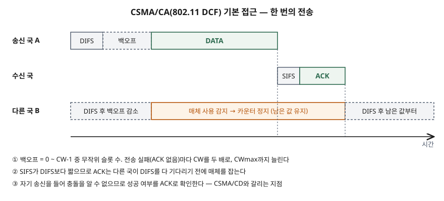
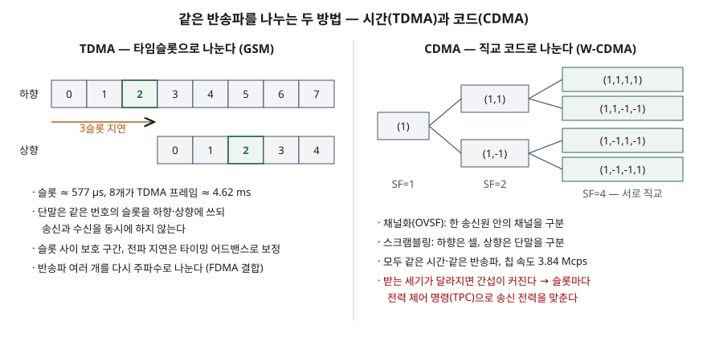

기출문제에서 무선 통신 프로토콜 세 가지, CSMA/CA·CDMA·TDMA를 차례로 설명하라고 묻는다.
셋을 같은 종류의 방식으로 나란히 놓고 정의만 적으면 평이한 답안이 된다. 점수는
**CSMA/CA는 단말들이 매체를 두고 경쟁하는 MAC 계층 규칙이고, CDMA·TDMA는 무선 자원을
코드나 시간으로 미리 나눠 배정하는 다중 접속 방식**이라는 층위 차이를 먼저 세우고,
각 방식이 **무엇으로 사용자를 구분하고 그 대가로 무엇을 관리해야 하는가**를 같은 틀로
비교하는 데서 난다.

> 실행 검증 없음. 개념 문제이므로 3GPP 규격(GSM TS 45.002, W-CDMA TS 25.213·25.214)과
> IEEE 802.11 DCF를 해설한 원 논문(Bianchi, IEEE JSAC, 2000) 근거만으로 정리했다.
> IEEE 802.11 표준 본문은 유료라 직접 인용하지 않았다.

---

## Ⅰ. 개요

### 가. 무선 매체 공유 문제

무선 구간은 여러 단말이 **하나의 전파 자원을 함께 쓰는 공유 매체**다. 둘 이상이 같은
시간·같은 주파수에 같은 방식으로 보내면 수신 측에서 신호가 겹쳐 둘 다 잃는다. 이를 막는
방법은 크게 **2가지**다.

- ① **자원을 미리 나눠 배정한다** — 시간(TDMA), 코드(CDMA), 주파수(FDMA)처럼 서로
  겹치지 않는 몫을 단말마다 정해 준다. 기지국 같은 중앙 제어자가 배정을 맡는다
- ② **나누지 않고 경쟁하게 한다** — 단말이 스스로 매체를 살펴 비었을 때 보내고, 겹치면
  다시 보낸다. CSMA/CA가 여기에 속한다

### 나. 세 방식의 층위 — 먼저 짚을 것

| 구분 | CSMA/CA | CDMA | TDMA |
|---|---|---|---|
| 성격 | **매체 접근 제어(MAC) 규칙** — 언제 보낼지를 정한다 | **다중 접속 방식** — 자원을 코드로 나눈다 | **다중 접속 방식** — 자원을 시간으로 나눈다 |
| 자원 배정 | 없음. 단말끼리 경쟁 | 코드를 배정 | 타임슬롯을 배정 |
| 대표 시스템 | IEEE 802.11 무선랜 | W-CDMA(3G), IS-95 | GSM(2G) |

CDMA·TDMA는 실제 시스템에서 FDMA와 함께 쓴다. GSM 규격은 물리 채널을 **주파수와 시간
다중화를 결합한 것**으로 정의하고(TS 45.002 물리 채널 일반 절, §5.1), W-CDMA도 정해진
반송파 위에서 코드로 나눈다.

## Ⅱ. (가) CSMA/CA

### 가. 정의

**CSMA/CA**(Carrier Sense Multiple Access with Collision Avoidance)는 송신 전에 매체가
비었는지 감지하고, 비어 있어도 **무작위 백오프 시간만큼 더 기다린 뒤** 보내 충돌 확률을
낮추는 경쟁 기반 매체 접근 방식이다. IEEE 802.11의 기본 MAC인 **DCF**(Distributed
Coordination Function)가 이 방식이고, 충돌한 패킷의 재전송은 **이진 지수 백오프**로 다룬다.

### 나. 등장 배경 — 왜 CD가 아니라 CA인가

유선 이더넷의 CSMA/CD는 보내면서 동시에 들어 충돌을 감지한다. 무선에서는 **송신기가
자기 송신을 들어서는 수신 성공 여부를 알 수 없다.** 그래서 802.11은 충돌을 감지하는 대신
① 보내기 전에 기다려 충돌 자체를 **피하고**, ② 수신 측이 **ACK를 명시적으로 돌려보내** 성공을
확인하게 했다.

### 다. 동작 절차 — 5단계

> **출처**: [Bianchi, Performance Analysis of the IEEE 802.11 Distributed Coordination Function, IEEE JSAC 18(3), 2000 — §II 802.11 Distributed Coordination Function, Fig.1](https://www.eng.buffalo.edu/~tmelodia/papers/bianchi.pdf)

| 단계 | 동작 |
|---|---|
| ① 반송파 감지 | 보낼 패킷이 생기면 매체 사용 여부를 살핀다 |
| ② DIFS 대기 | 매체가 **DIFS** 동안 비어 있으면 보낸다. 사용 중이면 DIFS 동안 빌 때까지 계속 살핀다 |
| ③ 백오프 | `0 ~ CW-1` 중 무작위 **슬롯 수**를 고른다. 매체가 비어 있는 동안 1씩 줄이고, 다른 송신이 감지되면 **멈췄다가**(남은 값 유지) 다시 DIFS 동안 비면 이어서 줄인다. 0이 되면 보낸다 |
| ④ 전송 | 데이터 프레임을 보낸다 |
| ⑤ ACK | 수신 국이 **SIFS** 뒤 ACK를 보낸다. ACK가 시간 안에 안 오면 **CW를 두 배로** 늘려(CWmax까지) ③부터 다시 한다 |

- **SIFS < DIFS**인 것이 핵심이다. ACK를 보내는 수신 국은 SIFS만 기다리므로, DIFS를 기다리는
  다른 국보다 먼저 매체를 잡는다. 진행 중인 교환이 끊기지 않는다
- **슬롯 시간**은 다른 국의 송신을 감지하는 데 드는 시간(전파 지연, 수신→송신 전환 시간,
  매체 상태 보고 시간)으로 정하며, 값은 물리 계층마다 다르다. CWmin·CWmax도 물리 계층마다 다르다
- 매체가 비어 있어도 **연속 전송 사이에는 백오프를 거친다.** 한 국이 매체를 독점하지 못하게
  하려는 것이다

### 라. RTS/CTS와 가상 반송파 감지 — 숨은 단말 문제

- **숨은 단말**: 두 송신 국이 서로의 신호를 못 듣는데 같은 수신 국으로 보내면, 반송파 감지가
  비어 있다고 판단해 충돌한다
- **RTS/CTS**(선택 기능): 송신 국이 짧은 RTS를 보내고, 수신 국이 SIFS 뒤 CTS로 답한 다음에야
  데이터를 보낸다. RTS·CTS에는 **전송 길이**가 실려, 듣는 국은 **NAV**(Network Allocation
  Vector)에 매체가 바쁠 시간을 적어 두고 그동안 보내지 않는다. 이것이 **가상 반송파 감지**다
- 송신 국이 숨어 있어도 수신 국의 CTS 하나만 들으면 물러나므로 숨은 단말 충돌이 줄어든다
- 충돌이 짧은 RTS에서만 일어나므로 긴 패킷일수록 이득이 크다. 그래서 **길이 임계값을
  넘는 패킷에만** RTS/CTS를 쓰는 조합 운용이 있다

### 마. 특성

- **장점**: 중앙 제어자 없이 동작하고, 단말이 들고 나도 배정을 다시 할 필요가 없다. 트래픽이
  간헐적인 데이터 통신에 맞다
- **한계**: IFS·백오프·ACK가 매 전송마다 붙는 고정 비용이다. 경쟁하는 국이 많아지면 충돌과
  백오프가 늘어 처리량이 **포화 처리량** 아래로 떨어지지 않게 하는 것이 설계 과제가 된다.
  접근 지연이 확률적이므로 **지연 상한을 보장하지 않는다**

## Ⅲ. (나) CDMA

### 가. 정의

**CDMA**(Code Division Multiple Access)는 각 송신 신호를 **고유한 확산 코드**로 넓은 대역에
퍼뜨려 **같은 시간·같은 반송파를 여러 사용자가 동시에** 쓰게 하고, 수신 측은 같은 코드로
역확산해 원하는 신호만 꺼내는 다중 접속 방식이다.

### 나. 확산 구조 — 2단계 (W-CDMA 기준)

W-CDMA 확산 규격(TS 25.213 상향 확산 개요, §4.1)은 확산을 **2개 연산**으로 나눈다.

| 연산 | 하는 일 | 무엇을 구분하는가 |
|---|---|---|
| ① **채널화**(channelization) | 데이터 심볼 하나를 **칩 SF개**로 바꿔 대역을 넓힌다. SF(확산 인자)가 칩 수다. 코드는 **OVSF** | 한 송신원 안의 **여러 물리 채널** |
| ② **스크램블링**(scrambling) | 확산된 신호에 복소 스크램블링 코드를 곱한다 | 하향: **셀**, 상향: **단말** |

> **출처**: [3GPP TS 25.213 V4.0.0 Spreading and modulation (FDD) §4.1 Overview, §4.3.1 Channelization codes(Figure 4 OVSF 코드 트리), §5.2.2 Scrambling code](https://www.etsi.org/deliver/etsi_ts/125200_125299/125213/04.00.00_60/ts_125213v040000p.pdf) · [3GPP TS 45.002 V13.2.0 Multiplexing and multiple access on the radio path §4.3.1 Timeslots, TDMA frames, §5.2.8 Guard period](https://www.etsi.org/deliver/etsi_ts/145000_145099/145002/13.02.00_60/ts_145002v130200p.pdf) · [3GPP TS 25.214 V5.3.0 Physical layer procedures (FDD) §5.1.2.2.1](https://www.etsi.org/deliver/etsi_ts/125200_125299/125214/05.03.00_60/ts_125214v050300p.pdf)

### 다. 구성요소 — 4가지

① **OVSF 채널화 코드**
- 코드 트리에서 길이 SF인 코드가 한 층을 이루고, 같은 층의 코드끼리는 **직교**한다. 길이가
  다른 코드도 조상·자손 관계만 아니면 직교하므로, **전송률이 다른 채널을 함께 실을 수 있다**
- 어떤 코드를 쓰면 그 코드에서 뻗은 하위 코드는 직교가 깨지므로 같은 송신원에서 함께 쓰지
  못한다. 코드 자원 배정이 트리 관리 문제가 된다

② **스크램블링 코드**
- 하향: 스크램블링 코드는 **512개 세트**(1차 코드 1개 + 2차 코드 15개)로 나뉘고, **셀마다
  1차 스크램블링 코드를 정확히 하나** 배정한다. 1차 코드 512개는 다시 8개씩 64그룹으로 묶여
  단말의 셀 탐색에 쓰인다
- 상향: 긴 코드와 짧은 코드가 각각 2²⁴개 있고 **상위 계층이 단말에 배정**한다. 그래서 같은
  OVSF 코드를 단말들이 겹쳐 써도 기지국은 스크램블링 코드로 단말을 가른다

③ **칩 속도**: 변조 칩 속도는 **3.84 Mcps**로 정해져 있다. 데이터 속도는 SF로 조절한다

④ **전력 제어**
- 모든 단말이 같은 대역에 동시에 실리므로 **다른 단말의 신호가 곧 간섭**이다. 기지국에 가까운
  단말의 신호가 너무 세게 들어오면 먼 단말의 신호가 묻힌다(원근 문제)
- 그래서 상향 내부 루프 전력 제어(TS 25.214 §5.1.2.2.1)는 기지국이 받은 신호 대 간섭비(SIR)를
  **목표값에 맞추도록** 단말 송신 전력을 조정한다. 기지국은 추정 SIR이 목표보다 크면 낮추라는,
  작으면 높이라는 **TPC 명령을 슬롯마다 한 번** 보낸다

### 라. 특성

- **주파수를 셀마다 나눌 필요가 없다.** 셀을 스크램블링 코드로 구분하므로 이웃 셀이 같은
  반송파를 쓴다. 그래서 단말이 여러 셀과 동시에 링크를 유지하는 **소프트 핸드오버**가 가능하고,
  규격도 여러 서빙 셀(액티브 세트)이 함께 TPC 명령을 보내는 경우를 정의한다
- **대가는 정밀한 전력 제어와 코드 관리**다. 수용량이 슬롯 수처럼 고정된 값이 아니라
  간섭 수준과 남은 코드에 따라 정해진다

## Ⅳ. (다) TDMA

### 가. 정의

**TDMA**(Time Division Multiple Access)는 하나의 반송파를 **주기적으로 반복되는 타임슬롯**으로
나누고, 단말마다 배정된 슬롯에서만 송신하게 해 같은 주파수를 여러 사용자가 번갈아 쓰는 다중
접속 방식이다.

### 나. GSM의 시간 구조 — 4가지

GSM 다중화 규격(TS 45.002)의 정의를 근거로 정리한다.

| 단위 | 정의 | 근거 |
|---|---|---|
| ① 타임슬롯 | 3/5200초(**≈ 577 µs**). 슬롯 번호 TN은 0~7 | 타임슬롯 일반 절(§4.3.1·§4.3.2) |
| ② TDMA 프레임 | 타임슬롯 **8개**(**≈ 4.62 ms**). 프레임 번호 FN으로 센다 | §4.3.1·§4.3.3 |
| ③ 멀티프레임 | **26-멀티프레임**(TDMA 프레임 26개)은 트래픽·부속 제어 채널, **51-멀티프레임**은 방송·공통 제어 채널을 싣는다 | 프레임 번호 절(§4.3.3) |
| ④ 슈퍼·하이퍼프레임 | 슈퍼프레임 = 26×51 TDMA 프레임, 하이퍼프레임 = 슈퍼프레임 2048개. 하이퍼프레임이 긴 이유는 **암호화가 FN을 입력으로 쓰기 때문**이다 | §4.3.3 |

### 다. 동작 원리 — 4가지

① **물리 채널 = 슬롯 번호 + 주파수 순서**
- 한 물리 채널은 **매 TDMA 프레임에서 같은 슬롯 번호**를 쓴다(§5.5). 주파수 쪽은 FN을 반송파로
  대응시키는 **주파수 도약** 함수로 정한다(§5.4). 시간과 주파수를 함께 나누는 구조다

② **상·하향 3슬롯 엇갈림**
- 기지국에서 상향 TDMA 프레임은 하향보다 **3슬롯 늦게** 시작한다. 단말은 하향과 상향에 같은
  슬롯 번호를 쓰면서도 **송신과 수신을 동시에 하지 않아도 된다** — 송수신기를 하나로 만들 수 있다

③ **타이밍 어드밴스(적응형 프레임 정렬)**
- 기지국에서 먼 단말은 전파 지연만큼 늦게 도착해 다음 슬롯을 침범할 수 있다. 단말은 거리에
  맞춰 **송신 시점을 앞당기고**, 그 조정 절차는 TS 45.010이 정한다

④ **보호 구간과 버스트**
- 버스트는 한 타임슬롯에 실리는 실제 송신이다. 연속 슬롯의 버스트 사이에 **보호 구간**을 두어
  송신 출력을 올리고 내리는 시간을 확보한다(§5.2.8)
- 첫 접속에 쓰는 **접속 버스트**는 일반 버스트보다 훨씬 긴 **확장 보호 구간**(약 68비트)을 둔다.
  아직 거리 보정값을 받기 전이라 도착 시점이 흔들려도 다음 슬롯을 침범하지 않게 하려는 것이다

### 라. 특성

- **충돌이 없고 지연이 일정하다.** 배정된 슬롯이 주기적으로 돌아오므로 음성처럼 일정한 속도의
  트래픽에 맞다
- **대가는 시간 동기화와 고정된 수용량**이다. 단말 전체가 프레임 시각에 맞춰야 하고, 보호 구간과
  타이밍 어드밴스가 그 비용이다. 반송파 하나의 동시 사용자는 슬롯 수만큼으로 정해진다
- 쓰지 않는 슬롯은 다른 단말이 가져가지 못한다. 간헐적인 데이터 트래픽에서는 배정된 슬롯이
  비는 만큼 자원이 낭비된다

## Ⅴ. 결론

### 가. 세 방식 비교

| 구분 | CSMA/CA | CDMA | TDMA |
|---|---|---|---|
| 층위 | MAC 계층 접근 규칙 | 물리 계층 다중 접속 | 물리 계층 다중 접속 |
| 사용자 구분 수단 | 없음 — 시간을 두고 경쟁 | **확산 코드**(채널화 + 스크램블링) | **타임슬롯**(+ 주파수) |
| 자원 배정 주체 | 각 단말이 분산 판단 | 기지국·상위 계층이 코드 배정 | 기지국이 슬롯 배정 |
| 충돌 | 일어날 수 있다 — 백오프·ACK로 회피·복구 | 충돌 대신 **간섭**이 늘어난다 | 배정 뒤에는 없다 |
| 반드시 관리할 것 | IFS·백오프·CW, 숨은 단말(RTS/CTS·NAV) | **전력 제어**(슬롯마다 TPC), 코드 트리 | **시간 동기**, 타이밍 어드밴스, 보호 구간 |
| 지연 | 확률적, 상한 보장 없음 | 배정 뒤 일정 | 배정 뒤 일정 |
| 수용량을 정하는 것 | 경쟁 국 수와 부하 | 간섭 수준과 남은 코드 | 슬롯 수 × 반송파 수 |
| 맞는 트래픽 | 간헐적 데이터 | 음성·데이터 혼합 | 일정 속도 음성 |
| 대표 시스템 | IEEE 802.11 무선랜 | W-CDMA, IS-95 | GSM |

### 나. 혼동하기 쉬운 지점 — 2가지

- **확산을 쓴다고 CDMA는 아니다.** 802.11 초기 물리 계층에는 DSSS(직접 시퀀스 확산)가 있지만,
  매체 공유는 CSMA/CA가 맡는다. 확산은 변조 기법이고, CDMA는 확산 코드를 **사용자 구분에 쓰는
  다중 접속**이다
- **CSMA/CA는 다른 둘과 함께 쓰일 수 있다.** 다중 접속(어떻게 나누는가)과 MAC 규칙(누가 언제
  쓰는가)은 층위가 다르므로, 같은 물리 계층 위에 경쟁형 접근을 얹는 설계가 가능하다

### 다. 맺음

세 방식은 공유 무선 매체에서 **사용자를 무엇으로 갈라내는가**의 선택이다. TDMA는 시간으로
가르고 그 대가로 정밀한 시간 동기를, CDMA는 코드로 가르고 그 대가로 전력 제어를 관리해야
한다. CSMA/CA는 미리 가르지 않고 경쟁하게 해 중앙 제어 없이 동작하는 대신 지연 보장을
포기한다. 셀룰러 이동통신은 이후 LTE에서 하향 OFDM 기반 다중 접속으로 옮겨 갔지만(TS 36.300),
**자원을 배정하는 셀룰러 방식과 경쟁하는 무선랜 방식**이라는 두 갈래의 설계 선택은 그대로
남아 있다. 정보시스템 설계에서는 트래픽이 일정한가 간헐적인가, 지연 상한이 필요한가,
중앙 제어자를 둘 수 있는가로 맞는 방식을 고른다.

끝

## 답안 작성 메모

- **먼저 쓸 것**: Ⅰ-나의 층위 표와 Ⅴ-가의 비교표. 층위 표 하나로 "CSMA/CA는 MAC, 나머지 둘은
  다중 접속"이라는 답안의 축이 서고, 비교표가 세 항목을 같은 기준으로 묶는다.
- **모식도는 두 개를 그렸지만 답안지에는 하나만 그려도 된다.** 시간이 모자라면 TDMA 슬롯 8칸과
  OVSF 트리 2단(SF=1→2→4)을 나란히 놓은 그림 하나로 Ⅲ·Ⅳ를 함께 받친다. CSMA/CA 타임라인은
  DIFS→백오프→DATA→SIFS→ACK 다섯 칸만 그린다.
- **점수가 갈리는 지점**:
  - CSMA/CA에서 **CD가 아니라 CA인 이유**(송신 중 자기 신호 때문에 충돌을 감지할 수 없다)와
    **SIFS < DIFS의 뜻**을 쓰는지. 백오프 동결(남은 값 유지)까지 쓰면 동작을 아는 답안으로 보인다
  - CDMA에서 **채널화 코드와 스크램블링 코드의 역할을 나누는지**, 그리고 **전력 제어**를 쓰는지.
    전력 제어가 빠지면 CDMA를 반만 쓴 답안이다
  - TDMA에서 **보호 구간·타이밍 어드밴스**처럼 시간 동기의 비용을 쓰는지
- **시간이 모자라면**: Ⅳ-나의 멀티프레임·하이퍼프레임 행, Ⅲ-다의 스크램블링 코드 개수,
  Ⅴ-나의 혼동 지점을 버린다. 층위 구분과 비교표는 남긴다.
- 숫자는 규격에 적힌 것만 썼다(슬롯 577 µs, 프레임 8슬롯, 3슬롯 지연, 3.84 Mcps, 1차 스크램블링
  코드 512개). 무선랜의 SIFS·슬롯 시간·CW 값은 물리 계층마다 달라 쓰지 않았다.

## 참고 자료

- [3GPP TS 45.002 V13.2.0 (2016-08), GSM/EDGE Multiplexing and multiple access on the radio path (ETSI TS 145 002)](https://www.etsi.org/deliver/etsi_ts/145000_145099/145002/13.02.00_60/ts_145002v130200p.pdf) — §4.3 Timeslots, TDMA frames, §5.1 Physical channels, §5.2.7 Access burst, §5.2.8 Guard period, §5.4·§5.5
- [3GPP TS 25.213 V4.0.0 (2001-03), Spreading and modulation (FDD) (ETSI TS 125 213)](https://www.etsi.org/deliver/etsi_ts/125200_125299/125213/04.00.00_60/ts_125213v040000p.pdf) — §4.1 Overview, §4.3.1 Channelization codes, §4.3.2 Scrambling codes, §4.4.1 Modulating chip rate, §5.2.2 Scrambling code
- [3GPP TS 25.214 V5.3.0 (2002-12), Physical layer procedures (FDD) (ETSI TS 125 214)](https://www.etsi.org/deliver/etsi_ts/125200_125299/125214/05.03.00_60/ts_125214v050300p.pdf) — §5.1.2.2.1 Uplink inner loop power control
- [Bianchi, G., Performance Analysis of the IEEE 802.11 Distributed Coordination Function, IEEE JSAC 18(3), pp.535–547 (2000-03)](https://www.eng.buffalo.edu/~tmelodia/papers/bianchi.pdf) — §II 802.11 DCF (기본 접근, RTS/CTS, NAV)
- [IEEE Std 802.11-2020, Wireless LAN Medium Access Control (MAC) and Physical Layer (PHY) Specifications (2021-02 발행)](https://standards.ieee.org/ieee/802.11/7028/) — DCF의 원 규격. 본문은 직접 인용하지 않았다
- [3GPP TS 36.300, E-UTRA and E-UTRAN Overall description](https://www.3gpp.org/DynaReport/36300.htm) — LTE 물리 계층 개요(하향 OFDM)
