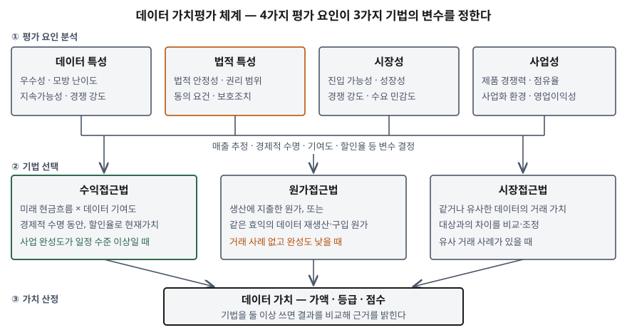

기출문제는 데이터가 기업 자산으로 다뤄지면서 그 값을 객관적으로 매길 필요가 커졌다는
전제 아래, 데이터 가치평가의 **평가 요인**, **평가 방법론**, 그리고 **객관성·신뢰성을
확보하는 핵심변수**를 차례로 묻는다. 세 기법의 이름을 나열하는 것만으로는 평이한
답안이 된다. 점수는 **평가 요인이 기법의 입력 변수를 정한다**는 연결을 세우고, 그 변수들이
추정에 기대는 지점을 **정보시스템의 기록으로 뒷받침하는 방법**까지 내려가는 데서 난다.

> 실행 검증 없음. 개념 문제이므로 데이터산업법, 과기정통부 데이터 가치평가 안내서(지정
> 평가기관 공개 자료로 확인), OECD 보고서, 국제평가기준(IVS 210), ISO/IEC 25012 근거만으로
> 정리했다.

---

## Ⅰ. 개요

### 가. 데이터 가치평가의 정의

| 구분 | 내용 |
|---|---|
| **정의** | 데이터 가치를 시장에서 일반적으로 인정된 평가 기법·모델에 따라 **가액·등급·점수**로 측정하는 활동 (과기정통부 안내서) |
| **데이터 가치** | 데이터의 생산·유통·거래·활용에서 생기는 **경제적 효익의 측정치** |
| **근거** | 데이터산업법 제14조 — 과기정통부 장관이 가치평가 기법과 평가체계를 정해 고시하고, 가치평가기관을 지정한다. 공공데이터는 대상에서 빠진다 |
| **대상 요건** | 일정 수준의 **품질이 담보**되고 가치평가 기법으로 경제적 효익을 측정할 수 있는 데이터 |

안내서는 이 가치가 사용자의 활용에서 나오는 **사용가치**(value in use)이고, 판매자와
사용자가 합의한 **교환가치**(value in exchange), 곧 데이터의 가격과는 다르다고 구분한다.
평가 결과가 거래 가격과 달라도 모순이 아닌 이유다.

### 나. 데이터 가치평가가 어려운 이유 — 데이터의 경제적 특성 3가지

OECD 보고서(2022)는 데이터가 다른 생산 요소와 구별되는 특성을 든다. 이 특성들이 곧
평가를 어렵게 만드는 원인이다.

| 특성 | 내용 | 평가에 미치는 영향 |
|---|---|---|
| ① 비경합성·배제 가능성 | 여러 주체가 동시에 써도 닳지 않는다. 남의 접근을 막을 수 있는지는 **법 제도**에 달렸다 | 같은 데이터라도 **누가 어떤 권리로 쓰느냐**에 따라 가치가 갈린다 |
| ② 규모의 경제 | 처음 만드는 비용은 크고 복제 비용은 거의 0이다 | 한계비용이 0에 가까우면 가격이 수요만으로 정해져 사용자마다 값이 다르다. **원가와 가치가 따로 논다** |
| ③ 거래의 희소성 | 정보 비대칭과 약한 소유권 체계 때문에 다자간 시장이 잘 생기지 않는다 | 대부분 **자체 생산·자체 사용**이라 비교할 거래 가격이 드물다 |

## Ⅱ. 데이터 가치평가의 주요 평가 요인

### 가. 평가 요인 — 4가지

과기정통부 안내서는 평가 요인을 **4가지 분석**으로 나눈다. 앞의 둘은 데이터 자체를,
뒤의 둘은 데이터로 만드는 사업을 본다.

| 평가 요인 | 무엇을 분석하나 | 세부 영향요인 |
|---|---|---|
| ① **데이터 특성** | 데이터의 개요·주변 환경·유용성·경쟁성 | 우수성, 모방 난이도, 지속가능성, 경쟁 강도 |
| ② **법적 특성** | 법적 안정성, 권리화됐을 때의 권리 범위, 보안 강도 → 독점적 지위, **경제적 수명**, 사업 보호 정도 | 개인정보·영업비밀·저작물이 섞였으면 수집·거래·제3자 제공에 필요한 **동의 요건**과 **보호조치** 수준 |
| ③ **시장성** | 데이터를 쓰는 서비스가 속한 시장의 환경과 경쟁 | 시장 진입 가능성, 시장 경쟁 강도, 시장 성장성, 수요 민감도 |
| ④ **사업성** | 사업화 주체의 역량과 서비스의 사업 전망 | 서비스 경쟁력, 예상 시장 점유율, 사업화 환경, 영업이익성 |

### 나. 평가 요인을 읽는 법 — 정보시스템 관점

평가 요인은 경영 분석처럼 보이지만, 앞의 두 요인은 **데이터 관리 체계가 남긴 기록**으로 답한다.

- **데이터 특성의 '우수성'은 품질로 측정된다.** ISO/IEC 25012는 데이터 품질을
  **15가지 특성**으로 정의하고, 이 중 정확성·완전성·일관성·신뢰성·최신성의 **5가지**를 데이터
  자체에 속한 고유 특성으로 둔다. 품질 진단 결과가 우수성의 근거가 된다
- **'지속가능성'은 갱신 체계로 측정된다.** 데이터는 새 정보가 더해지지 않으면 진부화로
  가치가 떨어진다(OECD). 수집 파이프라인이 주기적으로 돌고 있는지가 곧 지속가능성이다
- **법적 특성은 동의·권리 기록으로 증명된다.** 어느 데이터가 어떤 동의를 근거로 수집됐는지를
  항목 단위로 추적할 수 없으면 법적 안정성을 주장할 수 없다
- **같은 데이터라도 사업화 주체가 다르면 평가가 달라진다**(기술보증기금 안내). 사업성은
  데이터가 아니라 그것을 쓰는 조직을 보기 때문이다

## Ⅲ. 데이터 가치평가에 활용되는 주요 방법론

### 가. 평가 체계 — 모식도

> **출처**: [기술보증기금, 데이터가치평가 안내 — 평가 요인·주요 방법론](https://www.starvalue.or.kr/itechvalue/wsp/dataEval/dv_about.jsp) · [법무법인 화우, 과기정통부 데이터 가치평가 안내서 발간 해설 (2024-07-10)](https://www.hwawoo.com/newsletter/2024_07_10/240710_k_t.pdf) · [한국데이터산업진흥원, 데이터 가치평가 제도](https://www.kdata.or.kr/kr/contents/value01/view.do)

### 나. 3가지 기법

| 기법 | 정의 (과기정통부 안내서) | 묻는 질문 |
|---|---|---|
| ① **수익접근법** | 데이터의 **경제적 수명** 동안 활용으로 생길 미래 경제적 효익에 **적정 할인율**을 적용해 현재가치로 환산 | 이 데이터로 얼마를 더 버는가 |
| ② **원가접근법** | 데이터 생산에 **지출된 금액**을 기초로 하거나, 같은 효익을 가진 데이터를 **생산·구입하는 데 드는 금액**을 추정 | 이 데이터를 다시 만들려면 얼마가 드는가 |
| ③ **시장접근법** | 같거나 유사한 데이터가 유통시장에서 **거래된 가치**를 비교·분석해 상대 가치를 산정 | 비슷한 데이터가 얼마에 팔렸는가 |

데이터의 유형·특성·용도에 따라 **하나 또는 둘 이상**의 기법을 쓸 수 있다.

### 다. 세부 방법 — 국제평가기준과의 대응

무형자산 평가의 국제 기준인 IVS 210은 각 접근법 안의 세부 방법을 든다. 데이터에도 그대로 적용된다.

| 접근법 | 세부 방법 | 데이터에 적용할 때 |
|---|---|---|
| 수익 | **로열티공제법**(relief-from-royalty) — 데이터를 소유해 아끼게 되는 가상의 사용료를 현재가치로 | 유사 데이터 거래의 경상로열티율을 참고할 수 있을 때. 안내서가 직접 예로 든다 |
| 수익 | **초과이익법**(multi-period excess earnings) — 현금흐름에서 다른 자산 몫을 빼고 남은 부분 | 데이터가 핵심 자산인 서비스 |
| 수익 | **유무 비교법**(with-and-without) — 데이터를 쓸 때와 안 쓸 때의 두 시나리오 비교 | 추천·예측 모델에서 데이터 유무에 따른 성과 차이를 측정할 수 있을 때 |
| 원가 | **재생산 원가**·**대체 원가** — 대체 원가는 시장 수요와 수용성을 반영하고 재생산 원가는 반영하지 않는다 | 자체 구축 데이터. OECD는 자체 사용 데이터에 **원가합산법**이 가장 현실적이라고 본다 |
| 시장 | 유사 거래 사례 비교 | 데이터 거래소 등 거래 정보가 쌓인 분야 |

### 라. 기법 비교

| 비교 항목 | 수익접근법 | 원가접근법 | 시장접근법 |
|---|---|---|---|
| 가치의 근거 | 미래 효익 | 과거·현재 투입 | 시장 거래 |
| 적용 조건 | 사업 완성도가 일정 수준 이상 | 거래 사례 없고 완성도 낮음, 투입·재생산 비용 파악 가능 | 유사 거래 사례 존재 |
| 핵심 입력 | 매출 추정, 데이터 기여도, 할인율, 경제적 수명 | 인건비·외주·인프라 원가, 이윤 가산(마크업) | 비교 거래 가격, 차이 조정 요소 |
| 강점 | 데이터가 만드는 가치를 직접 잰다 | 증빙이 있어 재현성이 높다 | 시장이 인정한 값이라 설득력이 높다 |
| 약점 | 가정이 많아 평가자에 따라 크게 흔들린다 | 원가와 가치가 따로 논다(규모의 경제) | 데이터는 이질적이라 비교 대상이 드물다 |

OECD는 수익 기반 평가가 데이터의 재사용성 때문에 미래 수익 흐름을 정확히 추정하기 어렵고
정당화하기 힘든 가정을 많이 요구한다고 적는다. 반대로 원가는 증빙이 있지만 수확 체증이나
외부효과를 반영하지 못해 **가치 전체를 재지는 못한다.** 기법 하나가 정답이 아니라는 점이
Ⅳ의 핵심변수로 이어진다.

## Ⅳ. 객관성과 신뢰성을 확보하기 위한 핵심변수

### 가. 핵심변수의 분류 — 3계층 9가지

| 계층 | 핵심변수 | 왜 핵심인가 |
|---|---|---|
| **입력 변수** | ① 매출(현금흐름) 추정 | 수익접근법 결과의 출발점. 낙관하면 그대로 부풀려진다 |
| | ② 데이터 기여도 | 서비스 이익 중 **데이터 몫**만 떼어내는 비율. 가장 주관이 개입하기 쉽다 |
| | ③ 할인율 | 미래 효익의 불확실성을 반영. 조금만 바뀌어도 현재가치가 크게 달라진다 |
| | ④ 경제적 수명 | 효익을 몇 년 치 셀지. 법적 특성(권리 보호 기간)과 진부화 속도로 정해진다 |
| | ⑤ 원가 범위와 배분 | 어느 비용을 데이터 생산 원가로 칠지, 공용 인프라·인력을 얼마나 나눌지 |
| **전제 변수** | ⑥ 데이터 품질 | 평가 대상 요건 자체가 "일정 수준의 품질" 이다. 품질 미달이면 평가가 성립하지 않는다 |
| | ⑦ 권리·적법성 | 동의·보호조치가 없으면 경제적 수명이 0에 가깝다 |
| **절차 변수** | ⑧ 비교 가능한 거래 정보 | 시장접근법의 존재 조건이자 다른 기법의 검산 수단 |
| | ⑨ 평가 전제의 명시 | 대상·목적·가정·제한 조건·기법 선택 배경을 적어야 제3자가 검증할 수 있다 |

### 나. 입력 변수 — 추정을 기록으로 바꾼다

입력 변수는 대부분 미래에 대한 추정이다. 객관성은 **추정의 근거를 측정 가능한 기록에 묶는 것**에서 나온다.

① **데이터 기여도 — 유무 비교로 측정한다**
- 데이터를 넣은 모델과 뺀 모델의 성과(전환율, 예측 오차)를 같은 조건에서 비교하면
  기여도를 평가자 판단이 아닌 **실험 결과**로 제시할 수 있다. IVS 210의 유무 비교법과 같은 논리다
- 이를 위해 서비스 로그에 **어느 판의 데이터로 학습한 모델이 응답했는지**가 남아야 한다

② **원가 범위와 배분 — 계보와 원가 태그로 집계한다**
- OECD는 데이터 원가에 생산 전략 수립, 정보의 수집·기록·저장, 설계·정리·검증·분석의
  **3가지 활동** 비용과 인건비·자본 소모분·이윤 가산을 넣도록 정리하고, 어느 직무가 데이터
  생산에 시간을 얼마나 쓰는지 같은 가정은 **추가 연구가 필요하다**고 적는다
- 정보시스템으로는 데이터 파이프라인 작업과 클라우드 자원에 **데이터셋 단위 원가 태그**를
  붙이고, 데이터 계보(lineage)로 어느 원천·작업이 이 데이터셋을 만들었는지 추적하면
  배분 근거가 남는다
- 데이터는 계속 새 항목이 더해지므로 유지비와 개선 투자의 구분이 특히 어렵다(OECD).
  **새 정보를 더한 작업은 투자, 기존 품질을 유지하는 작업은 비용**으로 미리 규칙을 정해 둔다

③ **경제적 수명·할인율 — 갱신 이력과 사업 위험에서 끌어낸다**
- 데이터는 물리적으로 닳지 않지만 진부화로 가치가 떨어진다. 데이터셋별 **조회·활용 빈도의
  시계열**을 남기면 활용이 줄어드는 속도를 수명의 근거로 쓸 수 있다
- 할인율은 사업 위험을 반영하므로 시장성·사업성 분석과 일관돼야 한다. 사업성은 낮게
  보면서 할인율은 낮게 잡는 식의 엇갈림이 신뢰성을 깎는다

### 다. 전제 변수 — 평가 이전에 갖춰야 할 것

④ **데이터 품질 — 측정된 품질 지표**
- ISO/IEC 25012의 고유 특성(정확성·완전성·일관성·신뢰성·최신성)을 기준으로 품질을
  진단하고 그 결과를 평가 자료로 낸다. 15가지 특성에는 **추적 가능성**도 들어 있어,
  데이터에 대한 접근과 변경 이력이 남는지도 품질의 일부로 본다
- 품질이 낮으면 수익접근법의 기여도도, 시장접근법의 비교 가능성도 함께 흔들린다

⑤ **권리·적법성 — 동의 기록과 보호조치**
- 개인정보가 섞인 데이터는 **항목 단위로 수집 근거와 동의 범위**가 연결돼 있어야 한다.
  동의 범위 밖의 용도로 쓰는 사업을 전제로 매출을 추정하면 그 평가는 성립하지 않는다
- 가명처리·접근통제 같은 보호조치 수준은 법적 특성 분석의 직접 항목이다

### 라. 절차 변수 — 제3자가 다시 따라갈 수 있게

⑥ **복수 기법의 교차 검증**
- 원가접근법은 투입을, 수익접근법은 효익을 근거로 하므로 같은 데이터에도 결과가 벌어질 수
  있다. 둘 이상을 써서 그 차이를 설명하면 한 기법의 가정이 과도한지 드러난다

⑦ **평가 전제와 가정의 명시**
- 안내서는 대상 데이터·목적과 용도·적용된 가정·제한 조건, 그리고 **기법을 고른 배경**을
  명시하는 것을 원칙으로 둔다. 같은 데이터라도 담보용과 매각용은 평가 목적이 달라
  결과가 달라질 수 있으므로, 목적이 빠진 숫자는 비교할 수 없다

⑧ **지정 평가기관과 거래 정보 축적**
- 데이터산업법은 전문 인력·평가 모델·평가 정보 관리망을 갖춘 기관을 가치평가기관으로
  지정한다. 평가 결과와 거래 사례가 쌓일수록 시장접근법의 비교 대상이 늘어난다

### 마. 핵심변수와 근거 기록의 대응

| 핵심변수 | 근거가 되는 기록 | 기록을 남기는 시스템 |
|---|---|---|
| 데이터 기여도 | 데이터 유무에 따른 모델 성과 비교 | 실험 관리, 모델 레지스트리, 서비스 로그 |
| 원가 범위·배분 | 데이터셋별 작업·자원 원가 | 파이프라인 오케스트레이터, 클라우드 원가 태그 |
| 경제적 수명 | 데이터셋별 활용 빈도 시계열 | 데이터 카탈로그의 사용 통계, 접근 로그 |
| 데이터 품질 | 품질 진단 결과의 이력 | 데이터 품질 관리 도구 |
| 권리·적법성 | 항목별 수집 근거·동의 범위 | 동의 관리, 데이터 계보 |
| 평가 전제 | 대상 데이터의 판(버전)과 범위 | 데이터 카탈로그, 버전 관리 |

## Ⅴ. 결론

데이터 가치평가는 **4가지 평가 요인**(데이터 특성·법적 특성·시장성·사업성)을 분석해
**3가지 기법**(수익·원가·시장접근법)의 입력 변수를 정하고, 그 결과를 가액·등급·점수로
내는 체계다. 데이터는 비경합적이고 복제 비용이 거의 없으며 거래가 드물어, 원가는 가치를
다 담지 못하고 수익 추정은 가정이 많으며 시장 비교는 사례가 적다. 그래서 객관성은 기법
선택보다 **핵심변수의 근거**에서 정해진다. 기여도·원가·수명·품질·권리라는 변수를
평가자의 판단이 아니라 데이터 카탈로그·계보·품질 진단·동의 관리가 남긴 **기록**으로
제시할 수 있을 때, 데이터 가치평가는 제3자가 다시 따라가 확인할 수 있는 결과가 된다.

> 개념 정리: [ISO/IEC 5259 — 분석·머신러닝용 데이터 품질 표준 시리즈](../../data-analysis/2026-09-30-iso-iec-5259-data-quality-series/index.md)

> 개념 정리: [현금흐름할인(DCF) — 미래의 돈을 오늘 값으로](../../../Finance/valuation/2026-10-03-dcf-discount-rate-sensitivity/index.md)

끝

## 답안 작성 메모

- **먼저 쓸 것**: Ⅲ-가 모식도와 Ⅲ-라 기법 비교표. 모식도는 **평가 요인 4개 → 기법 3개
  → 가치** 세 줄이면 된다. 요인과 기법을 화살표로 이어 "요인이 변수를 정한다"를 그림으로
  보이는 것이 나열식 답안과 갈리는 지점이다.
- **점수가 갈리는 지점**:
  - 문항의 (다)를 "평가 기관 공신력 확보" 같은 제도 이야기로만 채우지 않는지. 기여도·할인율·
    경제적 수명·원가 배분처럼 **결과를 실제로 흔드는 변수**를 이름으로 들어야 한다
  - 그 변수를 **정보시스템의 기록으로 뒷받침하는 방법**(Ⅳ-마 표)까지 내려가는지. 이 부분을
    걷어내면 감정평가사의 답안이 된다 — 정보관리기술사 답안의 뼈대가 여기다
  - 사용가치와 교환가치(가격)를 구분하는지. 평가액이 거래가와 다른 이유를 설명할 수 있다
- **시간이 모자라면**: Ⅰ-나의 경제적 특성 표, Ⅲ-다의 IVS 세부 방법 표, Ⅳ-라의 ⑧을 버린다.
  Ⅳ-가의 9가지 표와 Ⅳ-마 대응표는 남긴다.
- 평가 요인 4가지와 그 세부 영향요인은 안내서의 용어를 그대로 쓴다. 채점자가 알고 있는
  틀이라 항목을 세기 쉽다.
- 수치는 쓰지 않았다. OECD 보고서의 국가별 데이터 투자 추정치는 실험적 추정이라고 보고서
  스스로 밝히고 있어 답안의 근거로 삼지 않았다.
- 과기정통부 안내서 원문은 직접 열지 못했고, 지정 평가기관(기술보증기금)과 진흥원의 공개
  안내, 안내서를 해설한 법무법인 자료가 같은 내용을 옮긴 것을 확인해 썼다.

## 참고 자료

- [데이터 산업진흥 및 이용촉진에 관한 기본법 제14조(데이터 가치평가) — 국가법령정보센터](https://www.law.go.kr/법령/데이터산업진흥및이용촉진에관한기본법) (2022-04-20 시행)
- 과학기술정보통신부, 데이터 가치평가 안내서 (2024-07-04 발간) — 아래 공개 자료로 내용 확인
  - [기술보증기금, 데이터가치평가 안내 — 개념·평가 요인·주요 방법론·절차](https://www.starvalue.or.kr/itechvalue/wsp/dataEval/dv_about.jsp)
  - [한국데이터산업진흥원, 데이터 가치평가 제도 안내](https://www.kdata.or.kr/kr/contents/value01/view.do)
  - [법무법인 화우, 과기정통부 데이터 가치평가 안내서 발간 해설 (2024-07-10)](https://www.hwawoo.com/newsletter/2024_07_10/240710_k_t.pdf)
- [OECD, Measuring the value of data and data flows, OECD Digital Economy Papers No. 345 (2022-12)](https://www.oecd.org/en/publications/measuring-the-value-of-data-and-data-flows_923230a6-en.html) — §2.3 Economic characteristics of data, §4.2 Valuation of data, §4.4 Practical challenges for the sum-of-cost approach
- [IVSC, IVS 210 Intangible Assets](https://www.ivsc.org/wp-content/uploads/2021/10/IVS210IntangibleAssets.pdf) — 수익·원가·시장접근법의 세부 방법
- [ISO/IEC 25012:2008, Data quality model](https://www.iso.org/standard/35736.html)
