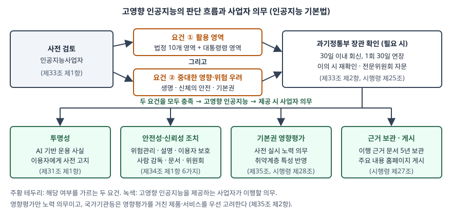

기출문제에서 인공지능 기본법이 정한 고영향 인공지능을 세 갈래로 묻는다. (가) 정의, (나) 활용
영역, (다) 사업자가 안전성과 신뢰성을 확보하려고 해야 하는 활동이다. 조문을 외워 늘어놓으면
법학 답안이 된다. 정보관리 답안의 점수는 **정의의 두 요건이 AND로 묶여 있다**는 점을 세우고,
(다)의 조치 하나하나가 **정보시스템에 무엇을 요구하는지**까지 내려가는 데서 난다. 설명 방안은
결과 근거를 남기는 로그와 데이터 이력을, 사람의 관리·감독은 결과를 멈추고 뒤집는 기능을,
문서 보관은 5년을 버티는 기록 체계를 요구한다.

> 실행 검증 없음. 법률·시행령 조문과 국제 표준 원문 근거만으로 정리했다. 조문은 국가법령정보센터의
> 현행 법령을 기준으로 하고, 문단을 바로 열 수 있는 제3자 전재본으로 대조했다.

---

## Ⅰ. 개요

### 가. 인공지능 기본법의 규제 구조 — 세 갈래 중 하나

인공지능 기본법(인공지능 발전과 신뢰 기반 조성 등에 관한 기본법)은 2025-01-21 제정(법률 제20676호)되어
2026-01-22 시행됐다. 진흥 법이면서 규제 조항을 함께 두는데, 규제 대상 AI는 3가지로 갈린다.

| 구분 | 근거 | 무엇으로 가르는가 | 핵심 의무 |
|---|---|---|---|
| ① 생성형 인공지능 | 제31조 | 결과물의 **종류**(글·소리·그림·영상 생성) | 사전 고지, 생성 사실 표시 |
| ② 일정 연산량 이상 AI | 제32조 | 학습 **규모**(시행령: 누적 연산량 10^26 부동소수점연산 이상 등 3기준 모두 충족) | 수명주기 위험 식별·평가·완화, 위험관리체계 |
| ③ **고영향 인공지능** | 제2조 제4호, 제33~35조 | 활용 **영역과 영향** | 사전 검토, 사전 고지, 6가지 조치, 영향평가 |

①은 무엇을 만드는가, ②는 얼마나 큰가, ③은 **어디에 쓰여 누구에게 영향을 주는가**로 가른다.
같은 모델이라도 영화 추천에 쓰면 ③이 아니고 대출 심사에 쓰면 ③이 된다. 고영향 인공지능은
**모델의 속성이 아니라 활용의 속성**이라는 것이 답안의 첫 문장이다.

### 나. 왜 영역을 기준으로 잡았는가

AI 위험은 기술보다 **결정이 닿는 자리**에서 커진다. 전력 공급을 제어하거나 채용 합격을 가르는
결정은 잘못되면 되돌리기 어렵고, 영향받는 사람은 그 결정이 AI에서 나왔는지조차 모를 수 있다.
법이 이용자(제2조 제8호)와 별도로 **영향받는 자**(제2조 제9호, AI 제품·서비스로 생명·신체의 안전과
기본권에 중대한 영향을 받는 자)를 정의한 것이 이 때문이다. 대출 심사 AI의 이용자는 은행이지만
영향받는 자는 신청인이다.

## Ⅱ. 고영향 인공지능의 정의

### 가. 법률상 정의 — 2요건

제2조 제4호는 고영향 인공지능을 **사람의 생명, 신체의 안전 및 기본권에 중대한 영향을 미치거나
위험을 초래할 우려가 있는 인공지능시스템**으로서 정해진 영역 중 하나에서 활용되는 것으로 정의한다.

| 요건 | 내용 | 성격 |
|---|---|---|
| ① 영향 요건 | 생명·신체의 안전·기본권에 **중대한 영향 또는 위험 우려** | 실질 판단 |
| ② 영역 요건 | 제2조 제4호 가목~카목 중 **하나의 영역에서 활용** | 형식 판단 |

두 요건은 **AND**다. 법정 영역에서 쓰여도 중대한 영향이 없으면 해당하지 않는다. 병원 원무과의
진료 예약 시간 추천은 보건의료 영역이지만 기본권에 중대한 영향을 준다고 보기 어렵다.
반대로 영향이 커도 법정 영역 밖이면 대통령령으로 영역이 추가될 때까지 해당하지 않는다.

여기서 인공지능시스템은 **다양한 수준의 자율성과 적응성을 가지고 예측·추천·결정 등의 결과물을
추론하는** AI 기반 시스템(제2조 제2호)이다. 결정을 직접 내리지 않고 추천만 해도 범위에 든다.

### 나. 판단 기준과 확인 절차

시행령 제25조는 과학기술정보통신부 장관이 해당 여부를 확인할 때 볼 기준 5가지를 둔다.

| 기준 | 내용 |
|---|---|
| ① 영역 | 법 제2조 제4호 각 목 영역에서 활용되는지 |
| ② 위험의 크기 | 생명·신체·기본권에 대한 위험의 **영향·중대성·빈도**와 영역별 특수성 |
| ③ 사업자 검토 | 사업자가 스스로 한 사전 검토 결과 |
| ④ 전문가 자문 | 전문위원회 자문 결과(자문한 경우) |
| ⑤ 고시 | 그 밖에 장관이 고시하는 사항 |

절차는 **자기 검토가 기본**이다. 사업자는 제공 전에 해당 여부를 스스로 검토해야 하고(제33조 제1항),
필요하면 장관에게 확인을 요청할 수 있다. 장관은 요청을 받은 날부터 30일 이내에 회신하고 한 차례
30일 범위에서 늘릴 수 있으며, 사업자는 결과에 이의가 있으면 재확인을 요청할 수 있다(시행령 제25조).
장관은 고영향 인공지능의 기준과 예시에 관한 가이드라인을 수립·보급할 수 있다(제33조 제3항).

## Ⅲ. 고영향 인공지능의 활용 영역

### 가. 법정 10개 영역 + 위임 1개

제2조 제4호는 10개 영역을 직접 열거하고(가목~차목), 카목에서 생명·신체의 안전과 기본권 보호에
중대한 영향을 주는 영역을 **대통령령으로 추가**할 수 있게 열어 둔다. 성격에 따라 셋으로 묶으면
답안에서 빠뜨리지 않는다.

| 묶음 | 목 | 영역 | 정보시스템 예 |
|---|---|---|---|
| **A. 기반 시설·안전** (4) | 가 | 에너지의 공급 | 전력 수요 예측·계통 제어 |
| | 나 | 먹는물의 생산 공정 | 정수 공정 약품 투입 제어 |
| | 마 | 핵물질·원자력시설의 안전한 관리·운영 | 원전 이상 징후 탐지 |
| | 아 | 교통수단·교통시설·교통체계의 주요 작동·운영 | 자율주행 판단, 신호 제어 |
| **B. 의료** (2) | 다 | 보건의료의 제공과 이용 체계의 구축·운영 | 진료 우선순위 분류 |
| | 라 | 의료기기·디지털의료기기의 개발·이용 | 영상 판독 보조 소프트웨어 |
| **C. 개인의 권리·의무** (4) | 바 | 범죄 수사·체포를 위한 생체인식정보 분석·활용 | 얼굴 인식 용의자 식별 |
| | 사 | 채용·대출 심사 등 권리·의무 관계에 중대한 영향을 주는 판단·평가 | 서류 평가, 신용 평가 |
| | 자 | 공공서비스 자격 확인·결정, 비용 징수 등 국가·공공기관의 의사결정 | 복지 수급 자격 판정 |
| | 차 | 유아·초등·중등교육의 학생 평가 | 자동 채점, 학업 평가 |
| **위임** (1) | 카 | 그 밖에 대통령령으로 정하는 영역 | — |

A는 **물리적 피해**(정전·오염·사고), B는 **신체 피해**, C는 **기본권 침해**(차별·부당한 불이익)가
주된 위험이다. 묶음에 따라 Ⅳ의 조치에서 무게가 달라진다. A는 실시간 제어라 사람의 개입 지점과
안전 정지가, C는 결과를 사후에 따지는 일이 많아 설명과 이의제기 경로가 무겁다.

### 나. 비교 — EU AI법의 고위험 AI

같은 영역 기반 규제를 EU AI법(Regulation (EU) 2024/1689)이 먼저 두었다. 시험에서 가장 자주 묻는
대비다.

| 비교 축 | 인공지능 기본법 — 고영향 AI | EU AI법 — 고위험 AI |
|---|---|---|
| 판단 방식 | 영역 요건 + 중대한 영향 요건(AND) | 부속서 III 영역 해당, 또는 제품 안전 법령의 안전 구성요소(제6조) |
| 영역 | 법정 10개 + 대통령령 | 부속서 III 8개: 생체인식, 핵심 기반시설, 교육·직업훈련, 고용, 필수 공공·민간 서비스, 법 집행, 이민·국경, 사법·민주적 절차 |
| 국내만의 영역 | 먹는물, 원자력, 보건의료 체계, 교통 등이 **영역으로 직접** 열거 | 기반시설은 "핵심 기반시설" 한 영역으로 묶음 |
| 금지 AI | **두지 않음** | 별도 금지 관행(제5조) |
| 의무 주체 | 인공지능사업자(개발·제공자 + 이용 제공자) 일괄 | 제공자(provider)·배포자(deployer)를 나눠 의무 배분 |
| 판단 주체 | 사업자 자기 검토 + 장관 확인 요청 | 제공자 자기 평가 |
| 영향평가 | 사업자의 **노력 의무**(제35조) | 공공기관 등 일부 배포자의 기본권 영향평가 **의무**(제27조) |

설계 선택이 다르다. EU는 금지-고위험-투명성 의무로 계층을 나누고 주체별로 의무를 갈랐고,
국내법은 금지 단계를 두지 않고 고영향 하나의 층에 사업자 의무를 모았다. 그 대신 시행령이
**상위 단계 사업자가 이행한 조치를 하위 단계 사업자가 이행한 것으로 보는** 규정(시행령 제27조 제3항)으로
공급망의 중복을 줄인다.

## Ⅳ. 인공지능 사업자의 안전성·신뢰성 확보 활동

### 가. 활동의 전체 흐름 — 4단계

> **출처**: [국가법령정보센터, 인공지능 발전과 신뢰 기반 조성 등에 관한 기본법 (법률 제21311호) — 제2조 제4호, 제31조, 제33조~제35조](https://www.law.go.kr/법령/인공지능발전과신뢰기반조성등에관한기본법) · [같은 법 시행령 (대통령령 제36580호) — 제25조, 제27조, 제28조](https://www.law.go.kr/법령/인공지능발전과신뢰기반조성등에관한기본법시행령)

| 단계 | 활동 | 근거 | 성격 |
|---|---|---|---|
| ① 확인 | 해당 여부 사전 검토, 필요 시 장관 확인 요청 | 제33조 | 의무(검토) |
| ② 고지 | AI에 기반해 운용된다는 사실을 이용자에게 **사전 고지** | 제31조 제1항 | 의무 |
| ③ 조치 | 안전성·신뢰성 확보 조치 **6가지** 이행, 근거 문서 5년 보관, 주요 내용 게시 | 제34조, 시행령 제27조 | 의무 |
| ④ 평가 | 기본권 영향평가 사전 실시 | 제35조, 시행령 제28조 | 노력 의무 |

### 나. 제34조 조치 6가지와 정보시스템 구현

제34조 제1항은 고영향 AI 또는 이를 이용한 제품·서비스를 제공하는 사업자가 다음 6가지를 포함한
조치를 이행하도록 한다. 조치의 구체 내용은 장관이 고시하고 준수를 권고할 수 있다(제2항).
각 조치가 정보시스템에 요구하는 것을 오른쪽에 붙인다.

| 조치 | 법의 내용 | 정보시스템 구현 | 대응 표준 |
|---|---|---|---|
| ① 위험관리방안 | 수립·운영 | 위험 식별·분석·평가·처리 절차, 모델별 **위험 등록부**, 재학습·배포마다 재평가하는 MLOps 관문 | ISO/IEC 23894 |
| ② 설명 방안 | 기술적으로 가능한 범위에서 **최종 결과, 결과 도출의 주요 기준, 학습용데이터 개요** 설명 | 결과별 판단 근거 저장(입력·모델 버전·주요 기여 변수), **데이터 이력**(출처·전처리·버전), 모델 카드 | ISO/IEC 42001 부속서 A |
| ③ 이용자 보호 방안 | 수립·운영 | 고지·동의 화면, **이의제기·재심사 창구**, 오류 결과 정정 처리 흐름 | — |
| ④ 사람의 관리·감독 | 고영향 AI에 대한 사람의 관리·감독 | 결과 확정 전 **사람 승인 단계**, 판단 **무효화(override)**·운영 정지 기능, 감독자 권한 분리 | ISO/IEC 42001 |
| ⑤ 문서 작성·보관 | 조치 내용을 확인할 수 있는 문서 | 변경 이력이 남는 문서 저장소, **5년 보존**(시행령 제27조 제2항), 위변조 방지 감사 로그 | ISO/IEC 42001 |
| ⑥ 위원회 심의 사항 | 그 밖에 위원회가 심의·의결한 사항 | 고시 변경을 추적해 통제 항목에 반영하는 컴플라이언스 관리 | — |

②의 "기술적으로 가능한 범위에서"가 중요하다. 심층 신경망의 내부 판단을 완전히 풀어 보이라는
요구가 아니라, **최종 결과·주요 기준·학습 데이터 개요**의 3가지를 설명하라는 것이다. 그래서 핵심은
설명 기법 선택보다 **결과가 나온 시점의 입력과 모델 버전을 나중에 다시 꺼낼 수 있는가**다. 이 기록이
없으면 이의가 들어와도 어떤 모델이 어떤 입력으로 그 결과를 냈는지 재구성할 수 없다.

④는 묶음 A와 C에서 모양이 다르다. 채용·대출(C)은 **결과를 확정하기 전에** 사람이 검토하는 구조가
맞고, 교통·에너지 제어(A)처럼 사람의 반응 시간보다 빠른 제어는 사전 승인이 불가능하므로 **감시하고
정지시키는** 구조가 맞다.

### 다. 공개와 보관 — 시행령이 구체화한 것

시행령 제27조는 제34조를 다음 3가지로 구체화한다.

| 항목 | 내용 |
|---|---|
| ① 게시 | 위험관리방안과 설명 방안의 주요 내용, 이용자 보호 방안, 관리·감독 담당자의 성명·연락처를 **홈페이지 등에 게시**. 영업비밀은 제외할 수 있다 |
| ② 보관 | 6가지 조치를 이행한 근거를 **문서로 5년간 보관** |
| ③ 이행 간주 | 상위 단계 사업자가 조치를 이행했으면 이를 제공받은 하위 단계 사업자는 **본래 목적을 바꾸지 않는 한** 이행한 것으로 본다. 다른 법령에 따라 준하는 조치를 했으면 역시 이행으로 본다(법 제34조 제3항, 시행령 별표 1) |

③은 정보시스템 도입에서 실질적인 쟁점이다. 대출 심사 서비스를 만드는 금융사가 외부 기반 모델을
받아 쓰면, 모델 개발사가 한 위험관리와 학습 데이터 설명은 금융사에 넘어온다. 그러나 금융사가 그
모델을 **원래 목적과 다르게** 신용 평가에 붙였다면 간주가 깨지고 금융사가 처음부터 이행해야 한다.
그래서 도입 계약에 **상위 사업자의 이행 근거 문서를 받는 조항**과 **용도 제한 조항**을 넣어야 한다.

### 라. 영향평가 — 7가지 포함 사항

제35조는 고영향 AI를 이용한 제품·서비스를 제공하는 사업자가 **사전에 기본권에 미치는 영향을 평가하도록
노력**하게 한다. 2026-01-20 개정으로 영향평가에 **인공지능취약계층의 특성**을 반영하도록 후단이 붙었다.
국가기관등은 영향평가를 거친 제품·서비스를 **우선 고려**해야 한다(제2항). 노력 의무지만 공공 조달에서
사실상 요건이 되는 구조다.

시행령 제28조가 정한 포함 사항은 7가지다.

| 순서 | 포함 사항 |
|---|---|
| ① | 영향받을 가능성이 있는 개인·집단 식별(취약계층 특성 반영) |
| ② | 영향받는 기본권의 유형 식별 |
| ③ | 기본권에 미치는 사회적·경제적 영향 |
| ④ | 고영향 AI의 사용 행태 |
| ⑤ | 정량·정성 평가지표와 결과 산출 방식 |
| ⑥ | 위험 예방·완화·손실 복구 등 조치 |
| ⑦ | 개선이 필요하면 그 이행계획 |

영향평가는 직접 하거나 제3자에게 맡길 수 있다. 국제 표준으로는 ISO/IEC 42005:2025(AI 시스템
영향평가)가 같은 활동의 절차를 다룬다. ⑤가 정보시스템 쪽 일이다. 집단별 승인율 차이 같은
**공정성 지표를 운영 중에 계속 측정**해야 평가가 출시 시점의 일회성 문서로 끝나지 않는다.

### 마. 통합 — 관리체계 하나로 묶는다

4단계 활동을 조치마다 따로 만들면 문서가 흩어지고 5년 보관도 감당하지 못한다. 조직의 AI 관리체계
하나에 넣어 돌리는 것이 현실적이다. ISO/IEC 42001:2023(AI 경영시스템)은 AI 정책·위험 평가·영향평가·
운영 통제·내부 감사·개선을 하나의 인증 가능한 체계로 묶는다. 그 조항 구조를 Plan-Do-Check-Act로
읽으면 기본법 활동이 다음처럼 들어간다.

| 42001 단계 | 기본법 활동 |
|---|---|
| Plan | 해당 여부 검토(제33조), 위험관리방안(①), 영향평가(제35조) |
| Do | 사전 고지(제31조), 설명·이용자 보호·사람 감독(②③④) 운영 |
| Check | 운영 지표 감시, 내부 감사, 문서·로그 점검(⑤) |
| Act | 고시·위원회 심의 반영(⑥), 영향평가 개선 이행계획 |

## Ⅴ. 결론

고영향 인공지능은 **모델이 아니라 활용으로 정해진다.** 생명·신체·기본권에 중대한 영향이라는 실질
요건과 법정 10개 영역(+대통령령)이라는 형식 요건이 함께 충족돼야 하고, 판단은 사업자의 사전 검토에서
출발한다. 해당하면 사업자는 사전 고지 → 6가지 조치 → 영향평가의 순서로 활동하며, 시행령은 이를
게시·5년 보관·이행 간주로 구체화했다. 이 의무들은 결국 **정보시스템의 요구사항**이다. 결과를 재구성할
수 있는 기록, 사람이 결과를 멈추고 뒤집을 수 있는 기능, 5년을 버티는 감사 기록이 없으면 어떤 조치도
입증할 수 없다. 과제는 세 가지다. 대통령령 영역과 고시의 변화를 따라갈 관리체계, 기반 모델을 받아
쓰는 공급망에서 이행 근거를 넘겨받는 계약 구조, 그리고 EU AI법 등 해외 규제와 함께 대응할 수 있도록
통제 항목을 하나로 맞추는 일이다.

> 관련 글: [기출문제 — AI 보안: 사이버 공격 지원 위협과 자율성에 따른 통제 상실](../2026-10-01-ai-security-cyber-offense-loss-of-control/index.md)

> 개념 정리: [프런티어 AI 안전 프레임워크 — 역량 임계치와 안전장치로 배포를 정하는 구조](../../security/2026-10-01-frontier-ai-safety-frameworks/index.md)

> 개념 정리: [인공지능 기본법과 EU AI법 — 위험 기반 규제 구조 비교](../../it-management/2026-10-05-korea-ai-basic-act-vs-eu-ai-act/index.md)

> 개념 정리: [AI 시스템 영향평가 — ISO/IEC 42005와 기본권 영향평가](../../it-management/2026-10-05-ai-system-impact-assessment-iso-42005/index.md)

끝

## 답안 작성 메모

- **먼저 쓸 것**: Ⅰ-가의 3갈래 표(생성형 / 일정 연산량 이상 / 고영향)와 Ⅱ-가의 2요건 AND. 고영향이
  **활용의 속성**이라는 한 줄이 (가)(나)(다)를 모두 꿰는 뼈대다.
- **(나)는 개수로 쓴다**: 법정 10개 + 대통령령 위임 1개. 열 개를 줄줄이 쓰면 하나씩 빠뜨리므로
  A 기반 시설·안전 4, B 의료 2, C 개인 권리·의무 4로 묶어 외운다. "에먹원교 / 보의 / 생채공학"처럼
  묶음별 앞 글자를 잡아도 된다.
- **(다)에서 점수가 갈리는 지점**: 제34조 6가지를 나열하는 데서 멈추지 않고, 각 조치를 **정보시스템
  구현**(결과 근거 로그·데이터 이력, override·정지 기능, 5년 보존 감사 기록)으로 내리는지. 그리고
  "기술적으로 가능한 범위에서"의 설명 대상 3가지(최종 결과·주요 기준·학습 데이터 개요)를 정확히 쓰는지.
- **도식**: 상자 8개라 5분이면 옮긴다. 시간이 없으면 위 줄(사전 검토 → 2요건 → 확인)을 버리고
  아래 줄 의무 4개만 그린다.
- **비교표는 EU AI법 하나로 충분하다.** 영역 수(10+1 대 8), 금지 AI 유무, 영향평가의 강도(노력 대 의무)
  세 줄만 남겨도 비교표로 인정된다.
- **시간이 모자라면**: Ⅳ-마 42001 매핑과 Ⅳ-라 영향평가 7가지를 버리고 "노력 의무, 취약계층 반영,
  국가기관 우선 고려" 세 마디만 남긴다.
- **시행령 수치를 쓸 때**: 30일 회신·5년 보관은 시행령 조문에서 확인한 값이다. 시행령이 2026년에 두 번
  개정됐으므로 답안에는 "시행령으로 정하는"이라는 수식어를 함께 쓰는 편이 안전하다.
- 2026-01-20 개정법(취약계층 반영)의 시행일은 자료마다 다르게 표시된다. 국가법령정보센터 개정 이력은
  2026-01-22로, 제3자 전재본은 현행 시행일을 2026-07-21로 적는다. 조문별 시행일이 부칙으로 갈렸을 수
  있으므로 답안에는 날짜 대신 "개정으로 취약계층 반영이 추가됐다"고만 쓴다.

## 참고 자료

- [국가법령정보센터, 인공지능 발전과 신뢰 기반 조성 등에 관한 기본법 (법률 제20676호 제정 2025-01-21, 2026-01-22 시행 / 법률 제21311호 일부개정 2026-01-20) — 제2조, 제31조~제35조](https://www.law.go.kr/법령/인공지능발전과신뢰기반조성등에관한기본법)
- [국가법령정보센터, 같은 법 제정·개정 이력과 개정 문](https://www.law.go.kr/LSW/lsRvsDocListP.do?lsId=014820&chrClsCd=010202&lsRvsGubun=all)
- [국가법령정보센터, 인공지능 발전과 신뢰 기반 조성 등에 관한 기본법 시행령 (대통령령 제36053호 제정 2026-01-21, 제36580호 개정 2026-08-18) — 제24조~제28조](https://www.law.go.kr/법령/인공지능발전과신뢰기반조성등에관한기본법시행령)
- [CaseNote, 인공지능 발전과 신뢰 기반 조성 등에 관한 기본법 (제3자 전재)](https://casenote.kr/법령/인공지능_발전과_신뢰_기반_조성_등에_관한_기본법)
- [CaseNote, 같은 법 시행령 (제3자 전재)](https://casenote.kr/법령/인공지능_발전과_신뢰_기반_조성_등에_관한_기본법_시행령)
- [대한민국 정책브리핑, "AI로 생성된 결과물" 고지해야…AI기본법 시행령 입법예고 (2025-11-12)](https://www.korea.kr/news/policyNewsView.do?newsId=148954629)
- [EUR-Lex, Regulation (EU) 2024/1689 (Artificial Intelligence Act) — Article 6, Article 27, Annex III](https://eur-lex.europa.eu/eli/reg/2024/1689/oj)
- [ISO/IEC 42001:2023 Information technology — Artificial intelligence — Management system](https://www.iso.org/standard/81230.html)
- [ISO/IEC 23894:2023 Information technology — Artificial intelligence — Guidance on risk management](https://www.iso.org/standard/77304.html)
- [ISO/IEC 42005:2025 Information technology — Artificial intelligence — AI system impact assessment](https://www.iso.org/standard/44545.html)
