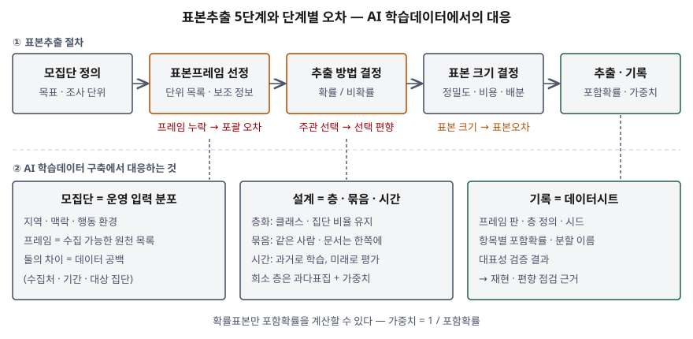

기출문제는 데이터 기반 의사결정과 AI 학습데이터 구축에서 표본추출이 왜 핵심인지를
전제로, **표본추출의 개념과 절차**, **확률·비확률 표본추출 기법의 비교**, **AI 학습데이터
구축 관점의 적용 방안**을 차례로 묻는다. 기법 이름을 나열하는 것만으로는 통계학 답안이 된다.
점수는 "학습데이터의 모집단은 무엇이고, 프레임은 무엇이며, 그 차이가 어디서 편향으로
바뀌는가"를 세우고, 그 판단을 **정보시스템이 기록으로 남기는 방법**까지 내려가는 데서 난다.

> 실행 검증 없음. 개념 문제이므로 캐나다 통계청 조사방법 지침서, NIST 통계 핸드북,
> 미국여론조사학회(AAPOR) 비확률표본 보고서, EU AI법 제10조, Datasheets for Datasets 논문,
> scikit-learn 사용자 안내서 근거로 정리했다. 표본 크기 예시는 손으로 계산해 검산했다.

---

## Ⅰ. 개요

### 가. 표본추출의 정의

| 구분 | 내용 |
|---|---|
| **정의** | 모집단 전체를 대신해 정보를 모을 **일부 단위를 고르는 방법**으로, 그 일부로부터 모집단 전체를 추론하는 것이 목적이다 (Statistics Canada, 표본설계 장 도입부) |
| **전수조사와의 차이** | 전수조사는 모든 단위에서 자료를 모으고, 표본조사는 그중 일부(보통 아주 작은 비율)에서만 모은다 |
| **두 갈래** | **확률표본추출** — 무작위로 고르고 각 단위의 포함확률을 계산할 수 있다 / **비확률표본추출** — 주관적(비무작위) 방법으로 고른다 |

### 나. 데이터 기반 의사결정과 AI에서 표본추출이 핵심인 이유 — 3가지

| 이유 | 내용 |
|---|---|
| ① 비용과 속도 | 전체를 다 모으거나 다 라벨링할 수 없다. 표본 크기는 비용·기간·인력을 직접 정한다 |
| ② 추론의 정당성 | 표본에서 낸 수치가 모집단에도 맞는지는 **어떻게 골랐는가**로만 판단된다 |
| ③ 모델의 일반화 | 학습·평가 데이터가 운영 환경의 입력을 대표하지 못하면, 평가 점수가 좋아도 운영에서 성능이 떨어진다. EU AI법 제10조는 고위험 AI의 학습·검증·평가 데이터가 **관련성 있고 충분히 대표적**이어야 한다고 정한다 |

## Ⅱ. 표본추출의 개념 및 절차

### 가. 핵심 개념 — 5가지

| 개념 | 정의 | 놓치면 생기는 일 |
|---|---|---|
| ① **모집단** | 결과를 일반화하려는 대상 단위 전체 | 무엇을 대표해야 하는지 모르게 된다 |
| ② **표본프레임** | 모집단 단위를 식별하고 접촉하는 수단. 물리적 목록·개념적 목록·지역 목록의 형태 (Statistics Canada, 조사틀 선정 절) | 프레임에서 빠진 단위는 **뽑힐 기회가 0**이다 → 포괄 오차 |
| ③ **포함확률** | 각 단위가 표본에 들어갈 확률. 확률표본은 **0보다 크고 계산 가능**해야 한다 | 계산할 수 없으면 신뢰할 수 있는 추정치와 표본오차를 낼 수 없다 |
| ④ **가중치** | 표본 단위가 모집단에서 대표하는 단위 수. **포함확률의 역수** | 불균등 추출을 하고 가중치를 버리면 추정이 기운다 |
| ⑤ **표본오차** | 전체 대신 일부만 봐서 생기는 오차. 확률표본이면 크기를 추정할 수 있다 | 비확률표본에서는 크기 자체를 잴 수 없다 |

### 나. 표본추출 절차 — 5단계

Statistics Canada 지침서는 조사 전 과정을 10단계(목표 수립 → 조사틀 선정 → 표본설계 →
질문지 → 수집 → 입력·코딩 → 편집·대체 → 추정 → 분석 → 배포)로 둔다. 그중 표본추출에
해당하는 부분을 묶으면 5단계다.

| 단계 | 하는 일 | 근거 |
|---|---|---|
| ① 모집단 정의 | 목표에 맞춰 조사 단위와 범위를 정한다. 무엇을 포함하고 무엇을 뺄지 | 목표 수립 절(1.1.1) |
| ② 표본프레임 선정 | 기존 프레임을 쓰거나 보완하거나 새로 만든다. **프레임이 조사 모집단의 정의를 결정**한다 | 조사틀 선정 절(1.1.2) |
| ③ 추출 방법 결정 | 확률/비확률, 그리고 단순무작위·계통·층화·집락·다단계 중 무엇을 쓸지. 프레임·단위 간 변동·조사 비용으로 정한다 | 표본설계 절(1.1.3), 6장 |
| ④ 표본 크기 결정 | 추정할 모수, 원하는 정밀도, 모집단의 변동, 비용으로 정한다. 층화했으면 층별 배분까지 | NIST 표본 크기 선택(3.3.3.3), 8장 |
| ⑤ 추출 실행·기록 | 난수로 단위를 고르고, 각 단위의 포함확률과 가중치를 남긴다 | 6.2, 7장 |

### 다. 표본 크기 결정 예 — 비율 추정

NIST 핸드북은 비율을 추정할 때 표본 크기를 $n = z^2 \cdot pq / \delta^2$ 로 둔다.
($z$: 신뢰수준의 정규분포 값, $p$: 예상 비율, $q = 1-p$, $\delta$: 허용 오차)

- 신뢰수준 95%($z = 1.96$), 비율을 모를 때의 보수적 값 $p = 0.5$, 허용 오차 ±3%p
- $n = 1.96^2 \times 0.5 \times 0.5 / 0.03^2 = 3.8416 \times 0.25 / 0.0009 = 1067.1$ → **1,068건**

이 크기를 단순무작위로 뽑으면 모집단에서 1%인 집단은 평균 $1068 \times 0.01 \approx 10.7$건만
들어온다. **전체 정밀도를 맞춘 크기가 희소 집단에는 턱없이 모자란다** — Ⅳ에서 층화와
과다표집이 필요한 이유다.

## Ⅲ. 확률표본추출과 비확률표본추출 기법의 비교

### 가. 확률표본추출 기법 — 6가지

| 기법 | 방법 | 쓰는 때 |
|---|---|---|
| ① 단순무작위추출 | 프레임에서 모든 단위를 같은 확률로 뽑는다 | 전체 추정만 필요하고 층화가 어렵거나 불필요할 때 |
| ② 계통추출 | 무작위 시작점에서 일정 간격으로 뽑는다 | 목록을 순서대로 훑으며 뽑는 편이 운영상 쉬울 때. 포함확률은 ①과 같다 |
| ③ 크기비례확률추출(PPS) | 보조 변수(규모)에 비례하는 확률로 뽑는다 | 단위 규모 차이가 크고 규모가 조사 변수와 상관이 있을 때 |
| ④ 층화추출 | 모집단을 겹치지 않는 층으로 나누고 층마다 독립적으로 뽑는다 | **하위 집단별 추정**이 필요할 때 |
| ⑤ 집락추출 | 단위의 묶음(집락)을 뽑고 그 안을 조사한다 | 단위 하나하나를 찾아가는 수집 비용이 높을 때 |
| ⑥ 다단계·다상추출 | 집락 → 하위 단위로 여러 단계에 걸쳐 뽑거나, 1차 표본에서 정보를 얻어 2차 표본을 뽑는다 | 대규모·광역 조사 |

①②는 포함확률이 같고, ③~⑥은 대개 다르며 프레임의 **보조 정보**를 쓴다. 보조 정보가
조사 변수와 상관이 있어야 효율이 오른다 (Statistics Canada 6.2).

### 나. 비확률표본추출 기법 — 6가지

| 기법 | 방법 | 편향이 생기는 곳 |
|---|---|---|
| ① 임의(편의)추출 | 계획 없이 쉽게 닿는 단위를 고른다 | 모집단이 균질하다는 가정에 기댄다 |
| ② 자원자추출 | 스스로 응한 사람만 받는다 | 관심이 강한 사람만 응답한다 |
| ③ 판단(목적)추출 | 전문가가 대표적이라고 보는 단위를 고른다 | 선입견이 그대로 표본에 들어간다 |
| ④ 할당추출 | 하위 집단별 정해진 수가 찰 때까지 고른다 | 층화처럼 보이지만 **층 안의 선택이 비무작위**다. 거절자를 응한 사람으로 바꿔 무응답 편향을 감춘다 |
| ⑤ 눈덩이추출 | 찾은 대상에게 비슷한 사람을 소개받아 넓힌다 | 연결망 밖의 사람은 뽑힐 기회가 없다 |
| ⑥ 표본 매칭 | 비확률 표본을 기준 집단의 공변량 분포에 맞춘다 | 맞춘 공변량 밖의 차이는 남는다 (AAPOR 보고서 4장) |

①~⑤는 Statistics Canada 6.1·6.3.3, ⑥은 AAPOR 보고서 기준이다. 둘을 섞은 **수정
확률추출**(앞 단계는 확률, 마지막 단계는 할당)도 있다.

### 다. 비교

| 비교 항목 | 확률표본추출 | 비확률표본추출 |
|---|---|---|
| 선택 원리 | 무작위. 조사자가 고르지 않는다 | 주관적. 조사자·응답자가 고른다 |
| 포함확률 | 모든 단위가 0보다 크고 **계산 가능** | 계산할 수 없다 |
| 모집단 추론 | 가능. 표본오차까지 낸다 | 표본이 대표적이라는 **가정**이 있어야 한다 |
| 선택 편향 | 설계로 피한다 | 모든 비확률표본에 있다 |
| 프레임 | 품질 좋은 프레임이 필요하다 | 필요 없다 |
| 비용·속도 | 어렵고 오래 걸리며 비싸다 | 빠르고 싸다 |
| 맞는 용도 | 모집단 수치를 내야 할 때 | 탐색 연구, 질문지 시험, 희귀 집단 발굴, 확률조사의 사전·사후 단계 |
| 보정 수단 | 가중치(포함확률의 역수), 무응답 조정 | 가중 보정, 표본 매칭 — **모형 가정이 맞을 때만** 유효 |

AAPOR 보고서는 비확률표본으로도 추론할 수는 있으나, 그 타당성이 **모형 가정이 맞는지와
가정이 어긋났을 때 추정치가 얼마나 흔들리는지**에 달렸다고 정리한다. 확률표본은 그 가정
대신 설계로 추론을 보장한다는 점이 둘을 가르는 본질이다.

## Ⅳ. AI 학습데이터 구축 관점의 표본추출 적용 방안

### 가. 대응 관계 — 모식도

> **출처**: [Statistics Canada, Survey Methods and Practices §1.1 Steps of a Survey, Ch.6 Sample Designs](https://www150.statcan.gc.ca/n1/pub/12-587-x/12-587-x2003001-eng.pdf) · [Regulation (EU) 2024/1689 Art. 10 Data and data governance](https://artificialintelligenceact.eu/article/10/) · [Gebru et al., Datasheets for Datasets §3.2 Composition, §3.3 Collection Process](https://arxiv.org/abs/1803.09010)

### 나. 모집단과 프레임을 먼저 정의한다

① **모집단 = 운영 환경에 들어올 입력의 분포**
- EU AI법 제10조 제4항은 데이터셋이 시스템이 쓰일 **지역적·맥락적·행동적·기능적 환경**의
  특성을 반영하도록 요구한다. 학습데이터의 모집단은 "모을 수 있는 데이터"가 아니라
  "모델이 운영에서 만날 입력"이다

② **프레임 = 실제로 수집 가능한 원천 목록**
- 웹 크롤링 대상 도메인, 협약 기관의 데이터, 특정 기간의 서비스 로그가 프레임이다.
  모집단과 프레임의 차이가 곧 **데이터 공백**이고, 같은 조 제2항이 요구하는 데이터 공백
  식별과 편향 점검의 대상이다
- 대부분의 학습데이터는 프레임이 불완전한 **비확률 수집**으로 시작한다. 이것을 숨기지 않고
  "어느 부분이 비확률인지"를 기록하는 것이 출발점이다

### 다. 학습데이터에 맞는 추출 설계 — 5가지

| 방안 | 표본추출 기법 | AI 학습데이터에서의 적용 |
|---|---|---|
| ① 층화 | 층화추출 | 클래스·수집처·인구 집단·기기 종류를 층으로 두고 층별로 뽑는다. 학습·검증·평가로 나눌 때도 층 비율을 유지한다 — scikit-learn의 `StratifiedKFold`·`StratifiedShuffleSplit`은 각 분할에서 클래스 상대 빈도를 거의 그대로 보존한다(3.1.2.2). 희소 클래스가 한 분할에서 빠지면 지표가 정의되지 않는다 |
| ② 묶음 단위 분할 | 집락추출 | 같은 환자·화자·문서·사용자에서 나온 여러 건은 독립이 아니다. **묶음 단위로** 학습과 평가에 나눠 같은 묶음이 양쪽에 들어가지 않게 한다 — `GroupKFold`(3.1.2.4.1). 어기면 모델이 사람을 외워 평가가 부풀려진다 |
| ③ 시간 순서 분할 | 계통·다상 추출의 변형 | 시계열·로그 데이터는 과거로 학습하고 미래로 평가한다 — `TimeSeriesSplit`(3.1.2.6.1). 무작위로 섞으면 미래 정보가 학습에 들어간다 |
| ④ 희소 층 과다표집 + 가중치 | 불균등 확률 층화 | Ⅱ-다의 계산처럼 1% 집단은 단순무작위로는 10건 남짓이다. 희소 층에서 비율 이상으로 뽑고, **포함확률을 기록해** 평가 지표를 낼 때 가중치(포함확률의 역수)로 모집단 비율로 되돌린다 |
| ⑤ 비확률 수집의 보정 | 할당·표본 매칭 | 웹·자원자 데이터는 기준 분포(인구 통계, 운영 로그의 분포)에 맞춰 할당하거나 매칭한다. 다만 AAPOR가 지적하듯 **맞춘 변수 밖의 편향은 남는다**는 사실을 함께 적는다 |

### 라. 라벨링·검수 단계에도 표본추출을 쓴다

- **라벨링 대상 선정**: 전체를 라벨링할 수 없으면 원천 데이터에서 층화 표본을 뽑아 라벨링한다.
  어느 층에서 몇 건을 뽑았는지가 곧 학습데이터의 구성이다
- **품질 검수**: 라벨 정확도를 전수 검사하지 않고 확률표본으로 검사하면, Ⅱ-다의 식으로
  허용 오차를 정하고 그 오차 안에서 오류율을 추정할 수 있다. 작업자·층별로 층화하면
  어느 작업자·어느 층에서 오류가 몰리는지도 드러난다

### 마. 정보시스템이 남길 기록 — 데이터시트

Datasheets for Datasets는 데이터셋이 **더 큰 집합의 표본인지, 그렇다면 그 집합은 무엇이고
대표적인지, 대표성을 어떻게 검증했는지**, 그리고 **표본추출 전략**(결정적인지, 어떤
확률로 뽑았는지)을 적도록 묻는다. EU AI법 제10조 제2항도 데이터 수집 과정과 출처를
데이터 거버넌스의 대상으로 둔다. 이를 시스템 기록으로 옮기면 다음과 같다.

| 기록 항목 | 무엇을 남기나 | 쓰임 |
|---|---|---|
| 모집단 정의 | 대상 환경·기간·단위 | 대표성 판단의 기준 |
| 프레임 판 | 원천 목록과 그 시점의 판 | 데이터 공백 식별, 재현 |
| 층·묶음 정의 | 층 변수, 묶음 키, 분할 규칙 | 누수 점검, 분할 재현 |
| 추출 파라미터 | 난수 시드, 층별 표본 수 | 같은 표본을 다시 뽑기 |
| 항목별 포함확률 | 각 건이 뽑힐 확률 | 가중 평가, 편향 보정 |
| 대표성 검증 결과 | 표본과 기준 분포의 비교 | 편향 점검의 증빙 |

이 기록이 없으면 표본이 확률표본으로 뽑혔어도 **확률표본으로 쓸 수 없다.** 포함확률을
모르면 가중치를 계산할 수 없기 때문이다.

### 바. 적용 시 고려사항 — 4가지

① **확률표본이라도 프레임이 틀리면 대표하지 못한다.** 프레임에서 빠진 집단은 포함확률이
0이다. 설계 이전에 프레임의 포괄 범위를 점검한다

② **분할은 행 단위가 아니라 독립 단위로.** 같은 원천의 중복·근사 중복을 먼저 걸러야
층화·묶음 분할이 의미를 갖는다

③ **운영 분포는 움직인다.** 표본은 수집 시점의 분포를 대표한다. 운영 입력 분포를
주기적으로 다시 재고, 프레임과 층 비율을 갱신한다

④ **개인정보가 섞인 데이터는 층 변수에도 제약이 있다.** 인구 집단별 층화를 하려면 그 속성을
수집·보관해야 하므로, 수집 근거와 보호조치를 먼저 확인한다

## Ⅴ. 결론

표본추출은 모집단의 일부로 전체를 추론하는 방법이고, **모집단 정의 → 프레임 선정 → 추출
방법 결정 → 크기 결정 → 추출·기록**의 5단계로 수행된다. 확률표본추출은 포함확률을 계산할
수 있어 표본오차까지 내며 모집단을 추론하고, 비확률표본추출은 빠르고 싸지만 대표성을
가정에 기댄다. AI 학습데이터는 대부분 비확률 수집에서 시작하므로, **모집단을 운영 환경의
입력 분포로 정의하고**, 층화·묶음·시간 분할과 희소 층 과다표집으로 설계하며, 프레임 판·층
정의·시드·포함확률을 데이터시트로 기록해야 한다. 표본추출의 품질은 기법 선택이 아니라
**어떻게 뽑았는지를 다시 따라갈 수 있는가**에서 정해진다.

> 개념 정리: [인공지능 학습용 데이터 품질관리 (기출문제)](../2026-09-30-ai-training-data-quality-management/index.md)

> 개념 정리: [부트스트랩 재표집 — 복원추출로 추정량의 분포를 세우는 절차](../../data-analysis/2026-09-22-bootstrap-resampling/index.md)

끝

## 답안 작성 메모

- **먼저 쓸 것**: Ⅲ-다 비교표와 Ⅳ-가 모식도. 모식도는 **5단계 박스 한 줄 + 아래에 오차 3개
  + AI 대응 3칸**이면 된다. 단계마다 어떤 오차가 생기는지 적어 두면 (다)의 적용 방안이
  "그 오차를 어떻게 막는가"로 자연스럽게 이어진다.
- **점수가 갈리는 지점**:
  - 확률표본의 정의를 "무작위로 뽑는다"에서 멈추지 않고 **포함확률이 0보다 크고 계산
    가능하다**까지 쓰는지. 이것이 있어야 가중치·표본오차·추론이 따라 나온다
  - 할당추출과 층화추출의 차이를 **층 안의 선택이 무작위인가**로 짚는지. 가장 자주
    헷갈리는 쌍이다
  - (다)를 "데이터를 골고루 모은다"로 채우지 않는지. 모집단 = 운영 입력 분포, 프레임 =
    수집 원천, 묶음 분할(데이터 누수), 포함확률 기록처럼 **학습데이터에만 있는 문제**를
    표본추출 용어로 다시 쓰는 것이 정보관리기술사 답안의 뼈대다. 이 부분을 걷어내면
    통계학 답안이 된다
- **시간이 모자라면**: Ⅱ-다의 표본 크기 계산, Ⅲ-나의 ⑥ 표본 매칭, Ⅳ-라를 버린다.
  Ⅲ-다 비교표, Ⅳ-다 5가지 표, Ⅳ-마 기록 항목 표는 남긴다.
- 표본 크기 1,068건과 1% 집단 기대 건수 10.7건은 공식에 값을 넣어 직접 계산한 것이다.
  다른 수치는 쓰지 않았다.
- scikit-learn 절 번호는 1.9.1 사용자 안내서 기준이다. 판이 바뀌면 번호가 달라질 수 있다.

## 참고 자료

- [Statistics Canada, Survey Methods and Practices, Catalogue no. 12-587-X (2003)](https://www150.statcan.gc.ca/n1/pub/12-587-x/12-587-x2003001-eng.pdf) — §1.1 조사 단계, Ch.6 Sample Designs (§6.1 Non-Probability Sampling, §6.2 Probability Sampling, §6.3.3 Snowball Sampling, §6.4 Summary)
- [NIST/SEMATECH e-Handbook of Statistical Methods, §3.3.3.3 Selecting Sample Sizes](https://www.itl.nist.gov/div898/handbook/ppc/section3/ppc333.htm)
- [AAPOR, Report of the AAPOR Task Force on Non-Probability Sampling (2013-06)](https://aapor.org/wp-content/uploads/2022/11/NPS_TF_Report_Final_7_revised_FNL_6_22_13-2.pdf) — §4 Sample Matching, Conclusions
- [Regulation (EU) 2024/1689 (AI Act), Article 10 Data and data governance](https://eur-lex.europa.eu/eli/reg/2024/1689/oj/eng) · [조문 열람 페이지](https://artificialintelligenceact.eu/article/10/)
- [Gebru et al., Datasheets for Datasets, Communications of the ACM 64(12), 2021 (arXiv:1803.09010)](https://arxiv.org/abs/1803.09010) — §3.2 Composition, §3.3 Collection Process
- [scikit-learn 1.9.1 User Guide §3.1 Cross-validation](https://scikit-learn.org/stable/modules/cross_validation.html) — §3.1.2.2 Stratified k-fold, §3.1.2.4.1 Group k-fold, §3.1.2.6.1 Time Series Split
