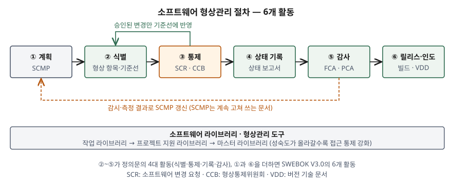
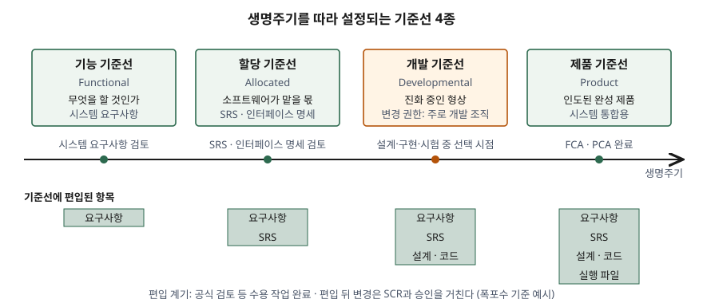

기출문제에서 소프트웨어 형상관리를 세 갈래로 나눠 묻는다. 형상관리가 무엇이고 어떤 순서로
수행하는지, 기준선이 무엇이고 어떤 종류가 있는지, 그리고 어떤 도구로 지원하는지다.
세 항목을 따로 외워 쓰면 목록 세 개가 나란히 놓인 답안이 된다. 점수는 **기준선이 절차와
도구를 잇는 축**이라는 점을 드러내는 데서 난다. 절차는 기준선을 세우고(식별) 기준선 이후의
변경만 다루며(통제), 도구는 그 기준선을 저장하고 재현하는 수단이다.

> 실행 검증 없음. 개념 문제이므로 SWEBOK V3.0 6장(ISO/IEC TR 19759:2016), SEBoK의
> 형상관리 항목, Pro Git 공식 문서를 근거로 정리했다.

---

## Ⅰ. 개요

### 가. 형상관리가 필요한 이유

소프트웨어는 개발 중에도 유지보수 중에도 바뀐다. 변경을 막을 수는 없으므로 관리의 대상은
변경 자체가 아니라 **"지금 승인된 상태가 무엇인가"를 언제든 말할 수 있게 하는 것**이다.
이것이 무너지면 세 가지 문제가 생긴다.

- ① **식별 실패**: 같은 산출물이 여러 판본으로 돌아다녀 어느 것이 현행인지 알 수 없다
- ② **통제 실패**: 변경이 무엇에 영향을 주는지 평가 없이 반영된다
- ③ **재현 실패**: 납품한 실행 파일을 어느 소스·어느 컴파일러로 만들었는지 다시 만들 수 없다

### 나. 품질보증(SQA)과의 관계

SWEBOK V3.0은 형상관리를 **지원 생명주기 프로세스**로 두고, SQA 목표 달성을 돕는 활동이라고
적는다. 프로젝트에 따라서는 SQA 요구사항이 특정 형상관리 활동을 지정하기도 한다. 감사 결과와
상태 기록 일부는 그대로 품질 기록이 된다. 형상관리는 개발 조직의 편의 도구가 아니라
**품질 증거를 만드는 체계**다.

## Ⅱ. (가) 소프트웨어 형상관리의 정의 및 절차

### 가. 정의

SWEBOK V3.0은 형상관리의 정식 정의를 ISO/IEC/IEEE 24765에서 가져온다.

> 형상 항목에 기술적·관리적 지시와 감시를 적용하여 ① 기능적·물리적 특성을 **식별하고
> 문서화**하고, ② 그 특성의 **변경을 통제**하고, ③ 변경 처리·구현 **상태를 기록·보고**하고,
> ④ 명시된 요구사항에 대한 **준수를 검증**하는 분야

같은 문서는 이를 풀어 **"시스템의 형상을 서로 다른 시점마다 식별해 두고, 변경을 체계적으로
통제하며, 생명주기 전체에 걸쳐 무결성과 추적성을 유지하는 분야"** 라고도 설명한다.
여기서 **형상**은 기술 문서에 적혔거나 제품으로 구현된 하드웨어·소프트웨어의 기능적·물리적
특성이고, **형상 항목(CI)** 은 하나의 단위로 관리하도록 정한 항목이다.

### 나. 절차 — 6개 활동

정의문의 네 항목이 곧 4대 활동이고, SWEBOK V3.0은 앞에 **계획**, 뒤에 **릴리스 관리·인도**를
붙여 **6개 활동**으로 나눈다.

> **출처**: [SWEBOK V3.0 Chapter 6 — Software Configuration Management](https://ieeecs-media.computer.org/media/education/swebok/swebok-v3.pdf) §1.3–1.5(계획·SCMP·감시), §2(식별), §2.2(소프트웨어 라이브러리), §3(통제), §4(상태 기록), §5(감사), §6(릴리스 관리·인도)를 합쳐 그렸다.

| 순서 | 활동 | 하는 일 | 대표 산출물 |
|---|---|---|---|
| ① | 형상관리 계획 | 조직·책임, 자원·일정, 도구 선정, 외주 통제, 인터페이스 통제를 정한다 | 형상관리계획서(SCMP) |
| ② | 형상 식별 | 통제할 항목을 고르고 명명·버전 체계를 세우며, 쓸 기준선과 편입 절차를 정한다 | 형상 항목 목록, 기준선 |
| ③ | 형상 통제 | 기준선 이후 변경을 요청·평가·판정·구현한다 | 변경 요청서(SCR), CCB 판정 |
| ④ | 형상 상태 기록 | 승인된 형상, 변경·편차·면제의 구현 상태를 수집해 보고한다 | 상태 보고서 |
| ⑤ | 형상 감사 | 항목이 요구된 기능적·물리적 특성을 갖췄는지 독립적으로 검사한다 | FCA·PCA 결과 |
| ⑥ | 릴리스 관리·인도 | 올바른 버전을 조합해 빌드하고, 묶어서 배포한다 | 빌드 결과물, 버전 기술 문서(VDD) |

SEBoK은 같은 내용을 계획·식별·변경 관리·상태 기록·검증과 감사의 **5개 활동**으로 나누고,
이 활동들이 **엄격히 순차적이지 않고 동시에, 반복적으로 적용된다**고 적는다. 표의 번호는
처음 한 바퀴의 순서이고, 실제로는 ③→②(기준선 갱신)와 ⑤→①(계획 갱신)이 계속 돈다.

### 다. 핵심 절차 — 변경 통제 4단계

절차 중 가장 자주 도는 것이 ③이다. SWEBOK V3.0의 변경 요청 흐름은 4단계다.

- ① **요청**: 누구나 생명주기의 어느 시점에서든 SCR을 낼 수 있다. 결함·개선 같은 변경 유형을 함께 적는다
- ② **기술 평가(영향 분석)**: 받아들일 경우 수정 범위가 어디까지인지 판단한다. 항목 간 관계를 알아야 가능하다
- ③ **판정**: 영향받는 기준선·항목·변경 성격에 맞는 권한자가 **수용·수정·기각·보류** 중 하나로 정한다.
  이 권한자가 **형상통제위원회(CCB)** 이고, 범위가 소프트웨어에 한정되면 SCCB다.
  소규모 프로젝트에서는 리더 한 사람일 수 있고, 항목의 중요도에 따라 **권한 단계를 여럿** 둘 수 있다
- ④ **구현과 종결**: 승인된 SCR을 반영하고 **어느 SCR이 어느 버전·기준선에 들어갔는지** 추적한다.
  종결 시 형상 감사·품질 검증으로 **승인된 변경만 들어갔는지** 확인한다

요구사항을 지정 시점에 만족할 수 없을 때는 별도의 공식 승인이 있다. 제작 **전에** 요구사항에서
벗어나도록 허가하는 것이 **편차(deviation)**, 제작 중이나 검사 뒤에 요구사항과 다르다고 확인된
항목을 그대로 또는 승인된 재작업 뒤에 쓰도록 허가하는 것이 **면제(waiver)** 다.

## Ⅲ. (나) 소프트웨어 형상관리 기준선

### 가. 정의

SWEBOK V3.0은 기준선을 **형상 항목의 공식 승인된 버전으로, 생명주기의 특정 시점에 공식
지정·고정된 것**이라고 정의한다. 매체를 가리지 않는다. 핵심 성질은 **3가지**다.

- ① **공식 승인**: 합의된 버전이어야 한다. 작업 중인 사본은 기준선이 아니다
- ② **시점 고정**: 생명주기의 특정 시점에 지정된다
- ③ **공식 변경 통제로만 변경**: 기준선에 승인된 변경을 모두 더한 것이 **현재 승인된 형상**이다

SEBoK은 여기에 기준선이 **변경을 정의하는 기준이 된다**는 점을 더한다. 기준선이 없으면
"무엇에서 무엇으로 바뀌었는가"를 적을 수 없고, 그러면 Ⅱ의 통제·기록·감사가 전부 성립하지 않는다.

### 나. 종류 — 4가지

> **출처**: [SWEBOK V3.0 Chapter 6 — Software Configuration Management](https://ieeecs-media.computer.org/media/education/swebok/swebok-v3.pdf) §2.1.5 Baseline(4종과 대응 산출물, 개발 기준선의 변경 권한), §2.1.6 Acquiring Software Configuration Items(공식 검토 완료가 편입 계기, Figure 6.2의 항목 누적), §5(FCA·PCA 완료가 제품 기준선 설정의 전제)를 합쳐 그렸다.

| 기준선 | 대응 산출물 | 설정 계기 | 변경 권한 |
|---|---|---|---|
| 기능(Functional) | 검토를 마친 **시스템 요구사항** | 시스템 요구사항 검토 완료 | 사업·시스템 수준 CCB |
| 할당(Allocated) | 검토를 마친 **SRS와 인터페이스 요구사항 명세** | 소프트웨어 요구사항 검토 완료 | 프로젝트 CCB |
| 개발(Developmental) | 생명주기 중 선택한 시점의 **진화 중인 형상** | 프로젝트가 SCMP에 정한 시점 | **주로 개발 조직**, 형상관리·시험 조직과 나눌 수 있다 |
| 제품(Product) | 시스템 통합용으로 **인도된 완성 제품** | FCA·PCA 완료(전제가 될 수 있다) | 프로젝트·고객 수준 CCB |

> 변경 권한 열에서 SWEBOK이 직접 적는 것은 개발 기준선의 권한뿐이다. 나머지 행은 같은
> 문서의 "기준선마다 필요한 승인 권한 수준을 SCMP에 정한다", "CCB는 항목의 중요도와
> 변경의 성격에 따라 여러 단계를 둘 수 있다"를 적용한 예시다.

### 다. 기준선 설정 절차 — 3단계

형상 항목은 한꺼번에 통제되지 않고 **생명주기의 서로 다른 시점에 기준선으로 편입**된다.

- ① **편입 계기 확인**: 공식 검토 같은 **공식 수용 작업의 완료**가 계기다
- ② **출처와 초기 무결성 확정**: 편입하는 항목이 어디서 왔고 처음 상태가 온전한지 정한다
- ③ **이후 변경은 승인 경로로**: 편입 뒤의 변경은 해당 항목·기준선에 맞는 권한자의 공식 승인을 받은 뒤에만 기준선에 반영한다

도식의 아래쪽처럼 기준선에 편입된 항목은 생명주기를 따라 **누적된다.** 요구사항만 있던
기준선이 SRS, 설계·코드, 실행 파일을 차례로 더해 간다. SWEBOK은 이 그림을 폭포수 모델로
그렸지만 **설명을 위한 예시일 뿐**이라고 밝힌다. 반복형 개발이나 지속적 통합 환경에서는 개발
기준선이 훨씬 자주 설정된다.

### 라. 기준선과 라이브러리

기준선은 **소프트웨어 라이브러리**에 담긴다. SWEBOK은 항목의 성숙도에 따라 라이브러리를
나누는 예를 든다.

| 라이브러리 | 지원하는 단계 | 통제 수준 |
|---|---|---|
| 작업(working) 라이브러리 | 코딩 | 개발자·유지보수자가 함께 쓴다. 다수 개발자의 버전 관리가 중심 |
| 프로젝트 지원 라이브러리 | 시험 | 접근이 좁아진다 |
| 마스터 라이브러리 | 완성 제품 | 접근이 가장 좁고, 형상관리 조직이 주 사용자 |

라이브러리마다 **연결된 기준선과 변경 권한 수준**이 붙고, 접근 통제와 백업이 라이브러리 관리의
핵심이 된다. 기준선을 정의만 하고 저장 위치와 접근 권한을 정하지 않으면 통제가 실제로 걸리지 않는다.

## Ⅳ. (다) 소프트웨어 형상관리 도구

### 가. 지원 범위에 따른 분류 — 3가지

SWEBOK V3.0은 형상관리 도구를 **지원하는 범위**로 세 부류로 나눈다.

| 구분 | 개인 지원 | 프로젝트 지원 | 전사 프로세스 지원 |
|---|---|---|---|
| 주 기능 | 버전 관리, 빌드 처리, 변경 통제 | 개발팀·통합 담당자의 **작업 공간 관리** | 전사 프로세스 일부 자동화 — 워크플로·역할·책임 |
| 분산 개발 | — | 지원 | 지원 |
| 적합한 조직 | 소규모, 제품 변형(variant)이 없는 조직 | 중·대규모, 제품 변형과 **병행 개발**이 있으나 인증 요건은 없는 조직 | **인증 요건**이 있는 공식 개발 프로세스 |
| 포함 관계 | 기본 | 개인 지원 위에 작업 공간 관리를 더함 | 프로젝트 지원 위에 공식 프로세스 지원을 더함 |

### 나. 기능별 도구와 대응 활동

개인 지원 도구는 다시 기능으로 나뉘고, 각각이 Ⅱ의 활동 하나 이상을 맡는다.

| 도구 기능 | 하는 일 | 지원하는 활동 |
|---|---|---|
| ① 버전 관리 | 소스 코드·외부 문서 같은 개별 형상 항목을 추적·문서화·저장한다 | 식별, 통제(구현), 기준선 복원 |
| ② 변경 통제 | 변경 요청의 흐름을 강제하고, CCB 판정을 남기고, 상태 변경·마일스톤 도달을 알린다 | 통제, 상태 기록 |
| ③ 빌드 처리 | 컴파일·링크부터, 발전된 형태는 최신 버전 추출·품질 점검·회귀 시험·보고서 생성까지 | 릴리스(빌드) |
| ④ 릴리스 관리 | 릴리스 내용을 받은 SCR과 연결하고, 대상 플랫폼·고객 환경 정보를 유지한다 | 릴리스·인도, 상태 기록 |

SWEBOK은 도구 간 연결도 요구한다. 변경 통제 도구를 문제 보고 시스템과 이으면 보고된 문제의
해결 경과를 추적할 수 있고, 릴리스 도구를 변경 요청 도구와 이으면 **릴리스마다 어떤 SCR이
들어갔는지**를 뽑을 수 있다. 이 연결이 Ⅱ-다 ④단계의 추적을 도구로 실현하는 부분이다.

### 다. 버전 관리 저장소 구조 — 3가지

버전 관리 도구는 저장소를 어디에 두는가에 따라 갈린다. Pro Git은 이를 **3가지**로 나눈다.

| 구분 | 로컬 | 중앙집중형(CVCS) | 분산형(DVCS) |
|---|---|---|---|
| 저장소 위치 | 개인 컴퓨터 한 대 | 단일 서버. 클라이언트는 파일을 체크아웃 | 모든 클라이언트가 **전체 이력을 포함한 저장소**를 복제 |
| 예 | RCS | CVS, Subversion, Perforce | Git, Mercurial |
| 장점 | 단순하다 | 누가 무엇을 하는지 보이고, 관리자가 **권한을 세밀하게** 통제한다 | 각 복제본이 전체 백업이다. 서버가 죽어도 복제본으로 복원한다 |
| 약점 | 협업이 안 된다 | 서버가 **단일 장애점**. 백업 없이 DB가 손상되면 전체 이력을 잃는다 | 저장소가 여러 곳에 있어 "어느 것이 기준인가"를 따로 정해야 한다 |
| 형상관리 관점 | 개인 이력만 남는다 | 기준선 저장 위치가 자연히 하나로 정해진다 | 기준선 저장소를 **규약으로 지정**하고 승인 경로를 그 저장소의 병합 권한에 건다 |

마지막 행은 Pro Git의 구조 설명에 SWEBOK의 라이브러리·접근 통제 요구를 대입한 해석이다.
분산형은 개발자 작업 공간(작업 라이브러리)을 자유롭게 하는 대신, 기준선을 담는 저장소와
그 저장소에 대한 병합 권한을 명시적으로 정해야 Ⅲ-라의 통제 수준이 유지된다.

### 라. 도구 선정 시 고려사항 — 4가지

SWEBOK V3.0은 도구 선정 시 따질 질문을 12개 든다. 정보시스템 설계에 직접 걸리는 것을 4개로 추린다.

- ① **브랜치·병합 전략과의 호환**: 계획한 브랜치·병합 전략을 도구가 지원하는가. 전략은 형상관리 활동 대부분에 영향을 주므로 도구보다 먼저 정한다
- ② **통합**: 형상관리 도구끼리, 그리고 조직의 다른 도구와 연동되는가. 형상관리는 단일 도구가 아니라 **도구 묶음(workbench)** 으로 수행되며, 공급자가 다른 도구를 섞는 개방형과 함께 동작하도록 설계된 통합형 중 무엇으로 갈지 정한다
- ③ **이관**: 버전 관리 저장소를 다른 도구로 옮길 때 **형상 항목의 전체 이력**을 유지할 수 있는가
- ④ **감시 요건과 유연성**: 절차를 강제하는 도구는 감시가 쉽고 개발자의 유연성이 줄어든다. 어느 수준을 요구할지가 선정 기준이 된다

## Ⅴ. 결론

소프트웨어 형상관리는 형상 항목을 식별하고, 변경을 통제하고, 상태를 기록하고, 요구사항
준수를 감사하는 분야이며, 계획과 릴리스 관리를 더한 6개 활동으로 수행된다. 이 절차를 묶는
축이 **기준선**이다. 기능·할당·개발·제품 4종의 기준선이 공식 검토를 계기로 생명주기를 따라
누적되고, 그 이후의 변경만 CCB를 거쳐 반영된다. 도구는 개인·프로젝트·전사 범위로 나뉘며,
버전 관리·변경 통제·빌드·릴리스 도구가 연결되어야 **어느 변경이 어느 릴리스에 들어갔는지**를
기록으로 뽑을 수 있다.

지속적 통합 환경에서는 빌드가 하루에도 여러 번 돌고 개발 기준선이 그만큼 자주 생긴다.
이때 형상관리의 범위는 소스에서 끝나지 않는다. SWEBOK은 이전 빌드를 정확히 다시 만들려면
**컴파일러 같은 지원 도구와 빌드 명령도 형상 통제 아래 두어야 한다**고 적는다. 형상관리를
"버전 관리 도구 도입"으로 좁히지 않고, **기준선의 정의·저장·재현을 하나의 체계로 설계하는 것**이
정보시스템 관점의 형상관리다.

> 개념 정리: [형상관리 — 4대 활동과 베이스라인](../../software-engineering/2026-09-22-configuration-management-baseline/index.md)
>
> 개념 정리: [브랜치·병합 전략 — 트렁크 기반 개발과 기능 브랜치](../../software-engineering/2026-10-06-branching-merging-strategy-trunk-feature/index.md)

끝

## 답안 작성 메모

- **먼저 쓸 것**: Ⅱ-나의 6개 활동 모식도와 Ⅲ-나의 기준선 4종 표. 둘이 서면 (가)와 (나)의
  절반이 채워진다. 모식도에는 ③→② 되먹임 화살표("승인된 변경만 기준선에 반영")를 꼭 그린다 —
  절차를 일직선으로만 그린 답안과 갈리는 지점이다.
- **점수가 갈리는 지점**:
  - Ⅱ-가에서 정의문의 네 항목이 곧 4대 활동임을 보이는지. 정의와 절차를 따로 외운 답안은
    둘을 잇지 못한다
  - Ⅲ에서 기준선 4종 이름만 쓰지 않고 **설정 계기**(공식 검토 완료)와 **변경 권한**을 붙이는지.
    "기준선 이후 변경만 통제한다"는 문장이 있어야 (가)와 (나)가 이어진다
  - Ⅳ를 제품 이름 나열로 끝내지 않고 **지원 범위 3분류**와 **활동 대응**으로 쓰는지.
    문항이 "도구"를 물어도 채점자가 보는 것은 도구가 어떤 활동을 지원하느냐다
- **시간이 모자라면**: Ⅰ-나(SQA 관계), Ⅱ-다의 편차·면제 문단, Ⅲ-라의 라이브러리 표,
  Ⅳ-라의 선정 고려사항을 버린다. Ⅳ-다의 저장소 비교표는 로컬 열을 빼고 CVCS·DVCS 둘만
  남긴다. 논술형은 비교표가 최소 1개 있어야 하므로 Ⅲ-나와 Ⅳ-가 중 하나는 반드시 남긴다.
- 기준선 종류는 교재에 따라 이름과 개수가 다르게 나오기도 한다. 이 답안은 SWEBOK V3.0의
  4종을 따랐고, 출처를 답안에 한 줄 적어 두면 다른 분류를 쓴 채점자에게도 근거가 선다.
- 도구 이름은 Pro Git이 예로 든 버전 관리 도구만 썼다. 변경 통제·빌드 도구는 제품 이름 대신
  기능 이름으로 쓴다.

## 참고 자료

- [SWEBOK Guide V3.0 — Chapter 6. Software Configuration Management (IEEE Computer Society, 2014)](https://ieeecs-media.computer.org/media/education/swebok/swebok-v3.pdf) — §1.3.3 도구 선정, §1.4 SCMP, §2.1.5 Baseline, §2.1.6 항목 편입, §2.2 라이브러리, §3 형상 통제, §5 감사, §6 릴리스, §7 도구
- [ISO/IEC TR 19759:2016 — Software Engineering Body of Knowledge (SWEBOK)](https://www.iso.org/standard/67604.html)
- [ISO/IEC/IEEE 24765:2017 — Systems and software engineering — Vocabulary](https://www.iso.org/standard/71952.html)
- [IEEE 828-2012 — Standard for Configuration Management in Systems and Software Engineering](https://ieeexplore.ieee.org/document/6170935)
- [SEBoK v2.14 — Configuration Management (2025-10-19 갱신)](https://sebokwiki.org/wiki/Configuration_Management)
- [Pro Git 2판 — 1.1 About Version Control (Scott Chacon, Ben Straub)](https://git-scm.com/book/en/v2/Getting-Started-About-Version-Control)
