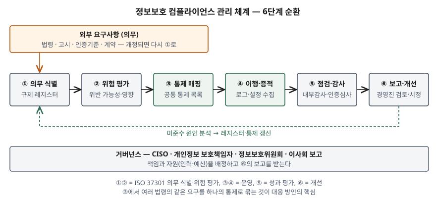

기출문제에서 국내의 여러 규제를 배경으로 정보보호 컴플라이언스를 세 갈래로 묻는다. 무엇인지,
왜 필요한지, 어떻게 대응하는지다. 법 이름을 나열하는 답안은 많다. 점수는 **법령마다 따로
대응하면 같은 통제를 여러 번 만들고 여러 번 입증하게 된다**는 문제를 짚고, 이를 공통 통제와
증적 체계로 푸는 데서 난다. 정보관리기술사 답안이므로 축은 법 해설이 아니라 **법이
정보시스템에 무엇을 요구하는가**다.

> 실행 검증 없음. 개념·제도 문제이므로 ISO 37301:2021, ISO/IEC 27001:2022, NIST CSF 2.0과
> 각 법률 조문을 근거로 정리했다. 2026년 4월 정부가 발표한 ISMS-P 개편 방안은 아직 고시로
> 확정되지 않아 1차 자료가 없다. 해당 부분만 보도 3건(뉴시스·머니투데이·보안뉴스)을 교차
> 확인해 썼다. (§10)

---

## Ⅰ. 개요

### 가. 국내 정보보호 규제의 특징 — 다중 규제

국내에는 정보보호를 한 법이 아니라 **여러 법이 업종과 대상별로 나눠** 규정한다. 정보통신서비스
제공자는 정보통신망법, 개인정보를 처리하면 개인정보 보호법, 금융회사는 전자금융거래법,
국가 기반시설은 정보통신기반 보호법의 적용을 받는다. 한 기업이 이 중 셋 이상에 동시에 걸리는
일이 흔하고, 법마다 소관 부처·책임자·점검 주기·제재가 다르다.

### 나. 최근 변화 — 2026년 정보통신망법 개정

2026년 3월 31일 공포된 정보통신망법 개정(법률 제21500호)이 2026년 10월 1일 시행됐다.
CISO를 **임원**으로 지정하고 이사회에 보고하게 했으며, 일정 규모 이상 사업자에 정보보호위원회
설치를 의무화했다. 5년 안에 침해사고가 반복되면 매출액 3% 이하의 과징금을 물릴 수 있게 됐다.
컴플라이언스가 실무 부서의 점검표가 아니라 **경영진 책임**의 문제로 올라간 것이다.

## Ⅱ. (가) 정보보호 컴플라이언스 개념

### 가. 정의

컴플라이언스 경영시스템 국제표준 ISO 37301:2021은 컴플라이언스를 **조직의 모든 컴플라이언스
의무를 충족하는 것**으로 정의한다. 여기서 **컴플라이언스 의무**는 법령·인허가처럼 반드시 지켜야
하는 요구사항과, 표준·계약·내부 방침처럼 조직이 자발적으로 지키기로 선택한 요구사항을 함께 가리킨다.

이를 정보보호에 적용하면 다음과 같이 쓸 수 있다.

> **정보보호 컴플라이언스**란 정보보호·개인정보보호에 관한 법령·고시·인증기준·계약상 의무를
> 식별하고, 이를 충족하는 관리적·기술적·물리적 통제를 운영하며, 그 충족을 **증적으로 입증**하는
> 지속적 활동이다.

국제 프레임워크도 같은 요구를 담는다. ISO/IEC 27001:2022 부속서 A의 법적·계약적 요구사항
통제(A.5.31)는 관련 요구사항을 식별·문서화·최신화하도록 요구하고, 정책·규칙 준수 통제(A.5.36)는
그 준수 여부를 정기적으로 검토하도록 요구한다. NIST CSF 2.0은 거버넌스(GOVERN) 기능 안에
"사이버보안에 관한 법적·규제적·계약적 요구사항을 이해하고 관리한다"는 항목(GV.OC-03)을 둔다.

### 나. 의무의 3계층

| 계층 | 성격 | 예 | 지키지 않으면 |
|---|---|---|---|
| ① 법령 의무 | 강제 | 안전조치, 책임자 지정, 침해사고 신고, 취약점 분석·평가 | 과징금·과태료·형사처벌 |
| ② 인증·공시 의무 | 대상이면 강제, 그 외 자율 | ISMS·ISMS-P 인증, 정보보호 공시 | 과태료, 인증 취소, 계약·사업 참여에서 불리 |
| ③ 계약·자율 의무 | 선택 | 고객사 보안 요구, ISO/IEC 27001, 내부 정책 | 계약 해지, 신뢰 하락 |

### 다. 국내 주요 규제와 정보시스템 요구사항 — 5개 법률

| 법률 | 적용 대상 | 핵심 의무 | 정보시스템에 주는 요구 |
|---|---|---|---|
| 정보통신망법 | 정보통신서비스 제공자 | CISO 지정(제45조의3), ISMS 인증 의무(제47조), 침해사고 신고 | 보호조치 구현, 침해 탐지·신고 체계, 인증 증적 |
| 개인정보 보호법 | 개인정보처리자 | 안전조치(제29조), 보호책임자 지정(제31조), 공공기관 영향평가(제33조) | 접근통제·암호화·접속기록 보관, 처리 단계별 통제 |
| 정보통신기반 보호법 | 주요정보통신기반시설 관리기관 | 취약점 분석·평가(제9조), 보호대책 수립 | 정기 취약점 진단, 기반시설 보호계획 |
| 전자금융거래법 | 금융회사·전자금융업자 | 정보보호최고책임자 지정(제21조의2), 안전성 확보 | 전자금융 기반시설 보호, 이상거래 탐지 |
| 정보보호산업법 | 시행령 기준 규모 이상 사업자 | 정보보호 공시(제13조) | 정보보호 투자·인력·인증 현황의 집계 |

ISMS 인증 의무 대상은 정보통신망법이 직접 정한다. 주요정보통신서비스 제공자, 집적정보통신시설
사업자, 그리고 전년도 매출액 1,500억 원 이상이거나 정보통신서비스 매출 100억 원 이상 또는 일일
평균 이용자 100만 명 이상인 자 중 대통령령 기준에 해당하는 자다. 개인정보 보호법의 인증
(제32조의2)과 합쳐 운영하는 것이 ISMS-P이며, 인증기준은 관리체계 수립·운영 16개, 보호대책
요구사항 64개, 개인정보 처리 단계별 요구사항 21개로 **3개 영역 101개 항목**이다.

### 라. 정보보호와 정보보호 컴플라이언스의 차이

둘은 겹치지만 같지 않다. ISO/IEC 27001이 조직의 **위험**에서 출발하는 반면, ISO 37301은 외부의
**의무**에서 출발한다. 아래 표는 두 표준의 출발점 차이를 정리한 것이다.

| 구분 | 정보보호(보안) | 정보보호 컴플라이언스 |
|---|---|---|
| 출발점 | 조직 자산의 위험 | 법령·인증·계약의 의무 |
| 판단 기준 | 위험이 수용 수준 이하인가 | 요구사항을 충족했는가 |
| 핵심 산출물 | 통제 자체 | 통제 + **충족을 보이는 증적** |
| 실패 형태 | 사고 발생 | 사고가 없어도 증적이 없으면 위반 |

둘은 서로를 대신하지 못한다. 인증을 받고도 침해사고가 나는 경우가 있고, 통제를 잘 운영해도
접속기록 보관 기간 같은 형식 요건을 놓치면 위반이 된다. 2026년 ISMS-P 개편 논의가 시작된
배경도 이 간극이다.

## Ⅲ. (나) 정보보호 컴플라이언스 필요성

필요성은 **5가지**로 정리한다.

- ① **법적 제재의 규모 확대**: 개인정보 보호법은 2023년 개정으로 과징금 상한을 **전체 매출액의
  3%**로 바꿨고, 2026년 정보통신망법 개정은 반복 침해사고에 매출액 3% 이하 과징금을 더했다.
  위반 비용이 보안 투자 비용을 넘는 구간이 생겼다
- ② **다중 규제의 중복 부담**: 접근통제·접속기록·암호화·취약점 점검은 여러 법과 인증기준이
  표현만 달리해 반복 요구한다. 법령마다 따로 대응하면 같은 통제를 여러 번 만들고, 점검 때마다
  같은 증적을 다른 양식으로 다시 만든다
- ③ **사업 자격 요건**: 의무 대상이 ISMS를 받지 않으면 과태료 대상이 되고, 인증은 공공 사업
  참여나 고객사 계약의 조건으로 쓰인다. 컴플라이언스가 곧 **영업 자격**이다
- ④ **경영진 책임의 명문화**: 2026년 개정으로 CISO가 임원으로, 업무에 이사회 보고와 인력·예산
  관리가 들어갔다. 책임자가 무엇을 근거로 보고하는지가 체계로 있어야 한다
- ⑤ **규제 변화의 속도**: 법 개정, 시행령·고시 변경, 인증기준 개편이 매년 일어난다. 2026년
  4월 정부는 ISMS-P를 간편·표준·강화 3단계로 나누고 기술 심사를 도입하는 개편 방안을 냈다.
  변경을 추적하는 절차가 없으면 작년에 맞던 통제가 올해 위반이 된다

## Ⅳ. (다) 정보보호 컴플라이언스 대응 방안

### 가. 관리 체계 — 6단계 순환

ISO 37301의 의무 식별(4.5)·위험 평가(4.6)·운영(8)·성과 평가(9)·개선(10) 구조를 정보보호에
적용하면 **6단계**가 된다.

> **출처**: [ISO 37301:2021 Compliance management systems](https://www.iso.org/standard/75080.html) 4.5 Compliance obligations, 4.6 Compliance risk assessment, 5 Leadership, 8 Operation, 9 Performance evaluation, 10 Improvement와 [NIST CSWP 29 CSF 2.0 GV.OC-03](https://nvlpubs.nist.gov/nistpubs/CSWP/NIST.CSWP.29.pdf), [ISO/IEC 27001:2022 Annex A 5.31·5.36](https://www.iso.org/standard/27001)을 합쳐 그렸다.

| 단계 | 하는 일 | 산출물 |
|---|---|---|
| ① 의무 식별 | 적용 법령·고시·인증기준·계약을 조항 단위로 목록화하고 담당자를 붙인다 | 규제 레지스터 |
| ② 위험 평가 | 의무별 위반 가능성과 영향(제재·사업 영향)을 평가해 우선순위를 정한다 | 컴플라이언스 위험 목록 |
| ③ 통제 매핑 | 여러 의무가 요구하는 같은 내용을 **공통 통제 하나**로 묶고, 통제마다 근거 조항을 연결한다 | 공통 통제 목록 |
| ④ 이행·증적 | 통제를 구현하고 로그·설정·결재 기록을 증적으로 수집한다 | 증적 저장소 |
| ⑤ 점검·감사 | 내부감사와 인증심사로 충족 여부를 확인한다 | 감사 결과, 결함 목록 |
| ⑥ 보고·개선 | 경영진에 보고하고 미준수의 원인을 찾아 시정한다 | 시정조치, 갱신된 레지스터 |

법령이 개정되면 ①로 돌아간다. 이 순환이 끊기지 않게 하는 것이 아래 거버넌스다.

### 나. 관리적 방안 — 3가지

- ① **책임 구조 정비**: CISO·개인정보 보호책임자·금융 정보보호최고책임자의 역할을 겹치지 않게
  정의한다. 정보통신망법은 CISO가 다른 법의 보호책임자 업무를 함께 맡을 수 있게 하므로, 겸직
  여부를 법 요건과 조직 규모에 맞춰 정한다. 정보보호위원회 설치 대상이면 위원회가 ⑥의 보고를 받는다
- ② **규제 레지스터 운영**: 의무를 법률 이름이 아니라 **조항 단위**로 관리한다. 조항마다 시행일,
  담당 부서, 대응 통제, 증적 위치를 적는다. 개정 법령의 시행일이 다가오면 해당 행이 갱신
  대상으로 뜨게 한다
- ③ **기준 프레임 하나를 축으로**: 국내 사업자라면 ISMS-P 101개 항목을, 해외 고객이 있으면
  ISO/IEC 27001·27701을 축으로 삼고 나머지 법령 요구를 그 위에 대응시킨다. 축이 여럿이면
  ③의 매핑이 다시 법령 수만큼 늘어난다

### 다. 기술적 방안 — 공통 통제와 증적 자동화

여러 법이 반복해 요구하는 항목을 공통 통제로 묶은 예다.

| 공통 통제 | 요구하는 근거 | 시스템 구현 | 증적 |
|---|---|---|---|
| 접근통제·권한 관리 | 개인정보 보호법 안전조치, ISMS-P 보호대책, 전자금융 안전성 | 통합 계정 관리, 역할 기반 권한, 정기 권한 검토 | 권한 부여·회수 이력 |
| 접속기록 보관·점검 | 안전성 확보조치 기준 제8조, ISMS-P 로그 관리 | 개인정보처리시스템 접속기록 위·변조 방지 저장 | 보관 기간 충족 기록, 점검 결과 |
| 암호화 | 개인정보 보호법 안전조치, ISMS-P 암호화 적용 | 저장·전송 구간 암호화, 키 관리 | 암호화 대상 목록, 키 관리 대장 |
| 취약점 점검 | 정보통신기반 보호법 제9조, ISMS-P 기술적 취약점 관리 | 정기 진단과 조치 추적 | 진단 보고서, 조치 이행 기록 |
| 침해사고 대응 | 정보통신망법 침해사고 신고·통지, 개인정보 유출 신고 | 탐지·분석·신고를 한 절차로 통합 | 사고 처리 기록, 신고 시각 |

접속기록을 예로 들면, 안전성 확보조치 기준은 개인정보처리시스템 접속기록을 1년 이상(5만 명
이상의 정보주체를 처리하는 시스템 등은 2년 이상) 보관하고 위·변조를 막도록 요구한다. 이를
시스템마다 따로 구현하지 않고 **중앙 로그 저장소 하나**에 보관 기간·무결성·점검 주기를 걸어
두면, 같은 저장소가 ISMS-P 심사와 개인정보 점검 양쪽의 증적이 된다.

증적은 사람이 캡처해 모으지 않고 **시스템이 생성하게** 한다. 권한 검토 결과, 암호화 설정 상태,
취약점 조치 현황을 정기적으로 수집해 통제 ID에 붙여 두면 ⑤단계의 심사가 수집이 아니라 확인이 된다.

### 라. 대응 방식 비교

| 구분 | 법령별 개별 대응 | 통합 컴플라이언스 체계 |
|---|---|---|
| 통제 설계 | 법령마다 별도 통제 | 공통 통제 하나에 근거 조항 여럿 |
| 증적 | 점검 때마다 수작업 수집 | 시스템이 생성·보관 |
| 법령 개정 대응 | 담당자가 개별 추적 | 레지스터에서 영향받는 통제를 조회 |
| 책임 | 법령별 담당 부서 분산 | CISO·위원회 아래 일원화 |
| 적합한 조직 | 적용 법령이 1~2개인 소규모 | 3개 이상 법령·인증이 겹치는 조직 |
| 약점 | 중복 투자, 누락 위험 | 초기 매핑 비용, 축 프레임 선정 부담 |

### 마. 2026년 ISMS-P 개편에 대한 대비

정부가 2026년 4월 발표한 개편 방안은 인증을 위험 수준에 따라 3단계로 나누고, 고위험 사업자에
강화 기준을 적용하며, 서면 심사에 취약점 진단·모의침투 같은 기술 심사를 더하는 내용이다.
아직 고시로 확정되지 않았으므로 세부 기준은 확정 후 다시 확인해야 한다. 다만 방향은 분명하다.
**문서로 통제가 있다고 보이는 것보다, 통제가 실제로 동작함을 보이는 것**으로 무게가 옮겨간다.
③의 공통 통제마다 "동작을 확인하는 방법"을 함께 정해 두는 것이 대비가 된다.

## Ⅴ. 결론

정보보호 컴플라이언스는 정보보호·개인정보보호에 관한 의무를 식별하고, 통제로 충족하고,
증적으로 입증하는 지속적 활동이다. 국내는 정보통신망법·개인정보 보호법·정보통신기반 보호법·
전자금융거래법·정보보호산업법이 대상별로 의무를 나눠 부과하고, 2026년 개정으로 제재와 경영진
책임이 커졌다. 이 환경에서 법령별로 따로 대응하면 같은 통제를 반복해 만들고 같은 증적을 반복해
모은다. 대응의 핵심은 **의무를 조항 단위로 식별해 공통 통제에 매핑하고, 그 통제의 증적을
시스템이 남기게 하는 것**이며, 이를 6단계 순환과 CISO 중심의 거버넌스로 운영한다.

컴플라이언스를 인증 취득으로 좁히면 인증을 받고도 사고가 나는 일이 반복된다. 정보시스템
관점에서 컴플라이언스는 **보안 통제의 설계 단계부터 근거 조항과 증적 생성을 함께 정의하는
일**이고, 그래야 규제가 바뀌어도 어느 통제를 고쳐야 하는지 바로 찾을 수 있다.

> 개념 정리: [ISMS-P 인증 — 3개 영역 인증기준과 의무 대상](../../security/2026-10-07-isms-p-certification-three-domains/index.md)
>
> 개념 정리: [컴플라이언스 경영시스템 ISO 37301 — 의무 식별과 위험 평가](../../it-management/2026-10-08-iso-37301-compliance-management-system/index.md)

끝

## 답안 작성 메모

- **먼저 쓸 것**: Ⅱ-가의 정의 한 문장과 Ⅳ-가의 6단계 모식도. 정의에 "의무 식별 → 충족 →
  **입증**" 세 동사가 들어가야 (다)의 증적 이야기와 이어진다. 모식도에는 법령 개정이 ①로
  돌아가는 화살표를 꼭 그린다 — 일회성 점검과 갈리는 지점이다.
- **점수가 갈리는 지점**:
  - (가)에서 법 이름 나열로 끝내지 않고 **각 법이 정보시스템에 무엇을 요구하는지**까지 쓰는지.
    Ⅱ-다 표의 마지막 열이 그것이다
  - (나)에서 "법 위반 방지" 한 줄로 끝내지 않고 **다중 규제의 중복**을 필요성으로 드는지.
    이것이 (다)의 공통 통제 매핑으로 이어지는 연결 고리다
  - (다)를 "인증 취득·교육 강화"로 끝내지 않고 **공통 통제와 증적 자동화**를 쓰는지.
    Ⅳ-다의 표 하나가 이 부분의 점수다
- **시간이 모자라면**: Ⅰ-나, Ⅱ-나의 3계층 표, Ⅳ-마를 버린다. Ⅱ-라 비교표와 Ⅳ-라 비교표 중
  하나는 반드시 남긴다 — 논술형은 비교표가 최소 1개다. 남긴다면 Ⅳ-라가 (다)의 점수와 직결된다.
- 법 조항 번호는 확실한 것만 쓴다. ISMS 의무 대상 기준 금액이나 ISMS-P 항목 수는 개정될 수
  있으므로, 기억이 불확실하면 숫자 대신 "대통령령 기준 이상", "3개 영역"으로 쓴다.
- 2026년 개편 방안은 시험 시점에 고시로 확정됐는지 확인하고 쓴다. 확정 전이면 "발표된 방안"으로
  적는다.

## 참고 자료

- [ISO 37301:2021 — Compliance management systems — Requirements with guidance for use](https://www.iso.org/standard/75080.html) — 3 용어(컴플라이언스, 컴플라이언스 의무), 4.5, 4.6, 8, 9, 10
- [ISO/IEC 27001:2022 — Information security management systems — Requirements](https://www.iso.org/standard/27001) — Annex A 5.31 Legal, statutory, regulatory and contractual requirements, 5.36 Compliance with policies, rules and standards for information security
- [NIST CSWP 29 — The NIST Cybersecurity Framework (CSF) 2.0 (2024-02-26)](https://nvlpubs.nist.gov/nistpubs/CSWP/NIST.CSWP.29.pdf) — GOVERN, GV.OC-03
- [정보통신망 이용촉진 및 정보보호 등에 관한 법률 (법률 제21500호, 2026-10-01 시행)](https://www.law.go.kr/법령/정보통신망이용촉진및정보보호등에관한법률) — 제45조의3, 제47조
- [개인정보 보호법](https://www.law.go.kr/법령/개인정보보호법) — 제29조, 제31조, 제32조의2, 제33조
- [개인정보의 안전성 확보조치 기준 (개인정보보호위원회 고시)](https://www.law.go.kr/행정규칙/개인정보의안전성확보조치기준) — 제8조 접속기록의 보관 및 점검
- [정보통신기반 보호법](https://www.law.go.kr/법령/정보통신기반보호법) — 제9조
- [전자금융거래법](https://www.law.go.kr/법령/전자금융거래법) — 제21조의2
- [정보보호산업의 진흥에 관한 법률](https://www.law.go.kr/법령/정보보호산업의진흥에관한법률) — 제13조
- [법무법인 세종, 개정 정보통신망법 주요 내용 (2026-03-19)](https://shinkim.com/kor/media/newsletter/3178) — 2차 자료, 개정 조항 해설
- [법무법인 태평양, 정보통신망법 개정 주요 내용 (2026-03-18)](https://www.bkl.co.kr/law/insight/newsletter/6518) — 2차 자료, 개정 조항 해설
- [뉴시스, "보안 사고 내고 로그 없으면 인증 취소"…정부, IT 대기업 ISMS-P 대수술 (2026-04-09)](https://mobile.newsis.com/view/NISX20260409_0003584993) — 2차 자료
- [머니투데이, 해킹 발생했는데 보안인증?…정부, 'ISMS-P' 실효성 높인다 (2026-04-10)](https://www.mt.co.kr/tech/2026/04/10/2026040915411150434) — 2차 자료
- [보안뉴스, 유출 사고 시 ISMS-P 취소도 가능 (2026)](https://m.boannews.com/html/detail.html?idx=142603) — 2차 자료
