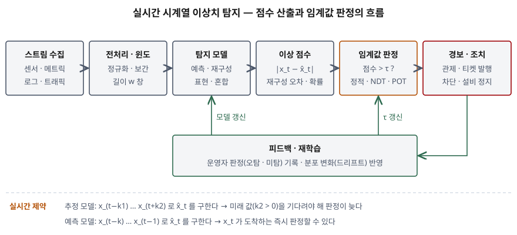

기출문제는 시계열 데이터의 실시간 이상치 탐지가 여러 산업에서 중요해지고 있다는 전제에서
**이상치의 유형**, **탐지 방식**, **딥러닝 기반 탐지 기법**을 차례로 묻는다. 기법 이름을
나열하는 것만으로는 머신러닝 교재 요약이 된다. 점수는 "이상치를 무엇에 대한 이탈로
정의하는가"를 먼저 세우고, 그 정의가 **기대값을 어떻게 구하는가 → 점수를 어떻게 내는가 →
임계값을 어떻게 정하는가**로 이어지는 처리 흐름을 정보시스템 관점에서 쓰는 데서 난다.

> 실행 검증 없음. 개념 문제이므로 이상 탐지 서베이(Chandola 외, 2009), 시계열 이상치
> 리뷰(Blázquez-García 외, 2021), 시계열 이상치 정의·벤치마크 논문(Lai 외, NeurIPS 2021),
> 딥러닝 시계열 이상 탐지 서베이(Darban 외, 2024), NASA 원격측정 이상 탐지 논문(Hundman 외,
> KDD 2018), 평가 프로토콜 논문(Kim 외, AAAI 2022) 근거로 정리했다. 성능 수치는 쓰지 않았다.

---

## Ⅰ. 개요

### 가. 시계열 이상치의 정의

| 구분 | 내용 |
|---|---|
| **정의** | 시계열의 한 시점 또는 한 구간이 **그 자리에서 기대되는 값·패턴에서 임계값 이상 벗어난 것** |
| **판정식** | $\lvert x_t - \hat{x}_t \rvert > \tau$ — $x_t$는 관측값, $\hat{x}_t$는 기대값, $\tau$는 임계값 (Blázquez-García 외 식 1, Lai 외 식 3) |
| **일반 이상치와의 차이** | 값 자체가 아니라 **시간 순서가 만드는 맥락**(이웃 시점·주기·추세)에 비춰 판단한다. 같은 값이 어느 시점에 나왔느냐에 따라 정상도 이상도 된다 |

판정식의 세 요소가 곧 답안의 뼈대다. **유형**은 $\hat{x}_t$를 무엇으로 볼지(전역 평균인지,
이웃 창인지, 주기인지), **탐지 방식**은 $\hat{x}_t$를 어떻게 구할지, **딥러닝 기법**은
$\hat{x}_t$와 점수를 신경망으로 구하는 방법이다.

### 나. 실시간 탐지가 중요해진 이유 — 3가지

| 이유 | 내용 |
|---|---|
| ① 데이터가 스트림으로 들어온다 | 설비 센서·서버 메트릭·네트워크 트래픽·금융 거래는 끝이 없는 시계열이다. 다 모은 뒤 일괄로 보면 이미 늦다 |
| ② 조기 탐지가 피해를 줄인다 | 실시간 탐지기는 이상을 **가능한 한 빨리** 잡고 **오경보를 내지 않으며** **바뀌는 통계에 스스로 적응**해야 한다 (Lavin·Ahmad, NAB 2015) |
| ③ 레이블이 거의 없다 | 이상은 드물고 미리 다 알 수 없다. 사람 전문가의 판정에 기대면 확장되지 않는다 (Hundman 외 2018) |

## Ⅱ. 시계열 데이터의 이상치 유형

### 가. 분류 축 — 3가지

이상치 유형은 하나의 표로 끝나지 않는다. 어느 축으로 보느냐에 따라 세 가지로 나뉜다.

| 축 | 분류 | 근거 |
|---|---|---|
| ① 일반 이상 탐지의 분류 | 점 이상 · 문맥 이상 · 집단 이상 | Chandola 외 2009 |
| ② 이상이 차지하는 단위 | 점 이상치 · 부분열 이상치 · 이상 시계열(여러 시계열 중 한 시계열 전체) | Blázquez-García 외 2021 |
| ③ 이상의 행동 | 점 단위 2유형 + 패턴 단위 3유형 (아래 나) | Lai 외 2021 |

①의 **집단 이상**은 "여러 시점이 함께 이상하다"는 묶음일 뿐이어서, 모양이 다른 구간·주기가
바뀐 구간·추세가 꺾인 구간이 전부 한 유형으로 들어간다. Lai 외는 이 모호함 때문에 합성
데이터를 만들고 탐지기를 비교하기 어렵다고 보고, 시계열을 **형상·계절성·추세** 성분으로
나눠 유형을 다시 정의했다. 답안은 ③을 중심으로 쓰고 ①②는 한 줄씩 대비한다.

### 나. 행동 기준 유형 — 점 단위 2 + 패턴 단위 3 = 5가지

| 구분 | 유형 | 정의 | 기대값 $\hat{x}$ / 비교 대상 | IT 운영 예 |
|---|---|---|---|---|
| **점 단위** | ① 전역(global) | 나머지 모든 점에서 크게 벗어난 점. 대개 **스파이크** | 전체 평균, $\tau = \lambda\cdot\sigma(X)$ | 응답 시간이 평소 범위를 훌쩍 넘는 한 시점 |
| | ② 문맥(contextual) | 전체 범위 안에 있지만 **이웃 시점**에 비해 벗어난 점. 작은 **글리치** | 길이 $2k$ 이웃 창, $\tau = \lambda\cdot\sigma(X_{t-k,t+k})$ | 새벽에 평소 낮보다 높은 트래픽 — 낮 기준으로는 정상인 값 |
| **패턴 단위** | ③ 형상(shapelet) | 구간의 **기본 모양**이 정상 구간과 다르다 | 정상 형상과의 거리(예: 동적 시간 와핑) | 주기적 배치 작업의 CPU 파형이 다른 모양으로 바뀜 |
| | ④ 계절(seasonal) | 모양·추세는 같고 **주기**가 다르다 | 정상 주기와의 차이 | 매시 정각 돌던 수집 작업이 30분 간격으로 바뀜 |
| | ⑤ 추세(trend) | 모양·주기는 같고 **추세 기울기**가 크게 바뀌어 평균이 영구히 이동한다 | 정상 추세와의 차이 | 메모리 누수로 사용량 기준선이 계속 올라감 |

> 정의와 식은 Lai 외 2021의 점 단위 이상치 절(3.2.1)·패턴 단위 이상치 절(3.2.2) 기준이다.
> 패턴 단위 유형은 구간을 $X_{i,j} = \rho(2\pi\omega T_{i,j}) + \tau(T_{i,j})$
> (형상 $\rho$, 계절성 $\omega$, 추세 $\tau$)로 쓰고, 세 성분 중 무엇이 어긋났는지로 나눈다.
> IT 운영 예는 이해를 돕기 위해 붙인 것이다.

### 다. 다변량 시계열에서 추가되는 유형 — 2가지

| 유형 | 정의 | IT 운영 예 |
|---|---|---|
| ⑥ 지표 간(intermetric) 이상 | 각 지표는 정상 범위인데 **지표 사이의 상관관계가 깨진다** | 요청 수가 늘었는데 CPU 사용률이 그대로 — 요청이 다른 곳으로 새고 있다 |
| ⑦ 시간·지표 간(temporal-intermetric) 이상 | 시간 의존성과 지표 간 의존성을 **동시에** 어긴다 | 여러 센서가 동시에 평소와 다른 주기로 움직임 |

Darban 외 서베이(2.4.1)는 ①~⑤를 시간 축의 이상, ⑥⑦을 지표 축의 이상으로 정리한다.
⑥은 단변량 탐지기를 지표마다 따로 돌리면 **구조적으로 놓친다.** 다변량 탐지가 따로 필요한 이유다.

## Ⅲ. 시계열 데이터 이상치 탐지 방식

### 가. 레이블 가용성에 따른 학습 방식 — 3가지

| 방식 | 학습 데이터 | 장단점 |
|---|---|---|
| ① 지도 | 정상·이상 레이블 모두 | 정확하지만 이상 레이블을 충분히 모으기 어렵고, 학습 때 못 본 유형을 놓친다 |
| ② 준지도 | **정상 데이터만** | 정상만 학습하고 벗어난 것을 이상으로 본다. 학습 데이터에 이상이 섞이면 그것까지 정상으로 배운다 |
| ③ 비지도 | 레이블 없음 | 이상이 드물다는 가정에 기댄다. 가장 널리 쓰이지만 오경보 관리가 과제다 |

(Chandola 외 2009의 레이블 가용성 구분 기준)

### 나. 기대값 산출 방식 — 4가지

Blázquez-García 외 리뷰는 단변량 점 이상치 탐지를 기대값 $\hat{x}_t$를 구하는 방법으로 나눈다.

| 방식 | 기대값을 구하는 법 | 대표 기법 | 실시간 적용 |
|---|---|---|---|
| ① 추정 모델 | 과거·현재·**미래** 값 $\{x_{t-k_1},\dots,x_{t+k_2}\}$로 $\hat{x}_t$ 추정 | 이동 중앙값, 구간별 평균, 오토인코더 | $k_2>0$이면 **미래 값을 기다려야 해** 즉시 판정이 안 된다 |
| ② 예측 모델 | **과거 값만** $\{x_{t-k},\dots,x_{t-1}\}$로 $\hat{x}_t$ 예측 | ARIMA, 지수평활, LSTM·CNN 예측 | $x_t$가 도착하는 즉시 판정 — 스트림에 맞다 |
| ③ 밀도·비유사도 기반 | 모델 없이 이웃 점·부분열과의 거리·밀도로 판단 | LOF, 부분열 디스코드 탐색, 매트릭스 프로파일 | 비교 대상 창을 유지해야 한다 |
| ④ 히스토그래밍 | 구간 근사에서 빼면 오차가 가장 줄어드는 점을 이탈점으로 본다 | 최적 히스토그램 기반 이탈점 탐색 | 스트림용 근사 알고리즘이 있다 |

리뷰는 추정 모델을 스트림에 쓸 수는 있으나 **미래 값이 필요한 경우 지연이 생기므로
실시간에는 예측 모델이 더 권할 만하다**고 정리한다. 또 이론상 스트림에 쓸 수 있는 기법은
많아도 **들어오는 데이터에 맞춰 점진적으로 갱신되는 기법은 적다**고 지적한다 — Ⅳ-바의
재학습 문제가 여기서 나온다.

### 다. 처리 흐름 — 모식도

> **출처**: [Blázquez-García et al., A Review on Outlier/Anomaly Detection in Time Series Data §3.1 Univariate time series (Fig.7, Eq.1)](https://arxiv.org/abs/2002.04236) · [Darban et al., Deep Learning for Time Series Anomaly Detection: A Survey §3.1 (anomaly score, thresholding)](https://arxiv.org/abs/2211.05244) · [Hundman et al., Detecting Spacecraft Anomalies Using LSTMs and Nonparametric Dynamic Thresholding (KDD 2018)](https://arxiv.org/abs/1802.04431)

정보시스템으로 보면 탐지는 **모델 하나가 아니라 6단계 파이프라인**이다. 수집 → 전처리·창
구성 → 모델이 기대값(또는 재구성) 산출 → 이상 점수 → 임계값 판정 → 경보·조치, 그리고
운영자 판정과 분포 변화를 모델·임계값으로 되돌리는 피드백이다. Darban 외는 이처럼 점수를
낸 뒤 임계값으로 자르는 **단계형** 모델과, 이상 여부를 바로 출력하는 **종단형** 모델을 구분한다.

## Ⅳ. 딥러닝 기반 시계열 데이터 이상치 탐지 기법

### 가. 4계열 분류

Darban 외 서베이(3장)는 딥러닝 기법을 **이상 점수를 무엇으로 내는가**로 4계열로 나눈다.

| 계열 | 원리 | 이상 점수 | 대표 모델 (신경망 구조) |
|---|---|---|---|
| ① 예측 기반 | 과거 창으로 다음 값을 예측 | **예측 오차** | LSTM-AD·Telemanom(LSTM), DeepAnT(CNN), GDN(그래프 신경망), HTM |
| ② 재구성 기반 | 정상 데이터를 잠재 공간으로 압축했다 복원 | **재구성 오차·재구성 확률** | EncDec-AD·USAD(오토인코더), Donut·OmniAnomaly(VAE), MAD-GAN(GAN), TranAD·Anomaly Transformer(트랜스포머) |
| ③ 표현 기반 | 자기지도 학습으로 시계열 임베딩을 학습 | 임베딩 위에 붙인 **하류 탐지기** 점수 | TS2Vec, DCdetector |
| ④ 혼합 | 여러 구조를 결합 | 예측 오차 + 재구성 오차 결합 | MTAD-GAT(그래프 주의 + 예측·재구성) |

### 나. 예측 기반 — LSTM 예측과 동적 임계값

- **동작**: 길이 $w$의 과거 창으로 $\hat{x}_t$를 예측하고 $\lvert x_t-\hat{x}_t\rvert$를 점수로 쓴다.
  Ⅲ-나의 ② 예측 모델을 신경망으로 구현한 것이라 **스트림에 그대로 맞는다**
- **대표 사례**: Hundman 외(KDD 2018)는 NASA의 SMAP 위성·MSL 탐사 로버 원격측정에 LSTM
  예측기를 두고, 예측 오차에 **분포를 가정하지 않는 동적 임계값**(NDT)을 붙여 오경보를 줄였다.
  임계값을 고정하지 않고 최근 오차 분포에서 다시 정한다
- **약점**: 원래 예측하기 어려운(잡음이 큰) 지표는 정상일 때도 오차가 커서 점수가 흐려진다

### 다. 재구성 기반 — 오토인코더·VAE·트랜스포머

- **동작**: 정상 창만 학습한 인코더-디코더는 정상 패턴은 잘 복원하고 이상 패턴은 잘 복원하지
  못한다. 복원 오차(또는 VAE의 재구성 확률)를 점수로 쓴다. Ⅲ-나의 ① 추정 모델에 해당한다
- **USAD·OmniAnomaly**: 다변량 창 전체를 한꺼번에 복원하므로 Ⅱ-다의 **지표 간 이상**을 잡을 수 있다
- **Anomaly Transformer**(Xu 외, ICLR 2022): 자기 주의(self-attention)에서 각 시점이 **전체
  시계열과 맺는 연관**과 **가까운 시점에 몰린 사전 연관**의 차이(연관 불일치)를 점수에 넣는다.
  이상 시점은 드물어서 전체와 연관을 맺기 어렵고 이웃 시점에만 연관이 몰린다는 관찰에 기댄다
- **약점**: 학습 데이터에 이상이 섞이면 이상까지 잘 복원하게 된다. 정상 데이터를 고르는 일이
  데이터 관리 과제가 된다

### 라. 표현 기반·혼합

- **표현 기반**은 레이블 없이 대조 학습 등으로 시계열 표현을 먼저 배우고, 그 위에 탐지기를
  올린다. 표현을 다른 작업(분류·예측)과 공유할 수 있다
- **혼합**은 MTAD-GAT처럼 지표 간 관계(그래프 주의)와 시간 관계를 함께 모델링하고, 예측
  오차와 재구성 오차를 합쳐 점수를 낸다

### 마. 비교 — 실시간 운영 관점

| 비교 항목 | ① 예측 기반 | ② 재구성 기반 | ③ 표현 기반 | ④ 혼합 |
|---|---|---|---|---|
| 점수 | 예측 오차 | 재구성 오차·확률 | 하류 탐지기 점수 | 결합 점수 |
| 기대값 산출 | 과거만 (예측 모델) | 창 전체 (추정 모델) | 학습된 임베딩 | 둘 다 |
| 잘 맞는 유형 | 전역·문맥 등 점 단위 | 형상·지표 간 등 패턴 단위 | 패턴 단위 | 다변량 전반 |
| 스트림 적합성 | 높음 — 도착 즉시 판정 | 창 단위 판정 | 하류 탐지기에 따라 다름 | 구성에 따라 다름 |
| 주된 약점 | 잡음 큰 지표에서 점수 흐림 | 오염된 정상 데이터에 취약 | 하류 탐지기·임계값 별도 설계 | 모델·운영 복잡도 |

> 계열 분류와 점수 정의는 Darban 외 서베이 3.2~3.5절, 기대값 산출 구분은 Blázquez-García 외
> 3.1절 기준이다. "잘 맞는 유형" 행은 각 계열의 점수 정의에서 따라 나오는 경향으로, 측정값이 아니다.

### 바. 적용 시 고려사항 — 4가지

① **임계값이 성능을 정한다.** 같은 점수라도 $\tau$에 따라 오경보와 미탐이 갈린다. 고정 임계값
대신 최근 오차 분포로 다시 정하는 NDT(Hundman 외), 극값 이론 기반 POT 같은 동적 방식을 쓰고,
임계값 이력을 남겨 경보가 왜 났는지 추적할 수 있게 한다

② **평가 방식부터 검증한다.** 많은 연구가 이상 구간에서 한 점만 맞혀도 그 구간 전체를 맞힌
것으로 치는 **점 조정(point-adjust)** 평가를 쓴다. Kim 외(AAAI 2022)는 이 방식에서는 **무작위
점수로도 최신 기법 수준의 F1이 나오고**, 학습하지 않은 모델이 조정 없이도 기존 기법과 비슷한
성능을 낸다는 것을 보였다. 도입 전 비교는 조정 없는 지표와 탐지 지연까지 함께 본다

③ **고전 기법을 기준선으로 둔다.** Lai 외(NeurIPS 2021)는 5유형 합성·실데이터 벤치마크에서
**일부 고전 알고리즘이 최근 딥러닝 기법보다 나았다**고 보고했다 — 전역 이상치에서는 OCSVM과
Isolation Forest가 앞섰다. 딥러닝은 다변량·패턴 단위 이상처럼 고전 기법이 약한 곳에 쓴다

④ **분포는 움직인다 — 재학습 체계를 둔다.** 배포·계절·사용자 증가로 정상의 기준이 바뀌면
모델이 정상 변화를 이상으로 본다. 실시간 탐지기는 바뀌는 통계에 적응해야 하므로(NAB),
운영자 판정(오탐·미탐)을 레이블로 쌓고 재학습 주기·모델 버전·학습 데이터 범위를 기록해
어느 모델이 어느 경보를 냈는지 재현할 수 있게 한다

## Ⅴ. 결론

시계열 이상치는 $\lvert x_t-\hat{x}_t\rvert>\tau$로 정의되고, 기대값을 무엇으로 보느냐에 따라
**점 단위 2유형(전역·문맥)과 패턴 단위 3유형(형상·계절·추세)**, 다변량의 **지표 간 이상**으로
나뉜다. 탐지 방식은 레이블 가용성(지도·준지도·비지도)과 기대값 산출 방식(추정·예측·밀도·
히스토그래밍)으로 정리되며, 실시간에는 과거만 쓰는 예측 모델이 맞다. 딥러닝 기법은
**예측·재구성·표현·혼합** 4계열이며 다변량·패턴 단위 이상에서 강점을 갖는다. 다만 실제
성능은 모델보다 **임계값 설계, 조정 없는 평가, 분포 변화에 맞춘 재학습**에서 갈리므로,
탐지를 모델이 아니라 수집부터 피드백까지 이어지는 파이프라인으로 설계해야 한다.

> 개념 정리: [오토인코더 기반 이상 탐지 — 재구성 오차로 정상에서 벗어난 것을 찾는 원리](../../data-analysis/2026-10-07-autoencoder-reconstruction-anomaly-detection/index.md)
>
> 개념 정리: [Isolation Forest — 고립에 필요한 분할 횟수로 이상치를 찾는 원리](../../data-analysis/2026-10-07-isolation-forest-path-length/index.md)
>
> 개념 정리: [시계열 이상 탐지 평가 — 점 조정(point-adjust)이 성능을 부풀리는 이유](../../data-analysis/2026-10-07-point-adjust-evaluation-inflation/index.md)

끝

## 답안 작성 메모

- **먼저 쓸 것**: Ⅰ-가 판정식, Ⅱ-나 5유형 표, Ⅳ-마 비교표, Ⅲ-다 모식도. 판정식
  $\lvert x_t-\hat{x}_t\rvert>\tau$를 맨 앞에 두면 (가) 유형은 "$\hat{x}$를 무엇으로 보는가",
  (나) 방식은 "$\hat{x}$를 어떻게 구하는가", (다) 딥러닝은 "신경망으로 $\hat{x}$와 점수를
  구하는 법"으로 세 문항이 한 줄로 이어진다.
- **모식도**는 6칸 가로 흐름 + 아래 피드백 1칸이면 된다. 아래에 "추정 모델은 미래 값을
  기다린다 / 예측 모델은 즉시 판정"을 한 줄 적어 두면 '실시간'이라는 문제 조건에 답한 것이 된다.
- **점수가 갈리는 지점**:
  - (가)를 점·문맥·집단 3유형에서 멈추지 않는지. 집단 이상을 **형상·계절·추세**로 쪼개고,
    다변량의 **지표 간 이상**까지 쓰면 차별화된다
  - (나)에서 **추정 모델과 예측 모델의 차이를 실시간 지연**과 연결하는지. 문제의 '실시간'
    조건을 답안에서 소화하는 곳이 여기다
  - (다)를 모델 이름 나열로 채우지 않는지. **이상 점수를 무엇으로 내는가**로 4계열을 나누고,
    임계값·평가 함정(점 조정)·재학습까지 내려가야 정보관리기술사 답안이 된다
- **시간이 모자라면**: Ⅱ-가 분류 축 표, Ⅲ-나의 ④ 히스토그래밍, Ⅳ-라를 버린다.
  Ⅱ-나 5유형 표, Ⅲ-나 표의 ①②, Ⅳ-가 4계열 표, Ⅳ-바 ①②는 남긴다.
- IT 운영 예(응답 시간, 메모리 누수 등)는 유형을 설명하기 위한 예시다. 성능·정확도 수치는
  출처에서 확인하지 않은 것이라 쓰지 않았다.

## 참고 자료

- [V. Chandola, A. Banerjee, V. Kumar, Anomaly Detection: A Survey, ACM Computing Surveys 41(3), 2009](https://doi.org/10.1145/1541880.1541882) — 점·문맥·집단 이상, 레이블 가용성에 따른 탐지 방식
- [A. Blázquez-García, A. Conde, U. Mori, J. A. Lozano, A Review on Outlier/Anomaly Detection in Time Series Data, ACM Computing Surveys 54(3), 2021 (arXiv:2002.04236)](https://arxiv.org/abs/2002.04236) — §2 이상치 유형, §3.1 단변량 점 이상치 탐지(추정·예측 모델, 밀도, 히스토그래밍)
- [K.-H. Lai et al., Revisiting Time Series Outlier Detection: Definitions and Benchmarks, NeurIPS 2021 Datasets and Benchmarks Track](https://datasets-benchmarks-proceedings.neurips.cc/paper_files/paper/2021/file/ec5decca5ed3d6b8079e2e7e7bacc9f2-Paper-round1.pdf) — §3.2.1 Point-wise Outliers, §3.2.2 Pattern-wise Outliers, 실험 결과
- [Z. Z. Darban, G. I. Webb, S. Pan, C. C. Aggarwal, M. Salehi, Deep Learning for Time Series Anomaly Detection: A Survey, arXiv:2211.05244v3 (2024)](https://arxiv.org/abs/2211.05244) · [ACM Computing Surveys 게재본](https://dl.acm.org/doi/10.1145/3691338) — §2.4 이상 유형, §3.1 점수·임계값, §3.2~3.5 예측·재구성·표현·혼합 모델
- [K. Hundman et al., Detecting Spacecraft Anomalies Using LSTMs and Nonparametric Dynamic Thresholding, KDD 2018 (arXiv:1802.04431)](https://arxiv.org/abs/1802.04431)
- [J. Xu, H. Wu, J. Wang, M. Long, Anomaly Transformer: Time Series Anomaly Detection with Association Discrepancy, ICLR 2022 (arXiv:2110.02642)](https://arxiv.org/abs/2110.02642)
- [S. Kim et al., Towards a Rigorous Evaluation of Time-Series Anomaly Detection, AAAI 2022](https://ojs.aaai.org/index.php/AAAI/article/view/20680)
- [A. Lavin, S. Ahmad, Evaluating Real-time Anomaly Detection Algorithms — the Numenta Anomaly Benchmark, IEEE ICMLA 2015 (arXiv:1510.03336)](https://arxiv.org/abs/1510.03336)
