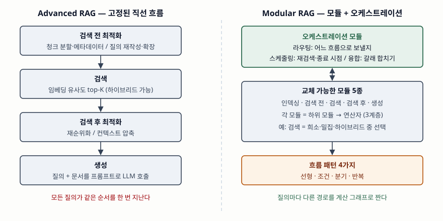

기출문제에서 Advanced RAG와 Modular RAG의 차이를 묻는다. 두 용어는 표준 기구가
아니라 **같은 연구진(Gao 등)이 논문 두 편에서 제안한 분류**다. 따라서 답안의
정의는 그 논문을 근거로 쓰고, 정보관리기술사 답안이므로 축은 "어떤 최적화
기법이 있는가"가 아니라 **검색·생성 파이프라인을 시스템으로 어떻게 구성하고
제어하는가**에 둔다.

> 실행 검증 없음. 원 논문(RAG 제안 논문, RAG 서베이, Modular RAG 논문)의 정의와
> 분류만으로 정리했다. 성능 수치는 싣지 않는다.

---

## Ⅰ. 정의

**RAG(Retrieval-Augmented Generation)** 는 언어 모델의 매개변수 안에 든 지식
(parametric memory)에, 외부 문서 색인을 검색기로 조회한 결과(non-parametric
memory)를 더해 답을 생성하는 방식이다. Lewis 등이 2020년에 제안했다.

**Advanced RAG** 는 색인 → 검색 → 생성의 기본 흐름(Naive RAG)을 유지한 채
**검색 전 처리(색인·질의 최적화)와 검색 후 처리(재순위화·컨텍스트 압축)를 덧붙여
검색 품질을 높인 RAG**다.

**Modular RAG** 는 RAG 시스템을 **모듈 → 하위 모듈 → 연산자의 3계층으로 분해하고,
이들을 계산 그래프로 엮어 라우팅·스케줄링·융합으로 흐름을 바꿀 수 있게 한 재구성
가능한 RAG 프레임워크**다. 원 논문은 이를 레고 블록처럼 조립하는 구조로 설명한다.

두 개념의 차이는 한 줄로 정리된다. Advanced RAG는 **각 단계를 더 잘 만든 것**이고,
Modular RAG는 **단계의 순서와 갈래 자체를 바꿀 수 있게 만든 것**이다.

## Ⅱ. 구성요소 비교

> **출처**: [Gao et al., Retrieval-Augmented Generation for Large Language Models: A Survey §II-B Advanced RAG (arXiv:2312.10997v5, 2024-03)](https://arxiv.org/abs/2312.10997) · [Gao et al., Modular RAG: Transforming RAG Systems into LEGO-like Reconfigurable Frameworks §IV Module and Operator · §V RAG Flow and Flow Pattern (arXiv:2407.21059v1, 2024-07)](https://arxiv.org/abs/2407.21059)

**Advanced RAG의 구성 — 4단계**

① **검색 전 최적화** — 색인 쪽은 슬라이딩 윈도, 세분화한 청크, 메타데이터 부착.
질의 쪽은 질의 재작성·변환·확장. ② **검색** — 임베딩 유사도로 상위 K개 청크.
③ **검색 후 최적화** — 가장 관련 높은 청크를 프롬프트 가장자리로 옮기는 재순위화,
핵심만 남기는 컨텍스트 압축. ④ **생성** — 질의와 문서를 합친 프롬프트로 LLM 호출.

**Modular RAG의 구성 — 모듈 6가지, 흐름 패턴 4가지**

| 모듈 | 하위 모듈 예 |
|---|---|
| ① 인덱싱 | 청크 최적화(small-to-big), 구조화(계층 색인·지식 그래프 색인) |
| ② 검색 전 | 질의 확장(다중·하위 질의), 질의 변환(재작성·HyDE), 질의 구성(Text-to-SQL·Cypher) |
| ③ 검색 | 검색기 선택(희소·밀집·하이브리드), 검색기 미세조정 |
| ④ 검색 후 | 재순위화, 압축, 선별 |
| ⑤ 생성 | 생성기 미세조정, 검증(지식 기반·모델 기반) |
| ⑥ 오케스트레이션 | **라우팅**(어느 흐름으로), **스케줄링**(언제 재검색·종료), **융합**(갈래 결과 합치기 — RRF 등) |

흐름 패턴은 **선형**(인덱싱 → 검색 전 → 검색 → 검색 후 → 생성), **조건**(라우터가
질의 유형별로 다른 흐름 선택), **분기**(질의를 여러 개로 펼쳐 병렬 검색 후 융합),
**반복**(반복·재귀·적응형 검색 — LLM이 검색 시점을 스스로 판단)의 4가지다.
Advanced RAG의 흐름은 이 중 **선형 패턴과 같은 모양**이다. 서베이도 Modular RAG를
Naive·Advanced RAG의 원리를 이어받아 발전시킨 단계로 설명한다.

| 비교 항목 | Advanced RAG | Modular RAG |
|---|---|---|
| 기본 단위 | 고정된 단계 | 모듈·하위 모듈·연산자 3계층 |
| 흐름 | 직선, 1회 통과 | 계산 그래프, 선형·조건·분기·반복 |
| 제어 주체 | 설계 시점에 고정 | 오케스트레이션 모듈이 실행 시점에 결정 |
| 데이터 원천 | 주로 단일 벡터 색인 | 벡터·검색 엔진·DB·지식 그래프를 라우팅 |
| 개선 방식 | 단계별 기법 추가 | 모듈 교체·재배선 |
| 강점 | 구현 단순, 지연·비용 예측 쉬움 | 이질 데이터·다단계 추론 질의 대응 |
| 약점 | 다단계·구조화 질의에 약함 | 경로가 질의마다 달라 디버깅·비용 관리 어려움 |

Modular RAG 논문은 Advanced RAG의 한계로 **4가지**를 든다 — 표·지식 그래프 같은
이질 데이터 통합, 해석·통제·유지보수 요구, 여러 신경망 구성요소의 조정, 순서·병렬·
LLM 판단이 섞인 흐름 제어. 단계를 아무리 개선해도 **흐름이 하나뿐이면** 풀 수 없는
문제들이다.

## Ⅲ. 적용 시 고려사항 — 4가지

- **질의 분포부터 본다.** 대부분이 단일 문서로 답이 나오는 FAQ형이면 Advanced
  RAG의 직선 흐름이 지연과 비용 면에서 낫다. 비교·집계·다단계 질의가 섞이거나
  DB·지식 그래프를 함께 조회해야 할 때 라우팅과 반복이 값을 한다.
- **경로를 기록한다.** Modular RAG는 질의마다 거친 모듈과 반복 횟수가 다르다.
  라우팅 결정, 재검색 횟수, 모듈별 지연을 질의 단위로 추적하지 않으면 틀린 답이
  어느 모듈에서 나왔는지 찾을 수 없다.
- **멈춤 조건과 예산을 둔다.** 스케줄링을 LLM 판단에 맡기는 반복·적응형 흐름은
  재검색이 끝나지 않을 수 있다. 최대 반복 횟수와 토큰·시간 예산을 오케스트레이션에
  규칙으로 건다.
- **모듈 단위로 평가한다.** 검색이 틀리면 생성은 무엇을 해도 맞출 수 없다. 검색
  재현율·정확도와 생성 충실도를 따로 재야 모듈 교체 효과를 판단할 수 있다.

> 관련 답안: [기출문제 — 어휘 검색과 의미 검색을 결합한 하이브리드 검색](../2026-09-22-hybrid-search-lexical-vector/index.md)

> 개념 정리: [Modular RAG — 모듈·연산자 3계층과 흐름 패턴](../../emerging-tech/2026-10-09-modular-rag-operators-flow-patterns/index.md)

끝

## 답안 작성 메모

- **먼저 쓸 것**: "Advanced는 단계를 개선, Modular는 흐름을 재구성"이라는 한 줄 대비와
  Modular RAG의 3계층(모듈·하위 모듈·연산자). 이 둘이 정의 점수다.
- **점수가 갈리는 지점**: 오케스트레이션 3요소(라우팅·스케줄링·융합)와 흐름 패턴
  4가지(선형·조건·분기·반복)를 개수와 함께 쓰는가. 그리고 Advanced RAG의 흐름이 Modular RAG의
  **선형 패턴과 같은 모양**이라는 계승 관계를 짚는가.
- **빠지기 쉬운 함정**: 같은 연구진의 2023년 서베이는 Modular RAG의 새 모듈을
  검색·RAG-Fusion·메모리·라우팅·예측·태스크 어댑터로 들었고, 2024년 논문은 인덱싱부터
  오케스트레이션까지 6개 모듈로 다시 짰다. **분류가 정립되는 중**이므로 어느 판을
  쓰는지 밝히면 감점 여지가 줄어든다.
- **시간이 모자라면**: 모듈별 하위 모듈 표를 버리고 비교표만 남긴다. 모식도는 왼쪽
  직선 4칸과 오른쪽 오케스트레이션 박스만 그려도 대비가 선다.
- 개수를 붙인다 — Advanced 4단계, Modular 모듈 6가지, 흐름 패턴 4가지, 한계 4가지,
  고려사항 4가지.

## 참고 자료

- [P. Lewis et al., "Retrieval-Augmented Generation for Knowledge-Intensive NLP Tasks", NeurIPS 2020 (arXiv:2005.11401)](https://arxiv.org/abs/2005.11401) — RAG 원 정의(매개변수·비매개변수 메모리)
- [Y. Gao et al., "Retrieval-Augmented Generation for Large Language Models: A Survey", arXiv:2312.10997v5 (2024-03-27)](https://arxiv.org/abs/2312.10997) — §II Naive·Advanced·Modular RAG 분류
- [Y. Gao, Y. Xiong, M. Wang, H. Wang, "Modular RAG: Transforming RAG Systems into LEGO-like Reconfigurable Frameworks", arXiv:2407.21059v1 (2024-07-26)](https://arxiv.org/abs/2407.21059) — §IV 모듈 6가지와 연산자, §V 흐름 패턴 4가지
