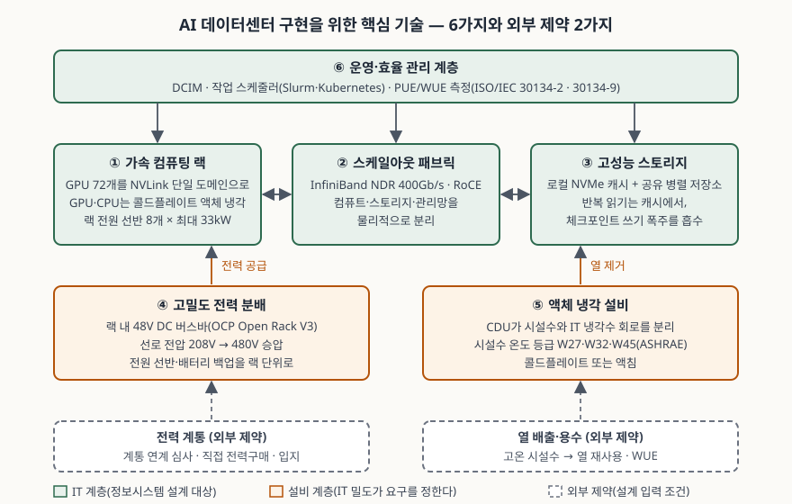

기출문제에서 AI 데이터센터를 세 갈래로 묻는다. 정의와 부상 배경, 기존 데이터센터와의
비교, 그리고 구현에 필요한 핵심 기술이다. "GPU가 많이 들어간 데이터센터"로 정의하고
전력·냉각·네트워크를 나열하면 평이한 답안이 된다. 점수는 **설계 단위가 서버에서 랙과
클러스터로 올라갔다**는 한 가지 변화에서 밀도·냉각·전력·네트워크의 차이가 전부
따라 나온다는 것을 보이는 데서 난다. 정보관리기술사 답안이므로 설비 이야기는
"IT 부하가 설비에 무엇을 요구하는가"의 방향으로 쓰고, 축은 정보시스템에 둔다.

> 실행 검증 없음. 개념 문제이므로 공개 문서 근거만으로 정리했다.
>
> "AI 데이터센터"라는 용어 자체의 국제 표준 정의는 아직 없다. 데이터센터의 정의는
> ISO/IEC 22237-1(1차)을, AI 데이터센터의 범위는 IEA 보고서(1차, 정부간기구)와 국내
> 법률(1차)을 썼다. 랙 밀도·냉각 수치는 Uptime Institute 설문과 ASHRAE TC 9.9 백서,
> NVIDIA·OCP 공개 규격에서 가져왔다. IEA 보고서 수치는 발행처 사이트가 자동 수집을
> 막아 EU 집행위원회 소개 페이지와 IEA 보도자료 발췌로 교차 확인했다.

---

## Ⅰ. 개요

### 가. 문제의 초점

데이터센터는 오래전부터 있었다. 달라진 것은 그 안에 들어가는 **부하의 성격**이다.
웹·DB·가상화 서버는 서로 독립적으로 돌고, 랙 하나가 몇 kW를 쓰며, 공기로 식힌다.
LLM 학습은 수천 개의 GPU가 **하나의 작업**을 몇 주 동안 함께 수행하고, 랙 하나가
수십에서 백 kW 이상을 쓰며, 공기로는 식힐 수 없다. AI 데이터센터는 이 부하를 수용하기
위해 **연산 랙·네트워크·스토리지·전력·냉각을 한 묶음으로 다시 설계한 시설**이다.

### 나. 답안의 구성

Ⅱ에서 정의와 부상 배경을, Ⅲ에서 기존 데이터센터와의 비교를, Ⅳ에서 구현을 위한
6가지 핵심 기술을 다룬다. 문항이 묻는 순서 그대로다.

## Ⅱ. AI 데이터센터의 정의 및 부상 배경

### 가. 정의 — 출처 3가지

| 출처 | 무엇으로 보는가 |
|---|---|
| ISO/IEC 22237-1:2021 (1차) | **데이터센터**: 정보기술·통신 장비를 집중 수용·연결·운영하여 데이터의 저장·처리·전송 서비스를 제공하는 구조물로, 전력 분배·환경 제어 설비와 요구되는 복원력·보안 수준을 함께 갖춘 것 |
| IEA, Energy and AI (2025-04, 1차) | AI 학습·추론용 칩을 실은 **가속 서버**(accelerated server)와, 그것을 중심으로 설계한 **AI 특화 데이터센터**(AI-focused data centre)를 구분해 집계한다 |
| 국내 법률 (1차) | 「인공지능 발전과 신뢰 기반 조성 등에 관한 기본법」(2026-01-22 시행)이 인공지능데이터센터 관련 시책 조항(제25조)을 두고, 「인공지능 데이터센터 산업 진흥에 관한 특별법」(2026-05-07 국회 통과, 2027-02 시행 예정)이 그 조항의 시설 중 **대통령령이 정하는 설비·규모 기준을 충족하는 것**을 인공지능 데이터센터로 정의한다 |

세 출처를 겹치면 AI 데이터센터는 "데이터센터의 일반 정의를 그대로 만족하면서,
수용 대상이 가속 서버 중심으로 바뀐 시설"이다. 답안 첫 줄에는 다음처럼 쓴다.

> AI 데이터센터는 GPU 등 가속기를 실은 고밀도 연산 랙과 이를 묶는 고대역 인터커넥트,
> 고성능 스토리지를 수용하기 위해 전력 분배·액체 냉각·운영 체계를 함께 설계한
> 데이터센터로, 초거대 AI 모델의 학습과 추론을 수행한다.

### 나. 부상 배경 — 4가지

| 배경 | 내용 | 근거 |
|---|---|---|
| ① 가속 서버 수요의 급증 | IEA는 데이터센터 전력 소비가 2024년 약 415TWh에서 2030년 약 945TWh로 두 배 이상이 되고, 그 순증가의 약 절반이 가속 서버에서 나온다고 전망한다. 가속 서버는 연 30% 안팎으로 늘어 다른 어떤 부문보다 빠르다 | IEA (2025-04) |
| ② 작업 단위의 변화 | 기존 서버는 독립적으로 돌지만, LLM 학습은 모델 하나를 수천 GPU에 나눠 **동시에, 긴 시간** 돌린다. GPU 사이 통신이 성능을 정하므로 랙과 클러스터가 **설계의 최소 단위**가 된다 | NVIDIA DGX SuperPOD 참조 아키텍처 |
| ③ 랙 밀도의 급등과 공랭의 한계 | Uptime 2024 설문에서 운영자들의 전형적 랙 밀도 평균은 8kW이고 대부분은 30kW를 넘는 랙이 하나도 없다. 그런데 GPU 서버는 랙 유닛(1U)당 1kW 이상이다. ASHRAE는 40~50kW 랙에 필요한 풍량이 최대 5,000cfm인데 바닥 타일 한 장이 낼 수 있는 최고치는 1,900cfm이라고 적는다 | Uptime (2024-07), ASHRAE TC 9.9 (2021) |
| ④ 전력·입지가 제약 조건으로 | 과기정통부는 2025년 2월 「AI컴퓨팅 인프라 확충을 통한 국가 AI 역량 강화 방안」에서 전력계통영향평가 우대와 항만 배후단지·공항 지원시설로의 입지 다변화를 들었고, 2026년 5월 통과된 특별법은 비수도권 AI 데이터센터의 전력계통영향평가 특례와 재생에너지 직접 전력구매 특례를 담았다. 전력 계통 연계가 구축 일정을 정하는 단계가 됐다는 뜻이다 | 과기정통부 (2025-02-20), 특별법 (2026-05) |

③이 이 문제의 중심이다. 공기로 식힐 수 있는 밀도의 한계를 GPU 랙이 넘어서면서,
냉각 방식이 바뀌고, 냉각 방식이 바뀌면 전력 분배·바닥 하중·배관까지 건물 설계가
바뀐다. 그래서 "기존 센터에 GPU를 넣는 것"과 "AI 데이터센터를 짓는 것"이 다른
일이 된다.

## Ⅲ. 기존 데이터센터와 AI 데이터센터의 비교

### 가. 비교표

| 비교 항목 | 기존 데이터센터 | AI 데이터센터 | 근거 |
|---|---|---|---|
| 주 워크로드 | 웹·DB·가상화·스토리지. 서버마다 **독립적** | LLM 학습·추론. 수천 GPU가 **한 작업을 공동 수행** | NVIDIA RA |
| 설계 최소 단위 | 서버(1~2U) | **랙 또는 랙 묶음(확장 단위)**. GB200 NVL72는 랙 하나가 GPU 72개를 NVLink 단일 도메인으로 묶는다 | NVIDIA RA |
| 전형적 랙 밀도 | 4~6kW가 가장 흔하고 평균 8kW(이상치 제외 7.1kW) | 랙 전원 선반 8개가 각각 최대 33kW를 공급하도록 설계된다. 1U당 1kW 이상 | Uptime 2024, NVIDIA RA |
| 냉각 | 공랭. 서버 흡기 온도 등급(A1~A4, 고밀도용 H1)으로 관리 | **액체 냉각**. GPU·CPU는 콜드플레이트, 나머지는 공랭인 하이브리드 또는 액침. 시설수 온도 등급(W17~W45, W+)으로 관리 | ASHRAE 5판 (2021), NVIDIA RA |
| 전력 분배 | 랙별 AC PDU, 서버마다 PSU | **랙 단위 DC 버스바**(OCP Open Rack V3는 48V), 전원 선반 집중, 선로 전압 상향 | OCP (2022-08), ASHRAE WP |
| 네트워크 | 범용 이더넷. 서버 간 트래픽은 서비스 요청 위주 | **스케일업(랙 안 NVLink) + 스케일아웃(InfiniBand/RoCE 400Gb/s)** 2단. 컴퓨트·스토리지·관리망 분리 | NVIDIA RA |
| 스토리지 I/O | 트랜잭션형 랜덤 읽기·쓰기 | 같은 데이터의 **반복 읽기**와 주기적 **체크포인트 쓰기 폭주** | NVIDIA RA |
| 효율 지표 | PUE 중심 | PUE에 더해 **WUE**(물 사용), 열 재사용이 설계 목표에 들어온다 | ISO/IEC 30134-2·30134-9 |
| 입지 조건 | 네트워크 지연·고객 근접성 | **전력 계통 연계 가능성**이 1순위. 비수도권·발전원 인접 | 과기정통부, 특별법 |
| 운영의 초점 | 가용성(SLA)·가상화 집적도 | 가속기 가동률·학습 중 장애 복구·전력 상한 관리 | NVIDIA RA |

> 기존 데이터센터 칸의 밀도는 Uptime 2024 설문의 "가장 흔한 랙 밀도" 응답(4~6kW 41%,
> 7~9kW 24%)과 평균값을, AI 데이터센터 칸의 수치는 NVIDIA 참조 아키텍처의 전원 선반
> 사양과 Uptime가 적은 GPU 서버 밀도(1U당 1kW 이상)를 그대로 옮긴 것이다.

### 나. 비교에서 끌어낼 점 — 3가지

① **밀도가 모든 차이의 출발점이다.** 랙 밀도가 한 자릿수 kW에서 수십~백 kW 이상으로
오르면, 공랭이 불가능해져 액체 냉각이 들어오고, 액체 냉각이 들어오면 CDU·배관·바닥
하중·전력 선로가 전부 바뀐다. ASHRAE는 고밀도 서버에서 팬 전력이 서버 전력의 10~20%에
이르고 50kW 랙이면 팬에만 5kW 이상이 든다고 적는다. 공랭을 고집하는 것 자체가 비용이다.

② **IT 설계와 설비 설계가 분리되지 않는다.** 기존 센터에서는 서버를 바꿔도 설비는 그대로다.
AI 데이터센터에서는 어떤 GPU 랙을 몇 개 들일지가 곧 냉각수 온도·전력 선반·배관 경로를
정한다. NVIDIA 참조 아키텍처가 연산·네트워크·스토리지뿐 아니라 전원 선반과 액체 냉각까지
한 문서에 적는 이유다. 정보시스템 설계자가 설비 요구를 **입력 조건으로 넘겨야** 한다.

③ **둘은 대립하지 않고 공존한다.** Uptime 설문에서 가장 밀도 높은 장비를 돌리는 곳도
아직은 AI보다 일반 업무·HPC가 많고, 운영자의 29%는 기존 전산실을 고밀도용으로 개조하고
있다. 전부 새로 짓는 것이 아니라 **기존 센터 안에 고밀도 구역을 두는 혼합 구성**이
현실적인 경로다. 비교는 "무엇이 낫다"가 아니라 "어느 부하를 어디에 두는가"의 문제다.

## Ⅳ. AI 데이터센터 구현을 위한 주요 핵심 기술

### 가. 구성도 — 핵심 기술 6가지와 외부 제약 2가지

> **출처**: [NVIDIA DGX SuperPOD GB200 Reference Architecture — Key Components](https://docs.nvidia.com/dgx-superpod/reference-architecture-scalable-infrastructure-gb200/latest/dgx-superpod-components.html) · [ASHRAE TC 9.9, Emergence and Expansion of Liquid Cooling in Mainstream Data Centers (2021)](https://www.ashrae.org/File%20Library/Technical%20Resources/Bookstore/Emergence-and-Expansion-of-Liquid-Cooling-in-Mainstream-Data-Centers_WP.pdf) · [OCP Open Rack Base Frame V3 Specification §6.3 Busbar (2022-08)](https://opencompute.org/documents/open-rack-base-specification-version-3-pdf) · [ISO/IEC 30134-2:2026](https://www.iso.org/standard/30134-2) — 계층 구분은 네 자료의 요소를 IT·설비·외부 제약으로 묶은 것이다

### 나. 기술별 설명

| 구분 | 핵심 기술 | 무엇을 하는가 | 정보시스템 관점에서 볼 것 |
|---|---|---|---|
| IT | ① 가속 컴퓨팅 랙 | GPU를 랙 안에서 고대역 스케일업 연결로 묶어 **하나의 큰 가속기처럼** 쓴다. GB200 NVL72는 컴퓨트 트레이 18개(GPU 72개, CPU 18개)와 NVLink 스위치 9개를 한 랙에 넣고, GPU·CPU는 액체로 식힌다 | 통신이 가장 잦은 텐서 병렬을 이 영역 안에 두도록 모델 분할을 설계 |
| IT | ② 스케일아웃 패브릭 | 랙 사이를 InfiniBand NDR(400Gb/s) 또는 RoCE로 잇는다. 컴퓨트 트레이마다 NIC 4개가 컴퓨트 패브릭을, 별도 DPU 2개가 스토리지·인밴드 관리망을 맡아 **망을 물리적으로 분리**한다 | 학습 트래픽이 스토리지·관리 트래픽과 경합하지 않게 망 분리, 토폴로지 설계 |
| IT | ③ 고성능 스토리지 | 로컬 NVMe 캐시와 공유 병렬 저장소의 계층. 첫 읽기 뒤에는 캐시에서 반복 읽기를 처리하고, 공유 저장소는 전체 데이터 보관과 체크포인트 쓰기를 받는다 | 데이터 파이프라인, 체크포인트 주기·보존 정책, 블록·파일·객체의 역할 분담 |
| 설비 | ④ 고밀도 전력 분배 | 랙 안을 DC 버스바로 바꿔 서버마다 PSU를 두지 않고 전원 선반에 모은다. OCP Open Rack V3는 48V 버스바 형상과 접지 경로를 규격화했다. ASHRAE는 시스템이 커지면 선로 전압을 208V에서 480V로 올리는 변곡점이 온다고 적는다 | 랙당 전력 상한, 전원 선반 이중화(N 또는 N+1), 배터리 백업 위치 |
| 설비 | ⑤ 액체 냉각 설비 | CDU(냉각수 분배 장치)가 시설수 회로와 IT 냉각수 회로를 분리한다. 칩 위 콜드플레이트(direct-to-chip) 또는 액침(단상·2상)으로 열을 액체에 넘긴다. ASHRAE는 시설수 공급 온도를 W17~W45·W+ 등급으로 나누고, 칩 전력이 오를수록 요구 온도가 W45에서 W32·W27로 내려올 수 있다고 본다 | 어느 장비가 어느 W 등급을 요구하는지 확인, 누수·유지보수 절차, 열 재사용 |
| 운영 | ⑥ 운영·효율 관리 | DCIM이 전력·온도·수량을 수집하고, 작업 스케줄러(Slurm·Kubernetes)가 수천 GPU를 할당·격리한다. 효율은 ISO/IEC 30134-2의 PUE와 30134-9의 WUE로 측정·보고한다 | 가속기 가동률 측정, 전력 상한(power cap) 정책, 장애 노드 자동 격리와 체크포인트 재시작 |

외부 제약 2가지는 기술이 아니라 **설계 입력 조건**이다. 전력 계통은 계통 연계 심사와
직접 전력구매 가능성이 구축 일정과 입지를 정하고, 열 배출·용수는 시설수 온도를 높게
가져갈수록 냉동기 없이 외기로 열을 버리거나 난방에 재사용할 수 있어 PUE·WUE에 직접
반영된다.

### 다. 기술이 함께 움직이는 방식 — 학습 작업 하나

1. ⑥의 스케줄러가 랙 묶음을 할당하고, ④가 그 랙들에 전력 상한 안에서 전력을 공급한다
2. ③에서 학습 데이터를 읽어 ①의 GPU 메모리로 올린다. 두 번째 에포크부터는 로컬 캐시가 받는다
3. 같은 층을 나눠 가진 GPU끼리는 랙 안 스케일업 연결로, 다른 랙과는 ②로 기울기를 교환한다
4. GPU가 내는 열을 ⑤의 콜드플레이트가 액체로 받아 CDU를 거쳐 시설수로 넘긴다
5. 일정 주기마다 체크포인트를 ③에 쓴다. 노드가 고장 나면 ⑥이 그 노드를 빼고 재시작한다

이 흐름에서 ④·⑤가 못 받쳐 주면 ①은 설계 성능을 내지 못하고, ②·③이 느리면 ①은
기다린다. 핵심 기술을 "GPU"가 아니라 **여섯 계층의 묶음**으로 쓰는 이유다.

### 라. 구현 시 정보시스템 관점의 고려사항 — 4가지

| 고려사항 | 판단할 것 |
|---|---|
| ① 신축·개조·클라우드 | 가동률이 꾸준히 높으면 구축, 간헐적이면 클라우드 전용 클러스터. 기존 전산실 개조는 바닥 하중·배관·전력 선로가 수용 가능한지부터 본다 (Uptime 설문에서 29%가 개조 중) |
| ② 냉각 등급과 장비의 정합 | 들일 장비가 요구하는 시설수 온도 등급(W 등급)과 설비가 낼 수 있는 등급을 맞춘다. 미래 세대 장비가 더 낮은 온도를 요구할 수 있으므로 여유를 둔다 |
| ③ 전력 상한과 효율 지표 | 계통에서 받을 수 있는 전력이 정해져 있으므로 랙·작업 단위 전력 상한 정책을 운영 체계에 넣고, PUE·WUE를 ISO/IEC 30134 측정 범주대로 측정해 규제 보고에 대비한다 |
| ④ 장애 복구 설계 | 가속기 수가 늘수록 학습 중 장애가 잦다. 체크포인트 주기, 장애 노드 자동 격리, 재시작 절차를 스케줄러와 스토리지 설계에 함께 넣는다 |

## Ⅴ. 결론

AI 데이터센터는 ISO/IEC 22237-1의 데이터센터 정의를 그대로 만족하되, 수용 대상이
**독립 서버에서 한 작업을 공동 수행하는 고밀도 가속 랙**으로 바뀐 시설이다. 그 한
가지 변화가 공랭의 한계를 넘기고, 액체 냉각·DC 버스바·2단 인터커넥트·계층형 스토리지·
전력 상한 운영을 차례로 요구한다. 기존 데이터센터와의 차이는 "크기"가 아니라
**설계 단위와 IT·설비의 결합도**에 있고, 구현의 핵심은 여섯 계층을 따로 조달하는 것이
아니라 전력 계통과 열 배출이라는 외부 제약 안에서 **한 시스템으로 설계**하는 데 있다.

> 개념 정리: [데이터센터 액체 냉각 — 콜드플레이트·액침과 ASHRAE 시설수 온도 등급](../../system/2026-10-08-data-center-liquid-cooling-ashrae-w-classes/index.md)
>
> 개념 정리: [GPU 클러스터 인터커넥트 — NVLink·InfiniBand·RoCE](../../network/2026-10-01-gpu-cluster-interconnect-nvlink-infiniband-roce/index.md)
>
> 개념 정리: [LLM 분산 학습 병렬화 — 데이터·텐서·파이프라인 병렬](../../system/2026-09-30-llm-parallelism-data-tensor-pipeline/index.md)
>
> 함께 볼 답안: [기출문제 — AI 슈퍼컴퓨팅 플랫폼](../2026-09-30-ai-supercomputing-platform/index.md) · [기출문제 — 블록·파일·객체 스토리지와 AI](../2026-10-04-block-file-object-storage-ai/index.md)

끝

## 답안 작성 메모

- **먼저 쓸 것**: Ⅱ-가의 한 줄 정의, Ⅲ-가의 비교표, Ⅳ-가의 구성도. 구성도는
  "운영 → IT 3개 → 설비 2개 → 외부 제약 2개"의 네 줄로 그리면 5분 안에 옮길 수 있다.
- **점수가 갈리는 지점**: 비교표에 **설계 최소 단위(서버 대 랙)** 행이 들어가는지, 그리고
  밀도 → 냉각 → 전력 → 건물로 이어지는 **인과**를 한 문단으로 쓰는지. 전력·냉각을
  설비 지식으로 늘어놓으면 건축·전기 기술사 답안이 된다. "IT 부하가 설비에 무엇을
  요구하고, 정보시스템 설계자가 무엇을 입력 조건으로 넘기는가"로 방향을 잡는다.
- **시간이 모자라면**: Ⅳ-다의 학습 작업 흐름과 Ⅳ-라의 고려사항 표를 버린다. 비교표는
  필수이므로 남기되 "입지 조건"·"운영의 초점" 행을 줄인다.
- **수치는 출처가 있는 것만**: 랙 밀도(Uptime), 전원 선반(NVIDIA), 풍량·팬 전력(ASHRAE),
  전력 소비 전망(IEA). "AI 랙은 n배 뜨겁다" 같은 배수 표현은 쓰지 않는다. 국내 GPU 확보
  수량·투자 금액은 정책 발표마다 바뀌므로 답안에 넣지 않았다.
- 제품 이름(NVLink, InfiniBand, GB200)은 예시로 한 번씩만 쓰고, 틀은 "스케일업 연결",
  "스케일아웃 패브릭", "DC 버스바"처럼 일반 명칭으로 세운다.

## 참고 자료

- [ISO/IEC 22237-1:2021, Information technology — Data centre facilities and infrastructures — Part 1: General concepts](https://www.iso.org/standard/78550.html) — 데이터센터 정의
- [ISO/IEC 30134-2:2026, Power usage effectiveness (PUE), 2nd ed. (2026-01)](https://www.iso.org/standard/30134-2) · [ISO/IEC 30134-9:2022, Water usage effectiveness (WUE)](https://www.iso.org/standard/77692.html)
- [IEA, Energy and AI — World Energy Outlook Special Report (2025-04)](https://www.iea.org/reports/energy-and-ai) — 가속 서버·AI 특화 데이터센터 구분, 전력 전망. 수치는 [EU 집행위원회 소개 페이지](https://transition-pathways.europa.eu/construction/innovations/international-energy-agency-iea-new-report-about-energy-and-ai)로 교차 확인
- [Uptime Institute, Global Data Center Survey 2024 (2024-07)](https://datacenter.uptimeinstitute.com/rs/711-RIA-145/images/2024.GlobalDataCenterSurvey.Report.pdf) — 랙 밀도 분포·평균, GPU 서버 밀도, 개조 비율
- [ASHRAE TC 9.9, Emergence and Expansion of Liquid Cooling in Mainstream Data Centers (2021-05)](https://www.ashrae.org/File%20Library/Technical%20Resources/Bookstore/Emergence-and-Expansion-of-Liquid-Cooling-in-Mainstream-Data-Centers_WP.pdf) — 팬 전력, 풍량 한계, W 등급, 선로 전압 변곡점
- [ASHRAE, Thermal Guidelines for Data Processing Environments, 5th ed. (2021)](https://www.ashrae.org/technical-resources/bookstore/datacom-series) — 공랭 등급 A1~A4·H1, 액체 냉각 등급 W17~W45·W+
- [NVIDIA DGX SuperPOD GB200 Reference Architecture — Key Components (2025-11 갱신)](https://docs.nvidia.com/dgx-superpod/reference-architecture-scalable-infrastructure-gb200/latest/dgx-superpod-components.html) — 랙 구성, 전원 선반, 패브릭, 냉각
- [OCP, Open Rack Base Frame V3 Specification (2022-08-24)](https://opencompute.org/documents/open-rack-base-specification-version-3-pdf) — 48V 버스바
- [과학기술정보통신부, 「AI컴퓨팅 인프라 확충을 통한 국가 AI 역량 강화 방안」 (2025-02-20, 제3차 국가인공지능위원회)](https://research.uos.ac.kr/node/6532) — 전력계통영향평가 우대, 입지 다변화 (대학 연구처가 전재한 보도자료)
- 「인공지능 발전과 신뢰 기반 조성 등에 관한 기본법」 (2026-01-22 시행) · 「인공지능 데이터센터 산업 진흥에 관한 특별법」 (2026-05-07 국회 본회의 통과) — 조문 요지는 [법무법인 세종 뉴스레터 (2026-05-08)](https://shinkim.com/kor/media/newsletter/3266)와 [MTN 기사 (2026-05-07)](https://news.mtn.co.kr/news-detail/2026050718190783794)로 확인 (2차)
