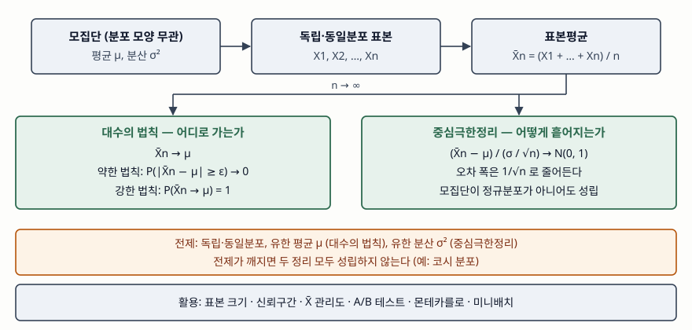

기출문제에서 대수의 법칙과 중심극한정리를 함께 묻는다. 둘 다 표본평균에 대한
극한 정리라 한 묶음으로 외우기 쉽지만, **하나는 표본평균이 어디로 가는지를, 다른
하나는 그 주변에서 어떤 모양으로 흩어지는지를** 말한다. 정보관리기술사 답안이므로
축은 정리의 증명이 아니라, 시스템이 표본으로 낸 수치(응답시간 평균, 불량률, A/B
테스트 전환율, 미니배치 기울기)를 **언제 믿고 오차를 얼마로 잡는가**에 둔다.

> 두 정리의 결론과 전제를 난수로 직접 검산했다. 계산 기록은
> [code/output.txt](code/output.txt)에 있다. (§7)

---

## Ⅰ. 정의

**대수의 법칙(Law of Large Numbers)** 은 평균 μ와 분산이 유한한 독립·동일분포
확률변수의 표본평균 X̄n이, 표본 크기 n이 커질수록 **모평균 μ로 수렴한다**는
정리다. 임의의 ε > 0에 대해 `P(|X̄n − μ| ≥ ε) → 0`으로 쓰는 확률수렴 형태를
**약한 법칙**, `P(X̄n → μ) = 1`인 거의 확실한 수렴 형태를 **강한 법칙**이라 한다.

**중심극한정리(Central Limit Theorem)** 는 같은 조건에 분산 σ²가 유한하면,
표준화한 표본평균 `(X̄n − μ) / (σ/√n)`의 분포가 **모집단 분포의 모양과 무관하게
표준정규분포 N(0, 1)로 수렴한다**는 정리다.

두 정리의 관계는 한 줄로 정리된다. 대수의 법칙은 오차 `X̄n − μ`가 0으로 간다는
것까지만 말하고, 중심극한정리는 그 오차가 **1/√n 크기로 줄면서 정규분포 모양을
띤다**는 데까지 말한다. Grinstead와 Snell도 중심극한정리가 분포의 모양까지
알려주므로 대수의 법칙보다 담는 정보가 많다고 정리한다.

## Ⅱ. 구성요소 — 전제 3가지, 결론 2가지

> **출처**: [C. M. Grinstead, J. L. Snell, Introduction to Probability 2nd ed., Ch. 8 Law of Large Numbers · Ch. 9 Central Limit Theorem (AMS, 2003)](https://math.dartmouth.edu/~prob/prob/prob.pdf)

| 구분 | 대수의 법칙 | 중심극한정리 |
|---|---|---|
| 답하는 질문 | 표본평균이 **어디로** 가는가 | 그 주변에서 **어떻게** 흩어지는가 |
| 결론 | X̄n → μ | (X̄n − μ)/(σ/√n) → N(0, 1) |
| 수렴 종류 | 확률수렴(약한)·거의 확실한 수렴(강한) | 분포수렴 |
| 필요한 조건 | 독립·동일분포, 유한 평균 | 독립·동일분포, 유한 분산 |
| 오차에 대해 주는 것 | 0으로 간다는 사실, 체비쇼프 상한 | 1/√n 축척과 정규 분위수 |

**전제 3가지** — ① 관측치가 **서로 독립**이고 ② **같은 분포**에서 나오며
③ 평균(대수의 법칙)과 분산(중심극한정리)이 **유한**하다. 교과서의 약한 법칙
증명은 분산 유한을 가정하고 체비쇼프 부등식 `P(|X̄n − μ| ≥ ε) ≤ σ²/(nε²)`에서
바로 끝난다.

### 검산 — 결론 2가지와 전제 1가지

**대수의 법칙** — 주사위(μ = 3.5)를 굴려 누적 평균을 봤다. n = 10에서 2.70이던
값이 n = 100,000에서 3.4973으로, 오차가 0.8000에서 0.0027로 줄었다. 체비쇼프
상한과 실제 이탈 비율(ε = 0.3, 2,000회 반복)을 나란히 놓으면 상한이 얼마나
느슨한지 보인다.

| n | 체비쇼프 상한 | 실제 이탈 비율 |
|---|---|---|
| 50 | 0.6481 | 0.1895 |
| 100 | 0.3241 | 0.0670 |
| 500 | 0.0648 | 0.0000 |

**중심극한정리** — 왜도가 2인 지수분포에서 표본평균을 20,000번 뽑아 표준화했다.
정규분포라면 양쪽 꼬리가 각각 0.025다.

| n | 표본평균의 왜도 | 이론값 2/√n | P(Z < −1.96) | P(Z > 1.96) |
|---|---|---|---|---|
| 1 | 1.9741 | 2.0000 | 0.0000 | 0.0508 |
| 5 | 0.9067 | 0.8944 | 0.0003 | 0.0428 |
| 30 | 0.3696 | 0.3651 | 0.0127 | 0.0345 |
| 100 | 0.1910 | 0.2000 | 0.0187 | 0.0288 |

왜도가 2/√n으로 줄며 정규분포에 다가가지만, **n = 30에서도 오른쪽 꼬리가
왼쪽의 2.7배**다. "n ≥ 30이면 정규"라는 말은 모집단이 대칭에 가까울 때의
경험칙이지 정리의 일부가 아니다. 양쪽 꼬리를 더하면 n = 1에서도 0.9492로
0.95와 비슷하게 나오므로, **합만 보고 정규성을 판단하면 안 된다**는 것도
여기서 드러난다.

**전제가 깨질 때** — 기댓값이 없는 코시 분포는 n = 10,000에서 0.3633,
n = 100,000에서 0.5564, n = 1,000,000에서 −0.3989로 표본평균이 수렴하지 않았다.
표본을 늘려도 평균이 안정되지 않는다는 것은 데이터가 틀린 것이 아니라 정리의
전제가 성립하지 않는다는 신호다.

## Ⅲ. 활용과 고려사항 — 활용 4가지, 고려사항 3가지

**활용 4가지**

- **표본 크기 산정과 신뢰구간** — 오차 폭이 `1.96·σ/√n`이므로 오차를 절반으로
  줄이려면 표본이 4배 필요하다. 로그 샘플링 비율, 품질 검사 수량을 정하는 근거다.
- **통계적 공정 관리** — X̄ 관리도는 부분군 평균에 `±3σ/√n` 폭의 관리 한계를
  긋는다. 폭의 √n은 표본평균의 분산이 σ²/n인 데서 나오고, 그 한계를 벗어날
  확률을 정규 분위수로 읽으려면 부분군 평균이 정규분포에 가까워야 한다.
  측정값 자체가 정규가 아니어도 이 해석이 버티는 근거가 중심극한정리다.
- **A/B 테스트** — 전환율은 베르누이 표본평균이므로 두 집단 차이를 정규근사
  z 검정으로 판정한다.
- **몬테카를로 추정과 미니배치 학습** — 시뮬레이션 반복 평균이 참값으로 가는
  근거가 대수의 법칙이고, 미니배치 기울기의 잡음이 배치 크기의 1/√B로 줄어드는
  근거가 중심극한정리다.

**고려사항 3가지**

- **독립이 깨진 데이터** — 같은 세션의 요청, 시계열 지표처럼 자기상관이 있으면
  유효 표본 수가 n보다 작다. 오차 폭을 σ/√n으로 잡으면 실제보다 좁게 나온다.
  블록 단위로 묶어 평균을 내야 한다.
- **두꺼운 꼬리 분포** — 응답시간, 파일 크기, 거래 금액은 오른쪽 꼬리가 길다.
  분산이 유한해도 수렴이 느리고, 분산이 무한하면 정리가 성립하지 않는다.
  평균 대신 백분위수(p95·p99)를 지표로 삼는 이유가 여기 있다.
- **평균 외의 통계량** — 두 정리는 표본평균(합)에 대한 것이다. 최댓값, 백분위수
  같은 통계량은 다른 극한 이론을 따르므로 정규근사를 그대로 쓰지 않는다.

> 개념 정리: [표본추출 — 확률·비확률 표본설계와 포함확률·가중치](../../data-analysis/2026-10-06-sampling-design-inclusion-probability-weights/index.md)

끝

## 답안 작성 메모

- **먼저 쓸 것**: 두 정리를 "어디로 가는가 / 어떻게 흩어지는가"로 대비한 한 줄과
  두 개의 식 `X̄n → μ`, `(X̄n − μ)/(σ/√n) → N(0, 1)`. 이 대비가 문제의 핵심이다.
- **점수가 갈리는 지점**: 전제(독립·동일분포·유한 분산)를 명시하는가, 그리고
  "모집단이 정규분포가 아니어도 성립한다"를 쓰는가. 약한·강한 법칙 구분을 한 줄
  붙이면 정의가 닫힌다.
- **빠지기 쉬운 함정**: "n ≥ 30이면 정규분포"를 정리처럼 쓰는 것. 비대칭 모집단에서는
  더 큰 n이 필요하다. 그리고 대수의 법칙을 "앞에서 손해 보면 뒤에서 만회된다"는
  도박사의 오류로 설명하는 것 — 정리는 이전 결과를 상쇄한다는 말을 하지 않는다.
- **시간이 모자라면**: 코시 분포 반례를 버린다. 정의 → 비교표 → 활용 2가지 순서를
  지킨다. 모식도는 위 두 박스(전제 → 두 결론)만 그려도 된다.
- 개수를 붙인다 — 전제 3가지, 결론 2가지, 활용 4가지, 고려사항 3가지.

## 참고 자료

- [C. M. Grinstead, J. L. Snell, Introduction to Probability 2nd ed. (AMS, 2003)](https://math.dartmouth.edu/~prob/prob/prob.pdf) — 체비쇼프 부등식(Theorem 8.1), 약한 대수의 법칙(Theorem 8.2), 코시 분포에서 대수의 법칙이 성립하지 않는 예(Example 8.8), 중심극한정리(Ch. 9)
- [NIST/SEMATECH e-Handbook of Statistical Methods §6.3.2.1 Shewhart X-bar and R and S Control Charts (2012)](https://www.itl.nist.gov/div898/handbook/pmc/section3/pmc321.htm) — X̄ 관리도의 관리 한계 `3s̄/(c4√n)`
