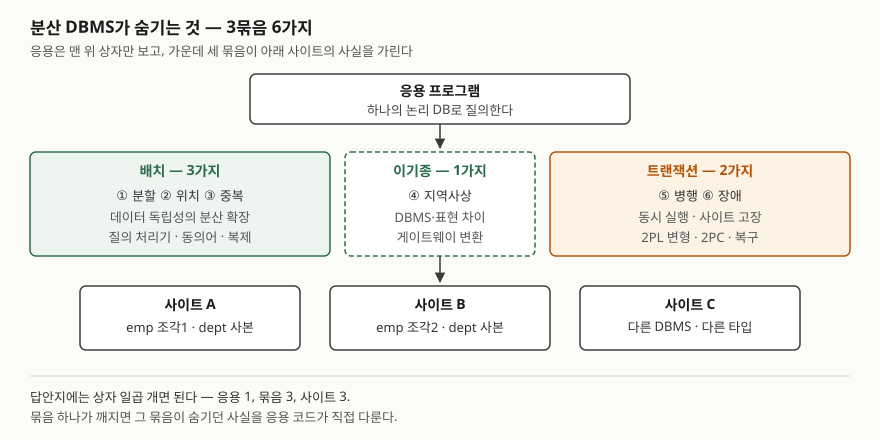

기출문제에서 분산 데이터베이스의 투명성을 묻는다. 데이터베이스 과목에서 가장 자주 나오는
유형이라 이름 여섯 개를 나열하는 답안이 많고, 그만큼 변별이 안 된다. 점수는 **각 투명성이
무엇을 누구에게서 숨기는지**, 그리고 **그것을 떠받치는 장치**(동의어, 복제, 2PL, 2PC)까지
쓰는 데서 난다. 6가지를 성격별로 3묶음으로 나눠 쓰면 채점자가 개수를 바로 센다.

> 실행 검증 없음. 개념 문제이므로 Özsu·Valduriez(1991) 논문과 Oracle Database 공식 문서 근거만으로 정리했다.

---

## Ⅰ. 정의

**분산 데이터베이스**는 네트워크에 흩어져 있으면서 논리적으로 서로 연관된 여러 데이터베이스의
모음이고, **분산 DBMS**는 이를 관리하면서 **분산 사실을 사용자에게 투명하게 만드는**
소프트웨어다(Özsu·Valduriez 1991, 2절).

**분산 데이터베이스의 투명성**은 데이터가 여러 사이트에 나뉘고 복제되어 있어도, 사용자가
그 사실을 의식하지 않고 **하나의 중앙 집중 DB처럼 접근**하게 하는 성질이다(같은 논문 3.1절).
중앙 집중 DBMS의 **데이터 독립성**을 분산 환경까지 넓힌 것이다.

## Ⅱ. 구성요소 — 투명성 6가지

> **출처**: [M. T. Özsu, P. Valduriez, Distributed Database Systems: Where Are We Now?, IEEE Computer 24(8), 1991 — §3.1 Transparent Management, §3.2 Distributed Transactions](https://cs.uwaterloo.ca/~tozsu/publications/distdb/short.pdf) · [Oracle Database 19c 관리자 안내서 — Heterogeneous Distributed Database Systems](https://docs.oracle.com/en/database/oracle/oracle-database/19/admin/distributed-database-concepts.html#GUID-15334E5B-01E7-46E6-99AA-FAC1BB9487C7)

| 묶음 | 투명성 | 숨기는 사실 | 떠받치는 장치 |
|---|---|---|---|
| 배치 | ① 분할 | 테이블이 수평·수직 조각으로 나뉘어 있다 | 분산 질의 처리기가 조각을 찾아 합친다 |
| 배치 | ② 위치 | 데이터가 어느 사이트에 있다 | 동의어·뷰·저장 프로시저로 이름 한 겹을 둔다 |
| 배치 | ③ 중복 | 같은 데이터의 사본이 여러 개다 | 사본 선택과 갱신 전파를 DBMS가 맡는다 |
| 이기종 | ④ 지역사상 | 사이트마다 DBMS와 데이터 표현이 다르다 | 게이트웨이가 SQL 방언·타입을 변환한다 |
| 트랜잭션 | ⑤ 병행 | 여러 트랜잭션이 여러 사이트에서 동시에 돈다 | 분산 동시성 제어(2단계 잠금의 변형) |
| 트랜잭션 | ⑥ 장애 | 사이트·링크가 도중에 고장 날 수 있다 | 분산 커밋(2단계 커밋, 2PC)과 복구 |

- **배치 3가지(①~③)** — Özsu·Valduriez가 분산 환경의 데이터 독립성으로 드는 네트워크·복제·분할
  투명성이다. 같은 논문은 ②·③은 운영체제가 거들 수 있지만 **①은 분산 DBMS의 몫**이라고 적는다
- **이기종 1가지(④)** — Oracle 문서는 비 Oracle DB가 섞인 이기종 분산 DB가 응용에게 **하나의
  로컬 DB로 보이도록** 로컬 서버가 이기종성을 숨긴다고 적는다
- **트랜잭션 2가지(⑤·⑥)** — 트랜잭션이 동시에 실행돼도 일관성을 지키고, 장애가 나도 원자적으로
  끝나게 한다(Özsu·Valduriez 3.2절)

## Ⅲ. 활용과 고려사항

### 가. 활용 — 투명성이 깨지면 응용이 떠안는 일

투명성 하나가 깨지면 그 칸의 사실을 응용 코드가 직접 다룬다. 설계 검토에서는 이 표를
체크리스트로 쓴다.

| 깨진 투명성 | 응용이 떠안는 일 |
|---|---|
| ① 분할 | 조각마다 질의를 따로 쓰고 결과를 합친다. 샤드 키가 바뀌면 코드를 고친다 |
| ② 위치 | SQL에 원격 DB 링크 이름을 직접 적는다. 객체를 옮길 때마다 응용 배포가 따라간다 |
| ③ 중복 | 비동기 복제본에서 방금 쓴 값을 못 읽는다. 읽을 사본을 응용이 고른다 |
| ⑥ 장애 | 일부 사이트만 반영된 결과를 찾아 되돌리는 보상 로직을 짠다 |

### 나. 고려사항 — 3가지

① **완전한 투명성이 늘 목표는 아니다.** Özsu·Valduriez는 원거리 DB에 투명하게 접근하도록 짠 응용이
관리성·성능에서 불리하다는 Gray(1989)의 반론을 소개한다. 투명성을 어디까지 줄지는 **개발 부담과
성능 사이의 선택**이다. 조인이 사이트를 넘나드는 질의는 투명하게 쓸 수 있어도 비싸다.

② **중복 투명성은 갱신 비용과 맞바꾼다.** 복제는 한 사이트가 멈춰도 다른 사본으로 읽게 해
가용성을 높이지만, 사본을 맞추려면 갱신이 모든 사본에 가야 한다. 전파를 비동기로 풀면 응답은
빨라지는 대신 ③이 일부 깨진다.

③ **장애 투명성은 사이트 자율성과 부딪친다.** 2PC는 참여한 모든 서버가 같이 커밋하거나 같이
롤백하게 묶는다. 커밋 도중 장애로 결과가 정해지지 않은(in-doubt) 트랜잭션이 생기면 해결될 때까지
그 데이터는 **읽기와 쓰기 모두 잠긴다**(Oracle 19c 문서). 다른 사이트의 고장이 이 사이트의
데이터 사용을 막는 것이다.

> 개념 정리: [분산 데이터베이스 — 투명성 6가지](../../database/2026-09-23-distributed-database-transparency/index.md)
>
> 개념 정리: [분산 데이터베이스 — CAP 정리와 BASE](../../database/2026-10-06-cap-theorem-base-pacelc/index.md)

끝

## 답안 작성 메모

- **먼저 쓸 것**: Ⅰ의 정의 한 줄("분산 사실을 숨겨 하나의 DB처럼 보이게 하는 성질")과
  Ⅱ의 6가지 표. 표의 첫 열을 **배치 3 · 이기종 1 · 트랜잭션 2**로 나누면 개수가 저절로 보인다.
- **점수가 갈리는 지점**: 이름만 쓰지 않고 **"떠받치는 장치"** 열(동의어, 2PL, 2PC)을 채우는지.
  그리고 "데이터 독립성을 분산 환경으로 넓힌 것"이라는 등장 이유를 정의에 붙이는지.
- **시간이 모자라면**: Ⅲ-가의 "깨지면" 표를 버리고 고려사항 3가지만 남긴다. 고려사항 중에서는
  ③(2PC와 in-doubt 잠금)이 가장 변별력이 있으니 마지막까지 남긴다.
- **분류는 출처마다 다르다.** 6가지는 국내 수험서가 묶는 방식이고, 이 6가지를 한 번에 제시한
  1차 자료는 없다. RM-ODP(ISO/IEC 10746)는 접근·장애·위치·이주·재배치·복제·영속성·트랜잭션의
  8가지로 나눈다. 변형 문항이 "RM-ODP 기준"을 물으면 이쪽을 쓴다.

## 참고 자료

- [M. T. Özsu, P. Valduriez, *Distributed Database Systems: Where Are We Now?*, IEEE Computer 24(8), 1991](https://cs.uwaterloo.ca/~tozsu/publications/distdb/short.pdf) — 2절 분산 DB와 분산 DBMS의 정의, 3.1절 네트워크·복제·분할 투명성과 Gray의 반론, 3.2절 병행 투명성·장애 원자성·2PL·2PC (저자 사이트 게재본)
- [Oracle Database 19c 관리자 안내서 — Distributed Database Concepts](https://docs.oracle.com/en/database/oracle/oracle-database/19/admin/distributed-database-concepts.html#GUID-15334E5B-01E7-46E6-99AA-FAC1BB9487C7) — 이기종 분산 DB가 하나의 로컬 DB로 보이는 방식, 사이트 자율성, 2단계 커밋
- [Oracle Database 19c 관리자 안내서 — About In-Doubt Transactions](https://docs.oracle.com/en/database/oracle/oracle-database/19/admin/distributed-transactions-concepts.html#GUID-364CA7BD-A02E-4A74-AF72-45021CAC3E3C) — 결과가 정해지지 않은 분산 트랜잭션의 데이터가 해결 전까지 읽기·쓰기 모두 잠긴다는 설명
- [Oracle Database 11g Release 2 관리자 안내서 — Transparency in a Distributed Database System](https://docs.oracle.com/html/E25494_01/ds_concepts005.htm#i1009082) — 위치 투명성(동의어·뷰·프로시저)과 SQL·COMMIT 투명성
- [A. Vallecillo, *RM-ODP: The ISO Reference Model for Open Distributed Processing*](https://www2.isye.gatech.edu/~lfm/8851/Sources/RefModels/RM-ODP.pdf) — RM-ODP 투명성 8가지 요약
