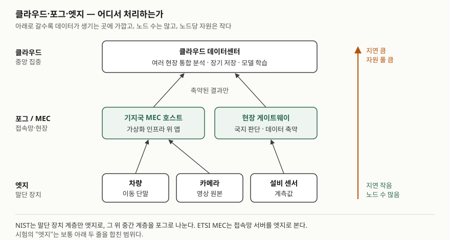

기출문제에서 엣지 컴퓨팅과 클라우드 컴퓨팅이 어떻게 다른지를 묻는다. "엣지는 가깝고
클라우드는 멀다"는 한 줄로는 점수가 나지 않는다. 점수는 **두 개념의 정의를 각각 출처로
세우고**, 차이를 **개수가 붙은 비교표**로 보이고, 결국 "어떤 데이터를 어디서 처리하는가"라는
**정보시스템 배치 판단**으로 내려가는 데서 난다. 둘은 대체 관계가 아니라는 점도 빠뜨리지 않는다.

> 실행 검증 없음. 개념 문제이므로 NIST SP 800-145, NIST SP 500-325, ETSI GS MEC 003 근거만으로 정리했다.

---

## Ⅰ. 정의

### 가. 클라우드 컴퓨팅

**클라우드 컴퓨팅**은 구성 가능한 컴퓨팅 자원(네트워크·서버·스토리지·애플리케이션·서비스)의
**공유 풀에 네트워크로 언제든 필요할 때 접근**하게 하고, 그 자원을 최소한의 관리 노력으로
빠르게 할당·반납할 수 있게 하는 모델이다(NIST SP 800-145). 같은 문서가 **필수 특성 5가지**
(주문형 셀프서비스, 광범위한 네트워크 접근, 자원 풀링, 신속한 탄력성, 측정되는 서비스),
서비스 모델 3가지, 배포 모델 4가지로 정리한다.

### 나. 엣지 컴퓨팅

엣지 컴퓨팅은 출처마다 범위가 다르다. 답안에는 두 정의를 함께 쓴다.

| 출처 | 정의 |
|---|---|
| NIST SP 500-325 부록 A | 말단 장치와 그 사용자를 포함하는 **네트워크 계층**. 센서·계량기 같은 장치 자체에서 로컬 연산 능력을 제공한다 |
| ETSI GS MEC 003 (5장) | 애플리케이션을 **네트워크 경계 또는 그 가까이에 놓인 가상화 인프라** 위에서 소프트웨어로 실행하는 것(Multi-access Edge Computing) |

NIST는 말단 장치 계층만 엣지로 부르고, 그와 클라우드 사이의 계층을 **포그(fog)** 로 따로 둔다.
ETSI는 통신망 접속 구간의 서버를 엣지로 본다. 시험에서 묻는 "엣지"는 대개 이 둘을 합친
**"중앙 클라우드 밖, 데이터가 생기는 곳 가까이에서 처리하는 것"** 이다.

### 다. 관계 — 대체가 아니라 보완

NIST SP 500-325는 이런 분산 처리 방식을 **중앙 집중형 클라우드를 보완하는** 계산 패러다임으로
소개한다(1.1절). 엣지가 클라우드를 없애는 것이 아니라, 지연과 전송량이 문제 되는 처리를
클라우드 앞단으로 끌어오는 것이다.

## Ⅱ. 차이점 — 7가지

> **출처**: [NIST SP 500-325 Fog Computing Conceptual Model — Figure 1, §2.1~2.3, Annex A (2018)](https://doi.org/10.6028/NIST.SP.500-325) · [ETSI GS MEC 003 V2.2.1 — §5 Multi-access Edge Computing framework (2020)](https://www.etsi.org/deliver/etsi_gs/MEC/001_099/003/02.02.01_60/gs_MEC003v020201p.pdf)

| 구분 | 클라우드 컴퓨팅 | 엣지 컴퓨팅 |
|---|---|---|
| ① 처리 위치 | 원격 데이터센터 | 데이터 발생지 또는 접속망 가까이 |
| ② 배치 형태 | 중앙 집중, 대형 자원 풀 | 지리적으로 흩어진 다수의 소형 노드 |
| ③ 지연 | 왕복 네트워크 구간만큼 늦다 | 장치 가까이에서 응답해 지연이 가장 작다 |
| ④ 처리 형태 | 대규모 저장·분석·학습, 배치 처리 | 실시간 상호작용 처리 |
| ⑤ 데이터 흐름 | 원시 데이터가 중앙으로 모인다 | 현장에서 거르고 줄인 결과만 올린다 |
| ⑥ 자원과 탄력성 | 자원 풀링·신속한 탄력성 | 노드당 자원이 작고, 클러스터 단위로 확장한다 |
| ⑦ 단절 시 동작 | 연결이 끊기면 서비스 불가 | 노드가 독립적으로 국지 판단을 내린다 |

> ①②③④⑦은 NIST SP 500-325가 포그 계층에 붙인 필수 특성(§2.3: 위치 인식과 저지연,
> 지리적 분산, 실시간 상호작용, 연합 클러스터의 확장성)과 노드 속성(§2.5: 자율성)에서,
> 클라우드 쪽 칸과 ⑥은 NIST SP 800-145의 필수 특성에서 가져왔다. ⑤는 ①과 ③에서 따라 나오는
> 배치 결과로, 아래 고려사항 ①에서 다룬다.

**구성도 다르다.** ETSI MEC 프레임워크는 엣지에도 **가상화 인프라·플랫폼·애플리케이션으로
이루어진 호스트**와 그 위의 **호스트 수준·시스템 수준 관리**를 둔다(5장). 엣지 노드는 작은
클라우드이고, 차이는 그것이 **수백·수천 곳에 흩어져 있다**는 데 있다.

## Ⅲ. 활용과 고려사항

### 가. 활용 — 4가지

NIST SP 500-325(1장·2.3절)가 드는 분야다.

- **산업 제어** — 설비 센서 값을 현장에서 판정해 제어 신호를 돌려준다
- **자율 주행·이동체** — 도로와 선로를 따라 놓인 접속점이 이동하는 차량에 스트리밍 서비스를 제공한다
- **스마트 그리드** — 계량기·변전 설비의 데이터를 지역 단위로 모아 처리한다
- **스마트 시티** — 지리적으로 흩어진 카메라·센서를 구역별 노드가 맡는다

### 나. 고려사항 — 4가지

① **무엇을 어디서 처리할지 나눈다.** 지연 요구가 엄격한 판정은 엣지에, 여러 현장을 합쳐 봐야
하는 분석과 모델 학습은 클라우드에 둔다. 엣지에서 원시 데이터를 줄여 올리면 회선 비용은 줄지만
**클라우드에서 다시 볼 수 있는 원본이 사라진다.** 원본 보관 범위를 먼저 정한다.

② **단절과 재동기화를 설계한다.** 엣지 노드는 연결이 끊겨도 국지 판단을 계속해야 한다(NIST의
자율성 속성). 끊긴 동안 쌓인 데이터와 판정 기록을 복구 뒤 클라우드와 어떻게 맞출지, 어느 쪽 값을
기준으로 삼을지 정해야 한다.

③ **흩어진 다수 노드를 중앙에서 관리한다.** 노드는 형태가 제각각이고(이기종성) 수가 많다.
배포·패치·설정을 사람이 노드마다 할 수 없으므로 ETSI MEC의 시스템 수준 관리처럼 **중앙
오케스트레이션**으로 다룬다.

④ **보안 경계가 넓어진다.** 데이터센터 안에 있던 처리와 데이터가 접근 통제가 약한 현장으로
나간다. 노드 인증, 저장 데이터 암호화, 원격 무결성 확인을 노드 단위로 갖춰야 한다.

> 개념 정리: [엣지·포그·MEC 컴퓨팅 — NIST 포그 모델과 ETSI MEC 참조 구조](../../cloud/2026-10-09-edge-fog-mec-computing/index.md)

끝

## 답안 작성 메모

- **먼저 쓸 것**: Ⅰ의 정의 두 줄(NIST 클라우드 정의, 엣지 정의)과 Ⅱ의 비교표. 단답형은 표가
  곧 답이다. 표 머리에 "7가지"를 붙여 채점자가 세게 한다.
- **점수가 갈리는 지점**: ① 엣지 정의가 출처마다 다르다는 것과 포그 계층을 아는지,
  ② "대체가 아니라 보완"을 쓰는지, ③ 고려사항을 "지연이 낮다"는 장점 반복이 아니라
  **데이터를 어디서 처리하고 무엇을 올릴지**라는 배치 판단으로 쓰는지.
- **시간이 모자라면**: 활용 4가지를 두 줄로 줄이고 ETSI MEC 프레임워크 문단을 버린다.
  모식도는 클라우드·포그·엣지 세 줄과 지연 화살표만 그려도 된다.
- 지연 시간 같은 수치는 망 구성마다 달라 쓰지 않았다. NIST SP 500-325 서론의 IoT 기기 수
  전망은 2차 인용이라 답안에 쓰지 않는다.

## 참고 자료

- [NIST SP 800-145, The NIST Definition of Cloud Computing (2011-09)](https://csrc.nist.gov/pubs/sp/800/145/final) — 클라우드 정의, 필수 특성 5가지, 서비스 모델 3가지, 배포 모델 4가지
- [NIST SP 500-325, Fog Computing Conceptual Model (2018-03)](https://doi.org/10.6028/NIST.SP.500-325) — 1.1절 목적과 범위, 2.3절 포그 필수 특성 6가지, 2.5절 포그 노드 속성, 부록 A 포그와 엣지의 차이
- [ETSI GS MEC 003 V2.2.1, Multi-access Edge Computing; Framework and Reference Architecture (2020-12)](https://www.etsi.org/deliver/etsi_gs/MEC/001_099/003/02.02.01_60/gs_MEC003v020201p.pdf) — 5장 MEC 프레임워크(호스트, 호스트 수준·시스템 수준 관리)
- [ISO/IEC TR 23188:2020, Cloud computing — Edge computing landscape](https://webstore.iec.ch/publication/66566) — 엣지와 클라우드·IoT의 관계를 다루는 기술 보고서. 본문은 확인하지 못했고 개요만 참고했다
