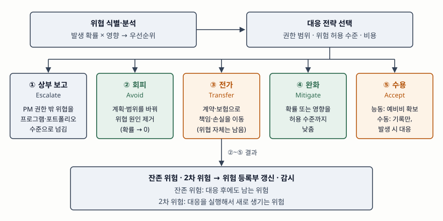

기출문제에서 IT 프로젝트의 부정적 위험이 무엇이고 어떻게 대응하는지를 묻는다.
대응 전략 이름을 나열하는 것만으로는 점수가 붙지 않는다. **각 전략이 위험의
확률·영향·책임 가운데 무엇을 바꾸는지**, 그리고 대응한 뒤에 무엇이 남는지까지
써야 다른 답안과 갈린다.

> 실행 검증 없음. PMI PMBOK Guide 제6판, ISO 31000:2018, NIST SP 800-39를 근거로
> 정리했다. PMBOK 본문은 유료 문서라 원문 대조는 NIST 문서와 PMBOK 인용 2건으로
> 교차 확인했다.

---

## Ⅰ. 정의

**위험(Risk)** 은 PMBOK Guide 제6판 용어집에서 *발생하면 프로젝트 목표에 긍정적
또는 부정적 영향을 주는 불확실한 사건이나 조건*으로 정의된다. ISO 31000:2018의
용어 정의(§3.1)도 위험을 "목표에 대한 불확실성의 영향"으로 두고, 그 영향이
긍정·부정 어느 쪽으로든 벗어날 수 있다고 적는다.

**부정적 위험(Negative Risk)** 은 이 가운데 일정·비용·범위·품질 목표에 손실을
주는 쪽이며, PMBOK은 이를 **위협(Threat)**, 긍정적 위험을 **기회(Opportunity)** 로
나눠 부른다. 이미 일어난 일은 위험이 아니라 **이슈(Issue)** 다. 위험 관리는
이슈가 되기 전에 확률과 영향을 바꾸는 활동이다.

IT 프로젝트에서 흔한 위협은 요구사항 변경, 검증되지 않은 기술 채택, 핵심 인력
이탈, 외주 업체 납기 지연, 데이터 이관 실패, 보안 취약점처럼 **일정·비용 초과로
바로 이어지는 것**들이다.

## Ⅱ. 대응 전략 — 5가지

> **출처**: [PMI, PMBOK Guide 6th ed. §11.5.2.4 Strategies for Threats (2017)](https://www.pmi.org/standards/pmbok) · [NIST SP 800-39 §3.3 Risk Response, Task 3-1 (2011-03)](https://csrc.nist.gov/pubs/sp/800/39/final)

PMBOK 제6판은 위협 대응 전략을 **5가지**로 둔다. 제5판의 4가지(회피·전가·완화·
수용)에 **상부 보고(Escalate)** 가 더해졌다.

| 전략 | 무엇을 바꾸는가 | IT 프로젝트 예 |
|---|---|---|
| ① 상부 보고 (Escalate) | 위험의 **관리 주체** | 전사 인증 체계 변경, 법 개정처럼 프로젝트 범위·PM 권한 밖의 위협을 PMO·포트폴리오 관리자에게 넘긴다 |
| ② 회피 (Avoid) | **발생 확률을 0**으로 | 검증되지 않은 신규 프레임워크 대신 운영 경험이 있는 기술로 바꾸고, 위험한 기능을 범위에서 뺀다 |
| ③ 전가 (Transfer) | 손실의 **책임·부담 주체** | 고정가 계약, 지체상금·SLA 위약 조항, 하자보증, 보험 |
| ④ 완화 (Mitigate) | **확률 또는 영향**을 허용 수준까지 | 개념 검증(PoC)과 프로토타입, 이관 리허설, 이중화, 핵심 인력 백업 지정 |
| ⑤ 수용 (Accept) | 바꾸지 않음 — **인지하고 감수** | 능동: 일정·예산 예비비 확보 / 수동: 기록만 하고 발생 시 대응 |

전략별로 짚을 점이 있다.

- **상부 보고**는 넘긴 뒤 프로젝트 팀이 더 감시하지 않는다는 점에서 다른 네 가지와
  다르다. 등록부에는 참고로 남긴다.
- **전가**는 위협 자체를 없애지 않는다. NIST SP 800-39도 위험 전가가 사건 발생
  가능성이나 피해 크기를 줄이지 않는다고 적는다. 외주사가 납기를 어기면 지체상금은
  받지만 서비스 개시가 늦어지는 것은 그대로다. 그래서 전가는 보통 완화와 함께 쓴다.
- **완화**는 확률을 낮추는 쪽(사전 테스트, 코드 리뷰)과 영향을 낮추는 쪽(백업,
  롤백 계획, 이중화)으로 다시 나뉜다. 답안에서 둘을 갈라 쓰면 항목이 깊어 보인다.
- **수용**은 대응 비용이 기대 손실보다 크거나, 다른 전략이 불가능할 때 고른다.
  능동적 수용의 예비비(Contingency Reserve)는 **식별된 위험**에 쓰는 돈이고,
  식별하지 못한 위험에 대비한 관리 예비비(Management Reserve)와 다르다.

### 표준마다 이름이 다르다

| PMBOK 6판 (위협) | ISO 31000:2018 위험 처리 선택안(§6.5.2) | NIST SP 800-39 |
|---|---|---|
| 회피 | 활동을 시작·지속하지 않아 위험 회피 / 위험원 제거 | 회피 |
| 완화 | 발생 가능성 변경 / 결과 변경 | 완화 |
| 전가 | 위험 공유 (계약, 보험) | 공유 / 전가 |
| 수용 | 정보에 근거한 결정으로 위험 보유 | 수용 |
| 상부 보고 | — | — |
| (기회 쪽 전략) | 기회를 위해 위험을 취하거나 늘림 | — |

ISO 31000은 위협과 기회를 가르지 않고 **7가지 선택안**을 한 목록에 둔다. 상부
보고에 해당하는 항목은 없다. 프로젝트라는 조직 단위를 전제한 PMBOK만의 전략이기
때문이다. NIST SP 800-39는 수용·회피·완화·공유·전가 **5가지**와 그 조합을 든다.

## Ⅲ. 활용과 고려사항 — 3가지

- **잔존 위험과 2차 위험을 다시 등록한다.** 대응 후에도 남는 **잔존 위험(Residual
  Risk)** 과, 대응을 실행해서 새로 생기는 **2차 위험(Secondary Risk)** 을 위험
  등록부에 올려 다시 분석한다. 이중화로 장애 영향을 줄이면, 이중화 전환 절차 자체가
  실패할 위험이 새로 생기는 식이다.
- **전략은 하나만 고르지 않는다.** NIST SP 800-39도 대응을 시점·상황에 따른 조합으로
  설명한다. 데이터 이관이라면 리허설로 완화하고, 실패 시 롤백 시간을 예비 일정으로
  수용하고, 외부 이관 도구 업체에 계약상 책임을 전가하는 식으로 겹쳐 쓴다.
- **위험마다 담당자와 발동 조건을 정한다.** 위험 담당자(Risk Owner)가 없으면 등록부는
  목록으로 끝난다. 수용·우발 대응은 "이관 리허설 오류율이 기준을 넘으면" 같은
  **발동 조건(Trigger)** 이 있어야 실행 시점이 정해진다.

끝

## 답안 작성 메모

- **먼저 쓸 것**: 위험 = 불확실성의 영향, 부정적 위험 = 위협, 이슈와의 구분. 그 다음
  5가지 전략 표. 이 표가 답안의 몸통이다.
- **점수가 갈리는 지점**: 각 전략이 **확률·영향·책임 중 무엇을 바꾸는지**를 쓰는가.
  "전가는 위험을 없애지 않는다"와 "잔존 위험·2차 위험"까지 쓰면 나열형 답안과 구분된다.
- **빠지기 쉬운 함정**: 제5판 기준으로 4가지만 쓰는 것. 제6판부터 상부 보고가 들어가
  5가지다. 그리고 기회 대응 전략(활용·공유·증대·수용)을 섞는 것 — 이 문제는 부정적
  위험만 묻는다.
- **시간이 모자라면**: ISO·NIST 대응표를 버린다. 정의 → 5가지 표 → 잔존·2차 위험 순서는
  지킨다. 모식도는 가운데 5개 박스만 그려도 된다.
- 개수를 붙인다 — 대응 전략 5가지, 고려사항 3가지.

## 참고 자료

- [PMI, A Guide to the Project Management Body of Knowledge (PMBOK Guide) 6th ed. (2017)](https://www.pmi.org/standards/pmbok) — §11.5 Plan Risk Responses, §11.5.2.4 Strategies for Threats. 유료 문서라 아래 인용으로 교차 확인했다
- [ISO 31000:2018 Risk management — Guidelines](https://www.iso.org/standard/65694.html) — §3.1 risk 정의, §6.5.2 Selection of risk treatment options
- [NIST SP 800-39, Managing Information Security Risk §3.3 Risk Response (2011-03)](https://csrc.nist.gov/pubs/sp/800/39/final) — Task 3-1 대응 유형(수용·회피·완화·공유·전가), 전가가 확률·결과를 줄이지 않는다는 설명
- [Bellevue University PM Center, Risk Response Strategies for Negative Risks or Threats (2015-08-19)](https://pmcenter.bellevue.edu/2015/08/19/risk-response-strategies-for-negative-risks-or-threats/) — 2차 자료, 제6판 이전 기준의 4가지 전략(회피·전가·완화·수용)과 능동·수동 수용 구분 교차 확인
- [Online PM Courses, Every Project Management Risk Response Strategy (2023-06-19)](https://onlinepmcourses.com/every-project-management-risk-response-strategy-are-there-6-7-or-more/) — 2차 자료, 제6판에서 상부 보고가 추가된 경위
